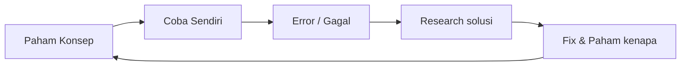

# Sesi Intro: Cara Belajar Efektif

> **Level:** 🌱 Beginner  
> **Durasi:** 1 sesi (sebelum mulai coding)  
> **Tujuan:** Lo bisa belajar kapan aja, asal caranya bener

---

## 🧠 Mindset: Coding itu Skill, Bukan Bakat

Lo gak perlu jago matematika. Gak perlu inget semua syntax. Yang lo butuh:
- **Konsisten** — 30 menit tiap hari > 5 jam seminggu sekali
- **Rasa penasaran** — "kenapa error ini terjadi?"
- **Gak takut gagal** — error itu guru lo, bukan musuh

> "The only way to learn to code is to code." — everyone who codes

---

## 🔄 Siklus Belajar Efektif



### Langkah 1: Paham Konsep (20%)
- Baca dokumentasi / modul ini
- Tonton video penjelasan (YouTube: Web Programming UNPAS, PZN)
- Jangan lanjut sebelum lo bisa jelasin pake kata sendiri

### Langkah 2: Coba Sendiri (40%)
- Buka VS Code / editor, **practice with intent**
- Jangan copy-paste — **tik ulang** kode dari contoh
- Ubah-ubah nilai, liat apa yang terjadi
- **Ini bagian paling penting** — kalau cuma baca, lo gakan bisa

### Langkah 3: Error itu Guru (20%)
- Error bukan tanda lo gagal — tanda **otak lo belajar**
- Baca error message pelan-pelan
- Google error message-nya (pake bahasa Inggris)
- Stack Overflow, GitHub Issues, forum Discord

> **90% error yang lo temuin udah pernah dialamin orang lain.** Tinggal googling.

### Langkah 4: Research + Fix (20%)
- Cari solusi, pahami **kenapa** itu solusinya
- Jangan asal paste — resapi dulu
- Kalo masih gak paham, tanya (AI, teman, forum)

---

## 📚 3 Golden Rules

### 1. Practice > Theory
Lo bisa baca 10 buku JavaScript — kalo gak nulis kode, gak bakal bisa.  
Perbandingan ideal: **20% baca, 80% coding**.

### 2. Bangun Sesuatu
Jangan belajar Fitur A → Fitur B → C → D.  
Belajar: bikin kalkulator → butuh button → belajar event → butuh input → belajar variable.

> **Proyek nyata > tutorial.** Begitu lo punya proyek sendiri, lo tau **kenapa** butuh fitur X.

### 3. Konsisten > Intensitas
| ❌ | ✅ |
|----|----|
| Belajar 8 jam hari Minggu | 30 menit setiap hari |
| Burnout minggu depan | Progress setiap hari |
| Lupa minggu lalu | Ingat karena repetisi |

---

## 🛠️ Tools yang Lo Butuh

| Tool | Fungsi | Install? |
|------|--------|----------|
| **VS Code** | Code editor | ✅ gratis |
| **Node.js** | Jalanin JavaScript | ✅ gratis |
| **Git** | Version control | ✅ gratis |
| **Browser** (Chrome/Edge) | Testing & DevTools | ✅ udah punya |

Gak usah install semua dulu — **belajar step by step**.  
Tiap modul bakal bilang kapan perlu install sesuatu.

---

## 📖 Cara Pake Modul Ini

1. Tiap modul punya **5-7 sesi** (@120 menit per sesi)
2. Baca materi + contoh kode
3. Kerjain **Latihan** di akhir sesi
4. Lanjut sesi berikutnya **kalo latihan udah selesai**
5. **Jangan skip** — tiap sesi dibangun di atas sesi sebelumnya

```
Sesi 1 → Latihan 1 ✅ → Sesi 2 → Latihan 2 ✅ → ...
```

---

## 💡 Tips dari Developer Senior

> **"Code every day. Even if it's just 15 minutes."**

> **"Don't compare your chapter 1 to someone else's chapter 20."**

> **"The best time to start was yesterday. The second best time is now."**

> **"Nobody knows everything. We all Google Stack Overflow daily."**

> **"Udah 2 jam mentok? Jalan-jalan 10 menit. Otak lo butuh break."**

---

## 🎯 Target lo setelah module ini

✅ Paham cara belajar coding yang efektif  
✅ Tau tools apa yang dibutuhin  
✅ Punya ekspektasi realistis tentang proses belajar  
✅ Siap mental buat mulai coding

---

**Next:** [Sesi 1: Gimana Internet Bekerja](01-how-internet-works.md)
