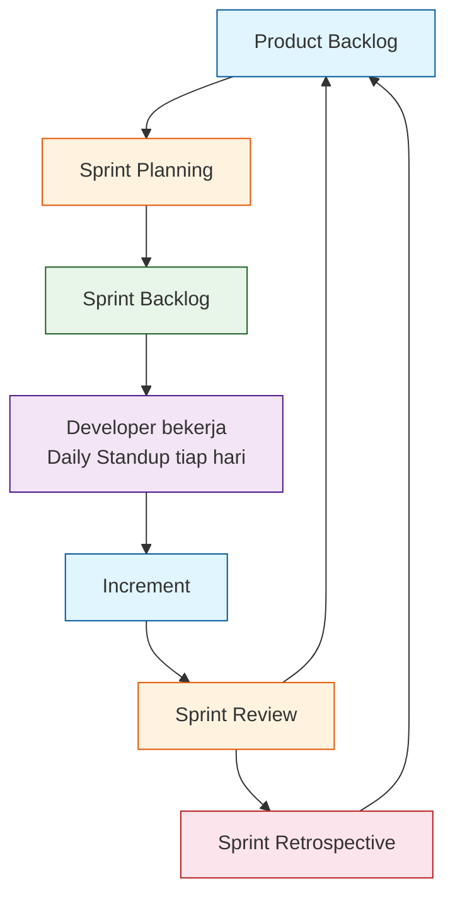

# 1.1 Agile & Scrum — Konsep Dasar, Roles, Artifak

## Agile vs Waterfall

| Waterfall | Agile |
|-----------|-------|
| Rencana semua di awal | Rencana bertahap, bisa berubah |
| User lihat hasil di akhir | User lihat hasil tiap 1–2 minggu |
| Error ketemu pas tahap akhir | Error ketemu cepat tiap sprint |
| Dokumen tebal | Dokumen secukupnya, kode jalan |
| Cocok untuk proyek besar & pasti | Cocok untuk proyek yang banyak berubah |

**Waterfall** = model air terjun. Langkahnya: Analisis → Desain → Implementasi → Testing → Maintenance. Kalau ada error di desain, ketemunya pas testing — sakitnya di akhir.

**Agile** = lincah. Kerja dalam **siklus pendek** (sprint). Fitur dikerjain sedikit demi sedikit, langsung demo ke user, langsung perbaiki feedback.

> **Kapan pakai?** Tugas kuliah dengan spek sering berubah → Agile. Proyek akhir dengan dokumen fix dari awal → bisa Waterfall. Tapi rekomendasi: tetap Agile biar adaptif.

---

## Agile Manifesto (4 Nilai)

1. **Individu dan interaksi** ➡ daripada proses dan alat
2. **Perangkat lunak yang berfungsi** ➡ daripada dokumentasi lengkap
3. **Kolaborasi dengan pelanggan** ➡ daripada negosiasi kontrak
4. **Merespons perubahan** ➡ daripada mengikuti rencana

> **Intinya:** Kode jalan > dokumen tebal. Ngobrol dengan user > bikin spek 50 halaman.

---

## Scrum — Kerangka Kerja Agile

Scrum adalah kerangka kerja Agile paling populer. Bukan metode kaku — tapi **mainan yang tinggal pakai**.

### 3 Pilar Scrum

1. **Transparency** — Semua orang tau apa yang dikerjakan
2. **Inspection** — Sering cek hasil kerja
3. **Adaptation** — Sesuaikan rencana kalau melenceng

---

## 3 Peran Scrum (Roles)

### Product Owner (PO) — "Suara User"

**Tugas:**
- Tulis **User Story** (kebutuhan fitur dari sisi user)
- Urutkan prioritas di **Product Backlog**
- Jelaskan "kenapa" fitur ini penting
- Terima / tolak hasil sprint

**Di kelas:** Satu orang jadi PO. Bisa dosen atau siswa yang paling ngerti kebutuhan proyek. PO bukan manager — PO tidak suruh-suruh tim cara ngerjain.

### Scrum Master (SM) — "Pelindung Tim"

**Tugas:**
- Pastikan Scrum jalan benar
- Hapus hambatan (blocker) tim
- Fasilitasi meeting (standup, planning, review, retro)
- Bukan ketua tim — bukan bos

**Di kelas:** SM bisa bergilir tiap sprint. SM tidak perlu jago coding. Cukup peduli sama proses tim.

### Developer (Dev) — "Tukang Kode"

**Tugas:**
- Memilih task sendiri (self-assign)
- Ngerjain task → selesai di standup
- Tes kode sendiri
- Bertanggung jawab bareng

**Di kelas:** Semua anggota tim sisanya. Semua Dev setara — tidak ada "programmer senior" dan "anak gambar".

> **Aturan emas:** PO bilang "APA", SM jagain "BAGAIMANA", Dev kerjain "siapa yang ngapain".

---

## 3 Artifak Scrum

### Product Backlog

Daftar semua fitur yang **mungkin** dikerjakan. Hidup — terus berubah. Diurutkan dari paling penting ke paling tidak penting.

Format:
```
[PRIORITAS] [TIPE] [JUDUL]
P1 - FEATURE - Login Google
P2 - FEATURE - Export PDF
P3 - BUG - Tombol simpan double click error
```

**User Story** adalah unit backlog:
```
Sebagai [pengguna], saya ingin [fitur] agar [alasan].
```

Contoh:
```
Sebagai siswa, saya ingin login pakai Google agar tidak perlu daftar ulang.
```

### Sprint Backlog

Task-task dari Product Backlog yang **diambil untuk sprint ini**. Dibreakdown jadi subtask ~4–16 jam.

Contoh breakdown:
```
FEATURE: Login Google
  [] [4 jam] Setup OAuth Google Console
  [] [6 jam] Buat halaman login (tombol Google)
  [] [2 jam] Test login dengan akun dummy
```

### Increment

Hasil sprint yang **selesai dan bisa dipakai**. Tiap sprint harus ngasih increment yang berfungsi — walau cuma 1 halaman.

> **Syarat Increment:** Kode sudah di-review, sudah di-merge ke branch utama, sudah jalan di lokal.

---

## Siklus Sprint (Mermaid)



**Penjelasan diagram:**
1. **Product Backlog** — Semua fitur yang mungkin
2. **Sprint Planning** — Tim pilih fitur untuk sprint ini
3. **Sprint Backlog** — Task yang dikerjakan selama sprint
4. **Developer + Daily Standup** — Proses pengerjaan, tiap hari cek progress
5. **Increment** — Hasil sprint yang bisa dipakai
6. **Sprint Review** — Demo ke PO, PO kasih feedback
7. **Sprint Retrospective** — Evaluasi proses tim

---

## Contoh Mapping Peran (4 Orang)

| Nama | Peran | Tugas Utama |
|------|-------|-------------|
| Budi | Product Owner | Tulis backlog, urut prioritas, terima/tolak fitur |
| Ani | Scrum Master | Fasilitasi meeting, hapus blocker |
| Caca | Developer | Coding fitur |
| Dedi | Developer | Coding fitur |

> **Catatan:** Di tim 3 orang, PO bisa merangkap Dev (tapi tidak ideal). SM bisa bergilir tiap sprint.

---

## Latihan

### Latihan 1: Bedain Waterfall vs Agile (Diskusi Kelompok — 10 menit)

Baca skenario berikut, tentukan cocok pakai Waterfall atau Agile, dan jelaskan alasannya.

| Skenario | Cocok Pakai? | Kenapa? |
|----------|--------------|---------|
| Proyek akhir SMK — spek udah fix dari awal | | |
| Aplikasi startup — fitur bisa berubah tiap minggu | | |
| Sistem ATM bank — keamanan ketat, jarang update | | |
| Tugas kelompok 2 minggu — dosen suka ganti permintaan | | |

### Latihan 2: Tentukan Peran (Diskusi — 10 menit)

Untuk tiap aktivitas, siapa yang paling bertanggung jawab? (PO / SM / Dev)

| Aktivitas | Peran |
|-----------|-------|
| Nulis user story "Sebagai user..." | |
| Nentuin prioritas fitur | |
| Ngebut deadline terdesak | |
| Ngasih tahu dosen kalau progress terhambat | |
| Nulis kode fitur login | |
| Fasilitasi daily standup | |
| Nolak fitur karena tidak sesuai kebutuhan | |

### Latihan 3: Bikin Product Backlog Awal (Kelompok — 15 menit)

Tentukan proyek final kalian (aplikasi yang akan dibuat). Buat minimal **6 user story** di Product Backlog dengan format:

```
P[prioritas] - [TIPE] - [Judul]
Sebagai [pengguna], saya ingin [fitur] agar [alasan].
```

Contoh untuk aplikasi perpustakaan sekolah:
```
P1 - FEATURE - Login anggota
Sebagai anggota perpustakaan, saya ingin login pakai NIS/NIP agar bisa akses fitur peminjaman.
```

### Latihan 4: Gambar Siklus Sprint (Individu — 10 menit)

Gambar ulang diagram siklus Sprint di kertas atau digital. Tambahkan:
- Durasi tiap fase (misal: planning 2 jam, sprint 2 minggu, review 1 jam)
- Siapa yang hadir di tiap fase

---

> **Ringkasan:** Agile = lincah, Scrum = framework Agile paling populer. Ada 3 peran (PO, SM, Dev), 3 artifak (Product Backlog, Sprint Backlog, Increment). Siklus sprint: planning → kerja → review → retro → ulang.
