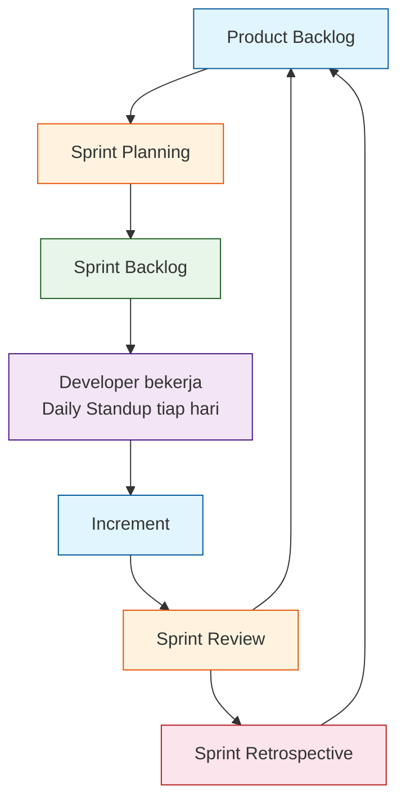
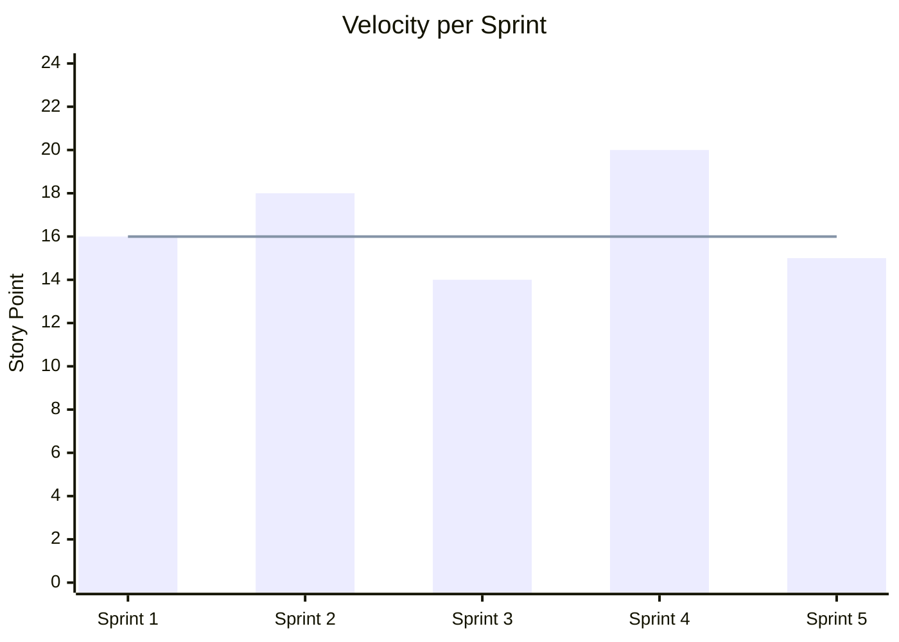
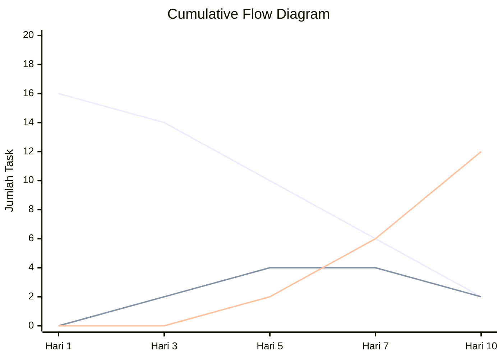

# 1.1 Agile & Scrum — Konsep Dasar, Roles, Artifak

## Agile vs Waterfall

| Waterfall | Agile |
|-----------|-------|
| Rencana semua di awal | Rencana bertahap, bisa berubah |
| User lihat hasil di akhir | User lihat hasil tiap 1–2 minggu |
| Error ketemu pas tahap akhir | Error ketemu cepat tiap sprint |
| Dokumen tebal | Dokumen secukupnya, kode jalan |
| Cocok untuk proyek besar & pasti | Cocok untuk proyek yang banyak berubah |

**Waterfall** = model air terjun. Langkahnya: Analisis → Desain → Implementasi → Testing → Maintenance. Kalau ada error di desain, ketemunya pas testing — sakitnya di akhir.

**Agile** = lincah. Kerja dalam **siklus pendek** (sprint). Fitur dikerjain sedikit demi sedikit, langsung demo ke user, langsung perbaiki feedback.

> **Kapan pakai?** Tugas kuliah dengan spek sering berubah → Agile. Proyek akhir dengan dokumen fix dari awal → bisa Waterfall. Tapi rekomendasi: tetap Agile biar adaptif.

---

## Agile Manifesto (4 Nilai)

1. **Individu dan interaksi** ➡ daripada proses dan alat
2. **Perangkat lunak yang berfungsi** ➡ daripada dokumentasi lengkap
3. **Kolaborasi dengan pelanggan** ➡ daripada negosiasi kontrak
4. **Merespons perubahan** ➡ daripada mengikuti rencana

> **Intinya:** Kode jalan > dokumen tebal. Ngobrol dengan user > bikin spek 50 halaman.

---

## Scrum — Kerangka Kerja Agile

Scrum adalah kerangka kerja Agile paling populer. Bukan metode kaku — tapi **mainan yang tinggal pakai**.

### 3 Pilar Scrum

1. **Transparency** — Semua orang tau apa yang dikerjakan
2. **Inspection** — Sering cek hasil kerja
3. **Adaptation** — Sesuaikan rencana kalau melenceng

---

## 3 Peran Scrum (Roles)

### Product Owner (PO) — "Suara User"

**Tugas:**
- Tulis **User Story** (kebutuhan fitur dari sisi user)
- Urutkan prioritas di **Product Backlog**
- Jelaskan "kenapa" fitur ini penting
- Terima / tolak hasil sprint

**Di kelas:** Satu orang jadi PO. Bisa dosen atau siswa yang paling ngerti kebutuhan proyek. PO bukan manager — PO tidak suruh-suruh tim cara ngerjain.

### Scrum Master (SM) — "Pelindung Tim"

**Tugas:**
- Pastikan Scrum jalan benar
- Hapus hambatan (blocker) tim
- Fasilitasi meeting (standup, planning, review, retro)
- Bukan ketua tim — bukan bos

**Di kelas:** SM bisa bergilir tiap sprint. SM tidak perlu jago coding. Cukup peduli sama proses tim.

### Developer (Dev) — "Tukang Kode"

**Tugas:**
- Memilih task sendiri (self-assign)
- Ngerjain task → selesai di standup
- Tes kode sendiri
- Bertanggung jawab bareng

**Di kelas:** Semua anggota tim sisanya. Semua Dev setara — tidak ada "programmer senior" dan "anak gambar".

> **Aturan emas:** PO bilang "APA", SM jagain "BAGAIMANA", Dev kerjain "siapa yang ngapain".

---

## 3 Artifak Scrum

### Product Backlog

Daftar semua fitur yang **mungkin** dikerjakan. Hidup — terus berubah. Diurutkan dari paling penting ke paling tidak penting.

Format:
```
[PRIORITAS] [TIPE] [JUDUL]
P1 - FEATURE - Login Google
P2 - FEATURE - Export PDF
P3 - BUG - Tombol simpan double click error
```

**User Story** adalah unit backlog:
```
Sebagai [pengguna], saya ingin [fitur] agar [alasan].
```

Contoh:
```
Sebagai siswa, saya ingin login pakai Google agar tidak perlu daftar ulang.
```

### Sprint Backlog

Task-task dari Product Backlog yang **diambil untuk sprint ini**. Dibreakdown jadi subtask ~4–16 jam.

Contoh breakdown:
```
FEATURE: Login Google
  [] [4 jam] Setup OAuth Google Console
  [] [6 jam] Buat halaman login (tombol Google)
  [] [2 jam] Test login dengan akun dummy
```

### Increment

Hasil sprint yang **selesai dan bisa dipakai**. Tiap sprint harus ngasih increment yang berfungsi — walau cuma 1 halaman.

> **Syarat Increment:** Kode sudah di-review, sudah di-merge ke branch utama, sudah jalan di lokal.

---

## Siklus Sprint (Mermaid)



**Penjelasan diagram:**
1. **Product Backlog** — Semua fitur yang mungkin
2. **Sprint Planning** — Tim pilih fitur untuk sprint ini
3. **Sprint Backlog** — Task yang dikerjakan selama sprint
4. **Developer + Daily Standup** — Proses pengerjaan, tiap hari cek progress
5. **Increment** — Hasil sprint yang bisa dipakai
6. **Sprint Review** — Demo ke PO, PO kasih feedback
7. **Sprint Retrospective** — Evaluasi proses tim

---

## Contoh Mapping Peran (4 Orang)

| Nama | Peran | Tugas Utama |
|------|-------|-------------|
| Budi | Product Owner | Tulis backlog, urut prioritas, terima/tolak fitur |
| Ani | Scrum Master | Fasilitasi meeting, hapus blocker |
| Caca | Developer | Coding fitur |
| Dedi | Developer | Coding fitur |

> **Catatan:** Di tim 3 orang, PO bisa merangkap Dev (tapi tidak ideal). SM bisa bergilir tiap sprint.

---

## Latihan

### Latihan 1: Bedain Waterfall vs Agile (Diskusi Kelompok — 10 menit)

Baca skenario berikut, tentukan cocok pakai Waterfall atau Agile, dan jelaskan alasannya.

| Skenario | Cocok Pakai? | Kenapa? |
|----------|--------------|---------|
| Proyek akhir SMK — spek udah fix dari awal | | |
| Aplikasi startup — fitur bisa berubah tiap minggu | | |
| Sistem ATM bank — keamanan ketat, jarang update | | |
| Tugas kelompok 2 minggu — dosen suka ganti permintaan | | |

### Latihan 2: Tentukan Peran (Diskusi — 10 menit)

Untuk tiap aktivitas, siapa yang paling bertanggung jawab? (PO / SM / Dev)

| Aktivitas | Peran |
|-----------|-------|
| Nulis user story "Sebagai user..." | |
| Nentuin prioritas fitur | |
| Ngebut deadline terdesak | |
| Ngasih tahu dosen kalau progress terhambat | |
| Nulis kode fitur login | |
| Fasilitasi daily standup | |
| Nolak fitur karena tidak sesuai kebutuhan | |

### Latihan 3: Bikin Product Backlog Awal (Kelompok — 15 menit)

Tentukan proyek final kalian (aplikasi yang akan dibuat). Buat minimal **6 user story** di Product Backlog dengan format:

```
P[prioritas] - [TIPE] - [Judul]
Sebagai [pengguna], saya ingin [fitur] agar [alasan].
```

Contoh untuk aplikasi perpustakaan sekolah:
```
P1 - FEATURE - Login anggota
Sebagai anggota perpustakaan, saya ingin login pakai NIS/NIP agar bisa akses fitur peminjaman.
```

### Latihan 4: Gambar Siklus Sprint (Individu — 10 menit)

Gambar ulang diagram siklus Sprint di kertas atau digital. Tambahkan:
- Durasi tiap fase (misal: planning 2 jam, sprint 2 minggu, review 1 jam)
- Siapa yang hadir di tiap fase

### Latihan 5: Story Map Praktik (Kelompok — 20 menit)

Pilih 1 aplikasi yang mau dibuat (bisa proyek final). Bikin story map:
- Tulis 3 aktivitas utama (horizontal)
- Breakdown tiap aktivitas jadi 3-5 task
- Urutkan prioritas vertikal: MVP vs Sprint 2 vs Nanti
- Potong baris MVP → itu Sprint Backlog Sprint 1

### Latihan 6: Velocity & Timeline (Individu — 10 menit)

Tim lo punya sisa backlog 120 story point. Data velocity:

| Sprint | Story Point Selesai |
|--------|---------------------|
| 1 | 10 |
| 2 | 14 |
| 3 | 12 |

Hitung: (a) velocity rata-rata (b) prediksi jumlah sprint yang dibutuhkan (c) estimasi tanggal selesai kalo sprint 2 mingguan mulai 1 Agustus.

### Latihan 7: Tools Comparison (Kelompok — 10 menit)

Buat tabel perbandingan 3 tools agile: Jira vs Linear vs GitHub Projects. Kriterianya:
- Biaya (untuk tim 5 orang)
- Fitur Scrum (sprint, backlog, burndown)
- Learning curve
- Integrasi GitHub

---
---

> **Ringkasan:** Agile = lincah, Scrum = framework Agile paling populer. Ada 3 peran (PO, SM, Dev), 3 artifak (Product Backlog, Sprint Backlog, Increment). Siklus sprint: planning → kerja → review → retro → ulang.

### Latihan 8: Bikin Story Map untuk Proyek Kalian (Kelompok — 20 menit)

Ambil proyek final kalian. Buat story map di kertas atau Miro:
1. Tulis 3-4 aktivitas utama user (horizontal)
2. Breakdown tiap aktivitas jadi 3-5 task detail
3. Urutkan prioritas vertikal: baris 1 = MVP (Sprint 1), baris 2 = Sprint 2, baris 3 = Nanti
4. Lingkari baris MVP → itu Sprint Backlog Sprint 1
5. Foto hasil, kumpulkan ke dosen

---

## Story Mapping — Visualisasi Produk

Story mapping ngatur user story dalam 2 dimensi: **aktivitas utama** (horizontal) vs **prioritas** (vertikal).

```
Walk Through:           ── Aktivitas ──────────────────────>
Prioritas ↓      [Cari Buku]    [Pinjam Buku]    [Kembalikan]
─────────────    ────────────    ─────────────    ───────────
MVP (Sprint 1)   Cari by judul   Pinjam 1 buku    ─
Sprint 2         Filter kategori  Pinjam banyak     Scan barcode
Sprint 3         Rekomendasi AI   Antar buku        Riwayat
```

### Cara Bikin Story Map

1. Tulis **user activities** — aktivitas utama user di sistem (Cari buku, Pinjam, Kembalikan)
2. Breakdown ke **user tasks** — langkah detail tiap aktivitas
3. Urutkan **vertikal** — prioritas (paling penting di atas = harus ada di MVP)
4. Potong **horizontal** — sprint planning: ambil baris paling atas untuk Sprint 1

### Kenapa Story Mapping?

| Tanpa Story Map | Pake Story Map |
|----------------|----------------|
| Tim gak lihat gambaran besar | Tim lihat semua fitur di satu tempat |
| Prioritas gak jelas | Prioritas visual (atas-bawah) |
| MVP gak terdefinisi | Jelas fitur apa yang harus selesai duluan |
| Sprint planning tebak-tebakan | Sprint planning berdasarkan prioritas vertikal |

### Contoh Story Map — Aplikasi Perpustakaan

```
Walk Through:           ── Aktivitas ──────────────────────────────────>
Prioritas ↓      [Cari Buku]       [Pinjam Buku]    [Kembalikan Buku]
─────────────    ────────────       ─────────────    ────────────────
MVP (Sprint 1)   Cari by judul     Pinjam 1 buku    ─
                 Lihat detail       Riwayat pinjam
Sprint 2         Filter kategori   Pinjam banyak    Scan barcode
                 Sort by tahun                       Notif telat
Sprint 3         Rekomendasi       Antar buku       Riwayat lengkap
                 Barcode scanner    Booking buku     Denda otomatis
```

Dari story map di atas, Sprint 1 (MVP) ambil baris paling atas: **Cari by judul**, **Lihat detail buku**, **Pinjam 1 buku**, **Riwayat pinjam**. Sisanya masuk backlog Sprint 2 dan 3.

---

## Velocity Estimation

Velocity = rata-rata story point yang selesai per sprint. Dipake buat prediksi.

### Cara Hitung Velocity

```text
Sprint 1: selesai 16 story point
Sprint 2: selesai 18 story point
Sprint 3: selesai 14 story point

Velocity = (16 + 18 + 14) / 3 = 16 story point per sprint
```

### Prediksi Timeline

```text
Sisa product backlog: 80 story point
Velocity: 16 per sprint
Sprint yang dibutuhkan: 80 / 16 = 5 sprint
→ Kurang lebih 10 minggu (5 sprint × 2 minggu)
```

### Velocity Chart (Mermaid)



### Aturan Velocity

- Jangan pake velocity dari sprint pertama sebagai tolak ukur — masih belajar
- Velocity bukan ukuran produktivitas individu — ukuran TIM
- Velocity stabil setelah 3-5 sprint
- Kalo velocity turun drastis, ada masalah proses/blocker

---

## Agile Metrics — Ukur Kesehatan Tim

### Cycle Time

Waktu dari mulai ngerjain task sampai selesai (In Progress → Done).

```text
Task A: mulai 2 Juli, selesai 5 Juli → cycle time 3 hari
Task B: mulai 3 Juli, selesai 6 Juli → cycle time 3 hari
Task C: mulai 5 Juli, selesai 10 Juli → cycle time 5 hari

Rata-rata cycle time: (3 + 3 + 5) / 3 = 3.67 hari
```

**Target:** Cycle time < panjang sprint. Ideal: 2-4 hari per task.

### Throughput

Jumlah task yang selesai per unit waktu (biasanya per sprint atau per minggu).

```text
Sprint 1: 5 task selesai
Sprint 2: 7 task selesai
Sprint 3: 6 task selesai

Rata-rata throughput: 6 task per sprint
```

### Lead Time

Waktu dari task masuk backlog sampai selesai (To Do → Done). Lead time > cycle time karena termasuk waktu nunggu.

### Cumulative Flow Diagram (CFD)



**Baca CFD:**
- Jarak antara garis To Do dan Done = Work In Progress (WIP)
- WIP tinggi → bottleneck
- Garis horizontal panjang di In Progress → blocker

### DORA Metrics (DevOps Research Assessment)

| Metrik | Target Elite | Target SMK |
|--------|-------------|------------|
| Deployment frequency | Daily | 1x per sprint |
| Lead time for changes | < 1 jam | < 3 hari |
| Time to restore service | < 1 jam | < 1 hari |
| Change failure rate | < 5% | < 20% |

---

## SAFe & LeSS — Scaling Agile

### SAFe (Scaled Agile Framework)

SAFe adalah framework agile untuk organisasi besar (50-500+ orang).

```
SAFe Levels:
┌─────────────────────────────────────┐
│           Portfolio Level            │ ← Strategi bisnis
├─────────────────────────────────────┤
│           Program Level             │ ← ART (Agile Release Train)
├─────────────────────────────────────┤
│           Team Level                │ ← Scrum tim biasa
└─────────────────────────────────────┘
```

**Kapan pake SAFe?** Perusahaan dengan 5+ tim yang harus koordinasi. **Bukan** untuk proyek SMK (terlalu berat).

### LeSS (Large Scale Scrum)

LeSS = Scrum yang di-scale tanpa nambah roles/framework complex.

| Aspek | SAFe | LeSS |
|-------|------|------|
| Tim | 50-500+ | 2-8 tim |
| Roles tambahan | Banyak (Release Train Engineer, System Architect, dll) | 1 Product Owner untuk semua tim |
| Ceremonies | Planning + PI Planning | 1 Sprint Planning untuk semua tim |
| Complexity | Sangat tinggi | Minimal — tetap Scrum |
| Cocok buat | Enterprise | Produk besar 2-8 tim |

### Prinsip Scaling Agile

1. **Feature teams** — tim punya kemampuan end-to-end, bukan tim komponen
2. **Sama-sama sprint** — semua tim mulai & selesai bareng
3. **1 Product Backlog** — bukan tiap tim punya backlog sendiri
4. **Cross-team coordination** — daily standup gabungan seminggu 1x
5. **System demo** — demo gabungan semua tim tiap sprint

---

## Remote Agile — Scrum untuk Tim Jarak Jauh

### Tantangan Remote Agile

| Tantangan | Solusi |
|-----------|--------|
| Standup jadi laporan, bukan diskusi | Pake timer, rotasi siapa mulai duluan |
| Kurang fokus pas remote | Sprint Goal ditempel di virtual background |
| Blocker gak keliatan | SM lebih aktif tanya di chat pribadi |
| Sprint review sepi | Minta tiap dev demo fiturnya langsung |
| Retro gak jujur | Pake anonymous tool (EasyRetro, FunRetro) |

### Tools Remote Agile

| Tool | Fungsi |
|------|--------|
| **Miro / Mural** | Sprint retro digital, story mapping, flowchart |
| **EasyRetro / FunRetro** | Retro board anonim — tim lebih jujur |
| **Discord / Telegram** | Daily standup async (tinggal ketik) |
| **Google Meet / Zoom** | Sprint planning & review video call |
| **Jira / Linear** | Sprint backlog digital |
| **GitHub Projects** | Sprint board gratis |

### Async Standup Template

Buat tim yang beda zona waktu atau jadwal kuliah:

```text
# Daily Standup — [Tanggal]

**Budi (PO)**
- 🟢 Kemarin: Nulis user story checkout
- 🟡 Hari ini: Finalisasi backlog Sprint 2
- 🔴 Blocker: Nunggu feedback dosen

**Ani (Dev)**
- 🟢 Kemarin: Selesai integrasi API login
- 🟡 Hari ini: Mulai halaman profile
- 🔴 Blocker: - (aman)

**Caca (Dev)**
- 🟢 Kemarin: Review PR Budi, fix bug pagination
- 🟡 Hari ini: Fitur search
- 🔴 Blocker: Butuh akses ke DB production
```

### Sprint Planning Remote

1. Share screen Product Backlog (di GitHub Projects / Jira)
2. PO jelaskan story satu-satu
3. Tim voting story point di chat (pake emoji: 👍=5, 🚀=3, 🐢=1 atau pake Polling)
4. Diskusi kalo ada voting beda jauh
5. SM simpulkan & tulis Sprint Goal di channel

---

## Agile Tools — Jira, Linear, & Alternatif

### Perbandingan

| Fitur | Jira | Linear | GitHub Projects | Trello | Notion |
|-------|------|--------|-----------------|--------|--------|
| Sprint management | ✅✅ | ✅✅ | ✅ | ❌ | ✅ |
| Burndown chart | ✅ | ✅ | ❌ (manual) | ❌ | ❌ |
| Story point | ✅ | ✅ | ✅ (pake labels) | ❌ | ✅ |
| Roadmap | ✅✅ | ✅✅ | ✅ | ❌ | ✅ |
| Gratis | ✅ (up to 10 users) | ✅ (up to 10 users) | ✅✅ | ✅✅ | ✅✅ |
| Integrasi GitHub | ❌ (butuh plugin) | ❌ | ✅✅ (native) | ❌ | ❌ |
| Learning curve | Tinggi | Rendah | Rendah | Sangat rendah | Rendah |

### Jira — Standar Industri

```bash
# Akses Jira untuk proyek SMK — gratis
# 1. Buka https://www.atlassian.com/software/jira/free
# 2. Daftar pake email sekolah
# 3. Pilih template "Scrum"
# 4. Setup: Product Backlog (Epic → Stories → Tasks)
# 5. Invite anggota tim via email
```

**Keunggulan Jira:**
- Standar industri — dipake Google, Spotify, Gojek
- Report: burndown, velocity chart, sprint report
- Roadmap untuk planning jangka panjang
- Workflow kustom — bisa adaptasi sama proses tim

**Kekurangan Jira:**
- Berat di browser
- Banyak fitur, bikin bingung
- Setup butuh waktu

### Linear — Modern & Cepat

Linear adalah alternatif Jira yang lebih modern, fast, UX lebih enak.

```bash
# Akses Linear
# 1. Buka https://linear.app
# 2. Daftar pake Google
# 3. Buat team → pilih template Scrum
# 4. Keyboard shortcuts:
#    N = new issue, C = comment, E = edit
#    S = change status, P = change priority
#    → = next issue, ← = previous issue
```

**Keunggulan Linear:**
- Super cepat (built with Rust)
- Keyboard-first
- Shortcuts cycle time, Triage, View
- Integrasi GitHub/API bagus
- UX lebih enak dari Jira

**Kekurangan Linear:**
- Ekosistem plugin lebih kecil
- Report kurang lengkap dibanding Jira
- Belum ada fitur testing/QA tracking

### GitHub Projects — Gratis & Native

Paling recommended untuk proyek SMK karena:
- Gratis tanpa limit
- Native integrasi sama GitHub Issues & PR
- Gak perlu belajar tool baru — semua di GitHub doang
- Bisa auto-update status berdasarkan PR/commit

### Tips Pilih Tool untuk Proyek SMK

1. **Tim baru Scrum** → GitHub Projects (free, native, familiar)
2. **Pengen belajar standar industri** → Jira (skill marketable)
3. **Tim suka tools cepat** → Linear (UX terbaik)
4. **Butuh kolaborasi tugas + dokumen** → Notion
5. **Tim kecil, suka simple** → Trello (tapi fitur Scrum kurang)
