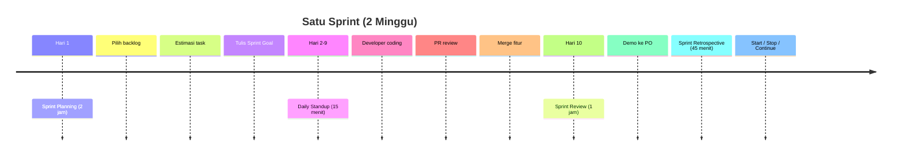

# 1.2 Ceremonies & Backlog Management

## 4 Upacara Scrum (Ceremonies)

### 1. Sprint Planning — Awal Sprint (Maks 2 jam)

**Tujuan:** Tentukan apa yang dikerjakan sprint ini dan bagaimana cara menyelesaikannya.

**Agenda:**
1. PO jelaskan prioritas Product Backlog (top 3–5)
2. Tim diskusi & klarifikasi
3. Tim estimasi effort (story point atau jam)
4. Tim pilih task yang masuk Sprint Backlog
5. Breakdown task jadi subtask (masing-masing ≤16 jam)
6. Tulis **Sprint Goal** — 1 kalimat tujuan sprint

**Output:** Sprint Backlog + Sprint Goal.

> **Sprint Goal contoh:** "Sprint ini kita buat fitur login, registrasi, dan landing page agar user bisa daftar dan lihat halaman depan."

### 2. Daily Standup — Tiap Hari (15 menit, berdiri)

Tiap orang jawab 3 pertanyaan:

1. **Apa yang saya kerjakan kemarin?**
2. **Apa yang akan saya kerjakan hari ini?**
3. **Apa hambatan saya?**

**Aturan:**
- Berdiri — biar singkat
- Bukan laporan ke SM — komitmen ke tim
- Jangan bahas solusi di standup. Bahas **setelah** standup (scrumming session)
- Kalau ada blocker, SM catat dan bantu setelah standup

### 3. Sprint Review — Akhir Sprint (Maks 1 jam)

**Tujuan:** Demo hasil kerja ke PO dan stakeholder.

**Agenda:**
1. Tim demo increment ke PO / dosen (langsung buka aplikasi, bukan slide)
2. PO cek apakah sesuai ekspektasi
3. PO terima atau tolak fitur
4. Diskusi: apa yang mau diubah?
5. Product Backlog diperbarui

> **Bukan presentasi slide — langsung demo kode jalan.**

### 4. Sprint Retrospective — Setelah Review (Maks 45 menit)

**Tujuan:** Tim evaluasi proses — bukan orang.

**Format Start-Stop-Continue:**

| Kategori | Arti | Contoh |
|----------|------|--------|
| **Start** | Hal baru yang perlu mulai dilakukan | "Mulai bikin branch sendiri sebelum coding" |
| **Stop** | Kebiasaan buruk yang harus dihentikan | "Stop commit langsung ke main" |
| **Continue** | Hal baik yang perlu dipertahankan | "Lanjutin daily standup tiap pagi" |

**Output:** 1–2 aksi konkret untuk sprint berikutnya.

> **Golden rule retro:** Blame tidak ada. Semua bicara tentang **proses**, bukan orang.

---

## Mermaid: Alur Satu Sprint Penuh



---

## User Stories — Bahasa Kebutuhan

User story adalah format standar untuk menulis kebutuhan fitur. Bukan dokumen teknis — ditulis dari **sisi pengguna**.

### Format Standar

```
Sebagai [peran pengguna], saya ingin [fitur] agar [manfaat/nilai bisnis].
```

**Contoh:**
```
Sebagai siswa, saya ingin melihat daftar buku yang tersedia agar tahu buku apa yang bisa dipinjam.
```

### INVEST — Kriteria User Story yang Baik

| Kriteria | Arti | Contoh ✅ | Contoh ❌ |
|----------|------|-----------|-----------|
| **I**ndependent | Bisa dikerjakan sendiri, tidak dependen story lain | "Login" | "Login & kirim email" (2 story) |
| **N**egotiable | Bisa didiskusikan, bukan instruksi kaku | "Tampilkan daftar buku" | "Buat tabel dengan kolom: judul, penulis, tahun" |
| **V**aluable | Memberi nilai ke pengguna | "Export data ke PDF" | "Bikin fungsi exportData()" |
| **E**stimable | Bisa diestimasi (tidak terlalu abstrak) | "Filter buku berdasarkan kategori" | "Sistem rekomendasi buku pake AI" |
| **S**mall | Ukuran pas untuk 1 sprint | "Halaman profile user" | "Buat seluruh aplikasi perpustakaan" |
| **T**estable | Jelas kapan selesai — bisa di-test | "Tombol simpan disabled kalau form kosong" | "Aplikasi responsif" |

---

## Estimasi Task

### Story Point

Bukan jam — **ukuran relatif** seberapa kompleks suatu task.

Skala umum (Fibonacci):
> **1, 2, 3, 5, 8, 13, 21**

| Story Point | Arti | Contoh |
|-------------|------|--------|
| 1 | Sangat kecil, tinggal ngetik | "Ganti warna tombol" |
| 2 | Kecil, sudah jelas caranya | "Tambah validasi email" |
| 3 | Sedang, perlu sedikit riset | "Buat halaman login" |
| 5 | Besar, ada beberapa bagian | "Integrasi API pembayaran" |
| 8 | Sangat besar, perlu breakdown | "Buat sistem notifikasi" |
| 13+ | Terlalu besar — harus dipecah | "Bikin aplikasi dari nol" |

### Planning Poker — Cara Estimasi Tim

1. Tiap dev pegang kartu (1, 2, 3, 5, 8, 13)
2. PO bacakan 1 user story
3. Tim diskusi sebentar
4. Hitung mundur — semua tunjuk kartu bersamaan
5. Kalau ada selisih jauh (1 vs 8), diskusi kenapa
6. Voting ulang sampai konsensus

```
Sprint: Sesi 1 (30 menit)
Story: "Sebagai siswa, saya bisa login pakai Google"

Voting ronde 1:
  Budi: 3   Ani: 5   Caca: 5   Dedi: 3

Selisih kecil → ambil rata-rata: 4 → pilih 5
→ Story Login Google: 5 story point
```

### Planning Poker Detail — Kasus Selisih Jauh

Kalo voting ada yang milih 1 dan yang lain milih 13, artinya ada **kesalahpahaman** soal story tersebut:

```
Story: "Buat sistem notifikasi"
Voting ronde 1:
  Budi: 3   Ani: 13   Caca: 8   Dedi: 5

Diskusi:
- Budi (3): "Notifikasi cuma toast di browser doang"
- Ani (13): "Notifikasi harus email + WhatsApp + in-app"
- Caca (8): "Aku pikir pake Firebase Cloud Messaging + email"

→ Ternyata tim belum sepakat scope notifikasi.
Fix: PO clarify scope → "Notifikasi in-app dulu, email next sprint"
Voting ronde 2:
  Budi: 3   Ani: 5   Caca: 3   Dedi: 3
→ Final: 3 story point
```

**Poin penting:** Planning poker bukan cuma estimasi — tapi **alat komunikasi** biar tim sepakat apa yang harus dikerjakan.

### Estimasi Timeline per Sprint

Rumus sederhana:

```
Jam tersedia per minggu × jumlah dev × 2 minggu = total jam sprint
Contoh: 10 jam × 4 dev × 2 minggu = 80 jam per sprint
```

Dari 80 jam, kurangi **20% buffer** (meeting, istirahat, revisi) → **64 jam efektif**.

---

## Backlog Refinement (Grooming)

Aktivitas rutin — **bukan upacara wajib** tapi sangat disarankan — untuk merapikan Product Backlog.

**Kapan:** Antar sprint atau tengah sprint, 1 jam.

**Aktivitas:**
1. Hapus story yang sudah tidak relevan
2. Split story yang terlalu besar (epic → stories)
3. Tambah detail ke story yang belum jelas
4. Re-prioritaskan sesuai feedback terbaru
5. Split story 13+ → beberapa story 3-5

---

## Contoh Sprint Backlog Lengkap

Untuk tim 4 orang, sprint 2 minggu:

| Story | Story Point | Assignee | Status |
|-------|-------------|----------|--------|
| Login Google | 5 | Budi | ✅ Done |
| Halaman Register | 5 | Ani | ✅ Done |
| Landing Page | 3 | Caca | 🔄 In Progress |
| Profile User | 3 | Dedi | ⏳ To Do |
| **Total** | **16** | | |

---

## Latihan

### Latihan 1: Tulis User Story (Individu — 10 menit)

Tulis ulang kebutuhan berikut jadi **user story** format yang benar.

| Kebutuhan | User Story |
|-----------|------------|
| User bisa cari buku berdasarkan judul | |
| Admin bisa nambah buku baru | |
| User bisa lihat riwayat peminjaman | |
| Sistem kirim notifikasi kalau buku harus dikembalikan | |

### Latihan 2: Evaluasi User Story dengan INVEST (Kelompok — 10 menit)

Evaluasi story berikut. Mana yang sudah INVEST? Mana yang perlu diperbaiki?

| User Story | INVEST? | Perbaikan |
|------------|---------|-----------|
| "Sebagai admin, saya ingin sistem yang cepat" | | |
| "Buat fungsi hitung denda" | | |
| "Sebagai siswa, saya ingin login pakai email agar bisa akses fitur peminjaman" | | |
| "Bikin semua fitur aplikasi perpustakaan" | | |

### Latihan 3: Planning Poker Simulasi (Kelompok — 15 menit)

Ambil 3 user story dari Product Backlog yang dibuat di sesi 1. Lakukan simulasi planning poker:

1. Setiap anggota voting (diam-diam) story point untuk tiap story
2. Tunjuk barengan
3. Diskusi kalau ada selisih jauh (≥3 poin)
4. Voting ulang sampai konsensus
5. Catat hasil estimasi

| Story | Voting 1 | Voting 2 | Final |
|-------|----------|----------|-------|
| [story 1] | | | |
| [story 2] | | | |
| [story 3] | | | |

### Latihan 4: Sprint Retro Simulation (Kelompok — 10 menit)

Bayangkan kalian sudah menyelesaikan 1 sprint untuk proyek RPL. Isi tabel Start-Stop-Continue:

| Kategori | Isi |
|----------|-----|
| **Start** (mulai lakukan) | |
| **Start** | |
| **Stop** (hentikan) | |
| **Stop** | |
| **Continue** (pertahankan) | |
| **Continue** | |

> **Aksi konkret:** Pilih 1 dari Start dan 1 dari Stop → tulis langkah konkret untuk sprint depan.

### Latihan 5: Planning Poker dengan Selisih Jauh (Kelompok — 10 menit)

Simulasi skenario berikut: Tim voting story "Integrasi pembayaran via QRIS".
- Anggota A voting 3 (anggap ini gampang)
- Anggota B voting 13 (anggap ini susah)
- Anggota C voting 8

**Diskusikan:**
1. Kenapa selisih jauh? Apa yang dipikirkan tiap anggota?
2. Apa yang harus PO klarifikasi?
3. Voting ulang sampai konsensus. Catat hasil final.
4. Refleksi: apa yang dipelajari dari proses ini?

### Latihan 6: Backlog Refinement (Kelompok — 15 menit)

Ambil Product Backlog dari sesi 1. Lakukan refinement:
1. Hapus 1 story yang sudah tidak relevan
2. Split 1 story yang terlalu besar (≥13 point) jadi 2-3 story kecil
3. Tambah detail/invest ke 1 story yang masih kurang jelas
4. Re-prioritaskan: pindahkan 1 story ke prioritas lebih tinggi
5. Catat perubahan di README proyek

---

> **Ringkasan:** 4 upacara Scrum = Planning, Standup, Review, Retro. User story pakai format INVEST. Estimasi pakai story point (1–21) + planning poker. Backlog refinement jaga backlog tetap rapi.
