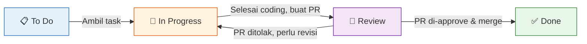
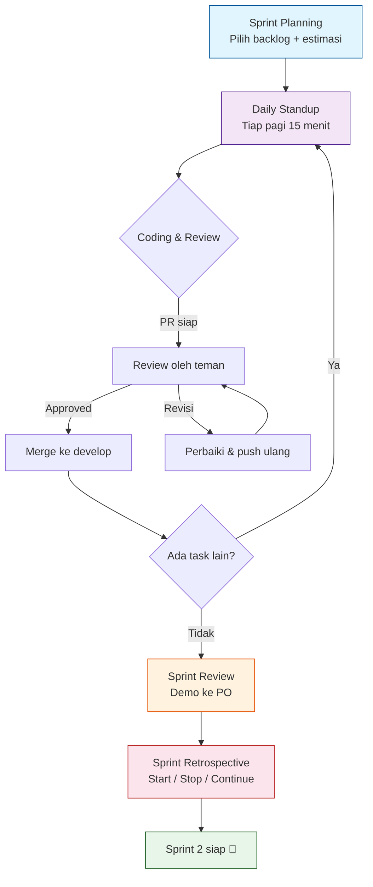

# 1.3 Tools & Penerapan ke Proyek Final

## GitHub Projects — Sprint Board Digital

GitHub Projects adalah fitur bawaan GitHub untuk manage task pakai **board visual**.

### Cara Setup GitHub Projects

1. Buka repo proyek kalian di GitHub
2. Klik tab **Projects** → **Create project**
3. Pilih **Board** (kanban style)
4. Beri nama: `Sprint Board - [Nama Proyek]`
5. Klik **Create**

### Struktur Kolom Standar

| Kolom | Arti |
|-------|------|
| **📋 To Do** | Task yang sudah direncanakan tapi belum dikerjakan |
| **🔄 In Progress** | Task yang sedang dikerjakan seseorang |
| **👀 Review** | Task selesai coding, nunggu PR di-review |
| **✅ Done** | Task sudah selesai + di-merge |

### Drag & Drop Workflow

```
To Do → In Progress → Review → Done
```

Sehari-hari:
1. Ambil task dari **To Do** → drag ke **In Progress**
2. Assign ke diri sendiri
3. Coding + commit
4. Bikin PR → drag ke **Review** + tag reviewer
5. Review selesai, merge → drag ke **Done**

---

## Mermaid: Alur Task di Sprint Board



---

## Milestones di GitHub

Milestones = **sprint** di GitHub timeline.

### Cara Setup Milestone

1. Repo → **Issues** → **Milestones** → **Create a milestone**
2. Isi:
   - **Title:** `Sprint 1`
   - **Due date:** tanggal akhir sprint
   - **Description:** Sprint Goal (contoh: "Fitur auth + landing page")
3. Setelah buat, tiap issue bisa di-assign ke milestone ini

**Melihat progress:** GitHub otomatis hitung berapa % issue yang closed vs open di milestone.

---

## Burndown Chart

**Burndown chart** = grafik yang menunjukkan sisa effort (story point) tiap hari selama sprint.

### Cara Baca

```
Story Point
  ^
  | 16 ┤ Start: 16 story point
  | 12 ┤
  |  8 ┤
  |  4 ┤
  |  0 ┤ End: 0 story point → ✅
  +-------------------------> Hari
     1  2  3  4  5  6  7  8  9  10
```

**Garis biru (ideal):** Penurunan linear — tiap hari selesai ~1.6 story point.
**Garis oranye (aktual):** Realita tim — naik-turun.

### Burndown Simulation (Mermaid)

```mermaid
---
title: Burndown Chart — Sprint 1
---
xyChart
    x-axis "Hari" [1, 2, 3, 4, 5, 6, 7, 8, 9, 10]
    y-axis "Sisa Story Point" 0 --> 20
    line "Ideal" [16, 14.4, 12.8, 11.2, 9.6, 8.0, 6.4, 4.8, 3.2, 1.6]
    line "Aktual" [16, 16, 14, 14, 11, 9, 9, 6, 3, 0]
```

**Arti:**

| Hari | Sisa SP | Arti |
|------|---------|------|
| 1 | 16 | Sprint start, semua task belum disentuh |
| 2-3 | 16→14 | Mulai ngerjain, belum selesai apa-apa (kaget) |
| 4-5 | 14→11 | Progress mulai jalan |
| 6-7 | 11→9 | Stuck — ada blocker (PR belum di-review) |
| 8-9 | 9→3 | Buru-buru ngejar deadline |
| 10 | 0 | ✅ Selesai tepat waktu |

### Kapan Perlu Khawatir?

| Kondisi | Arti | Tindakan |
|---------|------|----------|
| Garis aktual **jauh di atas** ideal | Tim kurang progress | Cek blocker, kurangi scope |
| Garis aktual **di bawah** ideal | Tim lebih cepat | Boleh ambil task tambahan |
| Garis aktual **flat** 3 hari berturut | Ada masalah serius | SM wajib intervensi |

---

## Menerapkan Scrum ke Proyek Final

### Langkah-langkah Setup Sprint 1

#### 🗓️ H-1: Persiapan

- [ ] Tentukan anggota tim & peran (PO, SM, Dev)
- [ ] Buat repo GitHub (1 repo untuk 1 tim)
- [ ] Setup GitHub Project Board
- [ ] Buat milestone "Sprint 1" (due date: 2 minggu)

#### 🗓️ Hari 1: Sprint Planning

- [ ] PO siapkan Product Backlog (minimal 6 user story)
- [ ] Tim estimasi pake planning poker
- [ ] Pilih story untuk Sprint Backlog (total ~16–20 story point)
- [ ] Tulis Sprint Goal
- [ ] Breakdown task di GitHub Issues
- [ ] Assign task ke anggota tim

Contoh Sprint Goal:
> "Sprint 1: User bisa login, daftar, dan lihat halaman utama aplikasi."

#### 🗓️ Hari 2–9: Eksekusi

**Pagi (15 menit):** Daily Standup

Tiap orang:
1. "Kemarin saya ___"
2. "Hari ini saya ___"
3. "Hambatan: ___"

**Sepanjang hari:**
- Coding di branch `feature/*`
- Commit pakai convention (feat, fix, docs, dll)
- Bikin PR ke `develop`
- Review PR teman (≤24 jam)
- Update status di GitHub Project board

#### 🗓️ Hari 10: Review & Retro

- [ ] Sprint Review — demo ke PO/dosen
- [ ] PO tandai story yang selesai ✅ / ditolak ❌
- [ ] Sprint Retrospective — isi Start/Stop/Continue
- [ ] Update Product Backlog untuk Sprint 2
- [ ] Tutup milestone Sprint 1

---

## Mermaid: Alur Lengkap Sprint 1



---

## Checklist Proyek Final — Sprint 1

Gunakan checklist ini untuk memastikan tim siap.

### Sebelum Sprint Mulai
```
□ Semua anggota punya akses ke repo GitHub
□ GitHub Project Board sudah jadi (4 kolom)
□ Milestone "Sprint 1" sudah dibuat
□ Product Backlog minimal 6 user story
□ Sprint Goal sudah ditulis
```

### Selama Sprint
```
□ Daily standup tiap hari (di chat atau lisan)
□ Tiap task ada di board → status selalu update
□ PR selalu di-review ≤24 jam
□ Tidak ada commit langsung ke main/develop
□ Convention commit dipakai
```

### Akhir Sprint
```
□ Sprint Review dijadwalkan dengan PO/dosen
□ Semua task di board sudah di Done atau dikembalikan ke backlog
□ Retro dijalankan → output aksi konkret
□ Milestone Sprint 1 di-closes
```

---

## Latihan

### Latihan 1: Setup GitHub Project (Praktik — 15 menit)

Di repo proyek kalian:

1. Buat GitHub Project Board (Board template)
2. Tambah 4 kolom: **To Do**, **In Progress**, **Review**, **Done**
3. Buat milestone **"Sprint 1"** — due date 2 minggu dari sekarang
4. Buat 6 **issues** dari Product Backlog sesi 1
5. Assign tiap issue ke milestone Sprint 1
6. Pindahkan 2 issue ke **To Do**

**Screenshot hasil** dan kumpulkan ke dosen.

### Latihan 2: Simulasi Burndown (Kelompok — 10 menit)

Tim kalian punya 20 story point di Sprint 1. Berikut data progress harian:

| Hari | Sisa Story Point |
|------|------------------|
| 1 | 20 |
| 2 | 20 |
| 3 | 18 |
| 4 | 18 |
| 5 | 15 |
| 6 | 12 |
| 7 | 12 |
| 8 | 8 |
| 9 | 4 |
| 10 | 0 |

**Pertanyaan:**
1. Apakah tim ini selesai tepat waktu? ✅ / ❌
2. Di hari berapa tim paling produktif?
3. Ada hari flat (tidak ada progress)? Hari berapa?
4. Apa yang sebaiknya SM lakukan di hari flat?

### Latihan 3: Rencanakan Sprint 1 untuk Proyek Kalian (Kelompok — 20 menit)

Buat dokumen **Sprint Plan** di Google Docs / Notion / Markdown dengan isi:

```
# Sprint Plan — [Nama Proyek]

## Info Sprint
- Sprint: 1
- Durasi: [tanggal mulai] — [tanggal selesai]
- Tim: [nama-nama anggota]

## Sprint Goal
[1 kalimat — apa yang akan dicapai sprint ini]

## Sprint Backlog
| Issue | Story Point | Assignee | Status |
|-------|-------------|----------|--------|
| | | | To Do |
| | | | To Do |
| | | | To Do |
| Total | | | |

## Peran
- PO: [nama]
- SM: [nama]
- Dev: [nama], [nama]
```

### Latihan 4: Refleksi — Siap Pakai Scrum? (Individu — 5 menit)

Isi jurnal refleksi:

```
1. Apa hal paling menarik tentang Scrum yang kamu pelajari?
2. Apa yang paling bikin khawatir saat pakai Scrum untuk proyek final?
3. Menurutmu, apa tantangan terbesar tim kalian saat pakai Scrum?
4. Satu hal yang kamu usahakan sendiri untuk sukses di Sprint 1:
```

### Latihan 5: Velocity Tracking (Kelompok — 10 menit)

Buat tabel tracking velocity untuk proyek kalian di README:

| Sprint | Total Story Point | Selesai | Velocity | Catatan |
|--------|------------------|---------|----------|---------|
| Sprint 1 | 20 | ? | ? | |
| Sprint 2 | | | | |
| Sprint 3 | | | | |

Update tiap akhir sprint. Setelah 3 sprint, hitung velocity rata-rata dan prediksi sisa sprint.

### Latihan 6: Daily Standup Roles Practice (Kelompok — 5 menit per orang)

Praktek daily standup dengan timer 15 menit:
1. Tiap orang jawab 3 pertanyaan dalam 1 menit
2. Satu orang catat blocker di board
3. Giliran bergilir setiap hari
4. Evaluasi: apakah standup efektif? (Ya/Tidak, kenapa?)
5. Coba 1 hari pakai format async (chat) → bandingkan mana yang lebih efektif

---

> **Ringkasan:** GitHub Projects = sprint board digital. 4 kolom: To Do, In Progress, Review, Done. Milestones = sprint. Burndown chart = tracker progress harian. Setup Sprint 1: planning → eksekusi (standup tiap hari) → review → retro. Checklist proyek final siap dipakai!
