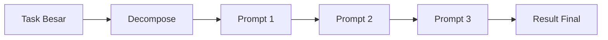

# 4. Prompt Chaining — Multi-Step & Chain-of-Thought

> **Durasi:** 2 Jam
> **Fokus:** Multi-step prompting, chain-of-thought, decomposition, agent workflow, prompt pipelines

---

## Kenapa Prompt Perlu Di-Chain?

AI response sekali tembak punya batasan:
- **Context window** — sekali prompt gak bisa muat semua konteks
- **Reasoning depth** — sekali lompat, reasoning bisa dangkal
- **Quality control** — kalau output jelek, susah debug yang mana yang salah

**Solusi:** Pecah tugas besar jadi beberapa prompt yang nyambung.



---

## 🔗 Chain-of-Thought (CoT) Prompting

CoT = minta AI **berpikir step-by-step** sebelum jawab. Efeknya dramatic:

| Tanpa CoT | Dengan CoT |
|-----------|------------|
| Langsung jawab (sering salah) | Nulis reasoning dulu |
| Gak bisa di-debug | Bisa lihat dimana salah nalar |
| Output pendek | Output lebih panjang tapi akurat |
| Cocok untuk simple task | WAJIB untuk complex task |

### Zero-Shot CoT

Cukup tambahin: "Let's think step by step" atau "Mari kita pikirkan langkah demi langkah"

```text
User: "Jika 3 apel harganya 15.000, berapa harga 7 apel?"

AI (tanpa CoT):
"35.000"

AI (dengan CoT):
Mari kita pikirkan:
1. 3 apel = 15.000
2. 1 apel = 15.000 / 3 = 5.000
3. 7 apel = 7 × 5.000 = 35.000

Jadi harga 7 apel adalah 35.000.
```

### Few-Shot CoT

Kasih contoh langkah-langkah reasoning:

```text
Contoh 1:
Q: Jika 5 buku harganya 60.000, berapa harga 8 buku?
A: 5 buku = 60.000, jadi 1 buku = 60.000/5 = 12.000.
   Maka 8 buku = 8 × 12.000 = 96.000. Jawaban: 96.000

Contoh 2:
Q: Sebuah mobil menempuh 240 km dengan 20 liter bensin.
   Berapa liter untuk 360 km?
A: 240 km = 20 liter, jadi 1 km = 20/240 = 1/12 liter.
   Maka 360 km = 360 × 1/12 = 30 liter. Jawaban: 30 liter

Sekarang jawab pertanyaan berikut:
Q: Sebuah kereta menempuh 450 km dalam 5 jam.
   Berapa kecepatan rata-rata dalam km/jam?
```

### Tree-of-Thought (ToT)

Lebih advanced dari CoT — AI explore multiple reasoning paths sekaligus:

```text
Pertanyaan: "Aplikasi web saya lambat. Apa yang harus saya cek?"

Cabang 1: Frontend
- Bundle size terlalu besar? → Cek Webpack/Lighthouse
- Render blocking? → Cek critical CSS, lazy loading
- API calls terlalu banyak? → Cek waterfall chart

Cabang 2: Backend
- Database query lambat? → Cek EXPLAIN, indexing
- N+1 problem? → Cek eager loading
- Caching? → Redis? CDN?

Cabang 3: Infrastructure
- Server CPU/memory? → Cek monitoring
- CDN? → Cloudflare? Image optimization?
- Database pool? → Connection pool exhaustion?

Evaluasi tiap cabang, pilih yang paling mungkin, rekomendasi action.
```

---

## 🧩 Task Decomposition

Task decomposition = memecah masalah besar jadi sub-task yang bisa ditangani AI satu per satu.

| Task Besar | Sub-Task |
|------------|----------|
| Bikin REST API | 1) Design schema 2) Setup Express 3) Models 4) Routes 5) Middleware |
| Debug error | 1) Parse error log 2) Cari pattern 3) Cek recent changes 4) Isolate root cause |
| Code review PR | 1) Security scan 2) Logic review 3) Style check 4) Test coverage |
| Migrasi database | 1) Schema diff 2) Migration script 3) Data validation 4) Rollback plan |

### Contoh: Multi-Step Prompt untuk Code Generation

```text
// Step 1: Minta analisis dulu
Prompt 1: "Analisis requirement ini dan breakdown jadi komponen.
Jangan tulis kode dulu. Fokus sama:
- Apa aja entity/data model yang dibutuhkan
- Endpoint apa yang diperlukan
- Validasi apa yang perlu
- Errors yang mungkin terjadi"

// Step 2: Baru generate kode
Prompt 2: "Berdasarkan analisis di atas, generate:
1. Schema/model definition
2. Route handlers 
3. Validation logic
Gunakan TypeScript dengan Express.
Tambahkan error handling di setiap endpoint."

// Step 3: Review & optimize
Prompt 3: "Review kode yang dihasilkan:
1. Security: ada celah injection? auth missing?
2. Performance: N+1 query? bisa dicache?
3. Maintainability: follow best practices? easy to test?
4. Error handling: semua error terhandle?

Kasih score 1-10 untuk tiap kategori."
```

---

## 🤖 Agent Workflow Pattern

Di production, prompt chaining sering diimplementasi sebagai **agent workflow**:

### 1. Sequential Chain

```typescript
async function sequentialChain(input: string) {
  // Step 1: Extract intent
  const intent = await llm(`
    Dari pesan berikut, tentukan intent user:
    "${input}"
    Intent: categorize, summarize, generate, or analyze
  `);

  // Step 2: Route to handler
  let result: string;
  switch(intent.trim()) {
    case 'categorize':
      result = await llm(`Kategorikan item berikut: ${input}`);
      break;
    case 'summarize':
      const extracted = await llm(`Extract key points: ${input}`);
      result = await llm(`Buat summary dari points ini: ${extracted}`);
      break;
    case 'generate':
      const plan = await llm(`Buat outline: ${input}`);
      result = await llm(`Generate konten dari outline: ${plan}`);
      break;
    default:
      result = await llm(`Analisis: ${input}`);
  }

  // Step 3: Format output
  return await llm(`Format hasil berikut jadi response yang rapi:\n${result}`);
}
```

### 2. Map-Reduce Chain

Cocok untuk dokumen/konteks besar:

```typescript
async function mapReduceChain(chunks: string[]) {
  // MAP: Proses tiap chunk independen
  const summaries = await Promise.all(
    chunks.map(chunk =>
      llm(`Summarize this section:\n${chunk}`)
    )
  );

  // REDUCE: Gabungkan hasil
  const combined = summaries.join('\n\n');
  return await llm(`
    Berikut summaries dari tiap section:
    ${combined}
    
    Buat executive summary keseluruhan yang:
    - Max 2 paragraf
    - Fokus pada poin paling penting
    - Hubungkan insight antar section
  `);
}
```

### 3. Conditional Chain

Route ke prompt berbeda berdasarkan kondisi:

```typescript
async function conditionalChain(query: string) {
  // Classify
  const type = await llm(`Classify: "${query}" sebagai:
  - code (pertanyaan coding)
  - concept (pertanyaan konsep)
  - debug (error/bug)
  - other`);

  let handler: string;
  switch(type.trim()) {
    case 'code':
      handler = `Kamu adalah code generator. ...`;
      break;
    case 'concept':
      handler = `Kamu adalah tutor yang jelasin konsep. ...`;
      break;
    case 'debug':
      handler = `Kamu adalah debug expert. ...`;
      break;
  }

  return await llm(handler, query);
}
```

### 4. Reflection Chain

AI nge-review output sendiri:

```typescript
async function reflectionChain(input: string) {
  // Generate draft
  const draft = await llm(`
    Generate kode TypeScript untuk: ${input}
    Include error handling dan type definitions.
  `);

  // Self-review
  const review = await llm(`
    Review kode berikut. Cari:
    1. Type safety issues
    2. Missing error handling  
    3. Performance problems
    4. Security vulnerabilities
    
    Kode:
    ${draft}
    
    Output format:
    - Issues: [list]
    - Severity: [critical/major/minor]
    - Fix: [saran konkret]
  `);

  // Refine based on review
  return await llm(`
    Kode awal:
    ${draft}
    
    Review feedback:
    ${review}
    
    Generate versi final yang sudah fix semua issues.
  `);
}
```

---

## Production Prompt Pipeline

Di aplikasi real, prompt chaining biasanya pake **orchestrator**:

```typescript
interface PipelineStep {
  name: string;
  prompt: string;
  validator?: (output: string) => boolean;
  maxRetries?: number;
}

class PromptPipeline {
  private steps: PipelineStep[] = [];

  addStep(step: PipelineStep) {
    this.steps.push(step);
  }

  async execute(input: string): Promise<string> {
    let currentInput = input;

    for (const step of this.steps) {
      let attempts = 0;
      const maxRetry = step.maxRetries ?? 1;

      while (attempts < maxRetry) {
        const output = await llm(step.prompt, currentInput);

        if (!step.validator || step.validator(output)) {
          currentInput = output;
          break;
        }

        attempts++;
        currentInput = `Perbaiki berdasarkan feedback: ${output}`;
      }
    }

    return currentInput;
  }
}

// Usage
const pipeline = new PromptPipeline();
pipeline.addStep({
  name: 'extract',
  prompt: 'Extract key requirements from:',
  validator: (o) => o.length > 10,
  maxRetries: 2
});
pipeline.addStep({
  name: 'design',
  prompt: 'Design architecture based on requirements:',
});
pipeline.addStep({
  name: 'generate',
  prompt: 'Generate code based on architecture:',
  maxRetries: 3
});

const result = await pipeline.execute(userInput);
```

---

## 🧪 Latihan

### Latihan 1: Debug Chain

Buat prompt chain untuk debugging error:
1. Parse error message → identify error type
2. Search for similar patterns → suggest causes
3. Generate fix → review fix safety

### Latihan 2: Content Pipeline

Buat pipeline untuk generate blog post:
1. Research outline (3 sources)
2. Write draft per section
3. Review consistency & grammar
4. Format with SEO metadata

### Latihan 3: Code Migration

Buat chain untuk migrasi JavaScript ke TypeScript:
1. Analyze JS file structure
2. Define types & interfaces
3. Add type annotations
4. Validate dengan TypeScript compiler
5. Generate report of changes

---

## 📖 Ringkasan

- **CoT** = minta AI berpikir step-by-step — dramatic accuracy improvement
- **Task decomposition** = pecah tugas besar jadi sub-task kecil
- **Sequential chain** = output prompt 1 jadi input prompt 2
- **Map-reduce** = proses paralel, lalu gabung hasil
- **Conditional chain** = routing berbeda berdasarkan kondisi
- **Reflection** = AI review output sendiri, lalu refine
- **Production pipeline** = orchestrator dengan validasi & retry
