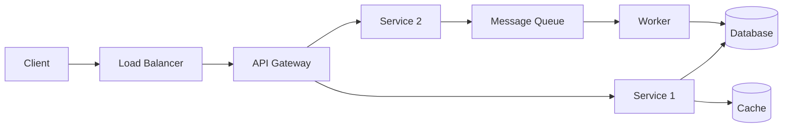
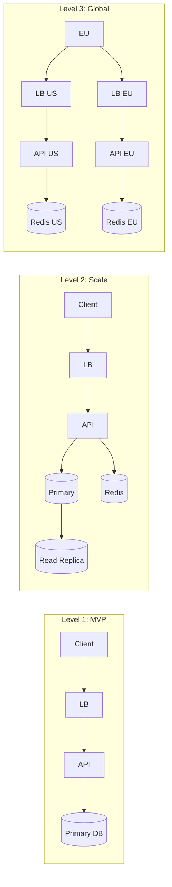

# 4. System Design Interview Round

> **Target:** Kuasai framework system design interview, skalabilitas, trade-off analysis, database design, API design.

---

## Kenapa System Design Penting?

System design interview beda dengan coding interview. Fokusnya bukan **apa yang lo tau**, tapi **gimana lo mikir**.

| Aspek | Coding Interview | System Design Interview |
|-------|------------------|------------------------|
| Fokus | Syntax, algoritma | Arsitektur, trade-off |
| Waktu | 30-45 menit | 45-60 menit |
| Output | Kode yang jalan | Diagram + reasoning |
| Penilaian | Correctness | Clarity, completeness |
| Level | Junior - Mid | Mid - Senior |

---

## 🏗️ Framework Sistem: The 4-Step Method

### Step 1: Requirements Clarification (5-10 menit)

Jangan langsung design — clarify dulu:

**Functional Requirements:**
- Fitur apa yang benar-benar perlu (core)?
- Fitur apa yang nice-to-have (MVP vs V2)?
- Siapa user-nya? Berapa banyak?

**Non-Functional Requirements:**
- Availability? (99.9%? 99.99%?)
- Latency tolerance? (real-time? near-real-time?)
- Consistency vs Availability trade-off?
- Security & compliance?

**Traffic Estimations:**
- DAU (Daily Active Users) berapa?
- Request per second (RPS)?
- Data volume per day / per month?
- Storage estimate (5 tahun ke depan)?

```
Contoh: Design URL Shortener (bit.ly, tinyurl)

Functional:
- ✅ Generate short URL dari long URL
- ✅ Redirect short URL ke original
- ❌ (V2) Custom alias
- ❌ (V2) Analytics

Non-Functional:
- Latency redirect < 100ms
- 99.9% availability
- High read:write ratio (100:1)

Estimations:
- 10M URL created per month
- 1000 redirects per second
- Average URL length: 100 chars
- Storage: 10M × 100 bytes = 1GB/month
```

### Step 2: High-Level Design (10-15 menit)

Gambar arsitektur keseluruhan:



Komponen utama yang harus dibahas:

1. **Client** — Web, mobile, atau API?
2. **Load Balancer** — Round robin? Least connections?
3. **API Gateway** — Auth, rate limiting, routing
4. **Services** — Monolith vs microservices?
5. **Database** — SQL vs NoSQL? Read replicas?
6. **Cache** — Redis? CDN? Write-through?
7. **Queue** — Async processing? Event-driven?
8. **Storage** — S3? Blob storage? File system?

### Step 3: Deep Dive (15-20 menit)

Pilih 1-2 komponen untuk dibahas detail:

**Database Schema:**
```sql
CREATE TABLE urls (
  id BIGSERIAL PRIMARY KEY,
  short_code VARCHAR(10) UNIQUE NOT NULL,
  original_url TEXT NOT NULL,
  created_at TIMESTAMP DEFAULT NOW(),
  expires_at TIMESTAMP,
  user_id BIGINT REFERENCES users(id)
);

CREATE INDEX idx_short_code ON urls(short_code);
CREATE INDEX idx_user_id ON urls(user_id);
```

**API Design:**
```
POST /api/url/shorten
  Request:  { "url": "https://example.com/very/long/url" }
  Response: { "short_url": "https://short.ly/abc123", "expires_at": "..." }

GET /{short_code}
  Response: 302 Redirect to original URL
```

**Key Design Decision — Short Code Generation:**
```
Option 1: Hash (MD5/SHA256)
  ✅ Deterministic — no collision check needed?
  ❌ Collision risk — perlu check DB dulu
  ❌ Panjang — base64 hash bisa > 7 chars

Option 2: Base62 Encode (ID → code)
  ✅ Short — 7 chars = 62^7 = 3.5T combinations
  ✅ No collision — dari ID unik
  ❌ Sequential ID = bisa ditebak
  
Option 3: Distributed ID (Snowflake)
  ✅ Unique across servers
  ✅ Time-ordered
  ❌ Complexity lebih tinggi
```

**Trade-off Analysis:**
```
Short code generation:
  Base62 + ID = simple, no collision, bisa ditebak
  Hash = less predictable, collision handling needed
  Chosen: Base62 (kita pakai random ID + retry on conflict)
```

### Step 4: Scalability & Bottlenecks (10 menit)

**Potential Bottlenecks:**
1. **Database write** — 10M URL/bulan → satu DB cukup
2. **Database read** — 1000 RPS redirect → perlu read replicas
3. **Cache** — Most accessed URLs → Redis cache (LRU eviction)
4. **Rate limiting** — Per user/IP → API Gateway + Redis counter

**Scaling Plan:**


---

## 🎯 Topik System Design Populer

### 1. Design URL Shortener

| Komponen | Implementation |
|----------|---------------|
| Short code | Base62 + random ID (7 chars) |
| Storage | PostgreSQL (relational, ACID) |
| Cache | Redis — most accessed URLs |
| Redirect | 301 (permanent) vs 302 (temporary) |
| Scaling | Read replicas, CDN untuk redirect |

### 2. Design Chat System (WhatsApp, Telegram)

| Komponen | Implementation |
|----------|---------------|
| Connection | WebSocket persistent |
| Message storage | Cassandra (time-series, high write) |
| Offline messages | Queue + push notification |
| Group chat | Fan-out on write vs Fan-out on read |
| File sharing | S3 + CDN |

### 3. Design News Feed (Twitter, Instagram)

| Komponen | Implementation |
|----------|---------------|
| Feed generation | Fan-out on write (celebrities → Fan-out on read) |
| Ranking | ML-based relevance scoring |
| Storage | PostgreSQL for relationships, Cassandra for timeline |
| Caching | Redis sorted sets for feed |
| Real-time | WebSocket push for new posts |

### 4. Design Video Streaming (YouTube, Netflix)

| Komponen | Implementation |
|----------|---------------|
| Upload | Chunked upload → queued encoding |
| Transcoding | FFmpeg pipeline (multiple resolutions) |
| Storage | Object storage (S3) + CDN |
| Streaming | HLS/DASH adaptive bitrate |
| Recommendation | ML pipeline (offline training → online serving) |

### 5. Design E-commerce (Shopee, Tokopedia)

| Komponen | Implementation |
|----------|---------------|
| Product catalog | Elasticsearch (search + filter) |
| Cart | Redis (session-based, ephemeral) |
| Order | Transactional DB (ACID penting untuk order) |
| Payment | Idempotency key (jangan double charge!) |
| Inventory | Optimistic locking + eventual consistency |
| Recommendation | ML: collaborative filtering + content-based |

---

## 🧪 Mock Interview Questions

### Soal 1: Design URL Shortener
- Functional: shorten URL, redirect, custom alias (v2)
- Non-functional: 1000 RPS, 99.9% uptime
- Estimasi: 10M URL/bulan, 1000 redirects/s

### Soal 2: Design Ride-Sharing (Gojek, Grab)
- Functional: request ride, matching driver, tracking, payment
- Non-functional: < 1s matching, real-time location
- Estimasi: 1M trips/day, 100K drivers online

### Soal 3: Design Social Media Feed (Twitter)
- Functional: post tweet, view feed, follow/unfollow
- Non-functional: < 500ms feed load, eventual consistency OK
- Estimasi: 100M DAU, 500M tweets/day

### Soal 4: Design File Storage (Google Drive, Dropbox)
- Functional: upload, download, share, version history
- Non-functional: consistency, deduplication, offline sync
- Estimasi: 1TB upload/day, 10M users

### Soal 5: Design Notification System
- Functional: push, email, SMS, in-app notification
- Non-functional: < 30s delivery, at-least-once delivery
- Estimasi: 100M notifications/day, 80% push

---

## 💡 Tips Interview

### Do's
- ✅ **Clarify requirements first** — jangan asumsi
- ✅ **Think out loud** — interviewer mau lihat proses lo
- ✅ **Start simple, then scale** — MVP dulu, baru optimasi
- ✅ **Acknowledge trade-offs** — gak ada arsitektur sempurna
- ✅ **Use whiteboard/diagram** — visual > verbal
- ✅ **Ask for feedback** — "Apakah approach ini sesuai?"

### Don'ts
- ❌ Langsung tulis kode — ini bukan coding interview
- ❌ Terlalu detail di awal — 10K feet view dulu
- ❌ Pilih teknologi tanpa alasan — "why?" itu penting
- ❌ Over-engineer — "kita gak perlu microservices untuk 10 users"
- ❌ Diam terlalu lama — interviewer gak tau lo mikir apa
- ❌ Defensive — accept feedback, iterasi design

### Framework Cheatsheet

```
┌─────────────────────────────────────┐
│ 1. Requirements (5 min)             │
│    - Functional + Non-functional    │
│    - Traffic estimation             │
├─────────────────────────────────────┤
│ 2. High-Level Design (10 min)       │
│    - Client → LB → API → Service     │
│    - Database, Cache, Queue         │
├─────────────────────────────────────┤
│ 3. Deep Dive (20 min)               │
│    - 1-2 komponen detail            │
│    - Schema, API, algorithm         │
│    - Trade-off analysis             │
├─────────────────────────────────────┤
│ 4. Scalability (10 min)             │
│    - Bottlenecks                    │
│    - Sharding, replication, CDN     │
│    - Monitoring, alerting           │
└─────────────────────────────────────┘
```

---

## 📖 Ringkasan

- **System design = process, bukan jawaban** — tunjukin cara mikir
- **4-step framework:** Requirements → High-Level → Deep Dive → Scalability
- **Trade-off adalah jawaban** — gak ada silver bullet
- **Estimasi** — penting buat justify scaling decisions
- **Common designs** — URL shortener, chat, feed, streaming, e-commerce
- **Latihan** — mock interview dengan timer 45 menit
