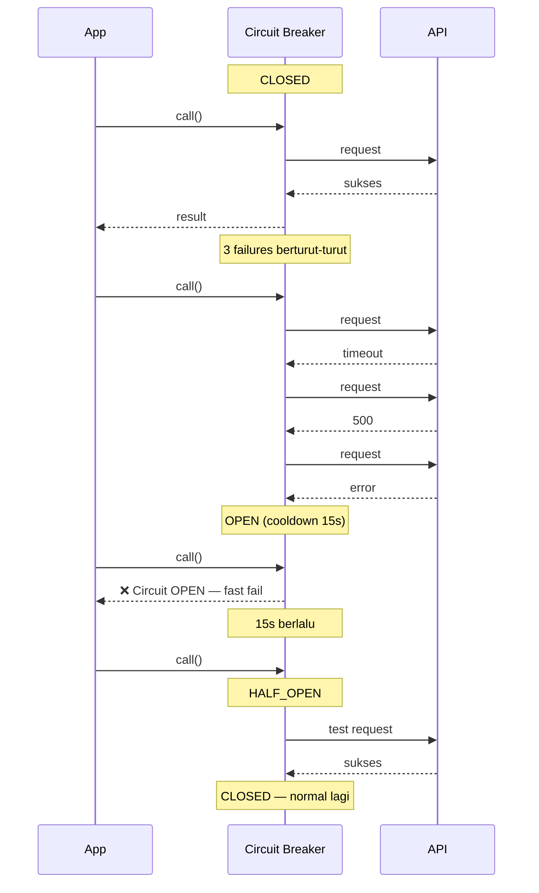

# Modul 24: Resilience Patterns — Circuit Breaker

**Tujuan Sesi:** Memahami circuit breaker pattern (closed/open/half-open), implementasi dari scratch, state transitions, failure threshold, recovery timeout, menggunakan opossum library, dan monitoring circuit state.

---

## 2.1 Konsep

Circuit breaker **ngelindungin sistem dari cascading failure**. Kalo service downstream udah mati, jangan terus dipanggil — kasih waktu buat recover.

**3 state:**

```
CLOSED (normal)
  ↔ Gagal melewati threshold → OPEN
OPEN (request langsung ditolak)
  ↔ Setelah timeout → HALF-OPEN
HALF-OPEN (test 1 request)
  ↔ Berhasil → CLOSED
  ↔ Gagal → OPEN lagi
```

| State | Arti | Request Masuk |
|-------|------|---------------|
| **CLOSED** | Normal — request jalan seperti biasa | Diteruskan |
| **OPEN** | Circuit putus — service diduga mati | Ditolak (throw error) |
| **HALF-OPEN** | Lagi test coba 1 request | 1 request diteruskan |

### Kenapa Circuit Breaker?

- **Fast fail** — kalo service udah mati, ga usah nunggu timeout 30 detik
- **Ngurangin beban** — service yang struggling ga dibanjiri request
- **Cascading failure protection** — satu service mati ga ngebunuh yang lain
- **Self-healing** — coba lagi secara otomatis setelah cooldown

### Tanpa Circuit Breaker

```
Request 1 → timeout (30 detik)
Request 2 → timeout (30 detik)
Request 3 → timeout (30 detik)
... 100 request × 30 detik = resource pool abis, semua service ikut mati
```

### Dengan Circuit Breaker

```
Request 1 → timeout (30 detik) → failure count++
Request 2 → timeout → failure count++ → threshold reached → OPEN
Request 3-100 → langsung ditolak (0 detik) → fast fail
... Setelah 30 detik → HALF-OPEN → test 1 request
```

---

## 2.2 Implementasi Sederhana

```typescript
class CircuitBreaker {
  private state: 'CLOSED' | 'OPEN' | 'HALF_OPEN' = 'CLOSED';
  private failureCount = 0;
  private lastFailureTime = 0;
  private readonly threshold: number;
  private readonly cooldownMs: number;

  constructor(
    private readonly name: string,
    threshold = 5,       // Gagal 5x → OPEN
    cooldownMs = 30000,  // Cooldown 30 detik
  ) {
    this.threshold = threshold;
    this.cooldownMs = cooldownMs;
  }

  async call<T>(fn: () => Promise<T>): Promise<T> {
    if (this.state === 'OPEN') {
      // Cek apakah udah lewat cooldown → HALF-OPEN
      if (Date.now() - this.lastFailureTime >= this.cooldownMs) {
        this.state = 'HALF_OPEN';
        console.log(`[${this.name}] Circuit → HALF_OPEN`);
      } else {
        throw new Error(`[${this.name}] Circuit OPEN — request ditolak`);
      }
    }

    try {
      const result = await fn();
      this.onSuccess();
      return result;
    } catch (err) {
      this.onFailure();
      throw err;
    }
  }

  private onSuccess() {
    this.failureCount = 0;
    this.state = 'CLOSED';
    console.log(`[${this.name}] Circuit → CLOSED (sukses)`);
  }

  private onFailure() {
    this.failureCount++;
    this.lastFailureTime = Date.now();

    if (this.failureCount >= this.threshold || this.state === 'HALF_OPEN') {
      this.state = 'OPEN';
      console.log(`[${this.name}] Circuit → OPEN (${this.failureCount} failures)`);
    }
  }

  getState() { return this.state; }
}

// Pake:
const cb = new CircuitBreaker('payment-api', 3, 15000);

async function getPayment(id: string) {
  return cb.call(() => fetch(`https://payment/api/order/${id}`));
}
```

### Perbaikan: Failure Threshold Based on Percentage

Threshold absolute (misal 5 failures) bisa misleading kalo traffic rendah. Better pake **error rate**:

```typescript
class CircuitBreakerPercentage {
  private results: boolean[] = []; // Ring buffer — true=sukses, false=gagal

  constructor(
    private readonly name: string,
    private readonly windowSize = 100,         // Lihat 100 request terakhir
    private readonly errorThreshold = 0.5,      // 50% error → OPEN
    private readonly cooldownMs = 30000,
  ) {}

  async call<T>(fn: () => Promise<T>): Promise<T> {
    if (this.shouldOpen()) {
      throw new Error(`[${this.name}] Circuit OPEN (${this.getErrorRate()}% errors)`);
    }

    try {
      const result = await fn();
      this.record(true);
      return result;
    } catch (err) {
      this.record(false);
      throw err;
    }
  }

  private record(success: boolean) {
    this.results.push(success);
    if (this.results.length > this.windowSize) {
      this.results.shift();
    }
  }

  private getErrorRate(): number {
    if (this.results.length === 0) return 0;
    const errors = this.results.filter(r => !r).length;
    return errors / this.results.length;
  }

  private shouldOpen(): boolean {
    return this.getErrorRate() >= this.errorThreshold;
  }
}
```

---

## 2.3 State Transitions & Timing



### Aturan Transisi

| Transition | Trigger | Akibat |
|-----------|---------|--------|
| **CLOSED → OPEN** | Failure count ≥ threshold (atau error rate ≥ threshold) | Semua request ditolak |
| **OPEN → HALF-OPEN** | Timer cooldown habis | 1 request diizinkan lewat |
| **HALF-OPEN → CLOSED** | Request test sukses | Reset failure count, normal lagi |
| **HALF-OPEN → OPEN** | Request test gagal | Kembali ke OPEN, restart cooldown |
| **OPEN → CLOSED** | (tidak langsung) | Harus lewat HALF-OPEN dulu |

---

## 2.4 Opossum Library

```bash
bun add opossum
```

```typescript
import CircuitBreaker from 'opossum';

const options = {
  timeout: 3000,        // Request timeout 3 detik
  errorThresholdPercentage: 50,  // 50% error → OPEN
  resetTimeout: 30000,  // 30 detik cooldown
};

const breaker = new CircuitBreaker(
  async (url: string) => {
    const res = await fetch(url);
    if (!res.ok) throw new Error(`HTTP ${res.status}`);
    return res.json();
  },
  options
);

// Events
breaker.on('open', () => console.log('Circuit OPEN'));
breaker.on('halfOpen', () => console.log('Circuit HALF-OPEN'));
breaker.on('close', () => console.log('Circuit CLOSED'));

// Fallback — kalo circuit open, pake data cadangan
breaker.fallback(() => ({ cached: true, data: [] }));

// Pake
const data = await breaker.fire('https://api.example.com/users');
```

### Opsi Lengkap Opossum

| Opsi | Default | Fungsi |
|------|---------|--------|
| `timeout` | 10000 | Max waktu per request (ms) |
| `errorThresholdPercentage` | 50 | % error sebelum OPEN |
| `resetTimeout` | 30000 | Waktu cooldown (ms) |
| `name` | auto | Nama breaker untuk logging |
| `volumeThreshold` | 5 | Min request sebelum circuit mulai ngitung error rate |
| `rollingCountTimeout` | 10000 | Window untuk ngitung error (ms) |
| `enabled` | true | Enable/disable circuit breaker |

### Fallback Strategy

```typescript
// Fallback berdasar tipe error
breaker.fallback((err, args) => {
  if (err.message.includes('timeout')) {
    return { cached: true, data: getFromLocalCache(args[0]) };
  }
  return { error: 'Service unavailable', retryLater: true };
});
```

---

## 2.5 Monitoring Circuit State

```typescript
import CircuitBreaker from 'opossum';

class CircuitMonitor {
  private circuits: Map<string, CircuitBreaker> = new Map();

  register(name: string, breaker: CircuitBreaker) {
    this.circuits.set(name, breaker);

    breaker.on('open', () => this.alert('open', name));
    breaker.on('halfOpen', () => this.alert('halfOpen', name));
    breaker.on('close', () => this.alert('close', name));
  }

  private alert(event: string, name: string) {
    console.log(`[ALERT] Circuit ${name} → ${event}`);

    // Kirim ke monitoring system
    // metricsClient.increment(`circuit.${name}.${event}`);
  }

  getStatus(): Record<string, any> {
    const status: Record<string, any> = {};

    for (const [name, breaker] of this.circuits) {
      status[name] = {
        state: breaker.status.stats,
        // Atau pake breaker.opened untuk cek status
        isOpen: breaker.opened,
      };
    }

    return status;
  }
}

// Pake:
const monitor = new CircuitMonitor();
const breaker = new CircuitBreaker(fetchData, options);
monitor.register('payment-api', breaker);

// Endpoint untuk ngecek status
app.get('/circuit-status', (req, res) => {
  res.json(monitor.getStatus());
});
```

### Metrics yang Perlu Dimonitor

| Metric | Arti | Ambang Batas |
|--------|------|-------------|
| `circuit.state` | State saat ini (0=CLOSED, 1=OPEN, 2=HALF_OPEN) | OPEN > 5 menit = alert |
| `circuit.failure_rate` | % error dalam window | > 10% = warning, > 30% = critical |
| `circuit.rejection_count` | Jumlah request ditolak | Lonjakan = circuit sering OPEN |
| `circuit.success_count` | Jumlah request sukses | Turun drastis = ada masalah |
| `circuit.cooldown_count` | Berapa kali cooldown ter-reset | > 3 reset = service beneran mati |

---

## 2.6 Common Patterns & Pitfalls

| Pitfall | Masalah | Solusi |
|---------|---------|--------|
| **Threshold terlalu kecil** | Circuit kebuka gara-gara spike normal | Set volumeThreshold biar ga terpengaruh traffic sedikit |
| **Cooldown terlalu singkat** | Coba lagi terlalu cepat, service ga sempet recover | Cooldown minimal 2× response time average |
| **Lupa fallback** | User dapet error mentah pas circuit open | Selalu sedia fallback (cache, data default) |
| **One-size-fits-all** | Semua pake threshold sama | Tiap service punya karakteristik beda — set per-service |
| **Timeout di circuit breaker** | Request gantung sampe timeout circuit breaker | Kurangi timeout di circuit breaker (3-5 detik) |
| **Ga monitoring circuit** | Ga tau kapan circuit open/close | Log semua state transition + metrics |

---

## Latihan

1. **Implementasi Circuit Breaker:** Buat class `CircuitBreaker` dengan threshold 3 dan cooldown 10 detik. Test dengan simulate: 5 request gagal beruntun (pake fungsi yang throw), lalu 1 request sukses setelah cooldown.

2. **Percentage-Based:** Modifikasi circuit breaker di atas pake error rate (window 10 request, threshold 50%). Test dengan 7 sukses + 3 gagal (30% — harusnya aman), lalu 4 sukses + 6 gagal (60% — harusnya OPEN).

3. **Opossum Integration:** Pake opossum untuk bungkus fungsi `callExternalAPI()`. Set fallback yang return data dari cache. Log state transitions. Fire 10 request, 8 gagal — pastikan circuit open, fallback kepanggil.

4. **Monitoring Dashboard:** Buat endpoint `/circuits` yang return JSON status semua circuit breaker (state, failure rate, rejection count). Tambah route `/circuits/reset/:name` buat manual reset circuit.

5. **Studi Kasus:** Payment gateway external punya error rate 30% di jam sibuk. Desain circuit breaker: threshold (absolute vs percentage), cooldown, fallback strategy, monitoring metrics. Jelaskan trade-off.

---

[« Kembali ke Index](README.md) | Lanjut ke [03-timeout-bulkhead](03-timeout-bulkhead.md)
