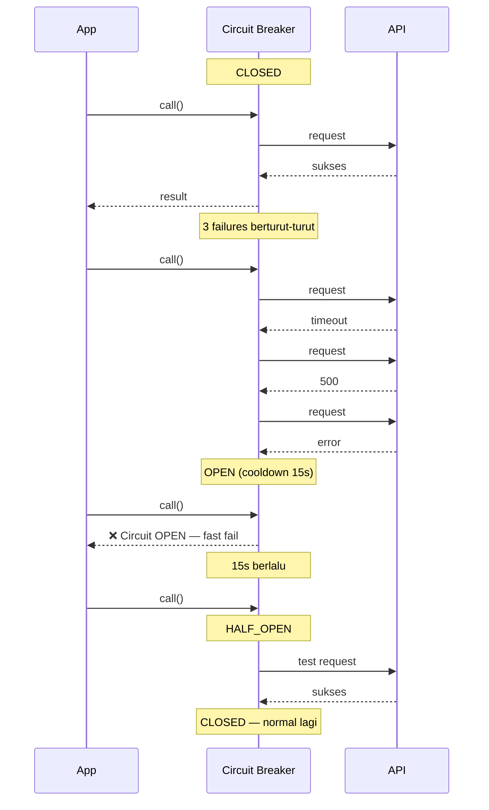

# Modul 24: Resilience Patterns — Backoff, Circuit Breaker, Database Transaction

**Tujuan Pembelajaran:** Setelah mempelajari modul ini, siswa mampu:
- Memahami dan menerapkan retry dengan exponential backoff + jitter
- Mengimplementasikan circuit breaker pattern
- Mengelola timeout dan deadline di aplikasi
- Mengisolasi resource dengan bulkhead pattern
- Menerapkan rate limiting di API
- Membangun health check dan graceful shutdown
- Memahami saga pattern untuk distributed transaction

---

## 1. Retry & Backoff

### 1.1 Kenapa Retry?

Network call bisa gagal karena alasan **transient** — koneksi drop, server sibuk, timeout. Retry logic otomatis nyoba lagi dengan jeda strategis.

**Jangan retry kalo:**
- Error 4xx (client error) — salah request, ga bakal berhasil
- Error auth (401/403) — token expired, retry ga guna
- Resource not found (404) — ga bakal muncul

**Retry kalo:**
- 429 Too Many Requests — server minta mondar-mandir
- 5xx Server Error — server lagi error, mungkin recover
- Network timeout / ECONNRESET — koneksi drop
- Database deadlock / serialization failure (PostgreSQL 40001)

### 1.2 Exponential Backoff

Jeda antar retry makin lama secara eksponensial:

```
Retry 1 → tunggu 100ms
Retry 2 → tunggu 200ms
Retry 3 → tunggu 400ms
Retry 4 → tunggu 800ms
Retry 5 → tunggu 1600ms
```

**Formula:** `delay = baseDelay * (2 ^ attempt)`

```typescript
async function fetchWithBackoff(url: string, maxRetries = 3): Promise<Response> {
  const baseDelay = 100; // ms

  for (let attempt = 0; attempt < maxRetries; attempt++) {
    try {
      return await fetch(url);
    } catch (err) {
      if (attempt === maxRetries - 1) throw err; // Terakhir, lempar error

      const delay = baseDelay * Math.pow(2, attempt);
      console.log(`Retry ${attempt + 1} in ${delay}ms...`);
      await new Promise(r => setTimeout(r, delay));
    }
  }
  throw new Error('Unreachable');
}
```

### 1.3 Jitter — Biar Ga Tabrakan

Kalo 100 request gagal barengan trus retry barengan, mereka tabrakan terus. **Jitter** nambahin acak ke delay biar tersebar.

```
Tanpa jitter: 100 req → delay 100ms → 100 req → delay 200ms → tabrakan terus
Dengan jitter: 100 req → delay 37-163ms → tersebar
```

```typescript
function sleepWithJitter(baseMs: number): Promise<void> {
  // Jitter: acak antara 0 sampai baseMs
  const jitter = Math.random() * baseMs;
  return new Promise(r => setTimeout(r, baseMs + jitter));
}

// Atau pake "full jitter" — delay total acak dari 0 sampai target
function sleepFullJitter(baseMs: number, attempt: number): Promise<void> {
  const maxDelay = baseMs * Math.pow(2, attempt);
  const delay = Math.random() * maxDelay;
  return new Promise(r => setTimeout(r, delay));
}
```

### 1.4 Retry dengan Status Code Check

```typescript
async function fetchSmart(url: string, options?: RequestInit): Promise<Response> {
  const maxRetries = 3;
  const baseDelay = 200;

  for (let attempt = 0; attempt <= maxRetries; attempt++) {
    const response = await fetch(url, options);

    if (response.ok) return response; // 200-299 → sukses

    if (response.status === 429) {
      // Rate limited — tunggu sesuai Retry-After header
      const retryAfter = parseInt(response.headers.get('Retry-After') || '5', 10);
      await sleep(retryAfter * 1000 + Math.random() * 500);
      continue;
    }

    if (response.status >= 500 && attempt < maxRetries) {
      // Server error — retry dengan backoff
      const delay = baseDelay * Math.pow(2, attempt);
      await sleep(delay + Math.random() * delay);
      continue;
    }

    // 4xx besides 429 — jangan retry
    return response;
  }

  throw new Error(`Max retries reached`);
}
```

### 1.5 Retry Library di Node.js

Better pake library yang udah mature daripada nulis manual:

```bash
bun add promise-retry
```

```typescript
import promiseRetry from 'promise-retry';

const result = await promiseRetry(async (retry, attempt) => {
  console.log(`Attempt ${attempt}...`);

  try {
    return await fetch('https://api.example.com/data');
  } catch (err) {
    retry(err); // Akan retry dengan backoff otomatis
  }
}, {
  retries: 3,
  factor: 2,       // exponential factor
  minTimeout: 200, // base delay
  maxTimeout: 2000, // max delay
  randomize: true,  // add jitter
});
```

| Opsi | Default | Fungsi |
|------|---------|--------|
| `retries` | 10 | Max percobaan |
| `factor` | 2 | Pengali exponensial |
| `minTimeout` | 1000 | Delay awal (ms) |
| `maxTimeout` | Infinity | Batas delay maksimal |
| `randomize` | false | Tambah jitter 0.5x-1.5x |

---

## 2. Circuit Breaker

### 2.1 Konsep

Circuit breaker **ngelindungin sistem dari cascading failure**. Kalo service downstream udah mati, jangan terus dipanggil — kasih waktu buat recover.

**3 state:**

```
CLOSED (normal)
  ↔ Gagal melewati threshold → OPEN
OPEN (request langsung ditolak)
  ↔ Setelah timeout → HALF-OPEN
HALF-OPEN (test 1 request)
  ↔ Berhasil → CLOSED
  ↔ Gagal → OPEN lagi
```

| State | Arti | Request Masuk |
|-------|------|---------------|
| **CLOSED** | Normal — request jalan seperti biasa | Diteruskan |
| **OPEN** | Circuit putus — service diduga mati | Ditolak (throw error) |
| **HALF-OPEN** | Lagi test coba 1 request | 1 request diteruskan |

### 2.2 Implementasi Sederhana

```typescript
class CircuitBreaker {
  private state: 'CLOSED' | 'OPEN' | 'HALF_OPEN' = 'CLOSED';
  private failureCount = 0;
  private lastFailureTime = 0;
  private readonly threshold: number;
  private readonly cooldownMs: number;

  constructor(
    private readonly name: string,
    threshold = 5,       // Gagal 5x → OPEN
    cooldownMs = 30000,  // Cooldown 30 detik
  ) {
    this.threshold = threshold;
    this.cooldownMs = cooldownMs;
  }

  async call<T>(fn: () => Promise<T>): Promise<T> {
    if (this.state === 'OPEN') {
      // Cek apakah udah lewat cooldown → HALF-OPEN
      if (Date.now() - this.lastFailureTime >= this.cooldownMs) {
        this.state = 'HALF_OPEN';
        console.log(`[${this.name}] Circuit → HALF_OPEN`);
      } else {
        throw new Error(`[${this.name}] Circuit OPEN — request ditolak`);
      }
    }

    try {
      const result = await fn();
      this.onSuccess();
      return result;
    } catch (err) {
      this.onFailure();
      throw err;
    }
  }

  private onSuccess() {
    this.failureCount = 0;
    this.state = 'CLOSED';
    console.log(`[${this.name}] Circuit → CLOSED (sukses)`);
  }

  private onFailure() {
    this.failureCount++;
    this.lastFailureTime = Date.now();

    if (this.failureCount >= this.threshold || this.state === 'HALF_OPEN') {
      this.state = 'OPEN';
      console.log(`[${this.name}] Circuit → OPEN (${this.failureCount} failures)`);
    }
  }

  getState() { return this.state; }
}

// Pake:
const cb = new CircuitBreaker('payment-api', 3, 15000);

async function getPayment(id: string) {
  return cb.call(() => fetch(`https://payment/api/order/${id}`));
}
```

### 2.3 Oskulasi Circuit Breaker



### 2.4 Opossum Library

```bash
bun add opossum
```

```typescript
import CircuitBreaker from 'opossum';

const options = {
  timeout: 3000,        // Request timeout 3 detik
  errorThresholdPercentage: 50,  // 50% error → OPEN
  resetTimeout: 30000,  // 30 detik cooldown
};

const breaker = new CircuitBreaker(
  async (url: string) => {
    const res = await fetch(url);
    if (!res.ok) throw new Error(`HTTP ${res.status}`);
    return res.json();
  },
  options
);

// Events
breaker.on('open', () => console.log('Circuit OPEN'));
breaker.on('halfOpen', () => console.log('Circuit HALF-OPEN'));
breaker.on('close', () => console.log('Circuit CLOSED'));

// Fallback — kalo circuit open, pake data cadangan
breaker.fallback(() => ({ cached: true, data: [] }));

// Pake
const data = await breaker.fire('https://api.example.com/users');
```

---

## 3. Timeout & Deadline

### 3.1 Kenapa Timeout Penting?

Request yang ga pernah selesai bisa **ngabisin resource** — koneksi pool penuh, thread blocked, user nunggu lama.

**Tanpa timeout:**
```
Request A → fetch API → API lemot → . . . → 120 detik baru sadar timeout
Request B → fetch API → . . . → semua koneksi pool abis
```

**Dengan timeout:**
```
Request A → fetch API → 5 detik → timeout → release koneksi
Request B → fetch API → selesai normal
```

### 3.2 Implementasi Timeout

```typescript
function withTimeout<T>(promise: Promise<T>, ms: number): Promise<T> {
  const timeout = new Promise<never>((_, reject) => {
    setTimeout(() => reject(new Error(`Timeout after ${ms}ms`)), ms);
  });
  return Promise.race([promise, timeout]);
}

// Pake:
try {
  const data = await withTimeout(fetch('/api/data'), 5000);
  console.log('Response:', data);
} catch (err) {
  console.error('Request gagal atau timeout:', err);
}
```

### 3.3 AbortController di Fetch API

```typescript
function fetchWithTimeout(url: string, ms: number): Promise<Response> {
  const controller = new AbortController();
  const timeoutId = setTimeout(() => controller.abort(), ms);

  return fetch(url, { signal: controller.signal })
    .finally(() => clearTimeout(timeoutId));
}

// Pake:
try {
  const res = await fetchWithTimeout('https://api.example.com', 3000);
  const data = await res.json();
} catch (err) {
  if (err instanceof DOMException && err.name === 'AbortError') {
    console.error('Request di-cancel karena timeout');
  } else {
    console.error('Network error:', err);
  }
}
```

### 3.4 Timeout Per Layer

| Layer | Timeout | Contoh |
|-------|---------|--------|
| HTTP Request | 5-10s | `fetch` dengan AbortController |
| Database Query | 1-5s | `statement_timeout` di PostgreSQL |
| External API | 3-10s | Tergantung SLA provider |
| File Upload | 30-120s | File besar butuh waktu lebih |
| WebSocket | > 60s | Koneksi long-lived |

---

## 4. Bulkhead Pattern

### 4.1 Konsep

Bulkhead = sekat di kapal. Kalo satu kompartemen bocor, yang lain tetep kering. Di aplikasi: **satu service yang down ga boleh ngebunuh yang lain.**

**Tanpa bulkhead:**
```
┌─────────────────────────────────────┐
│ Satu koneksi pool / thread pool     │
│ Payment API lemot → semua antre     │
│ → User API juga ikut lambat         │
└─────────────────────────────────────┘
```

**Dengan bulkhead:**
```
┌──────────┐  ┌──────────┐  ┌──────────┐
│ Payment  │  │ User API │  │ Notif    │
│ Pool: 5  │  │ Pool: 10 │  │ Pool: 3  │
└──────────┘  └──────────┘  └──────────┘
Payment lemot  Tetap normal  Tetap normal
```

### 4.2 Implementasi Thread Pool Terpisah

```typescript
class BulkheadPool {
  private running = 0;
  private queue: (() => void)[] = [];

  constructor(private maxConcurrent: number) {}

  async run<T>(fn: () => Promise<T>): Promise<T> {
    if (this.running >= this.maxConcurrent) {
      // Antre — tunggu sampe ada slot
      await new Promise<void>((resolve) => {
        this.queue.push(resolve);
      });
    }

    this.running++;
    try {
      return await fn();
    } finally {
      this.running--;
      // Kasih slot ke antrean berikutnya
      if (this.queue.length > 0) {
        const next = this.queue.shift()!;
        next();
      }
    }
  }
}

// Pake — pool terpisah per service
const paymentPool = new BulkheadPool(5);
const userPool = new BulkheadPool(10);
const notifPool = new BulkheadPool(3);

async function pay(orderId: string) {
  return paymentPool.run(() => fetch(`/api/pay/${orderId}`));
}

async function getUsers() {
  return userPool.run(() => fetch('/api/users'));
}
```

### 4.3 Pake Bottleneck Library

```bash
bun add bottleneck
```

```typescript
import Bottleneck from 'bottleneck';

const paymentLimiter = new Bottleneck({
  maxConcurrent: 5,
  minTime: 200, // Minimal 200ms antar request
});

const userLimiter = new Bottleneck({
  maxConcurrent: 10,
  minTime: 50,
});

// Wrap function
const getPayment = paymentLimiter.wrap(fetchPayment);
const getUsers = userLimiter.wrap(fetchUsers);

// Jalan — ga saling ganggu
const [payment, users] = await Promise.all([
  getPayment('order-123'),
  getUsers(),
]);
```

---

## 5. Rate Limiting

### 5.1 Rate Limiter vs Bulkhead

| Pattern | Fungsi |
|---------|--------|
| **Bulkhead** | Batasi koneksi **bersamaan** (concurrent) |
| **Rate Limiter** | Batasi request per **waktu** (per detik/menit) |
| **Circuit Breaker** | Matiin akses kalo error terus |

### 5.2 Token Bucket Algorithm

```typescript
class TokenBucket {
  private tokens: number;
  private lastRefill: number;

  constructor(
    private maxTokens: number,
    private refillRate: number, // token per detik
  ) {
    this.tokens = maxTokens;
    this.lastRefill = Date.now();
  }

  async waitForToken(): Promise<void> {
    this.refill();

    if (this.tokens > 0) {
      this.tokens--;
      return;
    }

    // Kalo abis, tunggu sampe ada token baru
    const waitMs = 1000 / this.refillRate;
    await new Promise(r => setTimeout(r, waitMs));
    return this.waitForToken(); // Coba lagi
  }

  private refill() {
    const now = Date.now();
    const elapsed = (now - this.lastRefill) / 1000;
    const newTokens = Math.floor(elapsed * this.refillRate);
    if (newTokens > 0) {
      this.tokens = Math.min(this.maxTokens, this.tokens + newTokens);
      this.lastRefill = now;
    }
  }
}

// Pake: max 10 request/detik
const limiter = new TokenBucket(10, 10);

async function handleRequest(req: Request) {
  await limiter.waitForToken();
  return processRequest(req);
}
```

### 5.3 Sliding Window dengan Redis

Kalo pake banyak server (horizontal scaling), rate limiter harus pake store terpusat:

```typescript
import { createClient } from 'redis';

const redis = await createClient().connect();

async function checkRateLimit(
  key: string,        // "user:123:api"
  limit: number,      // max request
  windowMs: number    // jendela waktu
): Promise<boolean> {
  const now = Date.now();
  const windowStart = now - windowMs;

  // Hapus entry lama & tambah entry baru (atomic)
  const multi = redis.multi();
  multi.zRemRangeByScore(key, 0, windowStart);
  multi.zAdd(key, { score: now, value: `${now}-${Math.random()}` });
  multi.zCard(key);
  multi.expire(key, Math.ceil(windowMs / 1000));

  const [, , count] = await multi.exec();
  return (count as number) <= limit;
}

// Pake di middleware:
async function rateLimitMiddleware(req: Request, res: Response, next: NextFunction) {
  const allowed = await checkRateLimit(
    `ratelimit:${req.ip}:${req.path}`,
    100, // 100 request
    60000 // per menit
  );

  if (!allowed) {
    return res.status(429).json({ error: 'Too many requests' });
  }
  next();
}
```

---

## 6. Health Check

### 6.1 Kenapa Perlu?

Health check ngasih tau **apakah service siap nerima traffic**. Dipake oleh:
- **Load balancer** — buat mastiin server sehat
- **Orchestrator (Kubernetes)** — buat decide restart / kill pod
- **Monitoring** — alerting kalo ada yang mati
- **CI/CD** — pastiin deploy sukses

### 6.2 API Health Check Pattern

```typescript
import express from 'express';
const app = express();

// Basic health — cuma ngecek process hidup
app.get('/healthz', (req, res) => {
  res.status(200).json({
    status: 'ok',
    timestamp: new Date().toISOString(),
  });
});

// Ready check — ngecek dependencies
app.get('/readyz', async (req, res) => {
  const checks = {
    database: false,
    redis: false,
    api_external: false,
  };

  try {
    await db.query('SELECT 1');
    checks.database = true;
  } catch {}

  try {
    await redis.ping();
    checks.redis = true;
  } catch {}

  try {
    const resp = await fetch('https://api.external.com/health');
    checks.api_external = resp.ok;
  } catch {}

  const allHealthy = Object.values(checks).every(v => v);
  res.status(allHealthy ? 200 : 503).json({
    status: allHealthy ? 'ok' : 'degraded',
    checks,
    timestamp: new Date().toISOString(),
  });
});
```

| Endpoint | Fungsi | Return Kalo Sehat |
|----------|--------|------------------|
| `/healthz` | Liveness — process hidup? | 200 OK |
| `/readyz` | Readiness — siap terima traffic? | 200 OK atau 503 |
| `/metrics` | Metrik Prometheus | Data metrik |

### 6.3 Graceful Shutdown

Kalo container di-restart, jangan langsung mati — kasih waktu buat selesain request yang jalan:

```typescript
import express from 'express';
import { createServer } from 'http';

const app = express();
const server = createServer(app);

// Handle shutdown signal
async function shutdown(signal: string) {
  console.log(`Received ${signal}, shutting down gracefully...`);

  // Stop nerima request baru
  server.close(() => {
    console.log('HTTP server closed');
    process.exit(0);
  });

  // Kalo ada request yang lama, force close setelah 10 detik
  setTimeout(() => {
    console.error('Forced shutdown after timeout');
    process.exit(1);
  }, 10000).unref();

  // Tutup koneksi database
  await pool.end();
  console.log('Database pool closed');
}

process.on('SIGTERM', () => shutdown('SIGTERM'));
process.on('SIGINT', () => shutdown('SIGINT'));

server.listen(3000, () => console.log('Server running on port 3000'));
```

---

## 7. Saga Pattern (Distributed Transaction)

### 7.1 Masalah

Di microservice, satu operasi bisa melibatkan banyak service — dan transaksi database biasa (BEGIN/COMMIT) ga bisa lintas service.

**Contoh:** Order barang
```
Order Service → Payment Service → Inventory Service → Shipping Service
```

Kalo Payment berhasil tapi Inventory gagal, Order udah terlanjur dibuat. Harus ada **kompensasi**.

### 7.2 Saga: Choreography vs Orchestration

**Choreography** — setiap service publish event, service lain subscribe:
```
Order Service → publish "OrderCreated"
Payment Service → subscribe, process payment → publish "PaymentCompleted"
Inventory Service → subscribe, reduce stock → publish "StockReduced"
Shipping Service → subscribe, create shipment → publish "Shipped"

Kalo gagal → publish event "Failed" + service sebelumnya bikin kompensasi
```

**Orchestration** — satu coordinator (saga manager) ngatur semua langkah:
```
Saga Manager → Order Service (Create Order)
            → Payment Service (Process Payment)
            → Inventory Service (Reduce Stock)
            → Shipping Service (Create Shipment)

Kalo gagal → Saga Manager panggil compensating action urutan terbalik
```

### 7.3 Implementasi Sederhana (Orchestration)

```typescript
type Step<T> = {
  name: string;
  action: () => Promise<T>;
  compensate: () => Promise<void>;
};

class SagaOrchestrator {
  private executed: Step<any>[] = [];

  async execute(steps: Step<any>[]): Promise<void> {
    for (const step of steps) {
      try {
        console.log(`[Saga] Executing: ${step.name}`);
        await step.action();
        this.executed.push(step);
      } catch (err) {
        console.error(`[Saga] Failed at: ${step.name}`, err);
        await this.rollback();
        throw new Error(`Saga failed at ${step.name}: ${err}`);
      }
    }
    console.log('[Saga] All steps completed successfully');
  }

  private async rollback() {
    // Kompensasi urutan terbalik
    for (const step of this.executed.reverse()) {
      try {
        console.log(`[Saga] Compensating: ${step.name}`);
        await step.compensate();
      } catch (err) {
        console.error(`[Saga] Compensate failed for ${step.name}:`, err);
        // Log failure — butuh manual intervention
      }
    }
  }
}

// Pake:
const saga = new SagaOrchestrator();

await saga.execute([
  {
    name: 'Create Order',
    action: () => db.query('INSERT INTO orders ...'),
    compensate: () => db.query('DELETE FROM orders WHERE id = $1', [orderId]),
  },
  {
    name: 'Process Payment',
    action: () => paymentService.charge(userId, amount),
    compensate: () => paymentService.refund(userId, amount),
  },
  {
    name: 'Reduce Stock',
    action: () => db.query('UPDATE products SET stock = stock - 1 ...'),
    compensate: () => db.query('UPDATE products SET stock = stock + 1 ...'),
  },
]);
```

### 7.4 Saga vs ACID Transaction

| | ACID Transaction | Saga |
|---|---|---|
| **Scope** | Single database | Multiple services |
| **Isolation** | Full (sesuai level) | Eventual consistency |
| **Rollback** | Otomatis (ROLLBACK) | Manual (compensating actions) |
| **Performance** | Lebih lambat (lock) | Lebih cepat (no lock) |
| **Kompleksitas** | Sederhana | Butuh desain hati-hati |
| **Use case** | Transfer bank, billing | Order processing, booking |

---

## 8. Studi Kasus: Aplikasi Resilient

### 8.1 Arsitektur

```
┌─────────────────────────────────────────────────┐
│                  API Gateway                     │
│  ┌──────────┐  ┌──────────┐  ┌──────────┐      │
│  │ Rate     │  │ Auth     │  │ Circuit  │      │
│  │ Limiter  │  │ Middleware│  │ Breaker  │      │
│  └──────────┘  └──────────┘  └──────────┘      │
└─────────────────────────────────────────────────┘
         │           │              │
    ┌────▼───┐  ┌────▼───┐   ┌─────▼────┐
    │ Order  │  │Payment │   │Inventory │
    │ Service│  │Service │   │ Service  │
    │  BULKHEAD(10) BULKHEAD(5) BULKHEAD(8)   │
    └────────┘  └────────┘   └──────────┘
         │           │              │
    ┌────▼───────────▼──────────────▼────┐
    │          Message Queue             │
    │      (Saga Orchestration)          │
    └────────────────────────────────────┘
```

### 8.2 Full Implementation Pattern

```typescript
import express from 'express';
import { Pool } from 'pg';
import CircuitBreaker from 'opossum';
import Bottleneck from 'bottleneck';
import promiseRetry from 'promise-retry';

const app = express();
const pool = new Pool({ connectionString: process.env.DATABASE_URL });

// 1. BULKHEAD — pool terpisah per service
const orderLimiter = new Bottleneck({ maxConcurrent: 10, minTime: 100 });
const paymentLimiter = new Bottleneck({ maxConcurrent: 5, minTime: 200 });

// 2. CIRCUIT BREAKER — untuk external API
const paymentBreaker = new CircuitBreaker(
  async (amount: number) => {
    const res = await fetch('https://payment.example.com/charge', {
      method: 'POST',
      body: JSON.stringify({ amount }),
    });
    if (!res.ok) throw new Error(`Payment failed: ${res.status}`);
    return res.json();
  },
  { timeout: 5000, errorThresholdPercentage: 50, resetTimeout: 30000 }
);

// 3. RETRY + BACKOFF — untuk database transaksi
async function executeTransaction<T>(
  fn: (client: any) => Promise<T>
): Promise<T> {
  return promiseRetry(async (retry, attempt) => {
    const client = await pool.connect();
    try {
      await client.query('BEGIN');
      const result = await fn(client);
      await client.query('COMMIT');
      return result;
    } catch (err: any) {
      await client.query('ROLLBACK');
      if (err.code === '40001' && attempt < 3) {
        retry(err);
        return undefined as T;
      }
      throw err;
    } finally {
      client.release();
    }
  }, { retries: 3, minTimeout: 100, factor: 2, randomize: true });
}

// 4. API Endpoint — semua pattern dipake
app.post('/api/orders', async (req, res) => {
  const { userId, items, amount } = req.body;

  try {
    // Pake bulkhead + circuit breaker
    const payment = await paymentLimiter.schedule(() =>
      paymentBreaker.fire(amount)
    );

    // Pake retry transaction
    const order = await executeTransaction(async (client) => {
      const { rows } = await client.query(
        `INSERT INTO orders (user_id, items, amount, payment_id)
         VALUES ($1, $2, $3, $4) RETURNING *`,
        [userId, JSON.stringify(items), amount, payment.id]
      );
      return rows[0];
    });

    res.status(201).json({ order, payment });
  } catch (err) {
    console.error('Order failed:', err);
    res.status(503).json({ error: 'Service unavailable, coba lagi nanti' });
  }
});

// 5. Health Check
app.get('/healthz', (req, res) => res.json({ status: 'ok' }));
app.get('/readyz', async (req, res) => {
  try {
    await pool.query('SELECT 1');
    res.json({ status: 'ok' });
  } catch {
    res.status(503).json({ status: 'degraded' });
  }
});

// 6. Graceful Shutdown
const server = app.listen(3000);
process.on('SIGTERM', async () => {
  server.close();
  await pool.end();
  process.exit(0);
});
```

---

## Rangkuman

| Pattern | Masalah | Solusi |
|---------|---------|--------|
| **Retry + Backoff** | Error transient | Coba ulang dengan delay makin lama |
| **Jitter** | Request tabrakan pas retry | Tambah acak ke delay |
| **Circuit Breaker** | Cascading failure | Matiin akses kalo error terus |
| **Timeout** | Request menggantung | Batasi waktu tunggu maksimal |
| **Bulkhead** | Satu service lemot ganggu yang lain | Pool terpisah per service |
| **Rate Limiter** | Abuse / overload | Batasi request per waktu |
| **Health Check** | Ga tau status service | Endpoint /healthz + /readyz |
| **Graceful Shutdown** | Request terputus pas restart | Tunggu request selesai |
| **Saga** | Transaksi lintas service | Kompensasi kalo gagal |


## Referensi

- [opossum (Circuit Breaker)](https://github.com/nodeshift/opossum)
- [promise-retry](https://github.com/IndigoUnited/node-promise-retry)
- [bottleneck (Rate Limiter)](https://github.com/SGrondin/bottleneck)
- [Microsoft — Resilience Patterns](https://learn.microsoft.com/en-us/azure/architecture/patterns/category/resiliency)
- [AWS — Exponential Backoff](https://docs.aws.amazon.com/general/latest/gr/api-retries.html)
- [PostgreSQL — Transaction Isolation](https://www.postgresql.org/docs/current/transaction-iso.html)
