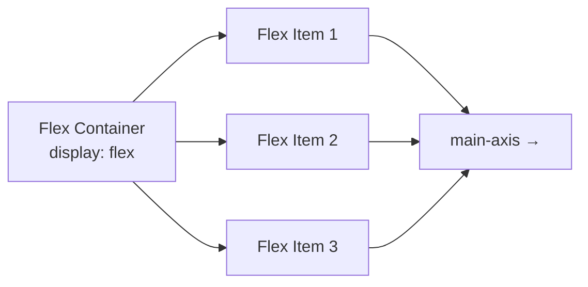
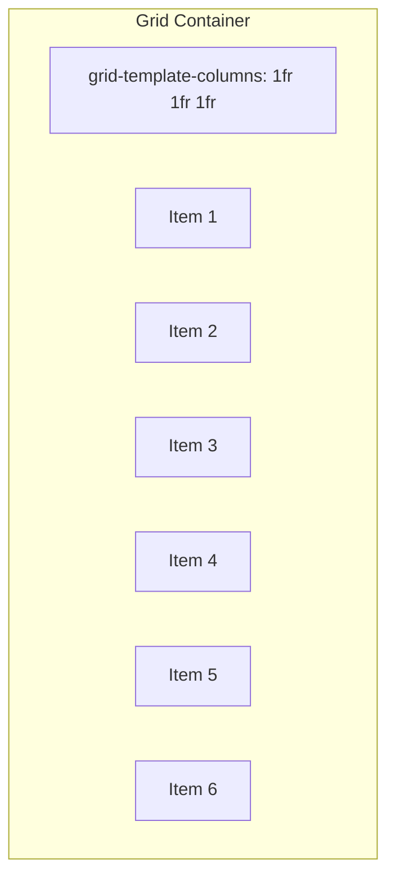

# 3.1 CSS Layout

## Flexbox

Flexbox buat **1 dimensi** — baris ATAU kolom. Paling gampang buat nengahkan konten, navbar, card row.



### Container Properties

```css
.container {
    display: flex;           /* aktifin flexbox */

    /* Main axis direction */
    flex-direction: row;            /* kiri ke kanan (default) */
    flex-direction: column;         /* atas ke bawah */
    flex-direction: row-reverse;    /* kanan ke kiri */

    /* Wrap — biar turun baris kalo penuh */
    flex-wrap: wrap;
    /* shorthand: flex-flow: row wrap; */

    /* Horizontal alignment (main axis) */
    justify-content: center;        /* tengah */
    justify-content: flex-start;    /* kiri (default) */
    justify-content: flex-end;      /* kanan */
    justify-content: space-between; /* rata kiri-kanan */
    justify-content: space-around;  /* rata dengan spasi */
    justify-content: space-evenly;  /* spasi sama rata */

    /* Vertical alignment (cross axis) */
    align-items: center;            /* tengah */
    align-items: flex-start;        /* atas */
    align-items: flex-end;          /* bawah */
    align-items: stretch;           /* samain tinggi (default) */

    /* Gap — jarak antar item */
    gap: 16px;
}
```

### Item Properties

```css
.item {
    flex: 1;            /* bagi rata space */
    flex: 2;            /* item ini 2x lebih besar */

    align-self: center; /* override alignment untuk item ini */
    order: -1;          /* urutan (default 0, -1 = lebih dulu) */
}
```

### Contoh Flexbox Layout

```html
<!DOCTYPE html>
<html lang="id">
<head>
    <meta charset="UTF-8">
    <meta name="viewport" content="width=device-width, initial-scale=1.0">
    <title>Flexbox Demo</title>
    <style>
        .navbar {
            display: flex;
            justify-content: space-between;
            align-items: center;
            background: #2c3e50;
            padding: 16px 32px;
            color: white;
        }

        .navbar a {
            color: white;
            text-decoration: none;
            margin-left: 20px;
        }

        .card-row {
            display: flex;
            gap: 20px;
            flex-wrap: wrap;
            padding: 20px;
        }

        .card {
            flex: 1;
            min-width: 250px;
            background: white;
            padding: 20px;
            border-radius: 8px;
            box-shadow: 0 2px 8px rgba(0,0,0,0.1);
        }

        .centered {
            display: flex;
            justify-content: center;
            align-items: center;
            height: 200px;
            background: #ecf0f1;
        }
    </style>
</head>
<body>
    <nav class="navbar">
        <h3>MySite</h3>
        <div>
            <a href="#">Home</a>
            <a href="#">About</a>
            <a href="#">Contact</a>
        </div>
    </nav>

    <div class="card-row">
        <div class="card"><h3>Card 1</h3><p>Isi card 1</p></div>
        <div class="card"><h3>Card 2</h3><p>Isi card 2</p></div>
        <div class="card"><h3>Card 3</h3><p>Isi card 3</p></div>
    </div>

    <div class="centered">
        <p>Ini di tengah pake flexbox</p>
    </div>
</body>
</html>
```

## Grid

Grid buat **2 dimensi** — baris DAN kolom. Cocok buat layout halaman, galeri, dashboard.



### Container Properties

```css
.grid-container {
    display: grid;

    /* Kolom */
    grid-template-columns: 200px 200px 200px;     /* 3 kolom ukuran tetap */
    grid-template-columns: 1fr 1fr 1fr;            /* 3 kolom sama besar */
    grid-template-columns: 2fr 1fr;                /* kolom 1 dua kali kolom 2 */
    grid-template-columns: repeat(3, 1fr);         /* 3 kolom, masing2 1fr */
    grid-template-columns: 200px 1fr 200px;        /* sidebar - konten - sidebar */

    /* Baris */
    grid-template-rows: auto 1fr auto;             /* header - konten - footer */

    /* Gap */
    gap: 16px;
    row-gap: 10px;
    column-gap: 20px;
}
```

### Item Properties

```css
.item {
    grid-column: 1 / 3;    /* ambil kolom 1 sampai 3 */
    grid-column: 1 / -1;   /* ambil semua kolom (full width) */
    grid-row: 1 / 3;       /* ambil baris 1 sampai 3 */
}
```

### Contoh Grid Layout

```html
<!DOCTYPE html>
<html lang="id">
<head>
    <meta charset="UTF-8">
    <meta name="viewport" content="width=device-width, initial-scale=1.0">
    <title>Grid Demo</title>
    <style>
        body { margin: 0; font-family: Arial, sans-serif; }

        .layout {
            display: grid;
            grid-template-columns: 200px 1fr 200px;
            grid-template-rows: auto 1fr auto;
            gap: 0;
            min-height: 100vh;
        }

        .header {
            grid-column: 1 / -1;
            background: #2c3e50;
            color: white;
            padding: 20px;
            text-align: center;
        }

        .sidebar-left {
            background: #ecf0f1;
            padding: 20px;
        }

        .main-content {
            padding: 20px;
        }

        .sidebar-right {
            background: #ecf0f1;
            padding: 20px;
        }

        .footer {
            grid-column: 1 / -1;
            background: #34495e;
            color: white;
            padding: 20px;
            text-align: center;
        }

        /* Card grid di dalam main */
        .card-grid {
            display: grid;
            grid-template-columns: repeat(3, 1fr);
            gap: 16px;
        }

        .card {
            background: #f9f9f9;
            padding: 16px;
            border-radius: 8px;
            border: 1px solid #ddd;
        }
    </style>
</head>
<body>
    <div class="layout">
        <header class="header">Header</header>
        <aside class="sidebar-left">Sidebar Kiri</aside>
        <main class="main-content">
            <h2>Konten Utama</h2>
            <div class="card-grid">
                <div class="card">Card 1</div>
                <div class="card">Card 2</div>
                <div class="card">Card 3</div>
                <div class="card">Card 4</div>
                <div class="card">Card 5</div>
                <div class="card">Card 6</div>
            </div>
        </main>
        <aside class="sidebar-right">Sidebar Kanan</aside>
        <footer class="footer">Footer</footer>
    </div>
</body>
</html>
```

## Media Queries

Buat responsive — tampilan beda di ukuran layar beda.

```css
/* Base style (mobile first) */
body { font-size: 16px; }

/* Tablet — min 768px */
@media (min-width: 768px) {
    body { font-size: 18px; }
    .grid {
        grid-template-columns: repeat(2, 1fr);
    }
}

/* Desktop — min 1024px */
@media (min-width: 1024px) {
    .grid {
        grid-template-columns: repeat(3, 1fr);
    }
}

/* Mobile — max 600px (kalo mobile first, jarang dipake) */
@media (max-width: 600px) {
    .navbar {
        flex-direction: column;
    }
}
```

### Contoh Layout Responsive

```html
<!DOCTYPE html>
<html lang="id">
<head>
    <meta charset="UTF-8">
    <meta name="viewport" content="width=device-width, initial-scale=1.0">
    <title>Responsive Layout</title>
    <style>
        * { box-sizing: border-box; }
        body { margin: 0; font-family: Arial, sans-serif; }

        .container {
            display: grid;
            grid-template-columns: 1fr;
            gap: 16px;
            padding: 16px;
        }

        .card {
            background: #3498db;
            color: white;
            padding: 40px;
            text-align: center;
            border-radius: 8px;
        }

        /* Tablet: 2 kolom */
        @media (min-width: 600px) {
            .container {
                grid-template-columns: repeat(2, 1fr);
            }
        }

        /* Desktop: 4 kolom */
        @media (min-width: 1024px) {
            .container {
                grid-template-columns: repeat(4, 1fr);
                max-width: 1200px;
                margin: 0 auto;
            }
        }
    </style>
</head>
<body>
    <div class="container">
        <div class="card">1</div>
        <div class="card">2</div>
        <div class="card">3</div>
        <div class="card">4</div>
        <div class="card">5</div>
        <div class="card">6</div>
    </div>
</body>
</html>
```

## Position

| Value | Behavior |
|-------|----------|
| `static` | Default — ngalir normal |
| `relative` | Posisi relatif terhadap posisi normalnya |
| `absolute` | Posisi relatif terhadap parent terdekat yang `position: relative` |
| `fixed` | Posisi tetap di layar (gak ikut scroll) |
| `sticky` | Gabungan relative + fixed |

```css
.parent {
    position: relative; /* biar child absolute pake ini sebagai patokan */
}

.absolute-child {
    position: absolute;
    top: 10px;
    right: 10px;
}

.fixed-header {
    position: fixed;
    top: 0;
    left: 0;
    width: 100%;
    background: white;
    z-index: 100; /* biar di atas elemen lain */
}

.sticky-nav {
    position: sticky;
    top: 0; /* nempel pas di-scroll sampe batas atas */
    background: white;
}
```

```html
<style>
    .card {
        position: relative;
        background: white;
        padding: 20px;
        margin: 20px;
        border-radius: 8px;
    }

    .badge {
        position: absolute;
        top: -10px;
        right: -10px;
        background: red;
        color: white;
        padding: 4px 8px;
        border-radius: 50%;
        font-size: 12px;
    }

    .whatsapp {
        position: fixed;
        bottom: 20px;
        right: 20px;
        background: #25d366;
        color: white;
        width: 50px;
        height: 50px;
        border-radius: 50%;
        display: flex;
        align-items: center;
        justify-content: center;
        font-size: 24px;
        box-shadow: 0 4px 12px rgba(0,0,0,0.2);
    }
</style>

<div class="card">
    <h3>Produk Baru</h3>
    <p>Ini produk terbaru kami dengan diskon besar.</p>
    <div class="badge">SALE</div>
</div>

<div class="whatsapp">WA</div>
```

## Latihan

1. **Navbar Flex** — Bikin navbar responsive pake flexbox: logo kiri, menu kanan. Di mobile (max 600px) menu jadi vertikal & center.

2. **Card Grid** — Bikin grid card produk: 1 kolom (mobile), 2 kolom (tablet 768px), 4 kolom (desktop 1024px). tiap card ada gambar, judul, harga.

3. **Responsive 3-Column** — Bikin layout 3 kolom pake grid: sidebar kiri (200px), konten utama (1fr), sidebar kanan (200px). Di tablet jadi 2 kolom (sidebar hilang). Di mobile jadi 1 kolom (stack).

4. **Hero Section** — Bikin hero section pake position: fixed background, konten di tengah pake flexbox, ada tombol CTA, ada floating badge absolute di pojok.

5. **Holy Grail Layout.** Bikin layout "holy grail" pake grid: header (full width), sidebar kiri, main content, sidebar kanan, footer (full width). Responsive: tablet jadi 2 kolom, mobile jadi 1 kolom.

6. **Card grid responsif.** Bikin grid 6 card produk. Pake media queries: mobile 1 kolom, tablet 2 kolom, desktop 3 kolom, wide 4 kolom. Setiap card punya gambar placeholder, judul, harga, tombol.

7. **Sticky navbar.** Bikin navbar yang sticky di top pas di-scroll. Pake `position: sticky`. Konten di bawah harus bisa scroll melewati navbar tanpa nutup konten.

8. **Position challenge.** Bikin halaman dengan: (1) fixed WhatsApp button pojok kanan bawah, (2) badge "SALE" absolute di card, (3) back-to-top button yang muncul pas di-scroll, (4) dropdown menu absolute di navbar. Screenshoot semua.
