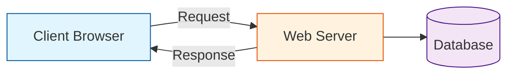
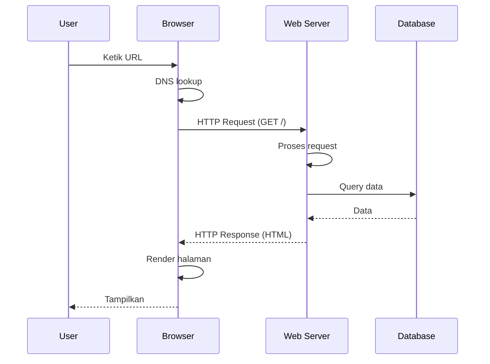
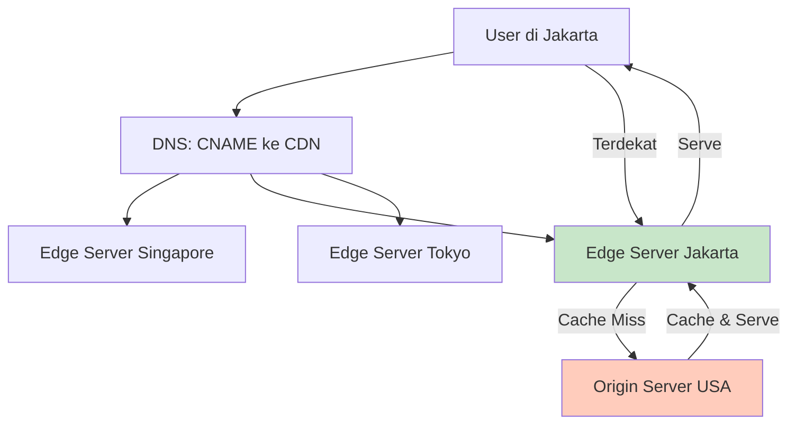
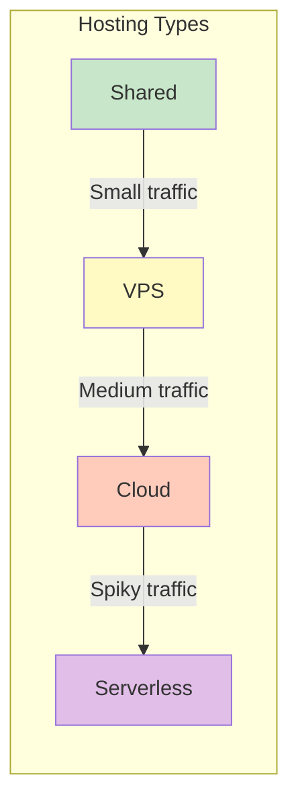

# 01. Cara Kerja Web

## Internet Basics

Internet = jaringan global komputer yang saling terhubung. Setiap perangkat punya alamat unik.

### IP Address

- **IPv4**: `192.168.1.1` — 4 blok angka (32-bit), ~4.3 miliar alamat
- **IPv6**: `2001:db8::ff00:42:8329` — format hex (128-bit), alamat hampir tak terbatas

```bash
# Cek IP sendiri
curl ifconfig.me
```

### DNS (Domain Name System)

DNS = buku telepon internet. Manusia gampang inget `google.com`, komputer butuh IP `142.250.184.46`.

```
Browser -> Cari DNS -> Dapet IP -> Connect ke server
```

```bash
# Cek DNS lookup
nslookup google.com
dig google.com +short
```

### TCP/IP

Protokol yang ngatur data dikirim via internet:

| Layer | Fungsi | Contoh |
|-------|--------|--------|
| Application | Data aplikasi | HTTP, FTP, SMTP |
| Transport | Pengiriman data | TCP, UDP |
| Internet | Routing & alamat | IP |
| Network Access | Hardware fisik | Ethernet, Wi-Fi |

---

## Client & Server



| Peran | Tugas | Contoh |
|-------|-------|--------|
| **Client** | Minta data, render tampilan | Browser, mobile app, Postman |
| **Server** | Proses request, kirim response | Apache, Nginx, Node.js |

---

## Request-Response Cycle



---

## URL Structure

```
  https://www.example.com:443/path/to/page?query=value&page=1#section
  \____/ \_______________/\__/\__________________/\______________/\______/
   |            |          |          |                |            |
 Protocol    Domain      Port       Path            Query        Fragment
```

| Komponen | Contoh | Keterangan |
|----------|--------|------------|
| **Protocol** | `https://` | Aturan komunikasi (HTTP/HTTPS) |
| **Domain** | `www.example.com` | Nama website (DNS) |
| **Port** | `:443` | Gerbang masuk (default: 80 HTTP, 443 HTTPS) |
| **Path** | `/products/laptop` | Resource spesifik di server |
| **Query** | `?search=laptop&page=2` | Parameter tambahan (key=value) |
| **Fragment** | `#section` | Bagian spesifik dalam halaman |

---

## CDN — Content Delivery Network

CDN = jaringan server yang tersebar di banyak lokasi geografis. Tujuan: ngirim konten dari server yang paling deket sama user.

### Cara Kerja CDN



### CDN Providers

| Provider | Fitur Utama | Harga |
|----------|-------------|-------|
| **Cloudflare** | CDN + DDoS protection + WAF | Free tier available |
| **Fastly** | Edge computing (Compute@Edge) | Pay-as-you-go |
| **Akamai** | Enterprise-grade | Mahal |
| **AWS CloudFront** | Integrasi AWS | Pay-as-you-go |
| **Vercel Edge** | Edge functions + CDN | Free tier |

### Cache Strategy di CDN

```
Static assets (images, CSS, JS):
  CDN: cache 1 tahun, immutable
  Browser: cache 1 tahun
  
HTML pages:
  CDN: cache 5 menit
  Browser: no-cache (revalidate)
  
API responses:
  CDN: cache 1 menit (kalo public)
  Browser: no-cache
```

### Purge Cache CDN

```bash
# Cloudflare
curl -X POST "https://api.cloudflare.com/client/v4/zones/ZONE_ID/purge_cache" \
  -H "Authorization: Bearer TOKEN" \
  -H "Content-Type: application/json" \
  -d '{"files":["https://site.com/style.css"]}'

# Fastly
curl -X POST "https://api.fastly.com/service/SERVICE_ID/purge/site.com/style.css" \
  -H "Fastly-Key: API_KEY"
```

---

## Edge Computing

Edge computing = jalanin kode di server CDN, bukan di origin server. Lebih deket ke user → latency lebih rendah.

### Edge Functions (Vercel / Cloudflare Workers / Fastly)

```javascript
// Cloudflare Worker — jalan di edge
export default {
  async fetch(request) {
    const url = new URL(request.url);
    
    // Handle API di edge
    if (url.pathname.startsWith('/api/')) {
      const data = await fetch('https://api.example.com' + url.pathname);
      const json = await data.json();
      
      // Tambah header caching
      return new Response(JSON.stringify(json), {
        headers: {
          'Content-Type': 'application/json',
          'Cache-Control': 'public, max-age=60',
          'CF-Cache-Status': 'HIT',
        },
      });
    }

    // Serve static dari CDN
    return fetch(request);
  }
}
```

### Edge vs Origin

| Aspek | Origin Server | Edge Server |
|-------|---------------|-------------|
| Lokasi | 1-3 region | 50-300+ locations |
| Latency | 100-500ms | 10-50ms |
| Compute | Unlimited | Limited (CPU, memory) |
| Storage | Database + disk | Cache + KV store |
| Cold start | No | Yes (first request) |
| Use case | Business logic, DB | Auth, rewrite, A/B testing |

---

## Browser DevTools — Network Tab

Cara buka: `F12` atau `Ctrl+Shift+I` → tab **Network**

Yang bisa kamu lihat:

| Kolom | Arti |
|-------|------|
| Name | Nama file request |
| Status | HTTP status code |
| Type | Tipe resource (document, css, js, img) |
| Size | Ukuran response |
| Time | Waktu loading |
| Waterfall | Timeline request visual |

> **Latihan**: Buka website manapun → Network tab → reload → liat semua request yang muncul

---

## Caching Strategy — 3 Level Cache

```
Level 1: CDN Cache
  - Static assets: cache lama (1 tahun)
  - HTML: cache pendek (5 menit)
  - API: cache sesuai kebutuhan

Level 2: Browser Cache
  - Cache-Control: max-age
  - ETag / If-None-Match
  - Service Worker Cache

Level 3: Server Cache
  - In-memory cache (Redis)
  - Database query cache
  - Full-page cache (Varnish)
```

### Cache Headers Praktis

```typescript
// Express middleware buat caching
function cacheMiddleware(duration: number) {
  return (req: Request, res: Response, next: NextFunction) => {
    res.set('Cache-Control', `public, max-age=${duration}`);
    next();
  };
}

// Static assets — cache lama
app.use('/static', cacheMiddleware(31536000)); // 1 year
app.use('/static', express.static('public'));

// API — cache pendek
app.get('/api/products', cacheMiddleware(60), (req, res) => {
  res.json(products);
});
```

---

## Hosting Overview

Cara naro website biar bisa diakses dari internet.

### Shared Hosting
- Satu server dipake banyak orang
- Murah, sumber daya terbatas
- Cocok: blog kecil, website statis

### VPS (Virtual Private Server)
- Server virtual sendiri, resource dedicated
- Root access, bebas config
- Cocok: website menengah, API

### Cloud Hosting
- Infrastruktur scalable (AWS, GCP, Azure)
- Bayar sesuai pemakaian
- Cocok: aplikasi besar, traffic fluktuatif

### Serverless
- Jalanin code tanpa ngurus server
- Scale otomatis, bayar per eksekusi
- Cocok: fungsi API, webhook, background job



---

## Rangkuman

| Konsep | Inti |
|--------|------|
| IP & DNS | IP itu alamat, DNS buku telepon |
| Client-Server | Client minta, server kasih |
| URL | Protocol://domain:port/path?query |
| CDN | Server dekat user buat ngirim konten cepet |
| Edge Computing | Jalanin kode di CDN, latency rendah |
| Caching | 3 level: CDN → Browser → Server |
| DevTools Network | Liat semua request website |
| Hosting | Shared → VPS → Cloud → Serverless |

---

## Latihan

### 1. Trace URL
Uraikan URL ini bagian per bagian:
```
https://shop.example.com:8080/products/category?sort=price&limit=10#reviews
```

### 2. Analisis Network Tab
Buka 3 website favorit. Catat:
- Total request yang keluar
- Request paling lambat
- Tipe file paling banyak (gambar? JS? CSS?)
- Status code 200 vs 404 vs 301
- Header Cache-Control dan CDN mana yang dipake

### 3. Gambar Arsitektur
Bikin diagram Mermaid arsitektur web yang mencakup: Client, DNS, CDN, Web Server, Database, Edge Server. Jelaskan alur request dari user buka browser sampai dapet halaman.

### 4. Bedain Hosting Types
Buat tabel perbandingan Shared, VPS, Cloud, Serverless dari segi:
- Harga
- Kontrol
- Skalabilitas
- Contoh kasus penggunaan
- Kelebihan & kekurangan

### 5. CDN Practice
Buat static site sederhana (HTML + CSS + JS), deploy ke Vercel, terus analisis header `x-vercel-cache`. Catat: request mana yang HIT vs MISS dari CDN.

### 6. Edge Function
Tulis Cloudflare Worker sederhana yang rewrite path `/?name=Budi` jadi `<h1>Halo, Budi!</h1>`. Deploy ke edge dan test.

### 7. Cache Strategy
Buat Express middleware dengan 3 level caching: static assets (1 year), API responses (60s), HTML pages (5 min). Set Cache-Control headers yang tepat.
