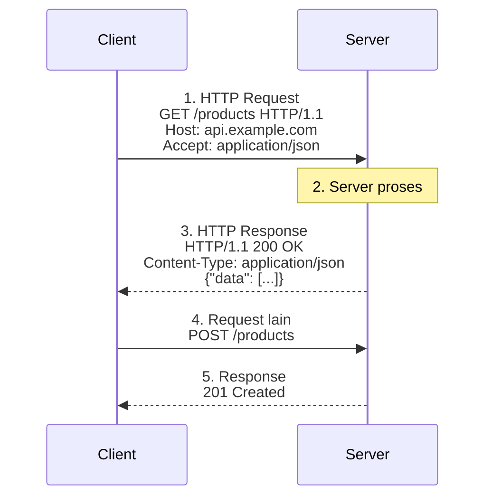
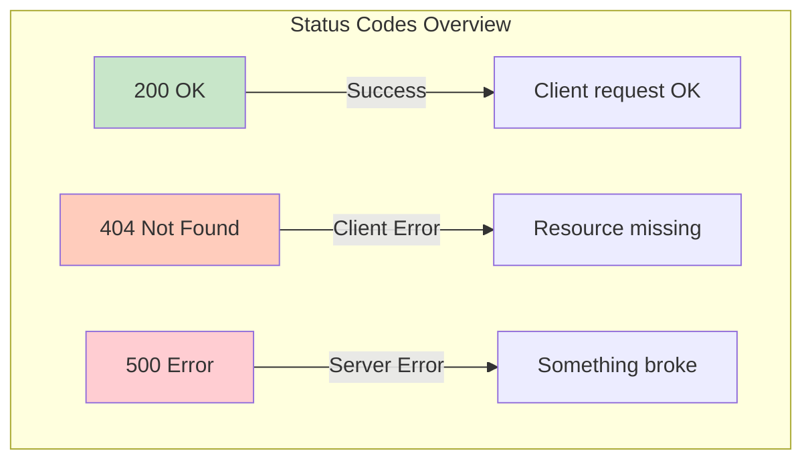
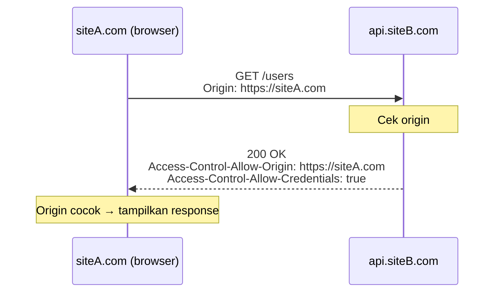
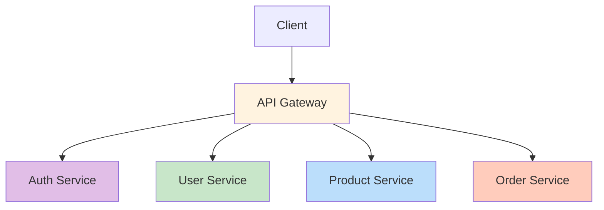

# 02. HTTP Basics

## Apa itu HTTP?

**HTTP** (HyperText Transfer Protocol) = bahasa yang dipake client & server buat komunikasi. Setiap interaksi web adalah pertukaran **HTTP Request** (dari client) dan **HTTP Response** (dari server).

---

## Cara Kerja



---

## HTTP Methods

Method = *verb* yang ngasih tau server **mau ngapain**.

| Method | Fungsi | Analogi Restoran | Kapan Pake |
|--------|--------|------------------|------------|
| **GET** | Ambil data | Lihat menu | Baca artikel, liat produk |
| **POST** | Kirim data baru | Pesan makanan | Register, upload foto |
| **PUT** | Update data (ganti semua) | Ganti pesanan total | Update profil, ganti password |
| **PATCH** | Update data (sebagian) | Ganti topping aja | Edit bio, ubah quantity |
| **DELETE** | Hapus data | Batalkan pesanan | Hapus akun, delete post |

> **Catatan**: PUT kirim data lengkap, PATCH kirim data yang berubah aja.

```bash
# Contoh pake curl
curl https://api.github.com/users/midory          # GET
curl -X POST https://api.example.com/users        # POST
curl -X PUT -d '{"name":"Baru"}' https://api.example.com/users/1  # PUT
curl -X DELETE https://api.example.com/users/1    # DELETE
```

### Idempotent & Safe

| Sifat | Arti | Method |
|-------|------|--------|
| **Safe** | Gak ngubah data di server | GET |
| **Idempotent** | Request berkali-kali hasilnya sama | GET, PUT, DELETE |
| **Not Safe** | Bisa ngubah data | POST, PUT, PATCH, DELETE |

---

## HTTP Status Codes

Server ngasih kode 3 digit biar client tau hasilnya.

### 1xx — Informational
Lagi proses, tunggu bentar.

### 2xx — Success
| Kode | Nama | Arti |
|------|------|------|
| **200** | OK | Sukses! Data dikirim |
| **201** | Created | Data baru berhasil dibuat |
| **204** | No Content | Sukses, tapi gak ada data (biasanya setelah DELETE) |

### 3xx — Redirection
| Kode | Nama | Arti |
|------|------|------|
| **301** | Moved Permanently | Pindah alamat permanen (cache oleh browser) |
| **302** | Found | Pindah sementara |
| **304** | Not Modified | Data gak berubah, pake cache aja |

### 4xx — Client Error
| Kode | Nama | Arti | Analogi |
|------|------|------|---------|
| **400** | Bad Request | Request salah format | Pesan gak jelas |
| **401** | Unauthorized | Belum login | Kartu identitas gak ada |
| **403** | Forbidden | Gak punya akses | Dilarang masuk |
| **404** | Not Found | Resource gak ada | Alamat salah |
| **405** | Method Not Allowed | Method gak didukung | Minta bayar cash di toko cashless |
| **429** | Too Many Requests | Kebanyakan request, kena rate limit | Antrian penuh |

### 5xx — Server Error
| Kode | Nama | Arti |
|------|------|------|
| **500** | Internal Server Error | Error umum di server |
| **502** | Bad Gateway | Server gateway dapet response invalid |
| **503** | Service Unavailable | Server sibuk / maintenance |



---

## HTTP Headers

Header = metadata yang nyertain request/response.

### Request Headers
| Header | Contoh | Fungsi |
|--------|--------|--------|
| `Host` | `api.example.com` | Domain tujuan |
| `User-Agent` | `Mozilla/5.0...` | Identitas browser/client |
| `Accept` | `application/json` | Format response yang diinginkan |
| `Authorization` | `Bearer eyJhbG...` | Token autentikasi |
| `Content-Type` | `application/json` | Format data yang dikirim (POST/PUT) |
| `Cookie` | `session_id=abc` | Data session |

### Response Headers
| Header | Contoh | Fungsi |
|--------|--------|--------|
| `Content-Type` | `text/html; charset=utf-8` | Format response |
| `Content-Length` | `1234` | Ukuran response (bytes) |
| `Set-Cookie` | `session_id=xyz; Path=/` | Set cookie di browser |
| `Cache-Control` | `max-age=3600` | Aturan caching |
| `Access-Control-Allow-Origin` | `*` | CORS policy |

```bash
# Liat headers pake curl -v
curl -v https://api.github.com
```

---

## HTTPS & SSL

### HTTP vs HTTPS

| HTTP | HTTPS |
|------|-------|
| Data plaintext | Data terenkripsi |
| Port 80 | Port 443 |
| Rentan man-in-the-middle | Aman pake TLS/SSL |
| ❌ Trusted | ✅ Padlock hijau di browser |

### Cara Kerja HTTPS

```
1. Client minta koneksi aman (ClientHello)
2. Server kirim sertifikat SSL + public key
3. Client verifikasi sertifikat (via Certificate Authority)
4. Client buat session key, enkrip pake public key
5. Server dekrip pake private key
6. Komunikasi terenkripsi dimulai!
```

> **SSL Certificate**: Dapet gratis dari Let's Encrypt, atau bayar dari DigiCert, Cloudflare, dll.

---

## HTTP/2 vs HTTP/3

| Fitur | HTTP/1.1 | HTTP/2 | HTTP/3 |
|-------|----------|--------|--------|
| Tahun | 1997 | 2015 | 2022 |
| Transport | TCP | TCP | QUIC (UDP) |
| Koneksi | 1 request per koneksi | Multiplexing | Multiplexing |
| Head-of-line blocking | ❌ Ya | ⚠️ Parsial (TCP level) | ✅ Gak ada |
| Server push | ❌ | ✅ | ✅ |
| Adopsi | Legacy | 40%+ web | 30%+ (makin naik) |

**Multiplexing** = kirim banyak request dalam 1 koneksi tanpa nunggu antrian.

### Server Push (HTTP/2)

Server bisa kirim resources yang diperlukan SEBELUM client minta:

```html
<!-- Server tau client butuh style.css — push duluan -->
Link: </style.css>; rel=preload; as=style
Link: </script.js>; rel=preload; as=script
```

---

## Caching — Cache-Control & ETag

### Cache-Control Directives

| Directive | Arti |
|-----------|------|
| `public` | Bisa di-cache oleh siapa aja (CDN, browser) |
| `private` | Hanya browser (gak di-cache CDN) |
| `no-cache` | Harus revalidate ke server sebelum pake cache |
| `no-store` | Jangan cache sama sekali |
| `max-age=3600` | Cache valid 1 jam |
| `must-revalidate` | Wajib revalidate kalo cache expired |
| `immutable` | Gak akan berubah — cache aja (buat file hash) |

### ETag — Validasi Cache

```typescript
// Express — otomatis handle ETag
app.set('etag', 'strong'); // strong ETag (by content)

// Manual ETag untuk API
app.get('/api/users', (req, res) => {
  const data = JSON.stringify(users);
  const etag = crypto.createHash('md5').update(data).digest('hex');
  
  if (req.headers['if-none-match'] === etag) {
    return res.status(304).send(); // Not Modified
  }
  
  res.set('ETag', etag);
  res.json(users);
});
```

### Service Worker Cache

```javascript
// Service Worker — cache first strategy
self.addEventListener('fetch', (event) => {
  event.respondWith(
    caches.match(event.request)
      .then((response) => {
        // Cache first — kalo ada di cache, pake itu
        if (response) return response;
        
        // Kalo gak ada — fetch dari network, simpan ke cache
        return fetch(event.request).then((res) => {
          const clone = res.clone();
          caches.open('v1').then((cache) => {
            cache.put(event.request, clone);
          });
          return res;
        });
      })
  );
});
```

---

## Web Security Headers

Security headers = HTTP response headers yang ngelindungin aplikasi dari serangan berbasis browser.

### Strict-Transport-Security (HSTS)

```nginx
Strict-Transport-Security: max-age=63072000; includeSubDomains; preload
```

Maksa browser pake HTTPS selalu. Kalo user ketik HTTP, browser otomatis upgrade ke HTTPS.

| Directive | Fungsi |
|-----------|--------|
| `max-age=63072000` | Waktu (detik) browser inget untuk pake HTTPS (2 tahun) |
| `includeSubDomains` | Berlaku juga untuk subdomain |
| `preload` | Daftar di HSTS preload list browser |

### Content-Security-Policy (CSP)

CSP ngontrol resource apa yang boleh di-load browser. Ini prevent XSS dan data injection.

```nginx
# Ketat — cuma percaya same-origin
Content-Security-Policy: default-src 'self'; script-src 'self'; style-src 'self'

# Dengan CDN dan analytics
Content-Security-Policy: default-src 'self';
  script-src 'self' https://cdn.example.com https://www.googletagmanager.com;
  style-src 'self' https://fonts.googleapis.com;
  img-src 'self' data: https://images.example.com;
  font-src 'self' https://fonts.gstatic.com;
  connect-src 'self' https://api.example.com;
  frame-ancestors 'none';
```

| Directive | Ngontrol |
|-----------|----------|
| `default-src` | Fallback untuk semua resource |
| `script-src` | Sumber JavaScript |
| `style-src` | Sumber CSS |
| `img-src` | Sumber gambar |
| `font-src` | Sumber font |
| `connect-src` | Sumber fetch/XMLHttpRequest |
| `frame-ancestors` | Sumber yang boleh embed halaman di iframe |
| `report-uri` | URL untuk laporan pelanggaran CSP |

### X-Content-Type-Options

```nginx
# Prevent MIME sniffing — browser jangan nebak-nebak tipe file
X-Content-Type-Options: nosniff
```

Kalo server kirim `Content-Type: text/plain` tapi isinya HTML, browser bisa "nebak" dan render sebagai HTML (MIME sniffing). Header ini stop itu.

### X-Frame-Options

```nginx
# Prevent clickjacking — halaman gak boleh di-iframe
X-Frame-Options: DENY
# Atau kalo perlu di-iframe di origin sendiri aja
X-Frame-Options: SAMEORIGIN
```

Prevent serangan clickjacking dimana attacker taruh halaman login di iframe transparan.

### Referrer-Policy

```nginx
# Kontrol data yang dikirim di header Referer
Referrer-Policy: strict-origin-when-cross-origin

# Opsi lain:
# no-referrer           — gak kirim referrer sama sekali
# same-origin           — kirim kalo same-origin aja
# strict-origin         — kirim origin aja (gak full URL)
# no-referrer-when-downgrade — default browser
```

### Permissions-Policy (dulu Feature-Policy)

```nginx
# Kontrol API browser yang boleh dipake
Permissions-Policy: camera=(), microphone=(), geolocation=()

# Kasih akses ke origin tertentu
Permissions-Policy: geolocation=(self "https://maps.example.com")
```

### Implementasi Lengkap di Express

```typescript
import helmet from 'helmet';

// Helmet = kumpulan security headers siap pakai
app.use(helmet());

// Atau custom:
app.use(helmet({
  contentSecurityPolicy: {
    directives: {
      defaultSrc: ["'self'"],
      scriptSrc: ["'self'", "https://cdn.example.com"],
      styleSrc: ["'self'", "'unsafe-inline'"],
      imgSrc: ["'self'", "data:", "https://images.example.com"],
      connectSrc: ["'self'", "https://api.example.com"],
    },
  },
  hsts: {
    maxAge: 63072000,
    includeSubDomains: true,
    preload: true,
  },
}));
```

```nginx
# Atau di Nginx
add_header Strict-Transport-Security "max-age=63072000; includeSubDomains; preload" always;
add_header X-Content-Type-Options "nosniff" always;
add_header X-Frame-Options "DENY" always;
add_header Referrer-Policy "strict-origin-when-cross-origin" always;
add_header Content-Security-Policy "default-src 'self'; script-src 'self'; object-src 'none'" always;
```

## CORS — Cross-Origin Resource Sharing

CORS = mekanisme browser buat ngontrol request dari domain lain.

### Kenapa CORS ada?

Browser punya **Same-Origin Policy** — halaman di `https://siteA.com` gak boleh fetch data dari `https://siteB.com` kecuali siteB ngasih izin lewat CORS.

```html
<!-- Ini di siteA.com -->
<script>
  // BLOCKED oleh browser — beda origin!
  fetch('https://api.siteB.com/users')
    .then(res => res.json())
</script>
```

### Cara Kerja CORS

1. Browser kirim request + header `Origin: https://siteA.com`
2. Server response dengan header `Access-Control-Allow-Origin: https://siteA.com`
3. Browser compare — kalo cocok, kasih akses



### Preflight Request (OPTIONS)

Kalo request bukan simple request (method selain GET/POST/HEAD, atau pake custom headers), browser kirim **preflight** dulu:

```http
OPTIONS /users HTTP/1.1
Origin: https://siteA.com
Access-Control-Request-Method: DELETE
Access-Control-Request-Headers: X-Custom-Header
```

Server harus reply dengan izin:

```http
HTTP/1.1 204 No Content
Access-Control-Allow-Origin: https://siteA.com
Access-Control-Allow-Methods: GET, POST, PUT, DELETE, PATCH
Access-Control-Allow-Headers: X-Custom-Header, Authorization
Access-Control-Max-Age: 86400
```

### CORS Headers Lengkap

| Header | Contoh | Fungsi |
|--------|--------|--------|
| `Access-Control-Allow-Origin` | `*` atau `https://siteA.com` | Origin mana yang diizinkan |
| `Access-Control-Allow-Methods` | `GET, POST, PUT` | Method yang diizinkan |
| `Access-Control-Allow-Headers` | `Content-Type, Authorization` | Custom headers yang diizinkan |
| `Access-Control-Expose-Headers` | `X-Total-Count` | Header response yang bisa dibaca JS |
| `Access-Control-Allow-Credentials` | `true` | Kalo pake cookie/auth |
| `Access-Control-Max-Age` | `86400` | Cache preflight (detik) |

### Implementasi CORS di Express

```typescript
import cors from 'cors';
import express from 'express';

const app = express();

// 1. Allow all (dev only)
app.use(cors());

// 2. Whitelist specific origins
const allowedOrigins = [
  'https://myapp.com',
  'https://admin.myapp.com',
  'http://localhost:5173',
];

app.use(cors({
  origin: (origin, callback) => {
    // Allow requests with no origin (mobile apps, curl, Postman)
    if (!origin || allowedOrigins.includes(origin)) {
      callback(null, true);
    } else {
      callback(new Error('Not allowed by CORS'));
    }
  },
  methods: ['GET', 'POST', 'PUT', 'PATCH', 'DELETE'],
  allowedHeaders: ['Content-Type', 'Authorization'],
  exposedHeaders: ['X-Total-Count', 'X-Request-Id'],
  credentials: true, // untuk cookie
  maxAge: 86400,     // cache preflight 24 jam
}));

// 3. Per-route CORS
app.get('/api/public', cors({ origin: '*' }));
app.get('/api/admin', cors({ origin: 'https://admin.myapp.com' }));
```

### CORS dengan Cookie / Credentials

Kalo pake cookie auth (bukan Bearer token), butuh config khusus:

```typescript
// Client — pake credentials
fetch('https://api.myapp.com/users', {
  credentials: 'include', // kirim cookie
});

// Server — allow credentials
app.use(cors({
  origin: 'https://myapp.com', // WAJIB: gak boleh '*'
  credentials: true,           // izinkan cookie
}));
```

### Debugging CORS

```bash
# Test CORS dengan curl
curl -H "Origin: https://evil.com" -v https://api.myapp.com/users 2>&1 | grep -i "access-control"

# Test preflight
curl -X OPTIONS \
  -H "Origin: https://myapp.com" \
  -H "Access-Control-Request-Method: DELETE" \
  -v https://api.myapp.com/users 2>&1 | grep -i "access-control"
```

### Common CORS Errors & Solusi

| Error | Penyebab | Solusi |
|-------|----------|--------|
| `No 'Access-Control-Allow-Origin'` | Server gak kirim CORS headers | Tambah middleware cors |
| `Multiple CORS header 'Access-Control-Allow-Origin'` | Dua middleware cors konflik | Cek jangan double cors() |
| `Response to preflight doesn't pass` | OPTIONS handler kena auth | Auth middleware skip OPTIONS |
| `Credentials flag is 'true'` | Origin `*` + credentials true | Ganti origin explicit |
| `CORS error: Request header field X-Custom` | Custom header gak diizinkan | Tambah `allowedHeaders` |

### CORS di Berbagai Backend

```python
# Python Flask
from flask_cors import CORS
CORS(app, origins=['https://myapp.com'])

# Go Gin
r.Use(cors.New(cors.Config{
  AllowOrigins: []string{"https://myapp.com"},
  AllowMethods: []string{"GET", "POST", "PUT", "DELETE"},
}))

# PHP Laravel
// config/cors.php
return [
  'paths' => ['api/*'],
  'allowed_origins' => ['https://myapp.com'],
  'supports_credentials' => true,
];
```

API Gateway = single entry point buat semua API. Dia handle routing, auth, rate limiting, caching.



### API Gateway di Node.js

```typescript
import express from 'express';
import { createProxyMiddleware } from 'http-proxy-middleware';

const gateway = express();

// Auth — sebelum proxy
gateway.use('/api/*', authMiddleware);

// Rate limiting per service
gateway.use('/api/users', rateLimit({ max: 100 }));
gateway.use('/api/products', rateLimit({ max: 200 }));

// Proxy ke service
gateway.use('/api/users', createProxyMiddleware({
  target: 'http://user-service:3001',
  changeOrigin: true,
}));

gateway.use('/api/products', createProxyMiddleware({
  target: 'http://product-service:3002',
  changeOrigin: true,
}));
```

---

## Rangkuman

| Konsep | Inti |
|--------|------|
| HTTP Methods | GET ambil, POST buat, PUT ganti, PATCH edit, DELETE hapus |
| Status Codes | 2xx ok, 3xx pindah, 4xx error client, 5xx error server |
| Headers | Metadata request/response |
| HTTPS | HTTP + enkripsi TLS, pake sertifikat SSL |
| HTTP/2 & /3 | Lebih cepet, multiplexing, HOL blocking solved |
| Caching | Cache-Control, ETag, Service Worker |
| API Gateway | Single entry point, handle routing + auth + rate limit |

---

## Latihan

### 1. Match Method to Action
Cocokin method HTTP ke aksi berikut:
- `[ ]` Ngirim form login
- `[ ]` Liat daftar produk
- `[ ]` Hapus komentar
- `[ ]` Ganti nama profil
- `[ ]` Upload foto profil

Tulis method yang tepat (GET, POST, PUT, PATCH, DELETE).

### 2. Identify Status Codes
Kasus berikut, status code apa yang tepat?
- User buka halaman yang gak ada
- Form login berhasil
- User gak login nyoba akses dashboard
- Server lagi down maintenance
- Data baru berhasil dibuat
- Redirect dari http ke https

### 3. Curl Command Practice
Tulis curl command buat:
- GET data user dari `https://jsonplaceholder.typicode.com/users/1`
- POST user baru dengan data `{"name":"Budi","email":"budi@mail.com"}`
- Liat response headers aja dari Google
- DELETE post dengan id 1

### 4. HTTP vs HTTPS
Jelaskan pake diagram atau tulisan:
- Apa bedanya HTTP dan HTTPS?
- Gimana proses handshake TLS?
- Kenapa HTTPS penting buat production?
- Cari tau: website mana aja yang masih pake HTTP? Kenapa?

### 5. Implementasi API Gateway
Buat Express server sederhana yang jadi API gateway untuk 2 service: user-service (port 3001) dan product-service (port 3002). Pake http-proxy-middleware. Tambah rate limiting dan auth middleware.

### 6. Caching Strategy
Buat Express endpoint `GET /api/products` dengan:
- ETag dari hash JSON response
- Cache-Control: public, max-age=60
- Handle If-None-Match → return 304
- Test dengan curl pake -H 'If-None-Match: ...'

### 7. Service Worker
Buat service worker yang implement cache-first strategy untuk gambar dan API responses. Register di halaman HTML. Test dengan DevTools → Application → Cache Storage.
