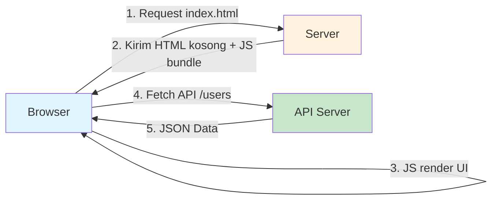
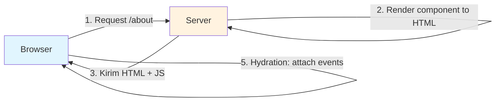
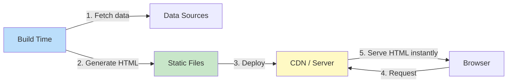
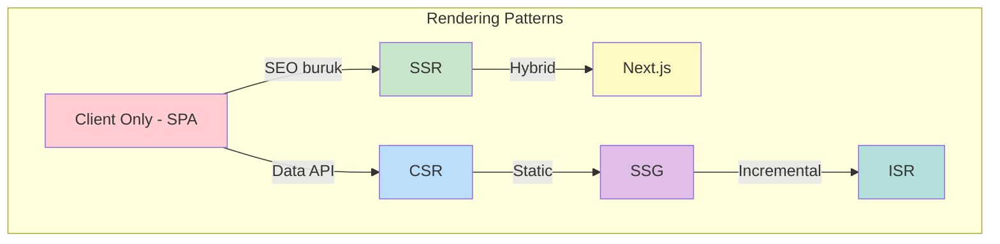

# 03. SSR, SPA, SSG

## 🎯 Tujuan

Setelah sesi ini, kamu mampu:

- Memahami perbedaan **SSR (Server-Side Rendering)**, **SPA (Single Page Application)**, **SSG (Static Site Generation)**, dan **ISR (Incremental Static Regeneration)**
- Menentukan kapan pakai masing-masing arsitektur
- Implementasi render pattern di Next.js
- Memahami **micro-frontends** sebagai evolusi dari SPA skala besar
- Memilih arsitektur yang tepat untuk berbagai use case

---

## 1. SPA — Single Page Application

Aplikasi web modern yang **gak reload halaman** pas navigasi. Semua HTML di-render di client pake JavaScript.

### Cara Kerja

1. Browser minta halaman pertama → server kirim HTML kosong + bundle JS besar
2. JS jalan di browser → render UI
3. Navigasi halaman → **gak reload**, cuma ganti konten via JS
4. Data diambil via API (fetch/axios) — render ulang component



### Kelebihan & Kekurangan

| Pro | Kontra |
|-----|--------|
| Navigasi cepat (gak reload) | SEO jelek (Google udah bisa, tapi gak optimal) |
| UX kaya aplikasi desktop | First load lambat (download bundle JS besar) |
| Bisa offline (PWA) | Lebih berat di device low-end |
| Backend bisa fokus API | Butuh JavaScript wajib nyala |

### Contoh Framework SPA

| Framework | Oleh | Cocok untuk |
|-----------|------|-------------|
| React | Meta | Component-based, ekosistem besar |
| Vue.js | Evan You | Lebih ringan, learning curve landai |
| Angular | Google | Enterprise, fitur lengkap built-in |
| Svelte | Rich Harris | Compile-time, bundle kecil |

### Sederhana SPA dengan React Router

```tsx
import { BrowserRouter, Routes, Route, Link } from 'react-router-dom';

function App() {
  return (
    <BrowserRouter>
      <nav>
        <Link to="/">Home</Link>
        <Link to="/about">About</Link>
        <Link to="/users">Users</Link>
      </nav>
      
      <Routes>
        <Route path="/" element={<Home />} />
        <Route path="/about" element={<About />} />
        <Route path="/users" element={<Users />} />
      </Routes>
    </BrowserRouter>
  );
}

function Users() {
  const [users, setUsers] = useState([]);
  
  useEffect(() => {
    fetch('/api/users')
      .then(res => res.json())
      .then(setUsers);
  }, []);
  
  return (
    <ul>
      {users.map(user => <li key={user.id}>{user.name}</li>)}
    </ul>
  );
}
```

---

## 2. SSR — Server-Side Rendering

HTML di-render di server, dikirim ke client. Client dapet HTML jadi, tinggal display.

### Cara Kerja

1. Browser request halaman → Server render component jadi HTML
2. Server kirim HTML lengkap + JS (hydration)
3. Browser tampilkan HTML (udah kelihatan sebelum JS jalan)
4. JS jalan → **hydration** (event listener attach ke DOM)



### Next.js SSR

```tsx
// pages/users.tsx — Next.js Pages Router (SSR)
import { GetServerSideProps } from 'next';

interface User {
  id: number;
  name: string;
  email: string;
}

// Ini jalan di SERVER setiap request
export const getServerSideProps: GetServerSideProps = async (context) => {
  const res = await fetch('https://api.example.com/users');
  const users: User[] = await res.json();
  
  return {
    props: { users }, // Dikirim ke component
  };
};

// Ini jalan di SERVER (SSR) + CLIENT (hydration)
export default function UsersPage({ users }: { users: User[] }) {
  return (
    <div>
      <h1>Daftar User</h1>
      <ul>
        {users.map(user => (
          <li key={user.id}>{user.name} — {user.email}</li>
        ))}
      </ul>
    </div>
  );
}
```

### Kelebihan & Kekurangan

| Pro | Kontra |
|-----|--------|
| SEO bagus (HTML lengkap) | Lebih berat di server |
| First contentful paint cepet | Tiap request render ulang |
| Data selalu fresh | Server cost lebih tinggi |
| Bekerja tanpa JS (minimal) | Timeout / error rate lebih mungkin |

---

## 3. SSG — Static Site Generation

HTML di-generate **saat build time**, bukan tiap request. Hasilnya file HTML statis.

### Cara Kerja

1. Build time: fetch semua data, generate semua halaman HTML
2. HTML statis + JS di-deploy ke server/CDN
3. Request masuk → server tinggal kirim file HTML (gak perlu render)



### Next.js SSG

```tsx
// pages/products/[id].tsx — Next.js SSG
import { GetStaticPaths, GetStaticProps } from 'next';

interface Product {
  id: number;
  name: string;
  price: number;
}

// Generate path yang akan dibuat static di build time
export const getStaticPaths: GetStaticPaths = async () => {
  const res = await fetch('https://api.example.com/products');
  const products: Product[] = await res.json();
  
  const paths = products.map(product => ({
    params: { id: product.id.toString() },
  }));
  
  return { paths, fallback: 'blocking' };
};

// Fetch data di build time
export const getStaticProps: GetStaticProps = async ({ params }) => {
  const res = await fetch(`https://api.example.com/products/${params.id}`);
  const product: Product = await res.json();
  
  return {
    props: { product },
    revalidate: 3600, // ISR: re-generate max setiap 1 jam
  };
};

export default function ProductPage({ product }: { product: Product }) {
  return (
    <div>
      <h1>{product.name}</h1>
      <p>Rp {product.price.toLocaleString('id-ID')}</p>
    </div>
  );
}
```

### Kelebihan & Kekurangan

| Pro | Kontra |
|-----|--------|
| Super cepat (static file) | Build lama kalo banyak halaman |
| SEO terbaik | Data bisa stale (perlu build ulang) |
| Server cost minimal | Gak cocok konten dinamis |
| Hosting di mana aja (CDN) | Perlu fallback strategy |

---

## 4. ISR — Incremental Static Regeneration

Hybrid antara SSG + SSR. Halaman static, tapi bisa di-re-generate tanpa full rebuild.

### Cara Kerja

1. Build time: generate static HTML seperti SSG
2. Request masuk: serve HTML static
3. Setelah `revalidate` (misal 60 detik): request pertama trigger regeneration di background
4. Request berikutnya dapet HTML baru
5. Gak perlu rebuild seluruh site

```typescript
// ISR: revalidate setiap 60 detik
export const getStaticProps = async () => {
  const data = await fetchData();
  return {
    props: { data },
    revalidate: 60, // detik
  };
};
```

### ISR vs SSG vs SSR

| Aspek | SSG | ISR | SSR |
|-------|-----|-----|-----|
| Freshness | Build time | Revalidate interval | Every request |
| Speed | Fastest | Fast | Slowest |
| Server load | None | Low | High |
| Complexity | Low | Medium | Low |

---

## 5. Perbandingan Lengkap



| Aspek | SPA | SSR | SSG | ISR |
|-------|-----|-----|-----|-----|
| **SEO** | ❌ Kurang | ✅ Baik | ✅ Terbaik | ✅ Terbaik |
| **Speed First Load** | ❌ Lama | ✅ Cepat | ✅✅ Tercepat | ✅✅ Tercepat |
| **Data Freshness** | ✅ Real-time | ✅ Real-time | ❌ Build time | ⚠️ Interval |
| **Server Load** | Rendah | Tinggi | Minimal | Rendah |
| **Dev UX** | ✅ Sederhana | ⚠️ Kompleks | ✅ Sederhana | ⚠️ Perlu config |
| **Cocok untuk** | Dashboard, tools | E-commerce, portal | Blog, docs, landing | Blog besar, catalog |

### Contoh Use Case

| Type | Teknologi | Contoh |
|------|-----------|--------|
| SPA | React + Vite | Dashboard admin, HRIS app |
| SSR | Next.js | E-commerce, social media |
| SSG | Astro, Next.js SSG | Blog, dokumentasi, company profile |
| ISR | Next.js ISR | Blog berita, product catalog besar |

---

## 6. Micro-Frontends

Micro-frontends = arsitektur dimana aplikasi frontend besar dipecah jadi tim/domain terpisah. Masing-masing tim punya codebase sendiri, tapi user liatnya satu aplikasi.

### Why Micro-Frontends?

Masalah yang muncul di SPA skala besar:

- Satu tim gabisa handle semua
- Build time lama (bundle besar)
- Deploy satu fitur → riskan ngerusak yang lain
- Codebase gede, onboarding susah

### Implementation Approaches

```
Approach 1: Iframe (simplest)
- Tiap micro-frontend di iframe terpisah
- Isolasi penuh, komunikasi via postMessage
- UX jelek (scroll, loading, styling susah)

Approach 2: Web Components
- Tiap team build custom element
- Framework-agnostic — bisa React, Vue, atau vanilla
- Module Federation untuk sharing runtime

Approach 3: Module Federation (Webpack 5)
- Share modules antar aplikasi di runtime
- Satu shell app yang mount federated modules
- Paling populer di enterprise
```

### Module Federation — Webpack 5

```javascript
// host/webpack.config.js
const { ModuleFederationPlugin } = require('webpack').container;

module.exports = {
  plugins: [
    new ModuleFederationPlugin({
      name: 'host',
      remotes: {
        products: 'products@http://localhost:3001/remoteEntry.js',
        checkout: 'checkout@http://localhost:3002/remoteEntry.js',
      },
      shared: { react: { singleton: true } },
    }),
  ],
};
```

```javascript
// Remote app — expose module
// products/webpack.config.js
new ModuleFederationPlugin({
  name: 'products',
  filename: 'remoteEntry.js',
  exposes: {
    './ProductList': './src/ProductList',
    './ProductDetail': './src/ProductDetail',
  },
  shared: { react: { singleton: true } },
});
```

### Single SPA

Framework untuk orkestrasi micro-frontends:

```typescript
import { registerApplication, start } from 'single-spa';

registerApplication({
  name: 'products',
  app: () => import('./products/main.js'),
  activeWhen: '/products',
});

registerApplication({
  name: 'checkout',
  app: () => import('./checkout/main.js'),
  activeWhen: '/checkout',
});

start();
```

### Kapan Pake Micro-Frontends?

| Pakai | Jangan Pakai |
|-------|-------------|
| Tim 5+ dengan domain terpisah | Tim kecil (1-5 dev) |
| Codebase >500K baris | Codebase masih manageable |
| Independent deploy needed | Satu deploy cukup |
| Mixed tech stacks | Semua pake framework sama |

> Micro-frontends = org chart mirroring. Struktur tim ngarah ke arsitektur.

---

## 7. Memilih Arsitektur untuk Project

### Decision Flowchart

```
Apakah SEO penting?
├── Ya → Apakah data perlu real-time?
│   ├── Ya → SSR (Next.js, Nuxt)
│   └── Tidak → SSG / ISR (Next.js, Astro)
└── Tidak → Apakah user interaction kompleks?
    ├── Ya → SPA (React, Vue, Angular)
    └── Tidak → SSR (lebih baik SEO + UX)
```

### Hybrid Strategy

Banyak production app pake lebih dari satu pattern:

```typescript
// Next.js App Router — hybrid per route
// About page — static (SSG)
// Products page — incremental (ISR)  
// Dashboard page — server-rendered (SSR)

// app/about/page.tsx → Static (default di Next.js App Router)
// app/products/page.tsx → ISR
export const revalidate = 3600;

// app/dashboard/page.tsx → SSR
export const dynamic = 'force-dynamic';
```

---

## Rangkuman

| Pattern | Render | Data Freshness | SEO | Speed |
|---------|--------|----------------|-----|-------|
| SPA | Client | Real-time | Buruk | Lambat awal |
| SSR | Server | Real-time | Baik | Cepat |
| SSG | Build time | Stale | Terbaik | Tercepat |
| ISR | Build + interval | Interval | Terbaik | Cepat |
| Micro-frontends | Multiple SPAs | Per team | Buruk (perlu SSR wrapper) | Variatif |

---

## Latihan

### 1. Sederhana SPA dengan Routing
Buat SPA pake React + Vite dengan 3 halaman: Home, About, Users. Pake react-router-dom. Users fetch dari JSONPlaceholder.

### 2. SSR dengan Next.js
Convert SPA di atas ke SSR pake Next.js Pages Router. Pake `getServerSideProps`. Bandingkan:
- Waktu load pertama (DevTools Network)
- HTML source yang diterima (View Page Source)
- SEO score (pake Lighthouse)

### 3. SSG Blog
Buat blog sederhana dengan Next.js SSG. Data dari markdown files atau CMS dummy. Pake `getStaticProps` + `getStaticPaths`. Generate semua halaman di build time.

### 4. ISR Product Catalog
Buat product catalog dengan Next.js ISR. 50+ products dari API dummy. `revalidate: 60` detik. Amati:
- Build time
- Behavior pas data berubah di API
- Cache invalidation jalan otomatis

### 5. Decision Matrix
Kamu diminta milih arsitektur buat project-project ini. Tulis SPA/SSR/SSG/ISR + alasan:
- Tokopedia (e-commerce)
- Medium (blog platform)
- Twitter/X (social media)
- Dashboard HRIS perusahaan
- Company profile static

### 6. Micro-Frontend Sederhana
Buat 3 aplikasi React kecil (products, cart, checkout). Pake Module Federation Webpack 5. Satu host app mount 3 remote. Jalankan semua di port berbeda.

### 7. Hybrid App
Buat Next.js app dengan 3 halaman yang pake render pattern berbeda:
- `/` — SSG (landing page)
- `/blog/[slug]` — ISR (revalidate: 3600)
- `/dashboard` — SSR (dynamic data)
