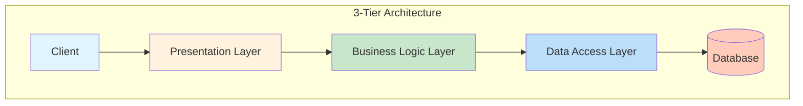
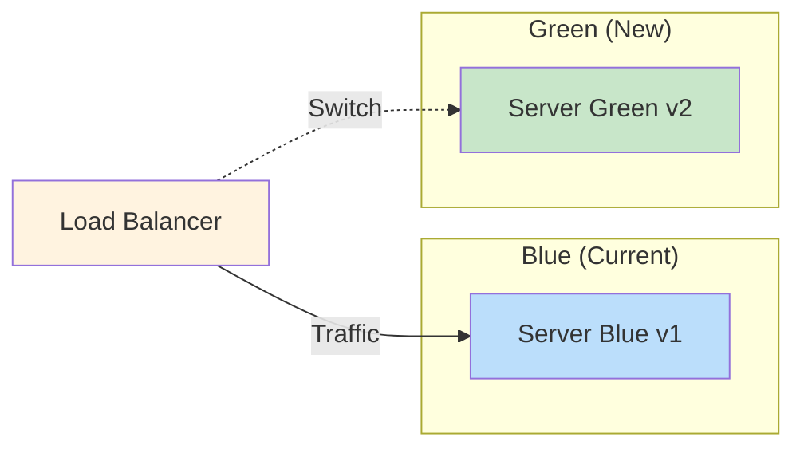
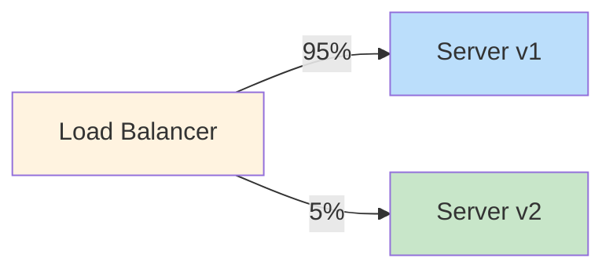

# 04. Production Architecture & Deployment

## 🎯 Tujuan

Setelah sesi ini, kamu mampu:

- Memahami arsitektur aplikasi production (N-tier, microservices, monolith)
- Memilih strategi deployment: **CI/CD**, **blue-green**, **canary**, **rolling**
- Setup production server dengan **reverse proxy (Nginx)**
- Menerapkan **API Gateway patterns** untuk skalabilitas
- Mengefektifkan **caching strategies** di berbagai layer
- Mengoptimalkan performa dengan **load balancing**

---

## 1. Arsitektur Aplikasi

### Monolith

Semua kode dalam satu aplikasi.

```
myapp/
├── controllers/
├── services/
├── models/
├── middleware/
├── public/
└── server.ts
```

| Pro | Kontra |
|-----|--------|
| Sederhana, deploy 1 file | Scale = scale semua (boros) |
| Testing gampang | Tech stack kaku |
| Latency rendah (in-process) | Codebase makin gede, onboarding susah |

### N-Tier

Lapisan terpisah (presentation, business, data).



### Microservices

Setiap fitur/fungsi jadi service sendiri.

```mermaid
graph TD
    A[Client] --> B[API Gateway]
    B --> C[User Service]
    B --> D[Product Service]
    B --> E[Order Service]
    B --> F[Payment Service]
    C --> G[(User DB)]
    D --> H[(Product DB)]
    E --> I[(Order DB)]
    F --> J[(Payment DB)]
    style B fill:#fff3e0
    style C fill:#e1bee7
    style D fill:#c8e6c9
    style E fill:#bbdefb
    style F fill:#ffccbc
```



| Pro | Kontra |
|-----|--------|
| Scale per service | Kompleksitas tinggi |
| Tech stack bebas | Network latency |
| Isolasi error | Testing integrasi susah |
| Team bisa independent | Butuh DevOps mumpuni |

---

## 2. Reverse Proxy — Nginx

Nginx sebagai gerbang depan: handle SSL, static files, load balancing, caching.

```nginx
# /etc/nginx/sites-available/myapp
server {
    listen 80;
    server_name myapp.com www.myapp.com;
    return 301 https://$server_name$request_uri;  # Force HTTPS
}

server {
    listen 443 ssl http2;
    server_name myapp.com;

    ssl_certificate /etc/letsencrypt/live/myapp.com/fullchain.pem;
    ssl_certificate_key /etc/letsencrypt/live/myapp.com/privkey.pem;

    # Static files — langsung dari Nginx (gak perlu sentuh Node)
    location /static/ {
        alias /var/www/myapp/static/;
        expires 1y;
        add_header Cache-Control "public, immutable";
    }

    # API proxy ke Node.js
    location /api/ {
        proxy_pass http://localhost:3000;
        proxy_http_version 1.1;
        proxy_set_header Upgrade $http_upgrade;
        proxy_set_header Connection 'upgrade';
        proxy_set_header Host $host;
        proxy_set_header X-Real-IP $remote_addr;
        proxy_set_header X-Forwarded-For $proxy_add_x_forwarded_for;
        proxy_cache_bypass $http_upgrade;

        # Rate limiting
        limit_req zone=api burst=20 nodelay;
    }

    # SPA fallback — semua route selain di atas kasih ke index.html
    location / {
        proxy_pass http://localhost:3000;
        proxy_set_header Host $host;
    }
}
```

### Rate Limiting dengan Nginx

```nginx
http {
    # Define rate limit zone
    limit_req_zone $binary_remote_addr zone=api:10m rate=10r/s;
    limit_req_zone $binary_remote_addr zone=login:10m rate=5r/m;

    server {
        location /api/ {
            limit_req zone=api burst=20 nodelay;
            proxy_pass http://backend;
        }

        location /api/login {
            limit_req zone=login burst=3 nodelay;
            proxy_pass http://backend;
        }
    }
}
```

### Load Balancing dengan Nginx

```nginx
upstream backend {
    least_conn;  # Kirim ke server dengan koneksi paling sedikit
    server 127.0.0.1:3001 weight=3;  # Bobot 3 — dapet traffic 3x lipat
    server 127.0.0.1:3002 weight=1;
    server 127.0.0.1:3003 backup;    # Cuma dipake kalo yang lain mati
}

server {
    location / {
        proxy_pass http://backend;
    }
}
```

---

## 3. Deployment Strategy

### Blue-Green Deployment

Dua environment identik (blue = production, green = staging). Switch kapan aja.



```
✅ Kelebihan: rollback instant (tinggal switch balik)
❌ Kekurangan: perlu 2x resource
```

### Canary Deployment

Versi baru dikasih ke sebagian kecil user dulu.



```
✅ Kelebihan: detect issues sebelum semua kena
❌ Kekurangan: monitoring harus detil
```

### Rolling Deployment

Update server satu per satu.

```
Server 1: [===update===]   [running v2]   [running v2]   [running v2]
Server 2: [running v1]   [===update===]   [running v2]   [running v2]
Server 3: [running v1]   [running v1]    [===update===]   [running v2]
```

```
✅ Kelebihan: nol downtime, gak perlu resource double
❌ Kekurangan: selama update, ada 2 versi jalan barengan
```

---

## 4. API Gateway Patterns

API Gateway sebagai single entry point dengan berbagai fungsi:

### Pattern 1: Gateway Routing

```typescript
// API Gateway sederhana dengan routing
import express from 'express';
import { createProxyMiddleware } from 'http-proxy-middleware';

const gateway = express();

// Service registry — mapping path ke URL service
const services = {
  users: 'http://user-service:3001',
  products: 'http://product-service:3002',
  orders: 'http://order-service:3003',
};

// Dynamic routing
Object.entries(services).forEach(([name, target]) => {
  gateway.use(`/api/${name}`, createProxyMiddleware({
    target,
    changeOrigin: true,
    pathRewrite: { [`^/api/${name}`]: '' },
  }));
});
```

### Pattern 2: Gateway Aggregation

Gateway fetch dari beberapa service, gabung response-nya:

```typescript
// Aggregasi: /api/user-dashboard
app.get('/api/user-dashboard', async (req, res) => {
  const userId = req.user.id;
  
  // Parallel fetch
  const [profile, orders, notifications] = await Promise.all([
    fetch(`http://user-service/users/${userId}`).then(r => r.json()),
    fetch(`http://order-service/orders?userId=${userId}`).then(r => r.json()),
    fetch(`http://notif-service/notifications?userId=${userId}`).then(r => r.json()),
  ]);
  
  res.json({
    profile,
    orders: orders.slice(0, 5),
    notifications: notifications.slice(0, 10),
  });
});
```

### Pattern 3: Gateway Offloading

Gateway handle cross-cutting concerns:

```
Authentication    → Gateway verifikasi JWT sebelum proxy
Rate Limiting     → Gateway batasi request per client
Caching           → Gateway cache response umum
Logging           → Gateway log semua request
SSL Termination   → Gateway handle HTTPS
```

---

## 5. Caching Strategy — Multi Layer

### Layer 1: CDN Cache

```
Static assets (CSS/JS/images):
  Cache-Control: public, max-age=31536000, immutable

HTML pages:
  Cache-Control: public, max-age=300 (5 menit)
  
API responses:
  Cache-Control: public, max-age=60 (1 menit) — kalo public
  Cache-Control: private, no-cache — kalo user-specific
```

### Layer 2: Application Cache (Redis/Memcached)

```typescript
// Redis cache pattern
import Redis from 'ioredis';

const redis = new Redis();

async function getProducts() {
  const cacheKey = 'products:list';
  
  // 1. Cek cache dulu
  const cached = await redis.get(cacheKey);
  if (cached) {
    return JSON.parse(cached);
  }
  
  // 2. Cache miss — query database
  const products = await db.query('SELECT * FROM products');
  
  // 3. Simpan ke cache (expire 5 menit)
  await redis.set(cacheKey, JSON.stringify(products), 'EX', 300);
  
  return products;
}
```

### Layer 3: Database Cache

```sql
-- MySQL query cache (legacy)
SET GLOBAL query_cache_size = 134217728; -- 128MB
SET GLOBAL query_cache_type = 1;

-- PostgreSQL — index yang tepat buat cache implicit
CREATE INDEX idx_products_category ON products(category_id);
-- Query plan pake index → lebih cepet
```

### Cache Invalidation Strategies

| Strategy | Cara | Contoh |
|----------|------|--------|
| **TTL** | Expire otomatis setelah waktu tertentu | Redis EX |
| **Write-through** | Update cache pas nulis ke DB | Set cache setelah INSERT |
| **Write-behind** | Update cache + DB async (cek dulu) | Queue-based |
| **Cache-aside** | App manage cache sendiri | Pattern `getCache → miss → query → setCache` |
| **Stale-while-revalidate** | Serve cache lama, refresh di background | `stale-while-revalidate=86400` |

---

## 6. Production Deployment Flow

### GitHub Actions → Docker → Server

```yaml
name: Deploy to Production

on:
  push:
    branches: [main]

jobs:
  deploy:
    runs-on: ubuntu-latest
    steps:
      - uses: actions/checkout@v4
      
      - name: Build Docker image
        run: docker build -t myapp:${{ github.sha }} .
      
      - name: Push to registry
        run: docker push registry.example.com/myapp:${{ github.sha }}
      
      - name: Deploy via SSH
        uses: appleboy/ssh-action@v1
        with:
          host: ${{ secrets.SERVER_HOST }}
          username: ${{ secrets.SERVER_USER }}
          key: ${{ secrets.SSH_KEY }}
          script: |
            docker pull registry.example.com/myapp:${{ github.sha }}
            docker stop myapp || true
            docker rm myapp || true
            docker run -d --name myapp \
              -p 3000:3000 \
              --env-file .env \
              registry.example.com/myapp:${{ github.sha }}
```

### Docker Compose di Production

```yaml
version: '3.8'
services:
  app:
    build: .
    restart: always
    ports:
      - "3000:3000"
    environment:
      - NODE_ENV=production
      - DATABASE_URL=postgres://user:pass@db:5432/myapp
      - REDIS_URL=redis://redis:6379
    depends_on:
      - db
      - redis

  nginx:
    image: nginx:alpine
    ports:
      - "80:80"
      - "443:443"
    volumes:
      - ./nginx.conf:/etc/nginx/nginx.conf
      - ./ssl:/etc/nginx/ssl
    depends_on:
      - app

  db:
    image: postgres:16-alpine
    volumes:
      - postgres_data:/var/lib/postgresql/data
    environment:
      - POSTGRES_DB=myapp
      - POSTGRES_USER=myapp
      - POSTGRES_PASSWORD=${DB_PASSWORD}

  redis:
    image: redis:7-alpine
    volumes:
      - redis_data:/data

volumes:
  postgres_data:
  redis_data:
```

### Environment Variables di Production

```bash
# .env.production
NODE_ENV=production
PORT=3000
DATABASE_URL=postgres://user:pass@db:5432/myapp
REDIS_URL=redis://redis:6379
JWT_SECRET=${JWT_SECRET}        # dari secrets manager
NEXT_PUBLIC_API_URL=https://api.myapp.com
SENTRY_DSN=https://xxx@sentry.io/xxx
```

---

## 7. Monitoring & Observability

### Logging

```typescript
// Winston logger — structured JSON logs
import winston from 'winston';

const logger = winston.createLogger({
  level: process.env.NODE_ENV === 'production' ? 'info' : 'debug',
  format: winston.format.combine(
    winston.format.timestamp(),
    winston.format.json()
  ),
  transports: [
    new winston.transports.File({ filename: 'error.log', level: 'error' }),
    new winston.transports.File({ filename: 'combined.log' }),
  ],
});

// Di production, console.log diganti logger.info
app.use((req, res, next) => {
  logger.info({
    method: req.method,
    url: req.url,
    ip: req.ip,
    userAgent: req.headers['user-agent'],
  });
  next();
});
```

### Health Check

```typescript
// Endpoint health check — dicek oleh load balancer
app.get('/health', async (req, res) => {
  const health = {
    status: 'ok',
    timestamp: new Date(),
    uptime: process.uptime(),
    memory: process.memoryUsage(),
    database: await checkDatabase(),
    redis: await checkRedis(),
  };
  
  const isHealthy = health.database && health.redis;
  res.status(isHealthy ? 200 : 503).json(health);
});
```

### Metrics (Prometheus)

```typescript
import prometheus from 'prom-client';

// HTTP request counter
const httpRequestsTotal = new prometheus.Counter({
  name: 'http_requests_total',
  help: 'Total HTTP requests',
  labelNames: ['method', 'path', 'status'],
});

// Middleware
app.use((req, res, next) => {
  res.on('finish', () => {
    httpRequestsTotal.inc({
      method: req.method,
      path: req.route?.path || req.path,
      status: res.statusCode,
    });
  });
  next();
});

// Metrics endpoint
app.get('/metrics', async (req, res) => {
  res.set('Content-Type', prometheus.register.contentType);
  res.end(await prometheus.register.metrics());
});
```

---

## Rangkuman

| Konsep | Inti |
|--------|------|
| Arsitektur | Monolith → N-Tier → Microservices (sesuai skala) |
| Reverse Proxy | Nginx handle SSL, static, load balancing, rate limit |
| Deployment | Blue-green (instant rollback), Canary (risk reduction), Rolling (zero downtime) |
| API Gateway | Entry point: routing, aggregation, offloading |
| Caching | CDN → App (Redis) → DB — invalidate dengan TTL/write-through |
| Monitoring | Logging structured, health check, metrics Prometheus |

---

## Latihan

### 1. Setup Nginx
Setup Nginx sebagai reverse proxy untuk Node.js app di port 3000. Config:
- Static files dari `/var/www/myapp/static/`
- API proxy ke `localhost:3000`
- SPA fallback: semua route lain ke `index.html`
- HTTPS dengan Let's Encrypt

### 2. Blue-Green Deployment
Tulis script deploy blue-green untuk aplikasi Node.js. 2 folder: `blue/` dan `green/`. Switch symlink `current -> blue/green`. Restart PM2.

### 3. Docker Compose Production
Bikin docker-compose.yml dengan service: app (Node.js), nginx, postgres, redis. Volume persistent untuk DB. Environment dari file .env.

### 4. API Gateway Pattern
Implementasi API Gateway Express yang:
- Routing ke user-service dan product-service via proxy
- Aggregation endpoint `/api/dashboard` (gabung profile + orders)
- Rate limiting per client IP (100 req/min)
- Logging semua request

### 5. Redis Cache Layer
Buat cache layer pake Redis untuk endpoint `GET /api/products`:
- Cek cache dulu (key: `products:all`)
- Cache miss → query DB → set cache (TTL 300s)
- Invalidate cache pas POST/PUT/DELETE products
- Test performance dengan dan tanpa cache

### 6. Production Checklist
Buat production readiness checklist untuk deploy app Express:
- Security: Helmet, CORS, rate limit, input sanitasi
- Performance: Compression, caching, minification
- Reliability: PM2/cluster mode, health check, graceful shutdown
- Monitoring: Logging, metrics, error tracking (Sentry)

### 7. Monitoring Setup
Integrasi Prometheus client ke Express app. Expose `/metrics` endpoint. Tambah metrics:
- HTTP request counter (method, path, status)
- HTTP request duration histogram
- Database query duration
- Active connections gauge

### 8. CI/CD Pipeline
Buat GitHub Actions workflow:
- Test on PR to main
- Build Docker image
- Push ke Docker registry
- Deploy via SSH ke VPS dengan rolling update
