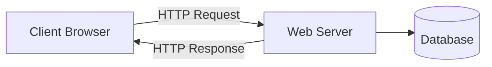

# 🧠 Cheatsheet: Web Architecture

> Referensi cepet — 1 halaman.

## Topik Utama

**How Web Works:** Client (browser) → DNS lookup → TCP connection → HTTP request → Server processing → HTTP response → Browser renders

**Client vs Server:**
- **Client:** Browser, mobile app — fetch data, render UI
- **Server:** Apache, Nginx, Node.js — process request, return response

**DNS:** Domain → IP resolution. `nslookup`, `dig` untuk cek.

**HTTP:** Request-Response protocol. Stateless, text-based.

**HTTP Methods:** GET (read), POST (create), PUT (replace), PATCH (update), DELETE (remove)

**HTTP Status Codes:**
- 2xx: Success (200 OK, 201 Created, 204 No Content)
- 3xx: Redirect (301 Moved, 304 Not Modified)
- 4xx: Client Error (400 Bad Request, 401 Unauthorized, 403 Forbidden, 404 Not Found)
- 5xx: Server Error (500 Internal, 502 Bad Gateway, 503 Service Unavailable)

**API & REST:** Resource-based URLs, JSON format, stateless

**Hosting Types:** Static (GitHub Pages, Vercel), Backend (Railway, DigitalOcean), Database (Supabase, PlanetScale)

**DNS:** Domain name → IP address. DNS providers: Cloudflare, Route 53.

## Command / Sintaks Penting

```bash
# DNS lookup
nslookup google.com
dig google.com +short
curl -v https://example.com  # verbose headers

# Test API endpoint
curl -X GET https://api.example.com/users
curl -X POST https://api.example.com/users \
  -H "Content-Type: application/json" \
  -d '{"name":"Budi","email":"budi@test.com"}'

# Check HTTP response
curl -I https://example.com  # headers only
curl -s -o /dev/null -w "%{http_code}" https://example.com  # status code only
```



```yaml
# GitHub Pages deploy (static site)
# Set in repo Settings > Pages > Source: main branch
# Site available at: https://username.github.io/repo-name/
```

## Tips & Trik

- **`curl -v`** untuk debug HTTP request/response headers
- **Browser DevTools (F12)** — Network tab untuk inspect requests, Console untuk JS errors
- **Mermaid** untuk bikin architecture diagram (di GitHub/Notion render otomatis)
- **Static hosting** untuk landing pages: Vercel, Netlify, GitHub Pages (gratis)
- **`http://` vs `https://`** — HTTPS wajib untuk production (SSL/TLS)
- **API testing:** Postman atau `curl` untuk test endpoints
- **`host` header** di HTTP request = domain yang diminta

## Common Mistakes

- **Confusing client & server** — client = browser, server = backend
- **Status code 200 for errors** — selalu pake status code yang tepat (4xx/5xx)
- **No `Content-Type` header** di POST/PUT — server gak tau format data
- **DNS propagation** — DNS update butuh waktu, gak instan
- **Mixing HTTP & HTTPS** — mixed content block di browser
- **No CORS config** — browser block cross-origin requests
- **Confusing backend hosting dengan database hosting** — mereka berbeda

## Link Cepat

- [Module README](README.md)
- [Quiz](quiz.md)
