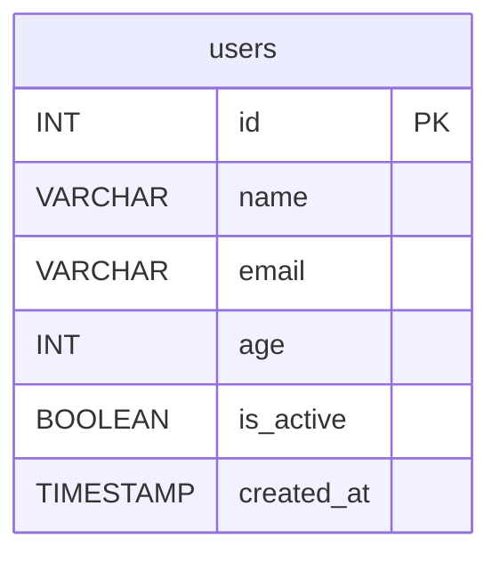

# 1.1 What is Database?

## Database vs Spreadsheet

Bayangin spreadsheet vs database sebagai tempat nyimpen data:

| Aspek | Spreadsheet (Excel/Google Sheets) | Database (PostgreSQL/MySQL) |
|-------|-----------------------------------|---------------------------|
| **Struktur** | Sel, baris, kolom di 1 file | Table, row, column — banyak table saling terhubung |
| **Relasi** | Manual pake VLOOKUP | Pake foreign key & JOIN |
| **Skalabilitas** | Ribuan baris mulai lemot | Jutaan baris masih cepat |
| **Multi-user** | Rentan conflict | ACID transaction, concurrent safe |
| **Validasi** | Manual | Constraint (NOT NULL, UNIQUE, CHECK) |
| **Query** | Filter/sort manual | SQL — SELECT, WHERE, JOIN, GROUP BY |
| **Keamanan** | Password file | Role-based access control |

**Kapan pake spreadsheet:** Data kecil, ad-hoc, analisis cepat, satu orang.
**Kapan pake database:** Data besar, multi-user, butuh konsistensi, aplikasi production.

---

## DBMS Types

DBMS (Database Management System) — software buat manage database.

### Relational Database (SQL)

Data disimpan dalam table dengan hubungan (relationship) antar table.

| DBMS | Cocok Untuk | Kelebihan |
|------|-------------|-----------|
| **PostgreSQL** | Aplikasi kompleks, geolocation, analytics | Fitur lengkap, open source, extensible |
| **MySQL** | Web app, CMS, e-commerce | Populer, performa tinggi, banyak hosting support |
| **SQLite** | Mobile app, embedded, prototyping | Serverless, file-based, zero config |

```sql
-- Semua pake SQL — beda sedikit di syntax
-- PostgreSQL
CREATE TABLE users (
    id SERIAL PRIMARY KEY,
    name VARCHAR(100) NOT NULL,
    created_at TIMESTAMP DEFAULT NOW()
);

-- MySQL
CREATE TABLE users (
    id INT AUTO_INCREMENT PRIMARY KEY,
    name VARCHAR(100) NOT NULL,
    created_at TIMESTAMP DEFAULT CURRENT_TIMESTAMP
);

-- SQLite
CREATE TABLE users (
    id INTEGER PRIMARY KEY AUTOINCREMENT,
    name TEXT NOT NULL,
    created_at TEXT DEFAULT (datetime('now'))
);
```

### NoSQL Database

Data tidak pakai table kaku — lebih fleksibel buat use case tertentu.

| DBMS | Model Data | Cocok Untuk |
|------|------------|-------------|
| **MongoDB** | Document (JSON-like) | Data fleksibel, prototyping cepat |
| **Redis** | Key-value | Cache, session store, realtime |
| **Firebase** | Document + Realtime | Mobile app, sync cepat |

```
// MongoDB — document dalam collection
{
    "_id": ObjectId("..."),
    "name": "Budi",
    "email": "budi@email.com",
    "orders": ["order1", "order2"]  // array reference
}
```

> **Rule of thumb:** Kalau data punya relasi jelas (user punya order, order punya items) → pakai SQL. Kalau data dokumen fleksibel (blog post, config) → NoSQL opsi. Di modul ini kita fokus ke **relational database (PostgreSQL/SQLite)**.

---

## Table Structure

Table di database mirip spreadsheet — tapi lebih strict.



### Row vs Column vs Field vs Record

| Istilah | Arti | Analogi |
|---------|------|---------|
| **Table** | Kumpulan data dengan struktur sama | File Excel |
| **Row / Record** | Satu baris data | Satu baris di spreadsheet |
| **Column / Field** | Satu atribut data | Satu kolom di spreadsheet |
| **Schema** | Definisi struktur table | Header kolom |

```
Table: users
+----+------+------------------+-----+-----------+---------------------------+
| id | name | email            | age | is_active | created_at                |
+----+------+------------------+-----+-----------+---------------------------+
| 1  | Budi | budi@email.com   | 25  | true      | 2024-01-15 10:30:00+07   |  ← row/record
| 2  | Ani  | ani@email.com    | 30  | true      | 2024-01-16 14:00:00+07   |
+----+------+------------------+-----+-----------+---------------------------+
     ↑      ↑                  ↑
   field  field              field
```

---

## Data Types

Setiap column harus punya tipe data. Ini constraint pertama — data nyangkut.

### Tipe Data SQL Lengkap

| Tipe Data | Contoh | Ukuran | Kegunaan |
|-----------|--------|--------|----------|
| `INTEGER` / `INT` | `25`, `-10`, `1000000` | 4 bytes | Angka bulat — id, umur, quantity |
| `BIGINT` | `99999999999` | 8 bytes | Angka besar — log ID, counter |
| `SMALLINT` | `100`, `-5` | 2 bytes | Angka kecil — rating 1-5 |
| `VARCHAR(n)` | `'Budi'`, `'Jakarta'` | Variabel | Teks pendek — nama, email, alamat |
| `TEXT` | Laporan panjang (>255 char) | Variabel | Teks panjang — deskripsi, konten artikel |
| `BOOLEAN` | `true`, `false` | 1 bit | Yes/no — is_active, is_verified |
| `DATE` | `'2024-01-15'` | 4 bytes | Tanggal tanpa waktu — tanggal lahir |
| `TIMESTAMP` | `'2024-01-15 10:30:00'` | 8 bytes | Tanggal + waktu — created_at, updated_at |
| `FLOAT` / `REAL` | `3.14`, `0.001` | 4 bytes | Angka desimal presisi rendah — rating |
| `DECIMAL(p,s)` / `NUMERIC` | `150000.50` | Variabel | Uang — harga, gaji (presisi tepat) |
| `UUID` | `'550e8400-...'` | 16 bytes | ID unik global — user_id, order_id |
| `JSON` / `JSONB` | `'{"key":"val"}'` | Variabel | Data semi-struktur — metadata, config |

**Penting:**
- `VARCHAR(255)` vs `TEXT` — VARCHAR bisa di-index penuh, TEXT di-index partial. Buat pencarian exact, VARCHAR lebih cepet.
- `FLOAT` vs `DECIMAL` — Jangan pake FLOAT buat uang! FLOAT punya rounding error. `DECIMAL(10,2)` = 10 digit total, 2 desimal.
- `TIMESTAMP WITH TIME ZONE` — Selalu pake ini, bukan `TIMESTAMP` biasa. Simpan di UTC, format di aplikasi.

```sql
-- Contoh CREATE TABLE dengan berbagai tipe data
CREATE TABLE products (
    id SERIAL PRIMARY KEY,
    name VARCHAR(200) NOT NULL,
    description TEXT,
    price DECIMAL(10, 2) NOT NULL,
    stock INT DEFAULT 0,
    is_active BOOLEAN DEFAULT true,
    category VARCHAR(50),
    created_at TIMESTAMP WITH TIME ZONE DEFAULT NOW(),
    updated_at TIMESTAMP WITH TIME ZONE DEFAULT NOW()
);
```

---

## Primary Key & Auto Increment

**Primary Key (PK):** Column (atau kombinasi column) yang unik identify tiap row.

**Sifat PK:**
- `UNIQUE` — tidak boleh duplikat
- `NOT NULL` — wajib diisi
- Hanya satu PK per table

**Auto Increment / Serial —** Biarin database generate ID otomatis.

```sql
-- PostgreSQL — SERIAL (integer)
CREATE TABLE users (
    id SERIAL PRIMARY KEY,  -- otomatis 1, 2, 3, ...
    name VARCHAR(100)
);

-- PostgreSQL modern — IDENTITY (SQL standard)
CREATE TABLE users (
    id INT GENERATED ALWAYS AS IDENTITY PRIMARY KEY,
    name VARCHAR(100)
);

-- INSERT — gausah isi id, database handle sendiri
INSERT INTO users (name) VALUES ('Budi'), ('Ani');
-- id: 1, 2 otomatis
```

**Natural Key vs Surrogate Key:**

| Key Type | Contoh | Kelebihan | Kekurangan |
|----------|--------|-----------|------------|
| **Natural Key** | `email`, `NIK`, `ISBN` | Bermakna secara bisnis | Bisa berubah, panjang |
| **Surrogate Key** | `id SERIAL`, `UUID` | Stabil, sederhana | Tidak bermakna |

> **Best practice:** Selalu pake surrogate key (`id SERIAL` atau `UUID`) sebagai primary key. Natural key jadi UNIQUE constraint aja.

```sql
CREATE TABLE users (
    id UUID PRIMARY KEY DEFAULT gen_random_uuid(),  -- UUID
    email VARCHAR(255) UNIQUE NOT NULL,             -- natural key jadi unique
    name VARCHAR(100)
);
```

---

## Tools

Tools buat interaksi sama database:

| Tool | Tipe | Kegunaan |
|------|------|----------|
| **pgAdmin** | GUI | PostgreSQL admin — query, manage, visual |
| **DBeaver** | GUI | Universal — support banyak DBMS |
| **TablePlus** | GUI | Modern, fast — macOS/Linux/Windows |
| **Prisma Studio** | GUI | Visual data browser buat Prisma ORM |
| **psql** | CLI | PostgreSQL native CLI |
| **SQLite Browser** | GUI | Explore SQLite file |
| **VS Code SQL Tools** | Extension | Query langsung dari editor |

---

## Latihan

**Latihan 1: Database vs Spreadsheet**
Bikin tabel perbandingan: kapan lebih baik pake spreadsheet, kapan pake database. Minimal 3 skenario masing-masing.

**Latihan 2: Identifikasi DBMS**
Dari skenario berikut, tentuin DBMS yang paling cocok dan jelaskan kenapa:
1. Aplikasi POS toko kelontong dengan 5 kasir
2. Blog pribadi dengan 10 artikel/bulan
3. Aplikasi chat realtime jutaan user
4. IoT sensor logger — ribuan data per detik
5. Aplikasi mobile catatan offline

**Latihan 3: Desain Table & Tipe Data**
Kamu diminta bikin table `students` buat sistem sekolah. Tentukan column dan tipe data yang tepat untuk:
- Nama lengkap
- Tanggal lahir
- NISN (nomor induk)
- Nilai rata-rata (bisa pecahan)
- Status aktif/tidak
- Alamat (bisa panjang)
- Tanggal daftar
- Nomor telepon

Tulis dalam bentuk `CREATE TABLE` SQL.

**Latihan 4: Primary Key Decision**
Dari table berikut, tentukan primary key yang tepat (natural vs surrogate) dan jelaskan:
1. Table `books` di perpustakaan — punya ISBN
2. Table `employees` — punya NIK dan email
3. Table `transactions` — transaksi harian ribuan
4. Table `categories` — hanya 10 kategori statis
