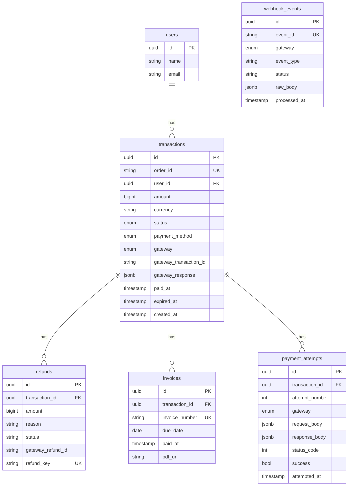
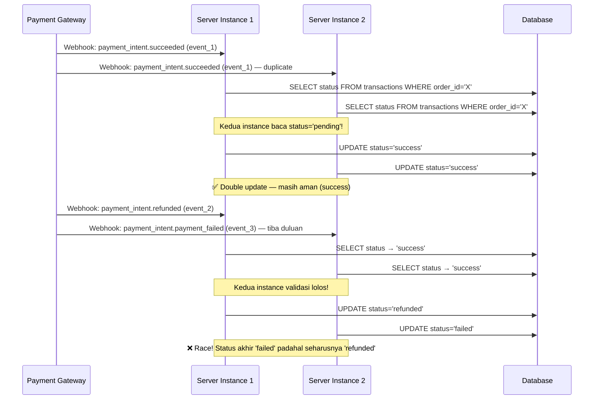

# Sesi 04: Production Payment

> **Tujuan:** Merancang database payment yang robust, handle idempotency & race condition, implementasi retry & reconciliation, webhook timeout & retry pattern, dan memahami PCI compliance.

## 📖 Materi

### 1. Payment Database Schema

Schema database untuk sistem payment yang production-ready.

#### 1.1 Migration SQL

```sql
-- migrations/001_create_payment_tables.sql

-- Enum untuk status transaksi
CREATE TYPE transaction_status AS ENUM (
  'pending',
  'success',
  'failed',
  'expired',
  'refunded',
  'partial_refund'
);

-- Enum untuk payment method
CREATE TYPE payment_method AS ENUM (
  'credit_card',
  'bank_transfer',
  'virtual_account',
  'qris',
  'gopay',
  'shopeepay',
  'invoice'
);

-- Enum untuk gateway
CREATE TYPE payment_gateway AS ENUM (
  'midtrans',
  'xendit',
  'stripe'
);

-- Tabel utama: transactions
CREATE TABLE transactions (
  id UUID PRIMARY KEY DEFAULT gen_random_uuid(),
  order_id VARCHAR(100) NOT NULL UNIQUE,
  user_id UUID NOT NULL REFERENCES users(id),
  amount BIGINT NOT NULL,              -- dalam sen (IDR 15000 = 1500000)
  currency VARCHAR(3) NOT NULL DEFAULT 'IDR',
  status transaction_status NOT NULL DEFAULT 'pending',
  payment_method payment_method,
  gateway payment_gateway NOT NULL,
  gateway_transaction_id VARCHAR(255),
  gateway_response JSONB,              -- raw response dari gateway
  paid_at TIMESTAMP WITH TIME ZONE,
  expired_at TIMESTAMP WITH TIME ZONE,
  created_at TIMESTAMP WITH TIME ZONE NOT NULL DEFAULT NOW(),
  updated_at TIMESTAMP WITH TIME ZONE NOT NULL DEFAULT NOW()
);

-- Tabel: refunds
CREATE TABLE refunds (
  id UUID PRIMARY KEY DEFAULT gen_random_uuid(),
  transaction_id UUID NOT NULL REFERENCES transactions(id),
  amount BIGINT NOT NULL,
  reason TEXT NOT NULL,
  status VARCHAR(20) NOT NULL DEFAULT 'pending',  -- pending, success, failed
  gateway_refund_id VARCHAR(255),
  refund_key VARCHAR(255) UNIQUE,      -- idempotency key untuk refund
  created_at TIMESTAMP WITH TIME ZONE NOT NULL DEFAULT NOW(),
  updated_at TIMESTAMP WITH TIME ZONE NOT NULL DEFAULT NOW()
);

-- Tabel: invoices (untuk Xendit Invoice / manual invoice)
CREATE TABLE invoices (
  id UUID PRIMARY KEY DEFAULT gen_random_uuid(),
  transaction_id UUID NOT NULL REFERENCES transactions(id),
  invoice_number VARCHAR(50) NOT NULL UNIQUE,
  due_date DATE NOT NULL,
  paid_at TIMESTAMP WITH TIME ZONE,
  pdf_url TEXT,
  notes TEXT,
  created_at TIMESTAMP WITH TIME ZONE NOT NULL DEFAULT NOW()
);

-- Tabel: webhook_events (idempotency + audit trail)
CREATE TABLE webhook_events (
  id UUID PRIMARY KEY DEFAULT gen_random_uuid(),
  event_id VARCHAR(255) NOT NULL UNIQUE,
  gateway payment_gateway NOT NULL,
  event_type VARCHAR(100) NOT NULL,
  status VARCHAR(20) NOT NULL DEFAULT 'received',  -- received, processing, processed, failed
  raw_body JSONB,
  processed_at TIMESTAMP WITH TIME ZONE,
  error_message TEXT,
  created_at TIMESTAMP WITH TIME ZONE NOT NULL DEFAULT NOW()
);

-- Tabel: payment_attempts (retry log)
CREATE TABLE payment_attempts (
  id UUID PRIMARY KEY DEFAULT gen_random_uuid(),
  transaction_id UUID NOT NULL REFERENCES transactions(id),
  attempt_number INT NOT NULL DEFAULT 1,
  gateway payment_gateway NOT NULL,
  request_body JSONB,
  response_body JSONB,
  status_code INT,
  success BOOLEAN NOT NULL DEFAULT false,
  error_message TEXT,
  attempted_at TIMESTAMP WITH TIME ZONE NOT NULL DEFAULT NOW()
);

-- === INDEXES ===
CREATE INDEX idx_transactions_order_id ON transactions(order_id);
CREATE INDEX idx_transactions_user_id ON transactions(user_id);
CREATE INDEX idx_transactions_status ON transactions(status);
CREATE INDEX idx_transactions_gateway_tx_id ON transactions(gateway_transaction_id);
CREATE INDEX idx_transactions_paid_at ON transactions(paid_at);

CREATE INDEX idx_refunds_transaction_id ON refunds(transaction_id);
CREATE INDEX idx_refunds_refund_key ON refunds(refund_key);

CREATE INDEX idx_webhook_events_event_id ON webhook_events(event_id);
CREATE INDEX idx_webhook_events_gateway ON webhook_events(gateway);
CREATE INDEX idx_webhook_events_status ON webhook_events(status);

CREATE INDEX idx_payment_attempts_transaction_id ON payment_attempts(transaction_id);

-- Trigger untuk auto-update updated_at
CREATE OR REPLACE FUNCTION update_updated_at_column()
RETURNS TRIGGER AS $$
BEGIN
    NEW.updated_at = NOW();
    RETURN NEW;
END;
$$ language 'plpgsql';

CREATE TRIGGER update_transactions_updated_at
    BEFORE UPDATE ON transactions
    FOR EACH ROW
    EXECUTE FUNCTION update_updated_at_column();

CREATE TRIGGER update_refunds_updated_at
    BEFORE UPDATE ON refunds
    FOR EACH ROW
    EXECUTE FUNCTION update_updated_at_column();
```

#### 1.2 Entity Relationship Diagram



### 2. Idempotency & Race Condition

#### 2.1 Race Condition di Webhook

Webhook bisa tiba bersamaan dari gateway, atau Stripe retry mengirim event yang sama.



#### 2.2 Solusi: Optimistic Lock + Atomic Update

```javascript
// services/payment-update.js
const pool = require('../config/database');

class PaymentUpdateService {
  /**
   * Update status transaksi dengan optimistic lock
   * Menggunakan WHERE clause dengan current_status untuk mencegah race
   */
  async updateTransactionStatus(orderId, newStatus, expectedStatus) {
    const client = await pool.connect();

    try {
      await client.query('BEGIN');

      // Atomic update — hanya update jika status masih expected
      const result = await client.query(
        `UPDATE transactions
         SET status = $1, updated_at = NOW()
         WHERE order_id = $2 AND status = $3
         RETURNING id, status, order_id`,
        [newStatus, orderId, expectedStatus]
      );

      if (result.rows.length === 0) {
        // Status sudah berubah — kemungkinan race condition
        const current = await client.query(
          `SELECT status FROM transactions WHERE order_id = $1`,
          [orderId]
        );

        await client.query('COMMIT');

        return {
          updated: false,
          currentStatus: current.rows[0]?.status,
          message: `Status conflict: expected ${expectedStatus}, current ${current.rows[0]?.status}`,
        };
      }

      await client.query('COMMIT');

      return {
        updated: true,
        currentStatus: newStatus,
      };
    } catch (error) {
      await client.query('ROLLBACK');
      throw error;
    } finally {
      client.release();
    }
  }

  /**
   * Webhook handler dengan idempotency + race condition protection
   */
  async handleWebhookEvent(eventId, gateway, processFn) {
    const client = await pool.connect();

    try {
      await client.query('BEGIN');

      // Atomic insert — skip jika event sudah diproses
      const insertResult = await client.query(
        `INSERT INTO webhook_events (event_id, gateway, status)
         VALUES ($1, $2, 'processing')
         ON CONFLICT (event_id) DO UPDATE
           SET status = webhook_events.status
           WHERE webhook_events.status = 'processed'
         RETURNING status`,
        [eventId, gateway]
      );

      const currentStatus = insertResult.rows[0].status;

      // Jika sudah processed, skip
      if (currentStatus === 'processed') {
        await client.query('COMMIT');
        return { duplicate: true };
      }

      // Eksekusi handler dengan transaksi yang sama
      await processFn(client);

      // Tandai selesai
      await client.query(
        `UPDATE webhook_events SET status = 'processed', processed_at = NOW()
         WHERE event_id = $1`,
        [eventId]
      );

      await client.query('COMMIT');
      return { duplicate: false };
    } catch (error) {
      await client.query('ROLLBACK');
      throw error;
    } finally {
      client.release();
    }
  }
}

module.exports = new PaymentUpdateService();
```

#### 2.3 Penggunaan

```javascript
// routes/webhook.js — Stripe webhook dengan race protection
router.post('/stripe', verifyStripe, async (req, res) => {
  const event = req.stripeEvent;

  await paymentUpdate.handleWebhookEvent(
    event.id,
    'stripe',
    async (client) => {
      // Di sini kita sudah dalam transaksi yang sama
      // Semua query aman dari race condition
      
      if (event.type === 'checkout.session.completed') {
        const session = event.data.object;
        const orderId = session.metadata.order_id;

        // Atomic update dengan optimistic lock
        const result = await client.query(
          `UPDATE transactions
           SET status = 'success',
               gateway_transaction_id = $2,
               paid_at = NOW(),
               updated_at = NOW()
           WHERE order_id = $1 AND status = 'pending'
           RETURNING id`,
          [orderId, session.payment_intent]
        );

        if (result.rows.length === 0) {
          throw new Error(`Order ${orderId} sudah diupdate atau tidak ditemukan`);
        }
      }
    }
  );

  res.json({ received: true });
});
```

### 3. Retry & Reconciliation

#### 3.1 Payment Attempt Retry Pattern

```javascript
// services/retry-payment.js
const pool = require('../config/database');
const { stripe } = require('../config/stripe');
const { coreApi } = require('../config/midtrans');

const MAX_RETRIES = 3;
const RETRY_DELAYS = [60, 300, 900]; // 1 menit, 5 menit, 15 menit (detik)

async function retryFailedPayment(transactionId) {
  const client = await pool.connect();

  try {
    // Ambil transaksi
    const txResult = await client.query(
      `SELECT * FROM transactions WHERE id = $1`,
      [transactionId]
    );
    const tx = txResult.rows[0];

    if (!tx) throw new Error('Transaksi tidak ditemukan');
    if (tx.status !== 'failed') throw new Error(`Status ${tx.status} — bukan failed`);

    // Cek jumlah attempt sebelumnya
    const attemptCount = await client.query(
      `SELECT COUNT(*) as count FROM payment_attempts
       WHERE transaction_id = $1 AND success = false`,
      [transactionId]
    );

    const attemptNumber = parseInt(attemptCount.rows[0].count) + 1;

    if (attemptNumber > MAX_RETRIES) {
      throw new Error(`Max retries reached (${MAX_RETRIES}) untuk ${transactionId}`);
    }

    // Delay sesuai attempt number
    const delay = RETRY_DELAYS[attemptNumber - 1] || RETRY_DELAYS[RETRY_DELAYS.length - 1];
    await new Promise(resolve => setTimeout(resolve, delay * 1000));

    // Coba charge ulang
    let chargeResult;
    if (tx.gateway === 'stripe') {
      chargeResult = await stripe.paymentIntents.create({
        amount: tx.amount,
        currency: tx.currency.toLowerCase(),
      });
    } else if (tx.gateway === 'midtrans') {
      chargeResult = await coreApi.charge({
        payment_type: 'bank_transfer',
        transaction_details: {
          order_id: tx.order_id,
          gross_amount: tx.amount / 100,
        },
      });
    }

    // Simpan attempt log
    await client.query(
      `INSERT INTO payment_attempts (transaction_id, attempt_number, gateway,
        response_body, status_code, success, attempted_at)
       VALUES ($1, $2, $3, $4, $5, $6, NOW())`,
      [transactionId, attemptNumber, tx.gateway,
       JSON.stringify(chargeResult), 200, true]
    );

    // Update status
    await client.query(
      `UPDATE transactions SET status = 'pending', updated_at = NOW()
       WHERE id = $1`,
      [transactionId]
    );

    return { retried: true, attemptNumber };
  } catch (error) {
    // Log failed attempt
    await client.query(
      `INSERT INTO payment_attempts (transaction_id, attempt_number, gateway,
        error_message, success, attempted_at)
       VALUES ($1, $2, $3, $4, false, NOW())`,
      [transactionId, (attemptNumber || 1), tx?.gateway, error.message]
    );
    throw error;
  } finally {
    client.release();
  }
}
```

#### 3.2 Reconciliation Cron Job

```javascript
// cron/reconciliation.js
const cron = require('node-cron');
const pool = require('../config/database');
const { coreApi } = require('../config/midtrans');
const { default: Stripe } = require('stripe');
const stripe = require('../config/stripe');

// Jalankan setiap jam
cron.schedule('0 * * * *', async () => {
  console.log('[Reconciliation] Starting...');
  const stats = { matched: 0, updated: 0, failed: 0, errors: [] };

  try {
    // Ambil transaksi pending > 1 jam dan hari ini
    const pendingTx = await pool.query(
      `SELECT * FROM transactions
       WHERE status = 'pending'
         AND created_at > NOW() - INTERVAL '24 hours'
         AND created_at < NOW() - INTERVAL '1 hour'
       ORDER BY created_at ASC
       LIMIT 50`
    );

    for (const tx of pendingTx.rows) {
      try {
        let gatewayStatus;

        // Cek status ke gateway
        if (tx.gateway === 'midtrans') {
          const response = await coreApi.transaction.status(tx.order_id);
          gatewayStatus = response.transaction_status;
        } else if (tx.gateway === 'stripe') {
          if (tx.gateway_transaction_id) {
            const pi = await stripe.paymentIntents.retrieve(tx.gateway_transaction_id);
            gatewayStatus = pi.status;
          }
        }

        // Map ke status internal
        const internalStatus = mapGatewayStatusToInternal(tx.gateway, gatewayStatus);

        if (internalStatus && internalStatus !== 'pending') {
          // Update jika berbeda
          await pool.query(
            `UPDATE transactions
             SET status = $1, updated_at = NOW(),
                 paid_at = CASE WHEN $1 = 'success' THEN NOW() ELSE paid_at END
             WHERE id = $2 AND status = 'pending'`,
            [internalStatus, tx.id]
          );

          stats.updated++;
          console.log(`[Reconciliation] ${tx.order_id}: pending → ${internalStatus}`);
        } else {
          stats.matched++;
        }
      } catch (txError) {
        stats.failed++;
        stats.errors.push({ order_id: tx.order_id, error: txError.message });
        console.error(`[Reconciliation] Error ${tx.order_id}:`, txError.message);
      }
    }

    console.log('[Reconciliation] Complete:', stats);
  } catch (error) {
    console.error('[Reconciliation] Fatal error:', error);
  }
});

function mapGatewayStatusToInternal(gateway, status) {
  const mapping = {
    midtrans: {
      settlement: 'success',
      capture: 'success',
      deny: 'failed',
      expire: 'expired',
      cancel: 'failed',
    },
    stripe: {
      succeeded: 'success',
      requires_payment_method: 'failed',
      canceled: 'failed',
    },
  };
  return mapping[gateway]?.[status] || null;
}
```

### 4. Webhook Timeout & Retry Pattern

Payment gateway biasanya punya timeout pendek untuk webhook (5-10 detik). Jika handler lama, gateway akan retry.

```javascript
// middleware/webhook-queue.js
const EventEmitter = require('events');

/**
 * Webhook queue — proses webhook secara async
 * Response langsung 200, proses di background
 * 
 * Cocok untuk:
 * - Handler yang perlu call external API lambat
 * - Kirim email/SMS notifikasi
 * - Generate invoice PDF
 */
class WebhookQueue extends EventEmitter {
  constructor() {
    super();
    this.queue = [];
    this.processing = false;
    this.maxConcurrent = 3;
    this.active = 0;
  }

  /**
   * Enqueue webhook untuk diproses async
   * Return 200 langsung agar gateway tidak retry
   */
  async enqueue(eventId, gateway, processFn) {
    const promise = new Promise((resolve, reject) => {
      this.queue.push({ eventId, gateway, processFn, resolve, reject });
    });

    this.processQueue();
    return promise;
  }

  async processQueue() {
    if (this.processing || this.active >= this.maxConcurrent) return;
    this.processing = true;

    while (this.queue.length > 0 && this.active < this.maxConcurrent) {
      const item = this.queue.shift();
      this.active++;

      // Proses tanpa await — biar concurrent
      item.processFn()
        .then((result) => {
          item.resolve(result);
          console.log(`[WebhookQueue] ${item.eventId} processed`);
        })
        .catch((error) => {
          item.reject(error);
          console.error(`[WebhookQueue] ${item.eventId} failed:`, error.message);
        })
        .finally(() => {
          this.active--;
          this.processQueue();
        });
    }

    this.processing = false;
  }
}

const webhookQueue = new WebhookQueue();

// Penggunaan di route
router.post('/stripe', verifyStripe, async (req, res) => {
  const event = req.stripeEvent;

  // Return 200 langsung — processing di background
  res.status(200).json({ received: true });

  // Queue processing
  webhookQueue.enqueue(event.id, 'stripe', async () => {
    await processStripeEvent(event);
  });
});
```

**Timeout Protection:**

```javascript
// utils/webhook-timeout.js
/**
 * Handler dengan timeout protection
 * Gateway timeout setelah 10 detik, jadi kita harus selesai < 5 detik
 */
async function processWithTimeout(promise, timeoutMs = 4000) {
  const timeout = new Promise((_, reject) =>
    setTimeout(() => reject(new Error('Webhook processing timeout')), timeoutMs)
  );

  try {
    return await Promise.race([promise, timeout]);
  } catch (error) {
    // Log untuk debug
    console.error('Webhook processing exceeded timeout:', error.message);
    // Jangan throw — gateway sudah return 200
    return { timeout: true };
  }
}

// Penggunaan
router.post('/stripe', verifyStripe, async (req, res) => {
  const event = req.stripeEvent;
  res.status(200).json({ received: true });

  processWithTimeout(processStripeEvent(event), 4000);
});
```

### 5. PCI Compliance Basics

#### 5.1 Apa itu PCI DSS?

**Payment Card Industry Data Security Standard** — standar keamanan untuk perusahaan yang memproses, menyimpan, atau mentransmisikan data kartu kredit.

#### 5.2 Yang BOLEH dan TIDAK BOLEH

| ✅ Boleh | ❌ Tidak Boleh |
|----------|---------------|
| Menyimpan 6 digit pertama + 4 digit terakhir kartu | Menyimpan full PAN (16 digit) |
| Menyimpan nama pemegang kartu | Menyimpan CVV/CVC |
| Menyimpan tanggal kadaluarsa | Menyimpan PIN |
| Menggunakan token dari payment gateway | Menyimpan track data dari magnetic stripe |
| Menyimpan alamat tagihan | Mengirim full PAN via email/chat |

#### 5.3 Best Practice untuk Aplikasi

```javascript
// services/pci-compliant.js
/**
 * 1. JANGAN PERNAH simpan data sensitif kartu
 * 
 * ❌ JANGAN:
 *   await db('cards').insert({
 *     full_pan: '4111111111111111',  // ❌
 *     cvv: '123',                     // ❌
 *     pin: '123456',                  // ❌
 *   });
 * 
 * ✅ BOLEH:
 *   await db('cards').insert({
 *     masked_pan: '411111xxxxxx1111', // ✅ — hanya 6+4 digit
 *     cardholder_name: 'Budi Santoso', // ✅
 *     expiry_month: 12,               // ✅
 *     expiry_year: 2027,              // ✅
 *     token: 'tok_xxx',               // ✅ — token dari gateway
 *   });
 */

/**
 * 2. Gunakan token dari payment gateway
 * 
 * Midtrans: token dari snap / core api
 * Stripe: token dari stripe.js / Elements
 * Xendit: token dari xendit-js
 */
async function chargeWithToken(gatewayToken, amount) {
  // Token sudah aman — tidak perlu simpan data kartu
  const charge = await stripe.paymentIntents.create({
    amount: amount * 100,
    currency: 'idr',
    payment_method: gatewayToken,
    confirm: true,
  });

  return charge;
}

/**
 * 3. Logging — jangan log data sensitif
 */
function safeLog(data) {
  const sensitiveFields = ['card_number', 'cvv', 'cvc', 'pin', 'password'];
  
  const sanitized = { ...data };
  for (const field of sensitiveFields) {
    if (sanitized[field]) {
      sanitized[field] = '***REDACTED***';
    }
  }

  console.log(JSON.stringify(sanitized));
}

/**
 * 4. Gunakan HTTPS — wajib
 *    (di handle oleh reverse proxy / load balancer)
 */
```

#### 5.4 SAQ (Self-Assessment Questionnaire)

Tergantung bagaimana kamu menerima pembayaran:

| Metode | SAQ Type | Scope |
|--------|----------|-------|
| Stripe Checkout (redirect) | SAQ A | Paling ringan — tidak sentuh data kartu |
| Stripe Elements (embedded) | SAQ A | Via iframe — tidak sentuh data kartu |
| Midtrans Snap (redirect/iframe) | SAQ A | Sama — via Snap UI |
| API langsung (collect card data) | SAQ D | Paling berat — harus compliance penuh |

> **Rekomendasi:** Selalu gunakan payment gateway yang handle UI pembayaran (Snap, Checkout Session, Elements). Dengan begitu aplikasi kamu tidak pernah menyentuh data kartu — SAQ A cukup.

## 🧪 Latihan

### Latihan 1: Database Migration

Buat dan jalankan migration:

1. Copy SQL migration ke file `migrations/001_create_payment_tables.sql`
2. Buat database PostgreSQL (pakai Docker: `docker run --name payment-db -e POSTGRES_PASSWORD=pass -p 5432:5432 -d postgres`)
3. Jalankan migration
4. Insert 1 transaksi test dengan INSERT
5. Query dan verifikasi semua tabel

**Output:** 5 tabel (transactions, refunds, invoices, webhook_events, payment_attempts) siap di PostgreSQL.

### Latihan 2: Idempotency + Race Condition Handler

Implementasi webhook handler dengan race protection:

1. Buat function `handleWebhookEvent(eventId, gateway, processFn)` dengan transaksi atomic
2. Gunakan `INSERT ... ON CONFLICT` untuk mencegah duplicate processing
3. Gunakan optimistic lock (`UPDATE ... WHERE status = 'pending'`) untuk update transaksi
4. Test dengan 2 concurrent request untuk event yang sama
5. Verifikasi hanya 1 yang diproses

**Output:** Webhook handler aman dari race condition. Event duplikat di-skip.

### Latihan 3: Reconciliation Cron

Buat cron job reconciliation:

1. Buat file `cron/reconciliation.js` dengan `node-cron`
2. Ambil transaksi status `pending` yang sudah > 1 jam
3. Cek status real ke payment gateway
4. Update di database jika berbeda
5. Log statistik (matched/updated/failed)
6. Jalankan manual untuk test: `node cron/reconciliation.js`

**Output:** Cron job siap, bisa sync status transaksi antara database dan gateway.

### Latihan 4: PCI Compliance Checklist

Audit aplikasi payment:

1. Cek kode: apakah ada penyimpanan full PAN atau CVV? (search `card_number`, `cvv`, `cvc` di codebase)
2. Cek logging: apakah ada log yang menyertakan data kartu?
3. Pastikan semua endpoint payment pakai HTTPS
4. Pastikan webhook menggunakan signature verification
5. Buat checklist PCI compliance untuk dokumentasi

**Output:** Checklist PCI compliance terisi, codebase bebas dari penyimpanan data sensitif.

## 📝 Ringkasan

- **DB Schema:** 5 tabel (transactions, refunds, invoices, webhook_events, payment_attempts) dengan index dan constraint
- **Race Condition:** Gunakan optimistic lock + atomic transaction untuk mencegah data inconsistency
- **Idempotency:** INSERT ON CONFLICT + webhook_events table untuk mencegah duplicate processing
- **Reconciliation:** Cron job periodic untuk sync status antara database dan payment gateway
- **Webhook Timeout:** Return 200 langsung, proses di background queue
- **PCI Compliance:** Jangan simpan CVV/full PAN, gunakan token dari payment gateway, prefer SAQ A dengan redirect/iframe flow
