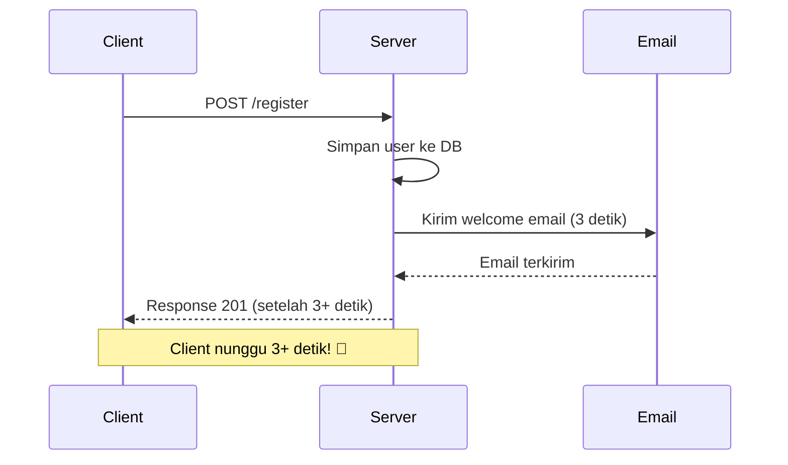
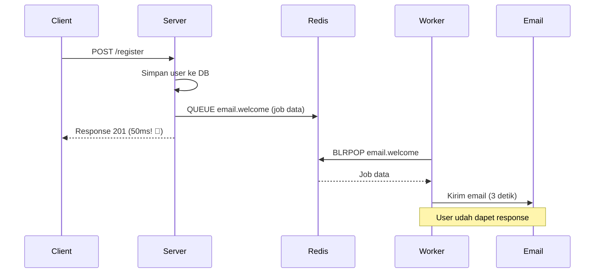
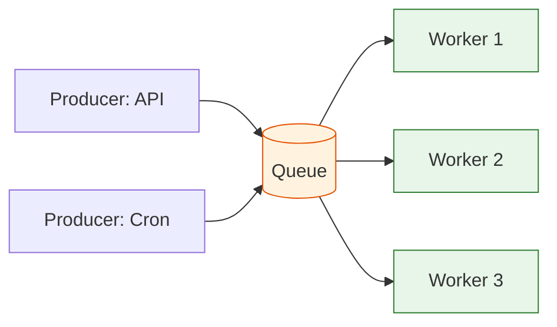
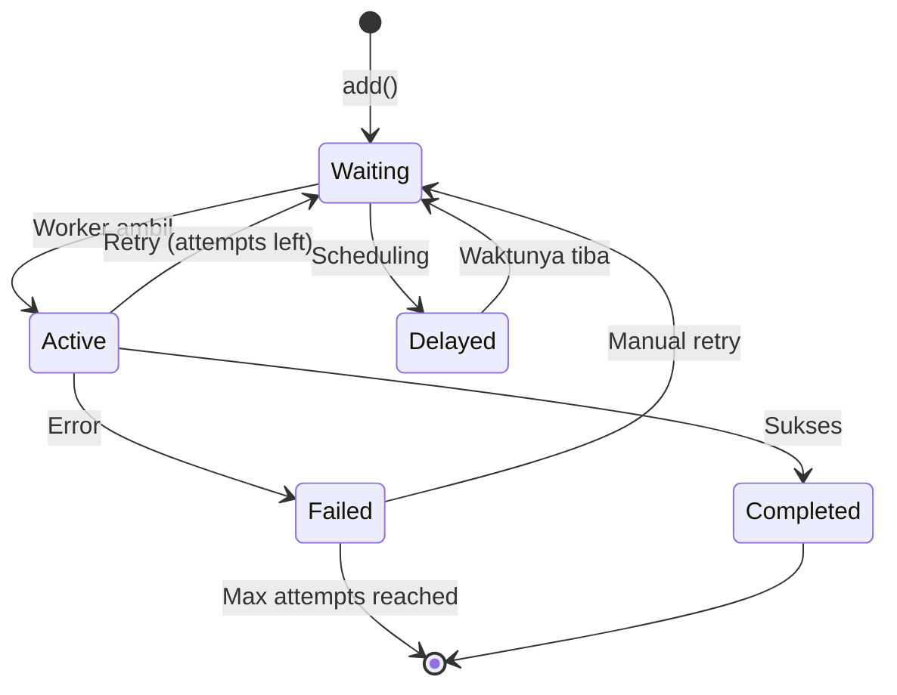

# 01. Queue Concepts

## Sync vs Async Problem

### Synchronous (Blocking)

Tanpa queue, semuanya jalan berurutan. Satu request lambat bisa nge-blok yang lain.



Masalah: user experience jelek, server gak scalable, request lain ngantre.

### Asynchronous (Queue)

Queue pisahin request dari proses berat. Response langsung balik, task jalan di background.



**Keuntungan:**
- Response cepet — user gak nunggu
- Worker bisa scale horizontal
- Job bisa retry kalau gagal
- Anti kehilangan task (persistent di Redis)

---

## Queue Concepts

### Komponen Utama

| Istilah | Deskripsi | Analogi Kasir |
|---------|-----------|---------------|
| **Queue** | Struktur data FIFO tempat job antre | Antrian pembayaran |
| **Producer** | Kode yang nambahin job ke queue | Pelanggan ambil nomor antrean |
| **Consumer/Worker** | Kode yang ambil dan proses job | Kasir yang layani pelanggan |
| **Broker** | Middleware yang nyimpen dan distribusi job | Sistem nomor antrean |
| **Job** | Unit kerja yang diproses (data + metadata) | Satu transaksi belanja |
| **Payload** | Data yang dibawa job (JSON) | Isi keranjang belanja |

### Producer → Queue → Consumer Flow



Queue bersifat **FIFO** (First In, First Out) — job pertama masuk, pertama diproses.

---

## Redis Overview

Redis = **Re**mote **Di**ctionary **S**erver. In-memory data store super cepat, sering dipakai buat queue.

### Kenapa Redis Cocok buat Queue?

1. **In-memory** — operasi sub-millisecond
2. **Persistent** — bisa disimpen ke disk (RDB/AOF)
3. **Pub/Sub** — realtime messaging
4. **List** — natural buat FIFO queue (LPUSH/BRPOP)
5. **Stream** — queue canggih dengan consumer groups (Redis 5+)
6. **Sorted Set** — buat delayed job / scheduling

### Data Structure untuk Queue

```bash
# Simple queue pake List
LPUSH myqueue "job1"       # Tambah job
LPUSH myqueue "job2"
BRPOP myqueue 0            # Ambil job (blocking)

# Delayed job pake Sorted Set
ZADD delayed:email 1730000000 "job:abc123"
ZRANGEBYSCORE delayed:email -inf 1730000000  # Ambil yg udah waktunya

# Pub/Sub untuk notifikasi
PUBLISH channel:job:completed "job:abc123"
SUBSCRIBE channel:job:completed
```

### Setup Redis

```bash
# Install Redis (Ubuntu/Debian)
sudo apt-get install redis-server -y

# Start Redis
sudo systemctl start redis-server

# Cek koneksi
redis-cli ping
# Output: PONG

# Atau pake Docker
docker run -d --name redis -p 6379:6379 redis:7-alpine
```

---

## BullMQ Setup + First Queue

### Apa itu BullMQ?

BullMQ = library Node.js buat job queue berbasis Redis. Dibuat oleh OptimalBits, mature dan production-ready.

### Instalasi

```bash
mkdir queue-demo && cd queue-demo
npm init -y
npm install bullmq ioredis
```

### Koneksi Redis

```javascript
// connection.js
const IORedis = require('ioredis');

const connection = new IORedis({
  host: 'localhost',
  port: 6379,
  maxRetriesPerRequest: null, // penting buat BullMQ
});

module.exports = connection;
```

### Buat Queue (Producer)

```javascript
// producer.js
const { Queue } = require('bullmq');
const connection = require('./connection');

const emailQueue = new Queue('email', { connection });

async function addJobs() {
  // Tambah job ke queue
  const job = await emailQueue.add('welcome-email', {
    to: 'user@example.com',
    name: 'Budi',
    template: 'welcome',
  });

  console.log(`Job ${job.id} ditambahkan ke queue`);
  await connection.quit();
}

addJobs();
```

### Buat Worker (Consumer)

```javascript
// worker.js
const { Worker } = require('bullmq');
const connection = require('./connection');

const worker = new Worker('email', async (job) => {
  console.log(`Processing job ${job.id}...`);
  console.log(`Data:`, job.data);

  // Simulasi proses (kirim email)
  await new Promise((resolve) => setTimeout(resolve, 2000));

  console.log(`Job ${job.id} selesai!`);
  return { sent: true, to: job.data.to };
}, { connection });

worker.on('completed', (job) => {
  console.log(`✅ ${job.id} completed`);
});

worker.on('failed', (job, err) => {
  console.log(`❌ ${job.id} failed:`, err.message);
});

console.log('Worker started...');
```

### Jalankan

```bash
# Terminal 1 — start worker
node worker.js

# Terminal 2 — tambah job
node producer.js
```

Output:
```
# Worker
Worker started...
Processing job 1...
Data: { to: 'user@example.com', name: 'Budi', template: 'welcome' }
Job 1 selesai!
✅ 1 completed
```

---

## Job Lifecycle

BullMQ job melewati state berikut:



| State | Deskripsi |
|-------|-----------|
| **Waiting** | Job antre, belum diproses |
| **Active** | Lagi dikerjain worker |
| **Completed** | Berhasil, return value disimpan |
| **Failed** | Gagal (error), bisa retry |
| **Delayed** | Ditunda sampai waktu tertentu |
| **Paused** | Queue di-pause, gak ada job diproses |

### Cek Status Job

```javascript
// status-check.js
const { Queue } = require('bullmq');
const connection = require('./connection');

async function checkQueue() {
  const queue = new Queue('email', { connection });

  const waiting = await queue.getWaiting();
  const active = await queue.getActive();
  const completed = await queue.getCompleted();
  const failed = await queue.getFailed();
  const delayed = await queue.getDelayed();

  console.log({
    waiting: waiting.length,
    active: active.length,
    completed: completed.length,
    failed: failed.length,
    delayed: delayed.length,
  });

  await connection.quit();
}

checkQueue();
```

---

## Latihan

### Latihan 1: Setup Redis + BullMQ
Setup Redis (local atau Docker). Buat project Node.js dengan BullMQ. Buat queue `notifications` dengan 1 worker dummy yang console.log data job.

### Latihan 2: Queue dengan Repeatable Job
Buat producer yang nambah 5 job ke queue `file-processing`. Worker simulasi proses file (setTimeout 1 detik per job). Jalankan semua job dan pastikan selesai.

### Latihan 3: Job Lifecycle Observer
Buat worker yang process job dengan 50% chance error. Register event listener `completed`, `failed`, `progress`. Catat jumlah completed vs failed.

### Latihan 4: Delayed Job
Buat producer yang nambah job dengan `delay: 5000` (5 detik). Worker console.log timestamp saat job mulai diproses. Buktikan job delay 5 detik dari waktu add.
