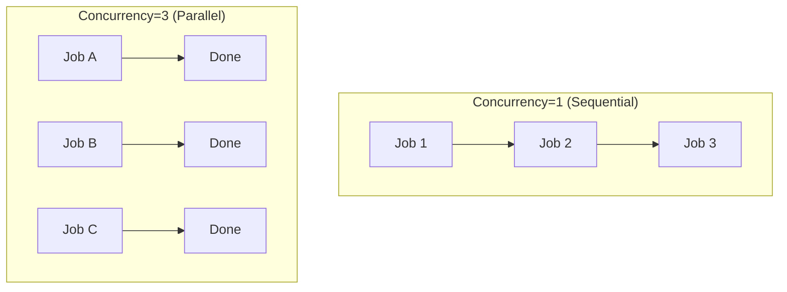

# 02. BullMQ Advanced

## Job Scheduling

### Cron / Repeatable Jobs

BullMQ bisa jadwalin job berulang otomatis pake cron expression.

```javascript
// schedule.js
const { Queue } = require('bullmq');
const connection = require('./connection');

const reportQueue = new Queue('reports', { connection });

async function setupSchedules() {
  // Setiap jam (menit 0)
  await reportQueue.add('hourly-summary', { type: 'hourly' }, {
    repeat: { pattern: '0 * * * *' },
  });

  // Setiap hari jam 08:00
  await reportQueue.add('daily-report', { type: 'daily' }, {
    repeat: { pattern: '0 8 * * *' },
    jobId: 'daily-report', // ID tetap biar gak dobel
  });

  // Setiap Senin jam 09:00
  await reportQueue.add('weekly-digest', { type: 'weekly' }, {
    repeat: { pattern: '0 9 * * 1' },
  });

  console.log('Schedules created');
  await connection.quit();
}

setupSchedules();
```

```javascript
// worker-schedule.js
const { Worker } = require('bullmq');
const connection = require('./connection');

const worker = new Worker('reports', async (job) => {
  console.log(`[${new Date().toISOString()}] Running ${job.name}`);
  console.log(`Type: ${job.data.type}`);

  switch (job.data.type) {
    case 'hourly':
      // Aggregasi data per jam
      break;
    case 'daily':
      // Generate report harian
      break;
    case 'weekly':
      // Kirim digest mingguan
      break;
  }
}, { connection });

console.log('Schedule worker started...');
```

### Delay Job

Job bisa ditunda tanpa cron — sekali jalan aja setelah delay.

```javascript
// Kirim email promo besok
await emailQueue.add('promo-email', {
  userId: '123',
  promo: 'DISKON50',
}, {
  delay: 24 * 60 * 60 * 1000, // 1 hari dalam ms
});

// Kirim reminder 30 menit sebelum event
await reminderQueue.add('event-reminder', {
  eventId: 'evt_001',
  startAt: '2025-07-05T14:00:00Z',
}, {
  delay: 30 * 60 * 1000,
});
```

### Buat Cron Jobs dari String

Bantuan cron expression:

```
* * * * *          Setiap menit
*/5 * * * *        Setiap 5 menit
0 * * * *          Setiap jam (menit 0)
0 8 * * *          Setiap hari jam 08:00
0 9 * * 1          Setiap Senin jam 09:00
0 0 1 * *          Tanggal 1 setiap bulan
0 0 * * 0          Setiap Minggu tengah malam
```

---

## Job Concurrency & Rate Limit

### Concurrency (Parallel Processing)

Worker bisa proses banyak job sekaligus.

```javascript
// Worker dengan 5 concurrent jobs
const worker = new Worker('email', async (job) => {
  await sendEmail(job.data);
}, {
  connection,
  concurrency: 5, // proses 5 job barengan
});
```

Tanpa `concurrency`, worker cuma proses 1 job per kali.



### Rate Limit

Batasi jumlah job per periode waktu — penting buat API eksternal.

```javascript
const worker = new Worker('email', async (job) => {
  await sendEmailViaAPI(job.data);
}, {
  connection,
  limiter: {
    max: 10,       // maksimal 10 job
    duration: 1000, // per 1 detik
  },
});
```

Ini berguna kalau:
- API email cuma allow 10 request/detik
- Database gak sanggup kena 100 query sekaligus
- Hindari rate limit dari service eksternal

### Multiple Workers

Jalanin banyak worker instance di process terpisah buat scale.

```bash
# Terminal 1
node worker.js

# Terminal 2
node worker.js

# Terminal 3 — producer
node producer.js
```

Masing-masing worker ambil job dari queue yang sama. Redis handle distribusi job antar worker.

---

## Retry Strategy

### Auto Retry

Worker bisa otomatis retry job yang gagal.

```javascript
// worker-retry.js
const { Worker } = require('bullmq');
const connection = require('./connection');

const worker = new Worker('email', async (job) => {
  // Simulasi error 30% chance
  if (Math.random() < 0.3) {
    throw new Error('Gagal kirim email');
  }
  console.log(`✅ Email ke ${job.data.to} terkirim`);
}, {
  connection,
  concurrency: 3,
});

console.log('Retry worker started...');
```

### Konfigurasi Retry

```javascript
// producer dengan retry options
const { Queue } = require('bullmq');

const emailQueue = new Queue('email', { connection });

async function addWithRetry() {
  await emailQueue.add('welcome-email', {
    to: 'user@example.com',
  }, {
    attempts: 5,               // max 5x percobaan
    backoff: {
      type: 'exponential',     // exponential backoff
      delay: 2000,             // delay awal 2 detik
    },
  });

  await emailQueue.add('invoice', {
    to: 'client@company.com',
  }, {
    attempts: 3,
    backoff: {
      type: 'fixed',           // delay tetap
      delay: 5000,             // 5 detik antar percobaan
    },
  });
}
```

### Backoff Strategy

| Type | Behavior | Contoh |
|------|----------|--------|
| **fixed** | Delay sama tiap retry | 5s, 5s, 5s |
| **exponential** | Delay nambah eksponensial | 2s, 4s, 8s, 16s |

Perhitungan exponential: `delay * 2^(attempt - 1)`

Attempt 1: 2000ms (gagal)
Attempt 2: 4000ms (gagal)  
Attempt 3: 8000ms (gagal)
Attempt 4: 16000ms (gagal)
Attempt 5: 32000ms — last attempt

### Custom Retry Logic

Kadang kita cuma mau retry untuk error tertentu.

```javascript
const worker = new Worker('email', async (job) => {
  try {
    await sendEmail(job.data);
  } catch (err) {
    if (err.code === 'RATE_LIMITED') {
      // Rate limit — pantas retry
      throw err;
    }
    if (err.code === 'INVALID_EMAIL') {
      // Email salah — guna retry
      await job.discard(); // Tandai selesai tanpa retry
      return { skipped: true, reason: 'Invalid email' };
    }
    // Error lain — retry
    throw err;
  }
}, { connection });
```

---

## Job Events & Progress Reporting

### Events yang Tersedia

```javascript
const worker = new Worker('email', async (job) => {
  await job.updateProgress(10); // progress 10%
  // proses...
  await job.updateProgress(50);
  // proses...
  await job.updateProgress(100);
  return { success: true };
}, { connection });

// Event listeners
worker.on('completed', (job, returnvalue) => {
  console.log(`✅ ${job.id} selesai:`, returnvalue);
});

worker.on('failed', (job, err) => {
  console.log(`❌ ${job.id} gagal:`, err.message);
});

worker.on('progress', (job, progress) => {
  console.log(`📊 ${job.id} progress: ${progress}%`);
});

worker.on('active', (job) => {
  console.log(`🏃 ${job.id} mulai diproses`);
});

worker.on('stalled', (job) => {
  console.log(`⚠️ ${job.id} stalled — worker crash?`);
});

// Queue-level events
const queue = new Queue('email', { connection });
queue.on('waiting', (job) => {
  console.log(`⏳ ${job.id} masuk antrian`);
});

queue.on('paused', () => console.log('⏸️ Queue paused'));
queue.on('resumed', () => console.log('▶️ Queue resumed'));
```

### Progress Reporting Detail

Buat job panjang, progress kasih feedback ke user.

```javascript
// bulk-import.js
const { Worker } = require('bullmq');

const worker = new Worker('import', async (job) => {
  const { users } = job.data; // array of 1000 users
  const total = users.length;

  for (let i = 0; i < total; i++) {
    await saveUser(users[i]);

    // Update progress tiap 10%
    const percent = Math.round(((i + 1) / total) * 100);
    if (percent % 10 === 0) {
      await job.updateProgress(percent);
      console.log(`Progress: ${percent}% (${i + 1}/${total})`);
    }
  }

  return { imported: total };
}, { connection });

// Client bisa cek progress via API
// GET /api/jobs/:id/progress
```

---

## Sandbox Processors

### Masalah Worker Biasa

Worker jalan di process yang sama. Kalau worker ada memory leak atau crash, process server ikut mati.

```javascript
// ❌ Berbahaya — worker dan server satu process
const worker = new Worker('heavy', async (job) => {
  // Proses berat yg bisa crash
  heavyComputation(job.data); // crash? server ikut mati!
}, { connection });
```

### Sandbox Processor

Jalanin tiap job di process terpisah (child process). Aman — kalau job crash, worker utama tetep jalan.

```javascript
// worker-sandbox.js
const { Worker } = require('bullmq');
const path = require('path');
const connection = require('./connection');

const worker = new Worker('image', path.join(__dirname, 'sandbox.js'), {
  connection,
  concurrency: 3,
});

worker.on('completed', (job) => {
  console.log(`✅ ${job.id} selesai`);
});

worker.on('failed', (job, err) => {
  console.log(`❌ ${job.id} gagal:`, err.message);
});
```

```javascript
// sandbox.js — file terpisah dijalankan sebagai child process
module.exports = async (job) => {
  const { imagePath, effect } = job.data;

  console.log(`[Sandbox ${process.pid}] Proses ${imagePath}`);

  // Kalau crash, cuma child process yang mati
  const result = await processImage(imagePath, effect);

  return result;
};
```

Sandbox cocok buat:
- Heavy computation (image processing, PDF)
- Kode yang gak stabil / rawan crash
- Isolasi memory — memory leak gak ngaruh ke main process
- Hot reload development

---

## Latihan

### Latihan 1: Cron Scheduler
Buat queue `cleanup` dengan worker yang jalan setiap jam (pattern `0 * * * *`). Worker log "Cleanup running at [timestamp]". Biarkan jalan 3 menit, amati pola eksekusi.

### Latihan 2: Retry + Backoff
Buat queue `unstable-service` dengan worker yang throw error random 70% chance. Tambah job dengan `attempts: 5` dan `backoff.exponential: 1000`. Catat jumlah attempts tiap job dari event listener `failed`.

### Latihan 3: Progress Report (Heavy Task)
Buat queue `bulk-export`. Worker simulasi export 100 records — update progress tiap 10 record. Producer nambah 1 job, lalu polling progress via `job.getProgress()` setiap 1 detik sampai 100%.

### Latihan 4: Sandbox Processor
Buat queue `dangerous-job`. Worker pake sandbox processor (file terpisah). Di sandbox, simulasi error dengan `throw new Error('Simulated crash')`. Pastikan worker utama TIDAK crash. Job marked as failed, worker tetep jalan buat job berikutnya.
