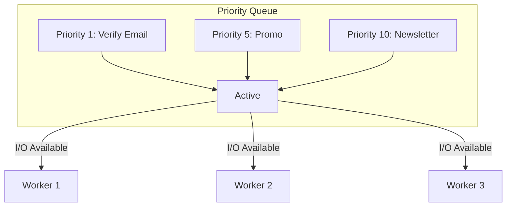

# 04. Queue Production

## Queue Dashboard UI (Bull Board)

Bull Board = dashboard GUI buat monitor queue BullMQ. Bisa lihat job, retry, pause, semuanya dari browser.

### Setup Bull Board

```bash
npm install @bull-board/express bullmq ioredis express
```

### Integrasi dengan Express

```javascript
// server-dashboard.js
const express = require('express');
const { createBullBoard } = require('@bull-board/api');
const { BullMQAdapter } = require('@bull-board/api/bullMQAdapter');
const { ExpressAdapter } = require('@bull-board/express');
const { Queue } = require('bullmq');
const IORedis = require('ioredis');

const app = express();
const connection = new IORedis({ host: 'localhost', port: 6379 });

// Buat queue instances
const emailQueue = new Queue('email', { connection });
const pdfQueue = new Queue('pdf', { connection });
const imageQueue = new Queue('image', { connection });
const exportQueue = new Queue('export', { connection });

// Setup Bull Board
const serverAdapter = new ExpressAdapter();
serverAdapter.setBasePath('/admin/queues');

createBullBoard({
  queues: [
    new BullMQAdapter(emailQueue),
    new BullMQAdapter(pdfQueue),
    new BullMQAdapter(imageQueue),
    new BullMQAdapter(exportQueue),
  ],
  serverAdapter,
});

app.use('/admin/queues', serverAdapter.getRouter());

// API routes lain
app.get('/', (req, res) => {
  res.json({ message: 'Queue Dashboard at /admin/queues' });
});

app.listen(3000, () => {
  console.log('Server running on http://localhost:3000');
  console.log('Dashboard: http://localhost:3000/admin/queues');
});
```

### Fitur Bull Board

| Fitur | Deskripsi |
|-------|-----------|
| **Queue List** | Lihat semua queue dan statusnya |
| **Job Overview** | Jumlah waiting, active, completed, failed, delayed |
| **Job Detail** | Lihat data, stack trace, progress |
| **Retry Job** | Retry job yang failed — 1 klik |
| **Add Job** | Manual nambah job buat testing |
| **Pause/Resume** | Stop queue sementara |
| **Clean** | Hapus completed/failed jobs |

### Dashboard dengan Autentikasi

```javascript
// Tambah basic auth
const basicAuth = require('express-basic-auth');

app.use('/admin/queues', basicAuth({
  users: { admin: process.env.DASHBOARD_PASSWORD || 'secret' },
  challenge: true,
}), serverAdapter.getRouter());
```

---

## Error Handling & Dead Letter Queue

### Dead Letter Queue (DLQ)

Job yang gagal total (udah max attempts) dikirim ke queue khusus — "dead letter". Biar gak bercampur sama job normal.

```javascript
// dlq-setup.js
const { Queue, Worker } = require('bullmq');
const connection = require('./connection');

// Queue utama
const emailQueue = new Queue('email', { connection });
// Dead letter queue
const deadLetterQueue = new Queue('email-dlq', { connection });

const worker = new Worker('email', async (job) => {
  const result = await sendEmail(job.data);
  return result;
}, { connection });

// Tangkap failed jobs — kirim ke DLQ
worker.on('failed', async (job, err) => {
  if (job.attemptsMade >= job.opts.attempts) {
    // Job udah max percobaan — kirim ke DLQ
    await deadLetterQueue.add(job.name, job.data, {
      ...job.opts,
      attempts: 1, // DLQ cukup 1x
      originalJobId: job.id,
      failedReason: err.message,
      failedAt: new Date().toISOString(),
    });
    console.log(`🚨 Job ${job.id} pindah ke DLQ: ${err.message}`);
  }
});
```

### Worker DLQ — Investigasi Manual

```javascript
// dlq-worker.js
const { Worker } = require('bullmq');
const connection = require('./connection');

const dlqWorker = new Worker('email-dlq', async (job) => {
  console.error(`[DLQ] Job asal: ${job.data.originalJobId}`);
  console.error(`[DLQ] Alasan: ${job.data.failedReason}`);
  console.error(`[DLQ] Data:`, job.data);

  // Kirim alert ke admin (email, Slack, dll)
  await sendAlertToAdmin({
    type: 'DLQ_JOB',
    queue: 'email',
    originalJobId: job.data.originalJobId,
    error: job.data.failedReason,
  });

  // Jangan retry — biar admin yang investigasi
  return { alerted: true };
}, { connection });

dlqWorker.on('completed', (job) => {
  console.log(`DLQ alert sent for job ${job.data.originalJobId}`);
});
```

### Logging & Monitoring Error

```javascript
// error-logging.js — integrasi dengan logging service
worker.on('failed', async (job, err) => {
  // Log ke file
  const logEntry = {
    timestamp: new Date().toISOString(),
    queue: 'email',
    jobId: job.id,
    jobName: job.name,
    attempts: job.attemptsMade,
    maxAttempts: job.opts.attempts,
    error: err.message,
    stack: err.stack,
    data: job.data,
  };

  await fs.appendFile('queue-errors.log', JSON.stringify(logEntry) + '\n');

  // Kirim ke Sentry / Datadog / etc.
  // Sentry.captureException(err, { extra: { jobId: job.id } });
});
```

### Error Categories & Strategy

| Error | Strategy | Retry? | DLQ? |
|-------|----------|--------|------|
| Rate limited | Exponential backoff | Yes | No |
| SMTP timeout | Retry (mungkin sementara) | Yes (3x) | Jika masih gagal |
| Invalid email | Skip — discard job | No | Yes |
| Template error | Fix code — gak retry | No | Yes |
| DB connection | Retry + alert | Yes (5x) | Jika masih gagal |

---

## Worker Scaling

### Multiple Workers (Horizontal)

Cara paling simpel: jalan banyak worker process.

```bash
# Start 3 worker instances
node email-worker.js &
node email-worker.js &
node email-worker.js &

# Atau pake PM2 cluster mode
pm2 start email-worker.js -i 4 --name email-worker
```

```javascript
// pm2-ecosystem.config.js
module.exports = {
  apps: [{
    name: 'email-worker',
    script: 'email-worker.js',
    instances: 4, // 4 instance
    exec_mode: 'cluster',
    env: {
      NODE_ENV: 'production',
      REDIS_URL: 'redis://localhost:6379',
    },
  }, {
    name: 'pdf-worker',
    script: 'pdf-worker.js',
    instances: 2,
    exec_mode: 'cluster',
  }],
};
```

### Concurrency Tuning

Gak semua queue sama — concurrency harus disesuaikan.

```javascript
// Email worker — I/O heavy, bisa banyak concurrent
const emailWorker = new Worker('email', handler, {
  connection,
  concurrency: 20, // banyak karena I/O bound
});

// PDF worker — CPU heavy, concurrent sedikit
const pdfWorker = new Worker('pdf', handler, {
  connection,
  concurrency: 2, // CPU bound, 2 aja cukup
});

// Image worker — mixed, moderate
const imageWorker = new Worker('image', handler, {
  connection,
  concurrency: 4,
});
```

### Aturan Concurrency

| Tipe | Contoh | Concurrency Rekomendasi |
|------|--------|------------------------|
| **I/O bound** | Email, HTTP call, DB query | 10-50 |
| **CPU bound** | PDF, image resize, video | 1-4 |
| **Mixed** | Export, aggregation | 4-10 |
| **External API** | Rate-limited | Sesuai rate limit |

### Queue Prioritization

Job penting bisa didahulukan.

```javascript
// Priority — nilai terkecil didahulukan
await emailQueue.add('verify-email', data, { priority: 1 });  // Tertinggi
await emailQueue.add('newsletter', data, { priority: 10 });   // Rendah
await emailQueue.add('promo', data, { priority: 5 });          // Medium
```



---

## Graceful Shutdown

Worker jalan terus. Waktu server mau mati (deploy, restart, crash), kita harus pastikan job yang lagi diproses gak hilang.

### Problem: Kill Paksa

```bash
# ❌ Jangan — job aktif hilang
kill -9 <pid>
# Atau Ctrl+C paksa
```

Process mati mendadak → job jadi **stalled** (stuck di active state).

### Solution: Graceful Shutdown

```javascript
// graceful-shutdown.js
const { Worker, Queue } = require('bullmq');
const connection = require('./connection');

const worker = new Worker('email', async (job) => {
  // Proses email...
  await sendEmail(job.data);
}, { connection });

// Handler graceful shutdown
async function shutdown(signal) {
  console.log(`\n${signal} received — shutting down gracefully...`);

  // 1. Stop worker — gak ambil job baru
  await worker.close({ force: false });
  // force: false — biarin job yg lagi jalan selesai

  console.log('Worker closed. Remaining jobs will be picked up later.');

  // 2. Tutup koneksi Redis
  await connection.quit();

  console.log('Redis connection closed.');
  process.exit(0);
}

process.on('SIGTERM', () => shutdown('SIGTERM'));
process.on('SIGINT', () => shutdown('SIGINT'));

console.log('Worker running. Press Ctrl+C to shutdown gracefully.');
```

### Stalled Job Recovery

BullMQ otomatis detek stalled job (di active > `stalledInterval`) dan mindahin balik ke waiting.

```javascript
const worker = new Worker('email', handler, {
  connection,
  stalledInterval: 30000,     // cek tiap 30 detik
  maxStalledCount: 2,         // max 2x stalled sebelum failed
});
```

### Docker Graceful Shutdown

```dockerfile
# Dockerfile
FROM node:20-alpine
WORKDIR /app
COPY package*.json ./
RUN npm ci --production
COPY . .
CMD ["node", "worker.js"]
# Docker akan kirim SIGTERM — worker.js handle itu
```

```yaml
# docker-compose.yml
version: '3.8'
services:
  redis:
    image: redis:7-alpine
    ports: ["6379:6379"]

  email-worker:
    build: .
    depends_on: [redis]
    environment:
      - REDIS_URL=redis://redis:6379
    stop_signal: SIGTERM
    stop_grace_period: 60s # kasih waktu 60s buat selesaiin job
```

### Complete Production Worker Template

```javascript
// production-worker.js
const { Worker, Queue } = require('bullmq');
const IORedis = require('ioredis');

const connection = new IORedis(process.env.REDIS_URL || 'redis://localhost:6379');
const QUEUE_NAME = process.env.QUEUE_NAME || 'default';

async function processJob(job) {
  // Implementasi proses job
  console.log(`[${new Date().toISOString()}] Processing ${job.id}`);
  return { processed: true };
}

const worker = new Worker(QUEUE_NAME, processJob, {
  connection,
  concurrency: parseInt(process.env.CONCURRENCY || '5'),
  stalledInterval: 30000,
  maxStalledCount: 2,
});

worker.on('completed', (job) => {
  console.log(`✅ ${job.id} done`);
});

worker.on('failed', (job, err) => {
  console.error(`❌ ${job.id} failed:`, err.message);
});

// Graceful shutdown
async function shutdown(signal) {
  console.log(`\n${signal} received. Closing worker...`);
  await worker.close({ force: false });
  await connection.quit();
  process.exit(0);
}

process.on('SIGTERM', () => shutdown('SIGTERM'));
process.on('SIGINT', () => shutdown('SIGINT'));

console.log(`Worker ${QUEUE_NAME} ready (concurrency: ${worker.opts.concurrency})`);
```

---

## Cron Job vs Queue Decision Guide

Kapan pake cron job biasa (node-cron, setInterval) dan kapan pake queue + scheduler?

### Cron Job

```javascript
// Cron job sederhana — cocok buat task ringan
const cron = require('node-cron');

cron.schedule('0 8 * * *', () => {
  console.log('Kirim laporan harian');
  generateDailyReport();
});
```

| Cocok buat | Gak cocok buat |
|------------|----------------|
| Task ringan < 1 detik | Task berat / lama |
| Gak perlu retry | Butuh retry logic |
| Hanya 1 process | Butuh scaling |
| Gak perlu monitoring | Butuh dashboard |
| Gak masalah kalau gagal | Critical task |

### Queue (BullMQ Scheduler)

```javascript
// Queue scheduler — cocok buat task production
const { Queue } = require('bullmq');

const reportQueue = new Queue('reports', { connection });

await reportQueue.add('daily-report', data, {
  repeat: { pattern: '0 8 * * *' },
  attempts: 3,
  backoff: { type: 'exponential', delay: 5000 },
});
```

| Cocok buat | Fitur tambahan |
|------------|----------------|
| Task berat / lama | Retry otomatis |
| Scaling horizontal | Multiple workers |
| Critical path | DLQ + alerting |
| Butuh monitoring | Bull Board dashboard |
| Task per-user / banyak | Concurrency control |

### Decision Matrix

```
Apakah task bisa gagal dan perlu diulang?
├── Ya → Queue (retry + DLQ)
└── Tidak → Cron job

Apakah task perlu scale saat ramai?
├── Ya → Queue (concurrent workers)
└── Tidak → Cron job

Apakah task critical / financial?
├── Ya → Queue (monitoring + audit trail)
└── Tidak → Bisa cron job aja

Apakah task per-user (masing-masing beda data)?
├── Ya → Queue (1 job per user)
└── Tidak → Cron job (1 task buat semua)

Apakah server sering restart / deploy?
├── Ya → Queue (recover stalled jobs)
└── Tidak → Cron job
```

### Hybrid Approach

Kadang perlu kombinasi:

```javascript
// Cron job buat trigger queue
cron.schedule('0 8 * * *', () => {
  // Cron cuma trigger — kerja berat di queue worker
  reportQueue.add('daily-report', {
    date: new Date().toISOString().split('T')[0],
  });
});
```

---

## Latihan

### Latihan 1: Bull Board Setup
Setup Express server dengan Bull Board. Daftarin 3 queue: `email`, `pdf`, `image`. Tambahin basic auth. Jalankan dan pastikan dashboard bisa diakses di `/admin/queues`.

### Latihan 2: Dead Letter Queue
Buat queue `orders` dengan worker yang sengaja throw error. Konfigurasi `attempts: 2`. Di event `failed`, kirim job ke `orders-dlq` kalau udah max attempts. Buat DLQ worker yang log detail error dan marked as alerted.

### Latihan 3: Graceful Shutdown
Buat worker yang proses job dengan delay 3 detik (simulasi). Handle SIGTERM: worker.close(), biarin job selesai, baru exit. Test dengan Ctrl+C — pastikan job terakhir tetep completed bukan failed.

### Latihan 4: Scaling Decision
Buat laporan analisis: dari 5 use case berikut, tentuin mana yang pake cron job dan mana yang pake queue. Beri alasan:
1. Bersihin log file setiap jam
2. Kirim email notifikasi pas user register
3. Generate thumbnaily pas user upload foto
4. Backup database setiap tengah malam
5. Proses refund order yang dibatalkan
