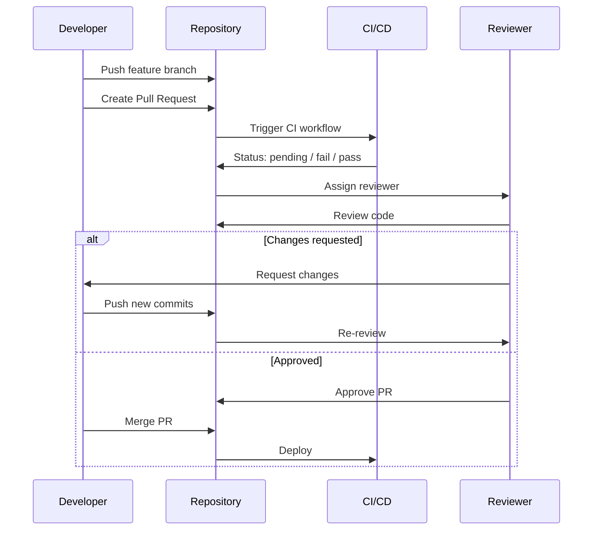

# Sesi 2: Pull Request Workflow

> Kuasai alur Pull Request profesional — dari deskripsi hingga merge, dengan code review yang efektif.

**Durasi**: 4 jam | **Output**: Pull Request real dengan review, diskusi, dan merge

---

## 2.1 PR Lifecycle

Alur standar Pull Request di tim engineering:

```
Create PR → Assign Reviewer → Review → Request Changes / Approve → Merge → Deploy
                ↓
          Discuss & Iterate
```

### Tahapan Detail

1. **Create** — Push branch → buka GitHub → klik "Compare & Pull Request"
2. **Describe** — Isi template PR (what, why, how, testing)
3. **Assign** — Assign reviewer (otomatis via CODEOWNERS atau manual)
4. **Review** — Reviewer baca kode, tinggalkan komentar
5. **Discuss** — Author jawab komentar, push perubahan
6. **Approve** — Reviewer setuju, klik Approve
7. **Merge** — Author merge setelah semua checklist terpenuhi
8. **Deploy** — Otomatis via CI/CD atau manual

### PR Size Matters

| Ukuran PR | Guidelines |
|-----------|------------|
| ✅ **Small (< 200 lines)** | Ideal — mudah review, cepat merge |
| ⚠️ **Medium (200-500 lines)** | Masih OK — usahakan dipecah |
| ❌ **Large (> 500 lines)** | Red flag — minta author split |

> **Aturan praktik**: Satu PR = satu fitur/perbaikan. Jangan campur refactor + fitur baru + fix di satu PR.

---

## 2.2 PR Description Template

Template standar yang dipakai tim profesional. Simpan file di `.github/pull_request_template.md`:

```markdown
## Deskripsi

<!-- Apa yang diubah di PR ini? Jelaskan secara singkat. -->

## Related Issue

<!-- Closes #issue_number, Fixes #issue_number, atau Related to #issue_number -->

Closes #

## Perubahan

- [ ] Fitur baru
- [ ] Perbaikan bug
- [ ] Refactor
- [ ] Dokumentasi
- [ ] Dependencies

## Type of Change

- [ ] feat: — fitur baru (non-breaking)
- [ ] fix: — perbaikan bug (non-breaking)
- [ ] chore: — tugas rutin
- [ ] docs: — dokumentasi
- [ ] refactor: — refaktor
- [ ] BREAKING CHANGE — perubahan tidak backward compatible

## How to Test

<!-- Langkah-langkah untuk testing PR ini -->

1. Checkout branch: `git checkout <branch>`
2. Install dependencies: `npm install`
3. Jalankan: `npm run dev`
4. Buka http://localhost:3000
5. Verifikasi: ...

## Screenshots (jika ada)

| Sebelum | Sesudah |
|---------|---------|
|         |         |

## Checklist

- [ ] Kode sudah di-test lokal
- [ ] Tidak ada warning/error baru
- [ ] Unit test ditambahkan (jika perlu)
- [ ] Dokumentasi diupdate (jika perlu)
- [ ] Branch sudah up-to-date dengan main
```

### Cara Setup

```bash
mkdir -p .github
touch .github/pull_request_template.md
# Paste template di atas
git add .github/pull_request_template.md
git commit -m "docs: add PR template"
```

---

## 2.3 Code Review Checklist

### General

- [ ] Apakah kode sesuai dengan requirement/ticket?
- [ ] Apakah ada duplicate code yang bisa di-extract?
- [ ] Apakah penamaan variable/fungsi jelas dan konsisten?
- [ ] Apakah ada dead code / komentar yang tidak perlu?
- [ ] Apakah ada perubahan tidak terduga di file lain?

### Logic & Correctness

- [ ] Apakah logic sudah benar untuk semua edge case?
- [ ] Apakah ada potential null pointer / undefined access?
- [ ] Apakah error handling sudah memadai?
- [ ] Apakah tidak ada race condition (async code)?
- [ ] Apakah validasi input sudah dilakukan?

### Style & Consistency

- [ ] Apakah mengikuti coding style tim (ESLint/Prettier)?
- [ ] Apakah format import konsisten?
- [ ] Apakah tidak ada hardcoded values (magic numbers/strings)?
- [ ] Apakah CSS/Tailwind mengikuti convention tim?

### Performance

- [ ] Apakah tidak ada infinite loop / recursion tanpa batas?
- [ ] Apakah query database sudah optimal (N+1 problem)?
- [ ] Apakah tidak ada render berulang (React useEffect missing deps)?
- [ ] Apakah assets/bundles terlalu besar?

### Security

- [ ] Apakah user input sudah di-sanitize (XSS, SQL injection)?
- [ ] Apakah API endpoint punya autentikasi/otorisasi?
- [ ] Apakah secret/token tidak hardcoded?
- [ ] Apakah ada rate limiting untuk public endpoint?

### Test Coverage

- [ ] Apakah ada unit test untuk logic baru?
- [ ] Apakah test passing di CI?
- [ ] Apakah snapshot test diupdate (jika pakai)?
- [ ] Apakah ada integration test untuk endpoint baru?

### Writing Review Comments

| Tipe Komentar | Cara Menulis |
|---------------|--------------|
| **Suggestion** | "Sebaiknya pake `map()` instead of `forEach()` biar immutable" |
| **Question** | "Kenapa pake `var` instead of `const`? Ada alasan spesifik?" |
| **Issue** | "Ini potential XSS — input user langsung di-render tanpa sanitize. Pake DOMPurify." |
| **Praise** | "Bagus! Error handling-nya lengkap." |

---

## 2.4 Merge Strategies

### Merge Commit

```bash
git checkout main
git merge --no-ff feature/login
```

```
main: ... ●────●─────────●─────────●
                \         /         /
 feature/login    ●───●─●         /
                         \       /
 fix/typo                  ●───●
```

- ✅ Mempertahankan histori branch lengkap
- ✅ Setiap merge punya commit terpisah
- ❌ Graf bisa kompleks untuk tim besar
- Cocok untuk: GitFlow, histori lengkap

### Squash & Merge

```bash
# Semua commit fitur jadi satu commit
git merge --squash feature/login
git commit -m "feat: add login page with JWT (#42)"
```

```
main: ... ●────●──────────●
                        feat: add login page with JWT (#42)
```

- ✅ Histori bersih dan linear
- ✅ Commit fitur jadi satu kesatuan logis
- ❌ Kehilangan detail commit individual
- Cocok untuk: GitHub Flow, tim kecil

### Rebase & Merge

```bash
git checkout feature/login
git rebase main
git checkout main
git merge feature/login
# atau fast-forward saja
```

```
main: ... ●────●────●────●────●
                    feat   feat   fix
```

- ✅ Histori linear sempurna
- ✅ Setiap commit tetap ada
- ❌ Perlu force push (rebase)
- Cocok untuk: Trunk-based, tim disiplin

### Perbandingan

| Aspek | Merge Commit | Squash & Merge | Rebase & Merge |
|-------|-------------|----------------|----------------|
| Histori branch | ✅ Lengkap | ❌ Hilang | ✅ Lengkap |
| Histori linear | ❌ Graf bercabang | ✅ Linear | ✅ Linear |
| Commit granular | ✅ Semua visible | ❌ Satu commit | ✅ Semua visible |
| Force push | ❌ Tidak perlu | ❌ Tidak perlu | ✅ Perlu |
| Cocok | GitFlow | GitHub Flow | Trunk-based |

---

## 2.5 Protected Branches

Branch protection rules memastikan kode tidak bisa di-push langsung ke branch penting (main, develop).

### Setup di GitHub

1. Repository → **Settings** → **Branches** → **Add branch protection rule**
2. Branch name pattern: `main`
3. Checklist:

```
☑ Require a pull request before merging
   ☑ Require approvals (1-2)
   ☑ Dismiss stale pull request approvals when new commits are pushed
   ☑ Require review from Code Owners

☑ Require status checks to pass before merging
   ☑ Require branches to be up to date

☑ Require conversation resolution first

☑ Include administrators (opsional)

☑ Restrict who can push to matching branches
```

### Status Checks

Hubungkan GitHub Actions sebagai required check:

1. Di `.github/workflows/ci.yml`, beri nama job
2. Di branch protection, cari nama job → centang
3. PR tidak bisa merge kalau CI failed

### Required Reviewers

- Minimal 1-2 orang approve sebelum merge
- Review dari code owner otomatis jika ada CODEOWNERS
- Stale review di-dismiss jika ada push baru

---

## 2.6 Code Owners

File `CODEOWNERS` di `.github/CODEOWNERS` — siapa yang auto-assign review berdasarkan path file.

### Format

```
# Default owners untuk semua file
* @tim-lead @senior-dev

# Owner spesifik folder
/src/api/ @backend-team
/src/components/ @frontend-team
/src/database/ @dba-team

# Owner spesifik file
README.md @tech-writer
package.json @devops-team

# Multiple owners — semua harus review
/docs/ @tech-writer @frontend-team
```

### Cara Setup

```bash
mkdir -p .github
cat > .github/CODEOWNERS << 'EOF'
* @lead-developer
/src/api/ @backend-engineer
/src/components/ @frontend-engineer
/docs/ @tech-writer
EOF

git add .github/CODEOWNERS
git commit -m "docs: add CODEOWNERS for team"
```

### Rules

- File `.github/CODEOWNERS` harus di `main` branch
- Pattern evaluasi dari yang paling spesifik
- Username atau email GitHub (bisa team @org/team-name)
- Wildcard `*` untuk default
- Path relatif dari root repo

---

## 2.7 Diagram PR Workflow



---

## 2.8 Latihan

### Latihan 1: Setup Branch Protection

1. Buka repo latihan dari sesi 1
2. Settings → Branches → Add rule
3. Pattern: `main`
4. Checklist:
   - Require PR before merging
   - Require 1 approval
   - Dismiss stale reviews
   - Require conversation resolution
5. Save

### Latihan 2: Create Pull Request

#### Part A: Feature Branch + PR

```bash
# 1. Pastikan branch main up-to-date
git checkout main
git pull origin main

# 2. Buat branch fitur
git checkout -b feature/profile-page

# 3. Buat file profile.html
cat > profile.html << 'EOF'
<!DOCTYPE html>
<html lang="id">
<head>
  <meta charset="UTF-8">
  <meta name="viewport" content="width=device-width, initial-scale=1.0">
  <title>Profile Page</title>
  <style>
    * { margin: 0; padding: 0; box-sizing: border-box; }
    body { font-family: system-ui; display: flex; justify-content: center; align-items: center; min-height: 100vh; background: #f1f5f9; }
    .card { background: white; border-radius: 16px; padding: 2rem; box-shadow: 0 4px 6px rgba(0,0,0,0.1); text-align: center; }
    .avatar { width: 96px; height: 96px; border-radius: 50%; background: #2563eb; margin: 0 auto 1rem; }
    h2 { color: #1e293b; }
    p { color: #64748b; margin-top: 0.5rem; }
  </style>
</head>
<body>
  <div class="card">
    <div class="avatar"></div>
    <h2>Nama Kamu</h2>
    <p>Frontend Developer</p>
    <p>✉️ email@example.com</p>
  </div>
</body>
</html>
EOF

# 4. Commit dan push
git add profile.html
git commit -m "feat(profile): add profile page card component"
git push origin feature/profile-page
```

5. Buka GitHub → lihat banner "Compare & Pull Request" → klik
6. Isi PR description dengan template:
   - **What**: Tambah profile page dengan card component
   - **Why**: Fitur user profile untuk halaman dashboard
   - **How**: HTML + CSS inline, card component reusable
   - **Testing**: Buka `profile.html` di browser
   - **Screenshots**: (screenshot jika bisa)
7. Assign reviewer ke teman (atau diri sendiri untuk latihan)
8. Submit PR

#### Part B: Review PR

1. Buka tab **Files changed** di PR
2. Tinggalkan komentar di baris tertentu:
   - +1 komentar pujian
   - +1 komentar suggestion (misal: pindahkan CSS ke file terpisah)
   - +1 komentar question (misal: "Apa perlu responsive?")
3. Klik **Finish review** → pilih **Comment** (belum approve)
4. Balas komentar sebagai author
5. Buat perubahan berdasarkan feedback:

```bash
# Pindahkan CSS ke file terpisah
git mv profile.html styles.css
# ... atau edit langsung
```

6. Push perubahan → komentar otomatis resolved

#### Part C: Merge

1. Pastikan semua conversation resolved
2. Dapatkan approval (atau approve sendiri untuk latihan)
3. Pilih merge strategy:
   - Coba **Squash and merge** → lihat commit message
   - Lihat hasil di graf: `git log --oneline --graph`
4. Hapus branch setelah merge (klik "Delete branch" di GitHub)

### Latihan 3: Setup CODEOWNERS

```bash
# Di repo latihan
cat > .github/CODEOWNERS << 'EOF'
* @usernamekamu
/src/ @usernamekamu
/docs/ @usernamekamu
EOF

git add .github/CODEOWNERS
git commit -m "docs: add CODEOWNERS"
git push origin main
```

### Checklist Output Sesi 2

- [ ] Branch protection rule untuk `main` sudah aktif
- [ ] Minimal 1 PR dibuat dengan deskripsi lengkap (what, why, how, testing)
- [ ] PR sudah di-review dengan minimal 3 komentar (praise, suggestion, question)
- [ ] Semua conversation di-resolved
- [ ] PR sudah di-merge (squash & merge atau merge commit)
- [ ] Branch fitur sudah dihapus setelah merge
- [ ] File `.github/CODEOWNERS` sudah ada

---

## Referensi

- [GitHub Pull Request Docs](https://docs.github.com/en/pull-requests)
- [Best Practices for Code Review](https://google.github.io/eng-practices/review/)
- [Conventional Comments](https://conventionalcomments.org/)
- [Branch Protection Rules](https://docs.github.com/en/repositories/configuring-branches-and-merges-in-your-repository/managing-protected-branches/about-protected-branches)
- [About CODEOWNERS](https://docs.github.com/en/repositories/managing-your-repositorys-settings-and-features/customizing-your-repository/about-code-owners)
