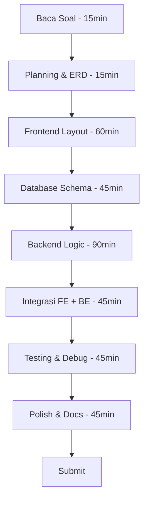

# 🎯 Sesi 02 — LKS Competition Strategy

> **Durasi:** 120 menit  
> **Tujuan:** Menguasai strategi mengerjakan soal LKS — time management, membaca soal, scoring criteria, dan simulasi mock test

---

## 1. Time Management

### Alokasi Waktu Umum (6 Jam)

| Sesi | Waktu | Aktivitas | Catatan |
|------|-------|-----------|---------|
| Pembukaan | 15 menit | Baca soal, rencanakan strategi | Jangan langsung coding! |
| Frontend | 90 menit | HTML struktur, CSS styling, responsive | Prioritaskan layout |
| Backend | 120 menit | Logic, routing, API, auth | Bagian terberat |
| Database | 60 menit | Schema, query, CRUD | Bisa sambil backend |
| Testing | 45 menit | Uji semua fitur, debug | Jangan skip! |
| Finalisasi | 30 menit | Polish UI, code cleanup, docs | Nilai tambahan |
| **Total** | **360 menit** | | |

### Prioritasi Berdasarkan Bobot

```
Bobot penilaian → alokasi waktu ideal:

Functional Correctness (35%) → ~126 menit
Code Quality (20%)          →  ~72 menit
Efficiency (15%)            →  ~54 menit
UI/UX (15%)                 →  ~54 menit
Creativity (10%)            →  ~36 menit
Documentation (5%)          →  ~18 menit
```

### Strategi If-Then

| Situasi | Tindakan |
|---------|----------|
| Waktu tinggal 2 jam, backend belum selesai | Prioritaskan core CRUD, skip fitur bonus |
| Waktu tinggal 1 jam, UI masih jelek | Fokus ke functional correctness, UI minimal rapi |
| Waktu tinggal 30 menit | Pastikan semua fitur utama jalan, jangan nambah fitur baru |
| Ada fitur yang mentok | Skip, lanjut ke fitur lain, balik kalau ada waktu |
| Error aneh | Catat, lanjut dulu, debugging terakhir |

### Time Boxing Technique

Gunakan timer di HP atau browser:

```
⏰ 15:00 — 15:15   Baca soal & planning
⏰ 15:15 — 16:45   Frontend (layout + responsive)
⏰ 16:45 — 18:45   Backend (routing + logic)
⏰ 18:45 — 19:45   Database (schema + queries)
⏰ 19:45 — 20:30   Testing & debugging
⏰ 20:30 — 21:00   Final polish
```

> **Tips:** Set alarm tiap pergantian sesi. Jangan over-invest di satu bagian.

---

## 2. Reading Comprehension

### Cara Membaca Soal LKS

Soal LKS biasanya panjang (3–5 halaman). Teknik membaca efektif:

```
Langkah 1: Scan Cepat (5 menit)
  - Baca judul, bullet points, bold text
  - Lingkari keywords: "wajib", "minimal", "tidak boleh"
  - Identifikasi jumlah halaman/output yang diminta

Langkah 2: Baca Detail Per Requirement (10 menit)
  - Tiap requirement → checklist
  - Catat tipe data, format output, nama file

Langkah 3: Buat Mind Map (5 menit)
  - Gambar arsitektur: frontend → backend → database
  - Tandai dependency antar fitur
```

### Keywords Penting

| Keyword | Arti |
|---------|------|
| **Wajib / Must / Required** | Nilai 0 kalau tidak ada |
| **Minimal / At least** | Boleh lebih, jangan kurang |
| **Tidak boleh / Must not** | Deduction point kalau dilanggar |
| **Disarankan / Recommended** | Bonus point |
| **Jika waktu memungkinkan** | Opsional, kerjakan setelah semua wajib selesai |
| **Responsive** | Harus pakai media queries |
| **Dynamic** | Data dari database / API, bukan hardcode |
| **Validation** | Client-side + server-side validation |

### Checklist Baca Soal

Sebelum mulai coding, pastikan:

- [ ] Ada berapa halaman/webpage yang diminta?
- [ ] Framework/library apa yang boleh/tidak boleh?
- [ ] Database: berapa tabel? relasi apa?
- [ ] Authentication: session atau JWT?
- [ ] File output: ekstensi apa? naming convention?
- [ ] Ada sample data atau harus generate sendiri?
- [ ] Waktu deadline: kapan harus submit?

---

## 3. Scoring Criteria

### Rubrik Detail

#### Functional Correctness (35 poin)

| Level | Poin | Kriteria |
|-------|------|----------|
| Excellent | 30–35 | Semua fitur berfungsi, edge cases tertangani |
| Good | 20–29 | Mayoritas fitur jalan, minor bug |
| Fair | 10–19 | Hanya core fitur jalan |
| Poor | 0–9 | Hanya beberapa fitur |

#### Code Quality (20 poin)

| Level | Poin | Kriteria |
|-------|------|----------|
| Excellent | 18–20 | Clean code, proper naming, comments, modular |
| Good | 14–17 | Mostly clean, minor inconsistency |
| Fair | 8–13 | Messy tapi masih readable |
| Poor | 0–7 | Spaghetti code, no comments |

#### Efficiency (15 poin)

| Level | Poin | Kriteria |
|-------|------|----------|
| Excellent | 13–15 | Optimized queries, minimal DB calls, caching |
| Good | 10–12 | Reasonable performance, minor N+1 |
| Fair | 5–9 | Slow query, multiple unnecessary calls |
| Poor | 0–4 | Very slow, blocking operations |

#### UI/UX (15 poin)

| Level | Poin | Kriteria |
|-------|------|----------|
| Excellent | 13–15 | Responsive, consistent, accessible, polished |
| Good | 10–12 | Mostly responsive, decent aesthetics |
| Fair | 5–9 | Functional but ugly, inconsistent |
| Poor | 0–4 | Broken layout, unreadable |

#### Creativity (10 poin)

| Level | Poin | Kriteria |
|-------|------|----------|
| Excellent | 9–10 | Extra features, innovative solution |
| Good | 6–8 | Some additions beyond spec |
| Fair | 3–5 | Minimal extra effort |
| Poor | 0–2 | Exactly spec, nothing more |

#### Documentation (5 poin)

| Level | Poin | Kriteria |
|-------|------|----------|
| Excellent | 5 | README, comments, setup guide |
| Good | 3–4 | Partial docs |
| Fair | 1–2 | Minimal comments |
| Poor | 0 | No documentation |

---

## 4. Common Pitfalls

### ❌ Pitfall 1: Missing Requirements
**Masalah:** Peserta melewatkan requirement yang tertulis jelas di soal.
**Solusi:** Checklist physical. Tandai tiap requirement yang sudah selesai.

### ❌ Pitfall 2: Hardcode Data
**Masalah:** Data ditulis langsung di kode, bukan dari database/API.
**Solusi:** Soal biasanya bilang "dynamic". Pastikan semua konten dari DB.

### ❌ Pitfall 3: Ignoring Error Handling
**Masalah:** Tidak ada try-catch, user liat error mentah.
**Solusi:** Tangani error dengan user-friendly message.

### ❌ Pitfall 4: No Validation
**Masalah:** Input user tidak divalidasi, bisa inject SQL/XSS.
**Solusi:** Validate client-side (UX) + server-side (security).

### ❌ Pitfall 5: Bad Time Management
**Masalah:** Terlalu lama di satu fitur, fitur lain tidak selesai.
**Solusi:** Time boxing. Prioritaskan fitur wajib.

### ❌ Pitfall 6: Not Testing
**Masalah:** Submit tanpa testing, ternyata error.
**Solusi:** Sisihkan 45 menit terakhir untuk testing.

### ❌ Pitfall 7: Over-Engineering
**Masalah:** Bikin arsitektur terlalu kompleks untuk soal sederhana.
**Solusi:** Keep it simple. YAGNI (You Ain't Gonna Need It).

### ❌ Pitfall 8: Ignoring Responsive
**Masalah:** Cuma desktop view, mobile broken.
**Solusi:** Mobile-first CSS. Test di viewport kecil.

### ❌ Pitfall 9: Forget File Naming
**Masalah:** Nama file tidak sesuai spec → tidak ketemu juri.
**Solusi:** Ikuti persis naming convention di soal.

### ❌ Pitfall 10: Panic
**Masalah:** Waktu mepet → panik → error makin banyak.
**Solusi:** Tarik napas. Prioritaskan core. Sesuatu > sempurna.

### Checklist Common Errors

Sebelum submit, cek:

- [ ] Semua link navigasi jalan?
- [ ] Form submit → data masuk database?
- [ ] Halaman error tidak muncul? (404, 500)
- [ ] Responsive di mobile view?
- [ ] Ada data dummy yang cukup?
- [ ] File name sesuai spec?
- [ ] Tidak ada hardcode test data?
- [ ] Session/logout jalan?
- [ ] CSS tidak broken di browser lain?
- [ ] Documentation ada?

---

## 5. Mock Test Simulation

### Format Mock Test

| Aspek | Detail |
|-------|--------|
| Durasi | 6 jam (360 menit) |
| Soal | 1 soal komprehensif (frontend + backend + database) |
| Tools | VS Code, XAMPP, MySQL, Chrome DevTools |
| Submit | ZIP folder atau upload ke server |

### Aturan Mock Test

1. **No internet browsing** — hanya akses dokumentasi lokal
2. **No AI tools** — kerjakan manual
3. **Timer ketat** — stop saat waktu habis
4. **Real condition** — nyalakan musik white noise, gangguan simulasi
5. **Debrief setelah selesai** — analisis apa yang bisa diperbaiki

### Langkah Mock Test



### Self-Assessment Setelah Mock Test

Setelah selesai mock test, isi:

```markdown
## Mock Test Debrief

### Technical
- Fitur selesai: ___ / ___ (berapa dari total)
- Fitur yang terlewat: ___
- Bug yang ditemukan: ___
- Skor estimasi:
  - Functional: ___/35
  - Code Quality: ___/20
  - Efficiency: ___/15
  - UI/UX: ___/15
  - Creativity: ___/10
  - Documentation: ___/5
  - **Total: ___/100**

### Non-Technical
- Waktu terbuang di bagian mana? ___
- Kenapa? ___
- Strategi alternatif untuk next mock: ___
- Skor manajemen waktu: ___/10
- Skor reading comprehension: ___/10

### Action Items
1. ...
2. ...
3. ...
```

---

## 6. Latihan

### Latihan 1: Time Management Simulation

**Timer: 15 menit**

Baca soal berikut (ringkasan):

> *Buat web profil perusahaan. HTML/CSS responsive. Minimal 3 halaman (home, about, contact). Form kontak dengan validasi. Data disimpan di localStorage. Tampilkan daftar pesan di halaman admin.*

```
1. Buat breakdown tugas dalam 15 menit. 
   Apa yang akan kamu kerjakan duluan?

2. Berapa menit alokasi untuk tiap tugas?

3. Fitur apa yang akan kamu prioritaskan?

4. Apa yang akan kamu skip jika waktu mepet?
```

### Latihan 2: Scoring Drill

Ambil jawaban teman (atau kode dari internet). Evaluasi:

```
1. Functional Correctness: fitur apa yang kurang? Berapa skor?

2. Code Quality: apakah ada hardcode? Duplikasi kode?

3. Efficiency: ada query N+1? Load data berlebihan?

4. UI/UX: responsive? Konsisten? Accessible?
```

### Latihan 3: Mock Test Mini

**Durasi: 60 menit**

Buat halaman TODO App sederhana:

```
Fitur:
- Tambah todo (input + button)
- Tampilkan daftar todo
- Hapus todo (tombol delete)
- Todo tersimpan di localStorage
- Responsive (mobile + desktop)

Evaluasi diri setelah selesai:
- Apakah semua fitur jalan? (Y/T)
- Apakah responsif? (Y/T)
- Ada error handling? (Y/T)
- Code bersih? (Y/T)
- Selesai dalam 60 menit? (Y/T)
```

### Latihan 4: Common Pitfalls Hunt

Baca kode berikut. Temukan minimal 5 pitfalls:

```javascript
// app.js
const data = [
    {id: 1, name: "Adi"},
    {id: 2, name: "Budi"},
]

function getData() {
    document.getElementById("output").innerHTML = data[0].name
}

function saveData(name) {
    data.push({id: data.length+1, name})
    localStorage.setItem("data", JSON.stringify(data))
}

// Halaman admin — cuma buat admin
const isAdmin = true;
if (isAdmin) {
    // show admin panel
}

// Query
const id = req.query.id;
db.query(`SELECT * FROM users WHERE id = ${id}`)
```

**Jawaban Pitfalls:**
1. _______
2. _______
3. _______
4. _______
5. _______

---

## 7. Checklist Sesi 02

- [ ] Paham alokasi waktu ideal per section (6 jam)
- [ ] Bisa baca soal dengan teliti dan identifikasi keywords
- [ ] Tahu bobot penilaian dan cara memaksimalkan skor
- [ ] Hafal 10 common pitfalls dan cara menghindarinya
- [ ] Selesai mock test mini (Latihan 3)
- [ ] Sudah melakukan self-assessment

---

**Next → Sesi 03: Mock Projects**
