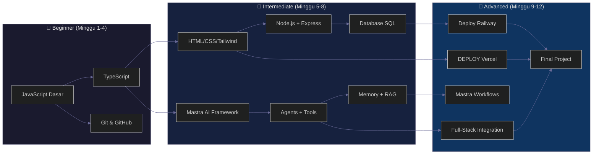

# 🗺️ RPL AI Curriculum

> **Kurikulum Rekayasa Perangkat Lunak Era AI — 3 Bulan × 2x/Minggu**
> Dari nol sampai bisa bikin AI-powered web app + deploy.

[](https://docsify.js.org)
[](https://nodejs.org)
[](https://mastra.ai)
[](https://typescriptlang.org)

 

---

## Pilih Jalur Belajar

Seperti [roadmap.sh](https://roadmap.sh), kamu bisa pilih jalur sesuai minat:

| 🧭 Jalur | 🎯 Target | ⏱️ Estimasi |
|----------|-----------|-------------|
| [**🌐 Full-Stack Web**](paths/04-fullstack.md) ✅ _recommended_ | Website + API + AI Agent | 12 minggu |
| [**🎨 Frontend Web**](paths/01-frontend-web.md) | HTML/CSS/JS + React | 8 minggu |
| [**⚙️ Backend API**](paths/02-backend-api.md) | Node.js + Express + Database | 8 minggu |
| [**🤖 AI Agent**](paths/03-ai-agent.md) | Mastra + Agents + RAG | 8 minggu |

---

## Peta Belajar (Roadmap)




---

## Modul

> Urutan: dari kiri ke kanan di roadmap. Tiap modul butuh modul sebelumnya.

| # | Modul | Level | Jam | Prasyarat |
|---|---|---|---|---|
| 0 | **[Fundamental Pemrograman & Web](00-fundamentals/)** | 🌱 Beginner | 4 | — |
| 1 | **[JavaScript Fundamentals](01-js-fundamentals/)** | 🌱 Beginner | 8 | Modul 0 |
| 2 | **[Algorithms & Data Structures](02-algorithms-data-structures/)** | 🌱 Beginner | 8 | Modul 1 |
| 3 | **[TypeScript Basics](03-typescript/)** | 🌱 Beginner | 4 | Modul 1 |
| 4 | **[Web Basics (HTML/CSS/Tailwind)](04-web-basics/)** | 🌱 Beginner | 6 | Modul 0 |
| 5 | **[Git & GitHub + Deploy](05-git-deploy/)** | 🌱 Beginner | 4 | Modul 0 |
| 6 | **[Node.js & Express + Database SQL](06-node-express/)** | 📐 Intermediate | 9 | Modul 1, 3 |
| 7 | **[Mastra AI — Agents, Tools, Memory & RAG](07-mastra-ai/)** | 📐 Intermediate | 12 | Modul 1, 3 |
| 8 | **[Final Project](08-project/)** | 🚀 Advanced | 8 | Semua |
| 9 | **[Testing — Vitest & Integration](09-testing/)** | 🚀 Advanced (Elektif) | 4 | Modul 6 |
| 10 | **[Design Patterns](10-design-patterns/)** | 📐 Intermediate | 6 | Modul 3 |
| 11 | **[System Design](11-system-design/)** | 📐 Intermediate | 4 | Modul 6 |
| 12 | **[UI/UX Design](12-ui-ux-design/)** | 📐 Intermediate | 6 | — |
| 13 | **[Flutter Mobile](13-flutter-mobile/)** | 📐 Intermediate | 8 | Modul 3 |
| 14 | **[Cybersecurity for Dev](14-cybersecurity/)** | 📐 Intermediate | 4 | Modul 6 |
| 15 | **[Agile & Scrum](15-agile-scrum/)** | 📐 Intermediate | 3 | — |
| 16 | **[Realtime Apps (WebSocket)](16-realtime-apps/)** | 🚀 Advanced | 4 | Modul 6 |
| 17 | **[Advanced Database](17-advanced-database/)** | 🚀 Advanced | 4 | Modul 7 |
| 18 | **[AI Prompt Engineering](18-ai-prompt-engineering/)** | 🚀 Advanced | 3 | Modul 1 |
| 19 | **[Technical Interview](19-technical-interview/)** | 🚀 Advanced | 4 | Semua |
| 20 | **[Frontend Frameworks](20-frontend-frameworks/)** | 📐 Intermediate | 6 | Modul 4 |
| 21 | **[Docker](21-docker/)** | 🚀 Advanced | 4 | Modul 6 |
| 22 | **[Monorepo](22-monorepo/)** | 🚀 Advanced | 3 | Modul 6 |
| 23 | **[System Runtime & Async](23-system-runtime/)** | 📐 Intermediate | 8 | Modul 1 |
|| 24 | **[Resilience Patterns](24-resilience-patterns/)** | 🚀 Advanced | 6 | Modul 6, 18 |
|| 25 | **[Soft Skills & Professional](25-soft-skills/)** | 🌱 Beginner | 4 | — |
|| 26 | **[Pragmatic Programming & Clean Code](26-pragmatic-programming/)** | 🌱 Beginner | 4 | Modul 1 |
|| 27 | **[Linux Terminal Mastery](27-linux-terminal/)** | 🌱 Beginner | 4 | Modul 0 |
|| 28 | **[REST API Design & Documentation](28-rest-api-design/)** | 📐 Intermediate | 4 | Modul 6 |
|| 29 | **[Cloud Computing & Serverless](29-cloud-computing/)** | 📐 Intermediate | 4 | Modul 6 |
|| 30 | **[GraphQL & tRPC](30-graphql-trpc/)** | 🚀 Advanced | 4 | Modul 6 |
|| 31 | **[Auth & Identity Deep Dive](31-auth-identity/)** | 🚀 Advanced | 5 | Modul 6 |
|| 32 | **[Performance Optimization](32-performance/)** | 🚀 Advanced | 4 | Modul 4 |
|| 33 | **[Data Visualization](33-data-visualization/)** | 📐 Intermediate | 4 | Modul 4 |
|| 34 | **[PWA & Offline-First](34-pwa-offline/)** | 🚀 Advanced | 5 | Modul 4 |
|| 35 | **[HTML & CSS Dasar](35-html-css-intro/)** | 🌱 Beginner | 4 | Modul 0 |
|| 36 | **[Frontend & Backend Architecture](36-web-architecture/)** | 🌱 Beginner | 4 | Modul 0 |
|| 37 | **[Database Introduction](37-database-intro/)** | 🌱 Beginner | 4 | Modul 0 |
|| 38 | **[AI-Assisted Dev Workflow](38-ai-dev-workflow/)** | 🚀 Advanced | 4 | Modul 1 |
|| 39 | **[Payment Integration](39-payment-integration/)** | 🚀 Advanced | 4 | Modul 6 |
|| 40 | **[Background Jobs & Queue](40-background-jobs/)** | 🚀 Advanced | 4 | Modul 6 |
|| 41 | **[Monitoring & Error Tracking](41-monitoring/)** | 🚀 Advanced | 4 | Modul 6 |
|| 42 | **[File Upload & Storage](42-file-upload/)** | 📐 Intermediate | 4 | Modul 6 |
|| 43 | **[Search Implementation](43-search-implementation/)** | 🚀 Advanced | 4 | Modul 6 |
|| 44 | **[Digital Portfolio & Branding](44-portfolio-branding/)** | 🌱 Beginner | 4 | Modul 4 |
|| 45 | **[Internationalization (i18n)](45-internationalization/)** | 🚀 Advanced | 4 | Modul 20 |

### Elektif

| Modul | Level | Jam |
|-------|-------|-----|
| [React Dasar](electives/01-react-intro.md) | 📐 Intermediate | 6 |
| [Next.js](electives/02-nextjs.md) | 🚀 Advanced | 6 |

## 🏆 Capstone Projects

Project besar yang ngetes semua skill. Cocok buat final project atau portofolio.

| # | Capstone | AI Fitur |
|---|----------|----------|
| 1 | [AI Study Assistant](capstones/01-ai-study-assistant/) | AI tutor, quiz generator, RAG |
| 2 | [AI Travel Planner](capstones/02-ai-travel-planner/) | Agent itinerary, weather, budget |
| 3 | [E-Commerce + AI](capstones/03-ecommerce-ai/) | Product recs, semantic search, chatbot |
| 4 | [AI Content Hub](capstones/04-ai-content-hub/) | AI write, summarize, auto-tag |
| 5 | [Coding Bootcamp](capstones/05-coding-bootcamp/) | AI code review, exercise gen, tutor |
| 6 | [Community Q&A](capstones/06-community-qa/) | AI answer suggestions, auto-tag, moderation |

> Tiap capstone punya sprint plan 8 minggu, data model, API spec, dan rubrik penilaian.

---

## Cara Pakai Repo Ini

### 📖 Baca sebagai Website

Repo ini pake [Docsify](https://docsify.js.org) — tinggal buka `index.html`:

```bash
# Opsi 1: Buka langsung
npx docsify serve .

# Opsi 2: Buka index.html di browser
# (Docsify CDN-loaded, koneksi internet required)
```

### 📄 Export sebagai PDF

```bash
# Pakai md-to-pdf
npx md-to-pdf README.md

# Atau pakai pandoc
pandoc README.md -o kurikulum.pdf --from markdown --to pdf
```

### 🖥️ Baca langsung di GitHub

Repo ini pure markdown — render otomatis di GitHub. Mulai dari [README](README.md).

---

## Prasyarat

| Skill | Level |
|-------|-------|
| Bisa pakai komputer (browser, file manager) | Dasar |
| Logika dasar (ngerti flowchart, urutan langkah) | Dasar |
| Bahasa Inggris (baca dokumentasi — dibantu AI) | Bisa dibantu |
| **Tidak perlu** pengalaman coding sebelumnya | — |

---

## Tools yang Dipakai

| Tools | Untuk | Gratis? |
|-------|-------|---------|
| [Node.js](https://nodejs.org) | Runtime JavaScript/TypeScript | ✅ |
| [VS Code](https://code.visualstudio.com) | Code editor | ✅ |
| [Git](https://git-scm.com) | Version control | ✅ |
| [GitHub](https://github.com) | Repo hosting + portfolio | ✅ |
| [Mastra AI](https://mastra.ai) | AI framework | ✅ |
| [Ollama](https://ollama.com) | Local AI (opsional) | ✅ |
| [Tailwind CSS](https://tailwindcss.com) | CSS framework | ✅ |
| [Vercel](https://vercel.com) | Deploy frontend | ✅ (free tier) |
| [Railway](https://railway.app) | Deploy backend | ✅ (free tier) |


---

## 📦 Supplementary Resources

Selain modul, repo ini juga punya:

| Sumber | Deskripsi |
|--------|-----------|
| [📋 Exercises](exercises/) | Latihan per modul (JS + DSA + others) |
| [🎯 Mini Projects](mini-projects/) | 5 project kecil selesai 1-2 sesi |
| [🚀 Project Ideas](projects/) | 15 ide project (easy → advanced + AI) |
| [🛠️ Starter Templates](templates/) | Template TypeScript, Express, Mastra |
| [📖 Glossary](glossary/) | Istilah teknis bahasa Indonesia |
| [📦 Deployment Guides](guides/) | Vercel, Railway, VPS deployment steps |
| [👨‍🏫 Teacher Guide](teacher-guide/) | Panduan ngajar per sesi (buat guru) |
| [📊 Grading Rubric](grading/) | Rubrik penilaian tugas + final project |
| [💼 Career Guide](career/) | CV, GitHub portfolio, LinkedIn tips |
| [⚙️ CI/CD](.github/workflows/) | GitHub Actions auto-test + deploy |

> Semua file `.md` — bisa dibaca langsung di GitHub atau lewat Docsify.

---

## Kontribusi

Kurikulum ini open untuk feedback & perbaikan.  
Buka issue atau pull request kalo ada saran.

---

## Lisensi

MIT — bebas dipake, diubah, disebarin buat pembelajaran.
