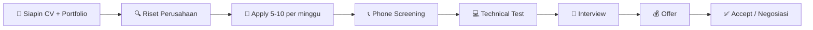

# 💼 Panduan Karir

> Panduan lengkap buat siswa RPL AI mulai dari bikin CV sampe negosiasi gaji.
> Semua dalam Bahasa Indonesia, fokus di industri teknologi Indonesia.

---

## 📋 Daftar Isi

| # | Topik | Level |
|---|-------|-------|
| 1 | CV Template & Tips | 🌱 Beginner |
| 2 | Portfolio Tips | 🌱 Beginner |
| 3 | GitHub Portfolio | 🌱 Beginner |
| 4 | LinkedIn Optimization | 🌱 Beginner |
| 5 | Interview Prep — Teknis | 📐 Intermediate |
| 6 | Interview Prep — Behavioral | 📐 Intermediate |
| 7 | Freelance Guide | 📐 Intermediate |
| 8 | Salary Negotiation | 🚀 Advanced |
| 9 | Networking | 🌱 Beginner |
| 10 | Personal Branding | 🌱 Beginner |
| 11 | Soft Skills for Dev | 🌱 Beginner |
| 12 | Career Path Options | 📐 Intermediate |
| 13 | Interview Q&A Bank | 📐 Intermediate |
| 14 | Cover Letter Guide | 🌱 Beginner |
| 15 | Job Search Strategy | 📐 Intermediate |

---

## 1. CV Template & Tips

### Format CV

| Elemen | Wajib? | Tips |
|--------|--------|------|
| Nama + Kontak | ✅ | Email profesional (bukan `si paling ganteng@...`) |
| Foto | Optional | Profesional, background rapi |
| Pendidikan | ✅ | SMK RPL + tahun |
| Skills | ✅ | Utamakan yang beneran bisa, bukan cuma nama |
| Projects | ✅ | 3 project terbaik link GitHub + demo |
| Pengalaman | Optional | Organisasi, freelance, internship |
| Sertifikat | Optional | Cuma kalau relevan (Dicoding, AWS, dll) |

**Panjang:** 1 halaman. **Format:** PDF (bukan DOCX).

### Contoh CV

```markdown
# BUDI SANTOSO
📧 budi.santoso@email.com | 📱 0812-3456-7890
🔗 github.com/budisantoso | 💼 linkedin.com/in/budisantoso
🌐 budisantoso.vercel.app

## Pendidikan
**SMK Negeri 1 Jakarta** — Rekayasa Perangkat Lunak (2023-2026)
- Rata-rata nilai: 88
- Aktif di ekstrakurikuler coding club

## Skills
- **Frontend:** HTML, CSS, Tailwind, React, TypeScript
- **Backend:** Node.js, Express, PostgreSQL, Prisma
- **AI:** Mastra AI, Prompt Engineering, OpenAI API
- **Tools:** Git, Docker, Linux, VS Code, Figma
- **Soft Skills:** Public speaking, teamwork, problem solving

## Projects
### 1. AI Todo App (2025)
Fullstack todo app dengan AI summarize pake Mastra.
- React + TypeScript frontend, Express + PostgreSQL backend
- AI agent bisa summarize notes pake OpenAI
- Deploy di Vercel + Railway
- 🔗 [GitHub](https://github.com/budisantoso/ai-todo) | [Live Demo](https://ai-todo.vercel.app)

### 2. Weather Dashboard (2024)
Dashboard cuaca real-time pake OpenWeather API.
- Fetch API, Tailwind CSS, responsive
- Fitur search kota, forecast 5 hari
- Dark mode toggle
- 🔗 [GitHub](https://github.com/budisantoso/weather-dash)

### 3. CLI Chatbot (2024)
Chatbot di terminal dengan Mastra AI agent.
- Agent dengan tools kalkulator dan cuaca
- Memory untuk ingat percakapan
- TypeScript + tsx runner
- 🔗 [GitHub](https://github.com/budisantoso/cli-chatbot)

## Sertifikat
- Dicoding: Belajar Dasar JavaScript (2024)
- AWS: Cloud Practitioner (2025)
- RPL AI: Fullstack Development (2025)
```

### Tips CV

1. **Keywords** — sesuaikan dengan role yang dilamar. Kalau lamar frontend, tonjolin React/CSS
2. **Quantify** — jangan cuma "membuat website", tapi "membuat website yang diakses 1000 user/hari"
3. **ATS Friendly** — jangan pake template aneh, PDF polos aja
4. **No Lies** — jangan bohong. Di wawancara ketahuan
5. **Update** — update tiap 3 bulan sekali

### CV untuk Berbagai Role

#### Frontend Developer CV (Fokus)

```markdown
## Skills
- React, Next.js, TypeScript, Tailwind CSS, Framer Motion
- Responsive design, accessibility, Web Vitals
- Figma to code, component library

## Projects
### E-Commerce Dashboard (2025)
React + TypeScript + Recharts + Tailwind
- 10+ interactive charts, real-time data
- Dark mode, responsive, accessible (WCAG AA)
- Performance: Lighthouse 95+
```

#### Backend Developer CV (Fokus)

```markdown
## Skills
- Node.js, Express, PostgreSQL, Redis, Docker
- REST API design, microservices, message queue
- Auth (JWT, OAuth), testing (Vitest, Supertest)

## Projects
### Payment Gateway API (2025)
Express + PostgreSQL + Redis
- 15+ REST endpoints, OpenAPI docs
- Rate limiting, idempotency, webhook handling
- 90% test coverage
```

---

## 2. Portfolio Tips

### Wajib Punya

| Item | Platform | Contoh |
|------|----------|--------|
| Landing page | Vercel | namakamu.vercel.app |
| GitHub | GitHub | github.com/namakamu |
| LinkedIn | LinkedIn | linkedin.com/in/namakamu |

### Portfolio Website Structure

```
├── Hero — Nama, tagline, CTA "Lihat Project"
├── About — 2-3 kalimat, foto
├── Skills — Icon per teknologi
├── Projects — 3-5 kartu project
│   ├── Screenshot/GIF
│   ├── Tech stack
│   ├── Link GitHub + Demo
│   └── 1 line description
├── Experience — Freelance / organisasi
├── Contact — Form atau link sosmed
└── Footer — Copyright, sosmed
```

### Yang Bikin Portfolio Stand Out

1. **Live demo** yang jalan — bukan cuma screenshot
2. **README rapi** di setiap repo
3. **Commit history** menunjukkan progress
4. **Mobile responsive**
5. **Performance bagus** (Lighthouse score > 80)
6. **Custom domain** (namakamu.com, lebih profesional)
7. **Interactive elements** — animasi, micro-interactions
8. **Testimonials** — dari guru, client, atau mentor

### Portfolio Examples

**Minimal:**
```html
<section id="projects">
  <h2>My Projects</h2>
  <div class="project-card">
    
    <h3>AI Todo App</h3>
    <p>Fullstack todo dengan AI summarize</p>
    <div class="tech-badges">
      <span>React</span><span>TypeScript</span><span>Mastra</span>
    </div>
    <a href="https://github.com/..." >GitHub</a>
    <a href="https://demo.vercel.app">Live Demo</a>
  </div>
</section>
```

**Advanced:**
```tsx
// Portfolio project card dengan GitHub stats auto-fetch
export function ProjectCard({ repo }: { repo: string }) {
  const { data: stats } = useSWR(`/api/github/${repo}`, fetcher);
  return (
    <div className="project-card">
      <Image src={stats?.screenshot} alt={stats?.name} />
      <h3>{stats?.name}</h3>
      <p>{stats?.description}</p>
      <div className="flex gap-2">
        <span>⭐ {stats?.stars}</span>
        <span>⑂ {stats?.forks}</span>
      </div>
    </div>
  );
}
```

---

## 3. GitHub Portfolio

**Repo yang wajib ada:**
- Landing page pribadi
- Final project (full-stack + AI)
- 3-5 mini project

### Cara bikin README bagus:

```markdown
# Nama Project

Deskripsi: 2-3 kalimat.

## Tech Stack
TypeScript, Express, PostgreSQL, Mastra AI

## Fitur
- CRUD notes
- AI summarize
- Search

## Live Demo
[namaku.vercel.app](https://namaku.vercel.app)

## Cara Run
1. Clone
2. npm install
3. npm run dev

## Screenshot


## AI Usage
- ChatGPT: bantu debug
- Claude: generate error handling
```

### Commit message yang baik:

```
feat: tambah fitur login
fix: perbaiki bug kalkulator bagi 0
docs: update README
refactor: pindahkan fungsi ke file terpisah
test: tambah test untuk auth middleware
style: format code dengan prettier
```

### GitHub Profile README:

Buat repo `github.com/namakamu/namakamu` dengan README yang nampil di profil GitHub. Contoh:

```markdown
# Halo! 👋 Saya Budi

💻 Fullstack Developer | 🤖 AI Enthusiast | 🎓 SMK RPL

## Tech Stack


## Stats

```

### Open Source Contribution

Cara mulai kontribusi open source:

1. Cari repo dengan label `good first issue` atau `help wanted`
2. Baca CONTRIBUTING.md
3. Fork repo, bikin branch
4. Fix issue (mulai dari typo fix / docs improvement)
5. Submit PR
6. Maintain komunikasi dengan maintainer

### GitHub Activity Tracker

```markdown
## Weekly Activity
- Monday: 3 commits — feat: search filter
- Tuesday: PR review for team member
- Wednesday: fix: pagination bug
- Thursday: docs: update API docs
- Friday: feature: dark mode toggle
```

> Target: Minimal 5 commit per minggu untuk portfolio aktif.

---

## 4. LinkedIn Optimization

### Checklist Profile

- [ ] **Foto profesional** — bukan foto selfie/party
- [ ] **Headline** — "Student at SMK ... | Aspiring Software Engineer | TypeScript | Node.js | AI"
- [ ] **About section** — 3-4 kalimat highlight skill
- [ ] **Featured** — Pin 3 project terbaik (link GitHub + demo)
- [ ] **Skills** — Tambahin yang beneran dikuasai, minta endorsement
- [ ] **Experience** — Masukin project sebagai experience ("Self-employed")
- [ ] **Education** — SMK, jurusan RPL
- [ ] **Certifications** — Dicoding, AWS, RPL AI, dll
- [ ] **Languages** — Indonesia (native), English (sesuai kemampuan)

### Headline Examples

❌ "Student" — terlalu umum
✅ "SMK RPL Student | Fullstack Developer (React + Node.js) | AI Enthusiast"
✅ "Aspiring Software Engineer | TypeScript • React • Node.js • AI"
✅ "Junior Fullstack Developer | Building AI-powered web apps"

### About Section Template

```markdown
Saya adalah siswa SMK jurusan Rekayasa Perangkat Lunak dengan pengalaman 
membangun fullstack web application menggunakan TypeScript, React, Node.js, 
dan PostgreSQL. Saya juga tertarik dengan AI Agent development menggunakan 
Mastra AI framework.

🏆 Final project: AI-powered Todo App (terdeploy di Vercel + Railway)
💻 3+ mini projects: Weather dashboard, CLI chatbot, CRUD API
🤖 Exploring AI agents, RAG, dan prompt engineering

Saya aktif mencari kesempatan magang / junior developer position.
Let's connect! 🚀
```

### LinkedIn Activity

- Post 1x seminggu (belajar apa, project apa, error apa)
- Comment di postingan tech influencer Indonesia
- Join grup: "Developer Indonesia", "ReactJS Indonesia"
- Minta recommendation dari guru/mentor

### Content Ideas for LinkedIn

| Content Type | Contoh | Frekuensi |
|-------------|--------|-----------|
| Learning update | "Hari ini belajar Docker, bikin container pertama 🐳" | 1x/minggu |
| Project showcase | "Final project udah di deploy! Cek yuk 👇" | 1x/bulan |
| Error story | "Error 3 jam gara-gara lupa await 🤦‍♂️" | 1x/2 minggu |
| Tips | "3 tips buat新手 belajar TypeScript" | 1x/bulan |
| Achievement | "Dapet sertifikat AWS Cloud Practitioner 🎉" | Saat ada |

---

## 5. Interview Prep — Teknis

### Technical Interview Topics by Role

#### Frontend

| Topik | Contoh Soal |
|-------|-------------|
| HTML/CSS | Flexbox vs Grid, semantic HTML |
| JavaScript | Closure, Promise, async/await |
| React | useState, useEffect, props drilling |
| TypeScript | Interface vs Type, generics |

#### Backend

| Topik | Contoh Soal |
|-------|-------------|
| Node.js | Event loop, middleware |
| Express | Routing, error handling |
| Database | JOIN, indexing, normalization |
| Auth | JWT, session, OAuth |

#### Fullstack
Semua di atas + deployment, Docker basic

#### AI/ML (Junior)

| Topik | Contoh Soal |
|-------|-------------|
| Prompt engineering | Chain-of-thought, few-shot |
| RAG | Retrieval, chunking, embedding |
| Mastra | Agent, tools, memory, workflow |

### Coding Interview Strategy

1. **Pahami problem** — tanya clarifying questions
2. **Beri contoh** — test case manual
3. **Brute force** — sampaikan solusi kasar
4. **Optimalkan** — improve time/space complexity
5. **Write code** — pseudocode dulu, baru syntax
6. **Test** — trace through test case
7. **Big O** — sebutkan complexity

### Platform Latihan

| Platform | Fokus | Gratis? |
|----------|-------|---------|
| LeetCode | Algorithm | ✅ (limited) |
| HackerRank | Algorithm + SQL | ✅ |
| Codewars | Algorithm | ✅ |
| Frontend Mentor | Frontend | ✅ (free tier) |
| InterviewBit | System Design | ✅ |

### Whiteboard / Online Coding Tips

1. **Tulis function signature dulu** — parameter, return type
2. **Comment your thought process** — "first I'll sort, then binary search"
3. **Handle edge cases** — empty input, single element, duplicates
4. **Talk while coding** — jelasin apa yang lo tulis
5. **Test with examples** — jalankan manual dengan contoh

---

## 6. Interview Prep — Behavioral

### STAR Method

| S | Situation | Konteks |
| T | Task | Tugas lo |
| A | Action | Yang lo lakukan |
| R | Result | Hasilnya |

### Contoh STAR

**Pertanyaan:** Ceritain project paling challenging

**STAR Answer:**
> **S:** Di final project, saya bikin AI Todo App. Deadline 2 minggu, saya baru belajar Mastra.
> **T:** Saya harus deliver fullstack app dengan AI fitur dalam 2 minggu.
> **A:** Saya breakdown jadi 3 sprint: (1) backend CRUD, (2) frontend, (3) AI integration. Setiap hari progress 1 fitur. Pas nyoba Mastra error terus, saya baca dokumentasi + tanya di Discord.
> **R:** Aplikasi selesai tepat waktu, AI summarize jalan, dan dapet nilai A. Saya juga jadi bisa Mastra.

### Common Behavioral Questions

1. **"Ceritain tentang diri kamu"** — 2 menit: nama, sekolah, skill, project, goals
2. **"Kenapa mau kerja di sini?"** — riset perusahaan dulu
3. **"Kelemahan kamu?"** — pilih kelemahan riil + cara ngatasin
4. **"Gimana cara belajar teknologi baru?"** — proyek kecil, dokumentasi, YouTube
5. **"Konflik dengan tim?"** — akui, jelaskan cara selesaikan

### Pertanyaan untuk Ditanyakan ke Interviewer

| Pertanyaan | Tujuan |
|-----------|--------|
| "Tech stack yang dipake apa?" | Tahu lo tertarik secara teknis |
| "Seperti apa daily standup di sini?" | Tahu budaya kerja |
| "Apa ekspektasi untuk role ini di 3 bulan pertama?" | Tahu prioritas |
| "Bagaimana proses code review?" | Tahu quality standard |
| "Ada kesempatan belajar / training?" | Tahu growth opportunity |

---

## 7. Freelance Guide

### Platform Freelance

| Platform | Cocok untuk | Fee |
|----------|-------------|-----|
| Upwork | Global client | 20% |
| Freelancer | Global | 10-20% |
| Sribulancer | Indonesia | 10% |
| Projects.co.id | Indonesia | 5% |
| LinkedIn | Direct client | 0% |

### Cara Mulai Freelance

1. **Buat profile** di 2-3 platform
2. **Portfolio** — 3 project terbaik
3. **Mulai kecil** — ambil project murah dulu (Rp500K-1jt) buat dapetin review
4. **Professional** — tepat waktu, komunikasi baik, deliver sesuai spec
5. **Scale** — naikin rate setelah dapet 5+ review positif

### Rate Guide (Indonesia, Junior)

| Layanan | Rate/jam | Rate/project |
|---------|----------|--------------|
| Landing page HTML/CSS | Rp50-100K | Rp500K-2jt |
| Website company profile | Rp75-150K | Rp2-5jt |
| REST API sederhana | Rp100-200K | Rp3-8jt |
| Fullstack app | Rp150-300K | Rp5-15jt |
| AI integration | Rp200-500K | Rp8-20jt |

### Freelance Contract Template

```markdown
## SURAT PERJANJIAN KERJA (FREELANCE)

**Pihak 1 (Klien):** [Nama Klien]
**Pihak 2 (Freelancer):** [Nama Kamu]

**Project:** [Judul Project]
**Deadline:** [Tanggal]
**Biaya:** Rp [Jumlah]

**Lingkup Pekerjaan:**
1. [Fitur 1]
2. [Fitur 2]
3. [Fitur 3]

**Pembayaran:**
- DP 50%: Rp [Jumlah]
- Pelunasan 50%: Rp [Jumlah] (setelah selesai)

**Catatan:**
- Revisi maksimal 2x
- Diluar revisi dikenakan biaya tambahan
- Source code diserahkan setelah pelunasan

[Tanda Tangan]
```

### Tips Sukses Freelance

1. **Komunikasi proaktif** — update progress tiap 2-3 hari
2. **Manage scope** — jangan takut bilang "ini di luar scope, ada biaya tambahan"
3. **Simpan backup** — commit di GitHub, backup ke Google Drive
4. **Bayar pajak** — freelance > Rp500jt/tahun kena PPh
5. **Minta testimoni** — setelah selesai, minta review di profile

---

## 8. Salary Negotiation

### Riset Gaji

| Role | Junior (<1 thn) | Mid (1-3 thn) | Senior (3+ thn) |
|------|----------------|---------------|-----------------|
| Frontend | Rp4-7jt | Rp7-15jt | Rp15-30jt+ |
| Backend | Rp5-8jt | Rp8-18jt | Rp18-35jt+ |
| Fullstack | Rp5-8jt | Rp8-18jt | Rp18-35jt+ |
| AI/ML Junior | Rp6-10jt | Rp10-20jt | Rp20-40jt+ |
| DevOps | Rp6-10jt | Rp10-22jt | Rp22-45jt+ |

**Sumber data:** Glassdoor, LinkedIn, Fishbowl, tanya teman

### Faktor yang Mempengaruhi Gaji

1. **Lokasi** — Jakarta lebih tinggi dari daerah
2. **Perusahaan** — startup lebih rendah dari corporate
3. **Skill** — AI/ML specialist > generalist
4. **Portfolio** — project yang terdeploy + digunakan orang
5. **Sertifikasi** — AWS, Google Cloud, Dicoding

### Strategi Negosiasi

1. **Jangan sebut angka pertama** — "Saya open, sesuai budget perusahaan berapa?"
2. **Tanya range** — "Untuk posisi ini, range gajinya berapa?"
3. **Value-based** — jangan bilang "saya butuh uang", bilang "saya bawa skill X dan Y"
4. **Total comp** — gaji + BPJS + bonus + THR + fasilitas (laptop, internet)
5. **Follow up** — kalau ditolak, "Apakah ada kemungkinan review setelah 3 bulan?"

### Script Negosiasi

```
HR: "Gaji yang kami tawarkan Rp5 juta."
Kamu: "Terima kasih untuk penawarannya. Dengan skill yang saya miliki
(TypeScript, React, Node.js, dan portfolio project yang sudah terdeploy),
saya berharap di angka Rp6,5-7 juta. Apakah ada kemungkinan?"

HR: "Maaf, budget maksimal Rp5,5 juta."
Kamu: "Kalau gitu, bagaimana kalau saya mulai Rp5,5 juta dengan review 
setelah 3 bulan? Saya yakin bisa menunjukkan kontribusi."
```

### Hal yang Gak Boleh Dilakukan

❌ Bilang "saya butuh banget kerja"
❌ Bandingin dengan tawaran lain (kecuali emang ada)
❌ Terima langsung tanpa mikir
❌ Gak riset gaji pasar
❌ Negosiasi di phone screening (tunggu offer resmi)

---

## 9. Networking

### Platform Networking

| Platform | Cara Pakai |
|----------|------------|
| LinkedIn | Connect + DM dengan sopan |
| Twitter/X | Follow tech people, reply/quote |
| Discord | Join server komunitas (IDDevs, RPL AI) |
| Telegram | Group developer Indonesia |
| Meetup/Event | Tech gathering, hackathon |

### Cara DM yang Baik

❌ "Halo, saya mau nanya" (langsung minta tanpa konteks)
✅ 
```
Halo Kak [Nama], saya Budi, siswa SMK RPL. Saya lihat kakak 
kerja di [Perusahaan] sebagai frontend developer. Saya juga 
sedang belajar React. Boleh minta saran roadmap belajar? 
Terima kasih 🙏
```

### Follow Up Networking

Setelah connect atau ketemu di event:

```
Halo Kak [Nama],
Terima kasih udah connect. Senang ketemu di event [Nama Event] kemarin.
Tips dari kakak soal [topik] sangat membantu.
Semoga bisa ketemu lagi di event berikutnya! 🚀
```

### Event untuk Dihadiri

- **Developer Week** (Jakarta) — tiap tahun
- **Google I/O Extended** — local viewing party
- **Hackathon** (Compfest, Arkavidia, Gemastik)
- **Tech meetup** (ReactJS Indonesia, Node.js Indonesia)
- **Workshop Dicoding** — online/offline

---

## 10. Personal Branding

### Kenapa Personal Branding?

- Bedain lo dari 1000 lulusan RPL lain
- Bikin HR tertarik sebelum lo apply
- Networking jadi lebih gampang

### Cara Bangun Brand

1. **Blog/Notes** — tulis apa yang lo pelajari (pakai Hashnode/Dev.to)
2. **Post di LinkedIn** — 1x seminggu, "Hari ini saya belajar tentang X"
3. **Open source** — kontribusi ke project kecil, fix typo/doc
4. **YouTube/TikTok** — coding short, tips, error debugging
5. **Twitter** — sharing, retweet tech content

### Content Ideas

| Konten | Format | Platform |
|--------|--------|----------|
| "Error yang paling bikin saya pusing" | Thread | Twitter |
| "Cara bikin REST API 5 menit" | Video pendek | TikTok/YT Shorts |
| "Week 1 belajar React" | Post | LinkedIn |
| "Review project final" | Blog | Hashnode |
| "Tips lolos interview" | Article | LinkedIn |

---

## 11. Soft Skills for Dev

### Yang Paling Dicari HR

1. **Komunikasi** — bisa jelasin teknis ke non-teknis
2. **Problem solving** — gak panic kalau error
3. **Teamwork** — bisa kerja sama, nerima feedback
4. **Time management** — deadline, prioritas
5. **Continuous learning** — teknologi berubah terus, harus update

### Cara Nunjukin di Interview

❌ "Saya orangnya komunikatif"
✅ "Di project kemarin, saya lead tim 3 orang. Saya bikin task di Trello,
tiap pagi standup 5 menit, dan pas conflict, saya jadi mediator."

### Soft Skills Matrix

| Skill | Deskripsi | Cara Latihan |
|-------|-----------|-------------|
| Public speaking | Presentasi di depan kelas | Presentasi project, ikut demo day |
| Written communication | Nulis jelas | README, blog post, dokumentasi |
| Empathy | Ngerti perspektif orang lain | Pair programming, code review |
| Adaptability | Cepat belajar teknologi baru | Ganti stack tiap project |
| Leadership | Ngatur tim kecil | Lead project kelompok |

---

## 12. Career Path Options

### Path 1: Full-time Employee

| Level | Title | Estimasi Gaji |
|-------|-------|---------------|
| Junior (<1yr) | Junior Developer | Rp5-8jt |
| Mid (1-3yr) | Software Engineer | Rp8-18jt |
| Senior (3-5yr) | Senior Engineer | Rp18-35jt |
| Lead (5-8yr) | Tech Lead | Rp30-50jt |
| Manager (8+yr) | Engineering Manager | Rp40-70jt+ |

### Path 2: Freelancer / Contractor

- Rate lebih tinggi (2-3x dari fulltime)
- Tapi gak ada stability (BPJS, THR)
- Perlu manage client sendiri

### Path 3: Startup Founder

- Build product sendiri
- High risk, high reward
- Butuh co-founder, fundraising

### Path 4: AI Specialist

- Prompt engineer, AI agent developer
- Masih niche, permintaan tinggi
- Gaji lebih tinggi dari web dev biasa

### Path 5: DevOps / SRE

- Infrastructure, CI/CD, cloud
- Butuh Linux + networking skill
- Remote-friendly

### Skill Progression Timeline

```markdown
Tahun 1: HTML, CSS, JavaScript, Git, basic React/Node
Tahun 2: TypeScript, database, Express, deployment, 1 project besar
Tahun 3: Mastra AI, testing, Docker, CI/CD, system design basic
Tahun 4+: Architecture, cloud, performance, mentoring
```

---

## 13. Interview Q&A Bank

### JavaScript

**Q1:** Apa bedanya `var`, `let`, `const`?
**A:** `var` function-scoped, bisa redeclare. `let` block-scoped, bisa reassign. `const` block-scoped, tidak bisa reassign.

**Q2:** Jelaskan closure dengan contoh.
**A:** Closure adalah function yang "mengingat" scope tempat dia dibuat, bahkan setelah outer function selesai.
```javascript
function counter() {
  let count = 0;
  return function() {
    count++;
    return count;
  };
}
const myCounter = counter();
console.log(myCounter()); // 1
console.log(myCounter()); // 2
```

**Q3:** Apa itu event loop?
**A:** Mekanisme yang nge-handle async operations. Call stack → Web APIs → Callback queue → Event loop ngecek kalau call stack kosong, ambil dari callback queue.

**Q4:** Bedanya `==` dan `===`?
**A:** `==` loose equality (type coercion), `===` strict equality (cek type + value).

**Q5:** Apa itu Promise? bedanya dengan callback?
**A:** Promise adalah object yang merepresentasikan operasi async. Lebih rapi dari callback karena `.then()` chain, handle error dengan `.catch()`.

**Q6:** Jelaskan `this` keyword.
**A:** `this` mengacu ke object yang "memanggil" function. Di arrow function, `this` mengikuti lexical scope.

**Q7:** Apa itu hoisting?
**A:** JavaScript "mengangkat" deklarasi variable/function ke atas scope. `var` dihoisting dengan `undefined`, `let`/`const` dihoisting tapi gak diinitialize (Temporal Dead Zone).

**Q8:** Bedanya `.map()`, `.filter()`, `.reduce()`?
**A:** `.map()` transform setiap element, `.filter()` seleksi element, `.reduce()` akumulasi jadi satu nilai.

**Q9:** Apa itu debounce dan throttle?
**A:** Debounce: nunda eksekusi sampai jeda tertentu. Throttle: eksekusi maksimal 1x per interval. Dipakai buat search input, scroll event.

**Q10:** Jelaskan prototype inheritance.
**A:** Setiap object JS punya prototype. Object bisa "mewarisi" property/method dari prototype chain. ES6 class adalah syntactic sugar.

### React

**Q11:** Apa itu virtual DOM?
**A:** Representasi ringan dari real DOM di memory. React bandingkan (diff) virtual DOM sebelumnya dengan yang baru, lalu update minimal ke real DOM (reconciliation).

**Q12:** Bedanya props dan state?
**A:** Props: data dari parent, readonly. State: data internal component, bisa berubah, trigger re-render.

**Q13:** Apa itu useEffect? kasih contoh.
**A:** Hook untuk side effects (fetch data, subscription, DOM manipulation). Contoh:
```jsx
useEffect(() => {
  fetchUser(userId).then(setUser);
}, [userId]); // re-run kalau userId berubah
```

**Q14:** Bagaimana cara optimasi performa React?
**A:** `React.memo()`, `useMemo()`, `useCallback()`, lazy loading, virtual scroll, code splitting.

**Q15:** Apa itu custom hook?
**A:** Function yang pake hooks React. Ngabstraksi logic yang reusable antar component.
```jsx
function useLocalStorage(key, initial) {
  const [value, setValue] = useState(() => {
    return JSON.parse(localStorage.getItem(key)) || initial;
  });
  useEffect(() => localStorage.setItem(key, JSON.stringify(value)), [key, value]);
  return [value, setValue];
}
```

### TypeScript

**Q16:** Interface vs Type, bedanya?
**A:** Interface bisa extend, bisa declaration merging. Type bisa union/intersection. Interface prefered untuk object shapes, type untuk complex types.

**Q17:** Apa itu generics?
**A:** Parameter type. Bikin function/class type-safe tanpa specify type spesifik.
```typescript
function firstElement<T>(arr: T[]): T {
  return arr[0];
}
```

**Q18:** Apa itu utility types? Sebutkan 3.
**A:** Type bawaan TypeScript: `Partial<T>`, `Pick<T,K>`, `Omit<T,K>`, `Readonly<T>`, `Record<K,V>`.

**Q19:** Jelaskan discriminated union.
**A:** Union type dengan property pembeda (discriminant). Biasanya `type` atau `status`.
```typescript
type Result<T> = 
  | { status: "success"; data: T }
  | { status: "error"; message: string };
```

**Q20:** Apa itu `unknown` vs `any`?
**A:** `any` matikan type checking. `unknown` butuh type narrowing dulu sebelum dipake.

### Backend / Express

**Q21:** Bagaimana cara kerja middleware Express?
**A:** Function yang punya akses ke request, response, dan `next()`. Jalan secara berurutan (chain). Bisa untuk logging, auth, parsing.

**Q22:** Jelaskan JWT flow.
**A:** Login → server verify credential → generate JWT (header.payload.signature) → return ke client → client simpan di localStorage/HttpOnly cookie → tiap request kirim di Authorization header → server verify.

**Q23:** Bedanya SQL dan NoSQL?
**A:** SQL (PostgreSQL, MySQL): structured, relational, ACID. NoSQL (MongoDB, Redis): flexible schema, horizontal scaling, eventual consistency.

**Q24:** Apa itu indexing di database?
**A:** Struktur data yang mempercepat pencarian (SELECT) dengan mengorbankan write speed. Kayak indeks di buku.

**Q25:** Jelaskan ACID.
**A:** Atomicity (all or nothing), Consistency (data valid), Isolation (concurrent transaction), Durability (tersimpan meski crash).

**Q26:** Apa itu N+1 query problem?
**A:** Kejadian di mana query utama ambil N record, lalu tiap record trigger query tambahan. Total N+1 query. Solusi: eager loading (JOIN) atau batch loading.

**Q27:** Jelaskan database transaction.
**A:** Kumpulan operasi database yang dijalankan sebagai satu unit atomic. Kalau salah satu gagal, semua di-rollback. Contoh: transfer bank — debit + credit harus sukses berdua.

**Q28:** Bedanya `HAVING` dan `WHERE` di SQL?
**A:** `WHERE` filter baris sebelum GROUP BY. `HAVING` filter hasil agregasi setelah GROUP BY. Contoh: `HAVING COUNT(*) > 5`.

### System Design

**Q29:** Desain URL shortener.
**A:** API: POST /shorten, GET /:code. Hashing: Base62 encode. Database: id, url, code. Cache: Redis. Analytics: counter table. Redirect: 301/302.

**Q30:** Desain chat app.
**A:** WebSocket untuk real-time. Database: messages table (sender_id, receiver_id, content, timestamp). Redis Pub/Sub untuk broadcast ke banyak user. Presence service untuk online/offline status. Media sharing via CDN.

**Q31:** Jelaskan scaling strategy.
**A:** Vertical scale (bigger machine) vs Horizontal scale (more machines). Load balancer, database replication (read replicas), caching (Redis/CDN), microservices, sharding.

**Q32:** Apa itu CAP theorem?
**A:** Consistency, Availability, Partition Tolerance. Sistem terdistribusi cuma bisa penuhi 2 dari 3. Contoh: database NoSQL pilih AP (availability + partition), SQL pilih CP (consistency + partition).

**Q33:** Desain rate limiter.
**A:** Token bucket (token diisi per interval) atau Sliding window (request count di window waktu). Implementasi: Redis sorted sets (ZADD, ZREMRANGEBYSCORE, ZCARD) untuk sliding window per user. Return 429 Too Many Requests kalau limit exceeded.

### Data Structures & Algorithms

**Q34:** Jelaskan time complexity O(log n).
**A:** Algoritma yang memotong data setengah setiap langkah. Contoh: binary search. Input naik 2x, langkah naik cuma 1. Sangat efisien.

**Q35:** Bedanya array dan linked list?
**A:** Array: kontigu di memory, akses O(1), insert/delete O(n). Linked list: node terpisah, akses O(n), insert/delete O(1) (kalau punya pointer).

**Q36:** Apa itu hash collision? Gimana ngatasin?
**A:** Dua key berbeda dapat hash index yang sama. Solusi: chaining (linked list di tiap bucket), open addressing (cari slot kosong berikutnya).

**Q37:** Jelaskan binary search tree.
**A:** Tree di mana left child < parent < right child. Search O(log n) rata-rata. Worst case O(n) kalau unbalanced (mirip linked list). Solusi: AVL tree atau Red-Black tree.

**Q38:** Apa itu memoization?
**A:** Teknik caching hasil function berdasarkan input. Biar kalau dipanggil dengan input yang sama, tinggal return cache. Contoh: Fibonacci DP — tanpa memo O(2^n), dengan memo O(n).

### Docker & DevOps

**Q39:** Bedanya Docker image dan container?
**A:** Image = template read-only (kayak ISO). Container = instance jalan dari image (kayak VM). Image bisa bikin banyak container.

**Q40:** Apa itu multi-stage build di Docker?
**A:** Bikin image lebih kecil dengan stage terpisah: stage 1 (builder) install tools + compile, stage 2 (runner) cuma copy binary + dependencies runtime. Contoh: compile Go di stage 1, copy binary ke stage 2 tanpa Go SDK.

**Q41:** Apa fungsi docker-compose?
**A:** Define + run multi-container Docker apps. Satu file YAML define services (app, database, cache), network, volume. `docker compose up` jalanin semua.

**Q42:** Jelaskan CI/CD pipeline.
**A:** CI (Continuous Integration): tiap push kode, auto test + lint. CD (Continuous Deployment): setelah test lulus, auto deploy ke production. Tools: GitHub Actions, GitLab CI, Jenkins.

### HTML/CSS/Frontend

**Q43:** Apa itu CSS specificity?
**A:** Aturan prioritas CSS. Urutan: inline style (1000) > id (100) > class/attribute (10) > element (1). Makin tinggi specificity, makin menang.

**Q44:** Bedanya `display: none` dan `visibility: hidden`?
**A:** `display: none` — element hilang total, gak makan space. `visibility: hidden` — element gak kelihatan tapi tetep makan space.

**Q45:** Apa itu CSS Grid?
**A:** Layout 2 dimensi (baris + kolom). Cocok buat layout halaman kompleks. `display: grid`, `grid-template-columns`, `grid-template-rows`, `grid-area`.

**Q46:** Jelaskan event delegation di JavaScript.
**A:** Teknik pake 1 event listener di parent buat handle event dari child elements. Manfaat: performa lebih baik, handle dynamic elements. Pake `event.target` buat deteksi child mana yang diklik.

**Q47:** Apa itu debounce?
**A:** Nunda eksekusi function sampai user berhenti ngelakuin aksi. Contoh: search input — tunggu user berhenti ngetik 300ms baru fetch hasil.

### Testing

**Q48:** Bedanya unit test dan integration test?
**A:** Unit test: test function/class terisolasi (mock dependencies). Integration test: test gabungan komponen (API → database → response). Unit test cepet, integration test lebih realistik.

**Q49:** Apa itu mock?
**A:** Object palsu yang simulasi behavior dependency asli. Dipake di unit test biar test gak bergantung ke database / API eksternal. Contoh: `vi.mock('./database')` di Vitest.

**Q50:** Jelaskan TDD (Test Driven Development).
**A:** Red-Green-Refactor cycle: (1) tulis test yang FAIL dulu (Red), (2) tulis minimal code biar test PASS (Green), (3) refactor code. Tujuannya: code ter-test dari awal, design lebih baik.

---

## 14. Cover Letter Guide

### Template Cover Letter

```markdown
Kepada Yth. HRD [Nama Perusahaan],

Saya [Nama Kamu], siswa SMK jurusan Rekayasa Perangkat Lunak, 
tertarik untuk melamar posisi Junior Fullstack Developer di [Perusahaan].

Saya memiliki pengalaman membangun fullstack web application 
menggunakan React, TypeScript, Node.js, dan PostgreSQL. 
Project terakhir saya adalah AI Todo App yang terdeploy di 
Vercel + Railway dengan fitur AI summarize menggunakan Mastra.

Saya juga aktif belajar AI Agent development dan memiliki 
sertifikasi AWS Cloud Practitioner.

Saya yakin bisa berkontribusi di tim engineering [Perusahaan].
Terima kasih atas perhatiannya.

Best regards,
[Nama Kamu]
[Link Portfolio]
```

### Tips Cover Letter

1. Personalisasi — jangan copy paste untuk semua perusahaan
2. Mention nama perusahaan + posisi
3. Highlight 1-2 pencapaian spesifik
4. Maksimal 3 paragraf
5. Attach portfolio link

---

## 15. Job Search Strategy

### Timeline Mencari Kerja



### Portal Lowongan Kerja

| Portal | Kekhususan |
|--------|-----------|
| LinkedIn | Professional, networking |
| Glints | Entry level, internship |
| JobStreet | Umum, banyak perusahaan |
| Kalibrr | Startup Indonesia |
| Tech in Asia Jobs | Tech companies |
| eFishery, Gojek, Tokopedia careers | Langsung ke website |

### Target Apply

| Metrik | Target |
|--------|--------|
| Apply per minggu | 5-10 |
| Response rate | 10-20% |
| Interview per bulan | 2-5 |
| Offer per 3 bulan | 1-3 |

### Follow Up After Interview

1. **24 jam setelah:** Kirim thank-you email
2. **1 minggu:** Follow up jika belum ada kabar
3. **2 minggu:** Move on, apply yang lain

```
Halo Kak [Nama],
Terima kasih untuk kesempatan interview kemarin. 
Saya makin tertarik untuk bergabung di [Perusahaan].
Kalau ada update, saya tunggu kabarnya ya 🙏
```

---

## 📚 Resources

| Resource | Link | Untuk |
|----------|------|-------|
| Dicoding | dicoding.com | Sertifikasi programming |
| FreeCodeCamp | freecodecamp.org | Belajar gratis |
| Frontend Mentor | frontendmentor.io | Latihan frontend |
| LeetCode | leetcode.com | Latihan coding interview |
| Roadmap.sh | roadmap.sh | Roadmap belajar |
| Dev.to | dev.to | Blog + komunitas |
| LinkedIn Learning | linkedin.com/learning | Course profesional |

---

## 💡 Final Tips

1. **Mulai karir dari sekarang** — bukan nanti lulus
2. **Build in public** — biar orang tau progress lo
3. **Portfolio > Ijazah** — di tech, yang penting bisa bikin apa
4. **Network is net worth** — kenalan, jaga hubungan
5. **Gagal itu wajar** — ditolak 10x, lolos 1x udah cukup
6. **Bayar learning** — internship atau freelance dengan rate rendah masih oke untuk portofolio
7. **Jangan bandingin diri** — fokus sama progress sendiri

---

Selamat membangun karir! 🚀
