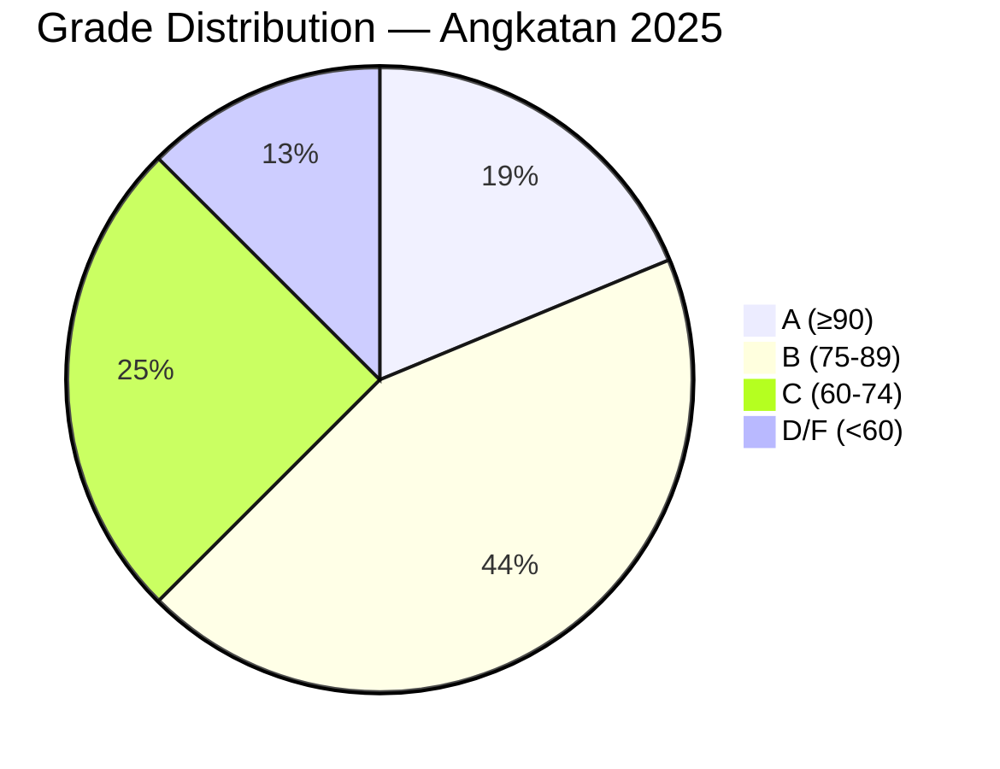
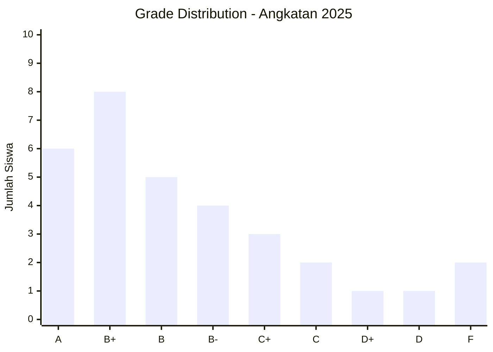

# 📊 Rubrik Penilaian — RPL AI Curriculum

> Rubrik lengkap buat semua komponen penilaian di RPL AI Curriculum.
> Berlaku untuk tugas mingguan, kuis, mini project, final project, partisipasi, dan presentasi.

---

## Format Penilaian

| Komponen | Bobot | Deskripsi |
|----------|-------|-----------|
| Tugas Mingguan | 30% | Latihan tiap sesi (coding, SQL, Git, design, dll) |
| Kuis | 10% | Quiz interaktif tiap modul (pilihan ganda, isian) |
| Mini Project | 20% | Project kecil selesai 1-2 sesi |
| Final Project | 35% | Capstone project akhir (full-stack + AI) |
| Partisipasi | 5% | Kehadiran & diskusi di kelas |

> **Total = 100%**

---

## Rubrik Tugas Mingguan

Skala: **0–3** per kriteria. Nilai akhir = (total poin ÷ total maksimal) × 100.

### Rubrik Coding (JavaScript/TypeScript)

| Kriteria | 0 (Tidak) | 1 (Kurang) | 2 (Baik) | 3 (Sangat Baik) |
|----------|-----------|-------------|----------|------------------|
| Kode jalan | Error / gak jalan | Jalan sebagian (ada bug) | Semua fitur jalan | Jalan + handle edge cases |
| Struktur kode | Berantakan / gak rapi | Ada struktur minimal | Struktur jelas, naming baik | Modular, rapi, file terpisah |
| Logika & algoritma | Salah konsep | Logika dasar benar | Efisien, gak redundant | Optimal + creative solution |
| Error handling | Gak ada | Ada try-catch minimal | Handle error spesifik | Graceful error + user feedback |
| Git commit | Gak pake Git | 1 commit | Commit per fitur | Commit message rapi + branching |
| AI Ethics | Copas prompt gak paham | Prompt dicatat | Paham output AI | Improve + modifikasi kode AI |

### Rubrik SQL / Database

| Kriteria | 0 (Tidak) | 1 (Kurang) | 2 (Baik) | 3 (Sangat Baik) |
|----------|-----------|-------------|----------|------------------|
| Query jalan | Error syntax | Jalan hasil salah | Semua query benar | Optimized (index, JOIN efisien) |
| Schema design | Gak ada | Table minimal | Normalisasi 3NF | Normalisasi + relasi + constraint |
| Data manipulation | Gak bisa CRUD | Sebagian CRUD | Semua CRUD jalan | CRUD + transaction + rollback |
| Migration & seed | Gak ada | Manual insert | Migration file | Migration + seed + rollback |

### Rubrik Git & Deploy

| Kriteria | 0 (Tidak) | 1 (Kurang) | 2 (Baik) | 3 (Sangat Baik) |
|----------|-----------|-------------|----------|------------------|
| Git init & repo | Gak pake Git | Repo doang | Commit + push | Branch + PR |
| Commit messages | Gak ada / asal | Ada isi | Format konvensional (feat/fix) | Conventional commit + deskriptif |
| .gitignore | Gak ada | Ada template | Custom sesuai project | Plus env example, DS_Store, node_modules |
| Deploy | Gak deploy | Deploy manual | Deploy via CLI | CI/CD pipeline auto deploy |

### Rubrik HTML/CSS/Frontend

| Kriteria | 0 (Tidak) | 1 (Kurang) | 2 (Baik) | 3 (Sangat Baik) |
|----------|-----------|-------------|----------|------------------|
| HTML struktur | Gak ada / error | Ada elemen dasar | Semantic HTML5 | Semantic + accessibility (ARIA) |
| CSS styling | Gak ada | Inline / berantakan | External CSS + layout | Responsive + Tailwind/utility |
| Desain visual | Gak rapi | Minimal | Konsisten (warna, font) | Professional UI + micro-interactions |
| Responsiveness | Error mobile | Mobile breakpoint | Responsive all screen | Mobile-first + fluid layout |

### Rubrik API / Backend (Node.js + Express)

| Kriteria | 0 (Tidak) | 1 (Kurang) | 2 (Baik) | 3 (Sangat Baik) |
|----------|-----------|-------------|----------|------------------|
| API endpoints | Gak jalan | Sebagian jalan | RESTful semua endpoint | RESTful + pagination, filter, sorting |
| Middleware | Gak ada | 1 middleware | Error handler + logger | Auth + validation + rate limit |
| Database integration | Gak ada koneksi | Query di handler | ORM/query builder | Repository pattern + migration |
| Input validation | Gak ada | Manual if-else | Express-validator / Zod | Zod schema + sanitization |
| API documentation | Gak ada | Comment doang | README endpoint list | OpenAPI/Swagger spec |

### Rubrik AI / Mastra Agent

| Kriteria | 0 (Tidak) | 1 (Kurang) | 2 (Baik) | 3 (Sangat Baik) |
|----------|-----------|-------------|----------|------------------|
| Agent setup | Gak jalan | Basic agent | Tools + instructions | Agent dengan memory + RAG |
| Tool integration | Gak ada | 1 tool | Beberapa tools relevan | Tools + error handling + fallback |
| Prompt quality | Copas gak paham | Prompt dasar | Prompt + context | Few-shot + dynamic context |
| Memory / RAG | Gak ada | Memory dasar | Working memory | RAG pipeline + retrieval |

### Rubrik Testing (Vitest / Integration)

| Kriteria | 0 (Tidak) | 1 (Kurang) | 2 (Baik) | 3 (Sangat Baik) |
|----------|-----------|-------------|----------|------------------|
| Unit test | Gak ada | Test sebagian fungsi | Coverage fungsi utama | Coverage > 80% |
| Integration test | Gak ada | Test 1 endpoint | Test semua endpoint | Test + error scenarios |
| Test organization | Berantakan | Satu file | Per-module folder | Describe + it + data factory |
| CI integration | Gak ada | Manual run | GitHub Actions | Actions + lint + coverage report |

### Rubrik System Design / Diagram

| Kriteria | 0 (Tidak) | 1 (Kurang) | 2 (Baik) | 3 (Sangat Baik) |
|----------|-----------|-------------|----------|------------------|
| Diagram | Gak ada | Asal gambar | Struktur jelas | Tools (Mermaid/Excalidraw) + rapi |
| Alur & logic | Gak jelas | Sebagian benar | Alur lengkap | Edge cases + error flow |
| Komponen | Gak disebut | Beberapa komponen | Semua komponen | Scaling + bottleneck dibahas |

### Rubrik Docker / Deployment

| Kriteria | 0 (Tidak) | 1 (Kurang) | 2 (Baik) | 3 (Sangat Baik) |
|----------|-----------|-------------|----------|------------------|
| Dockerfile | Gak ada | Ada tapi gak jalan | Multi-stage build | Optimal (layers, caching) |
| Docker Compose | Gak ada | 1 service | App + DB service | App + DB + reverse proxy |
| Container best practice | Gak pakai .dockerignore | Image besar | Layer caching | Non-root user + healthcheck |

### Rubrik UI/UX Design (Figma)

| Kriteria | 0 (Tidak) | 1 (Kurang) | 2 (Baik) | 3 (Sangat Baik) |
|----------|-----------|-------------|----------|------------------|
| Wireframe | Gak ada | Sketsa tangan | Digital wireframe | Low-fi + hi-fi |
| Design system | Gak konsisten | Warna font asal | Style guide (warna, font, spacing) | Design system + component library |
| User flow | Gak ada | Flow acak | Flowchart user journey | User flow + error state flow |
| Prototype | Gak ada | Static screen | Clickable prototype | Prototype + micro-interactions |

### Rubrik Cybersecurity

| Kriteria | 0 (Tidak) | 1 (Kurang) | 2 (Baik) | 3 (Sangat Baik) |
|----------|-----------|-------------|----------|------------------|
| Security awareness | Gak tau | Tau OWASP Top 10 | Implementasi minimal | Implementasi + testing (XSS, SQLi) |
| Input sanitization | Gak ada | Manual | Lib/orm protection | Multiple layer defense |
| Auth & session | Gak ada password | Basic auth | JWT / session | JWT + refresh + HTTPS + httpOnly |

### Rubrik Agile & Scrum

| Kriteria | 0 (Tidak) | 1 (Kurang) | 2 (Baik) | 3 (Sangat Baik) |
|----------|-----------|-------------|----------|------------------|
| Sprint planning | Gak ada | Task list | Sprint backlog | Sprint backlog + estimation |
| Standup & retrospective | Gak ada | Catatan manual | Format standup + retro | Insight + action items |
| Scrum artifacts | Gak ada | Product backlog | Sprint backlog + burndown | Backlog + burndown + review doc |

### Rubrik Soft Skills & Professional

| Kriteria | 0 (Tidak) | 1 (Kurang) | 2 (Baik) | 3 (Sangat Baik) |
|----------|-----------|-------------|----------|------------------|
| Presentasi | Gak siap | Baca slide | Jelas, kontak mata | Engaging + demo live |
| Dokumentasi | Gak ada | Minimal | README jelas | README + API docs + setup guide |
| Kolaborasi | Gak kontribusi | Kerja sendiri | Bantu tim | Lead + mentoring anggota |

### Rubrik Async Programming & Event Loop

| Kriteria | 0 (Tidak) | 1 (Kurang) | 2 (Baik) | 3 (Sangat Baik) |
|----------|-----------|-------------|----------|------------------|
| Promise usage | Gak paham | Pake callback | Promise chain | Async/await + error handling |
| Event loop | Gak tau | Tau konsep | Bisa jelasin | + Microtask vs macrotask |
| Concurrency | Gak ada | Sequential | Parallel Promise.all | + Race condition handling + throttling |

### Rubrik Flutter / Mobile

| Kriteria | 0 (Tidak) | 1 (Kurang) | 2 (Baik) | 3 (Sangat Baik) |
|----------|-----------|-------------|----------|------------------|
| Widget tree | Error / gak jalan | Widget minimal | Widget terstruktur | Reusable widget + state management |
| Navigation | Gak ada | 1 screen | Multi-screen | + Routing + deep link |
| State management | setState doang | Provider | Riverpod / Bloc | + Testing state |
| Platform integration | Gak ada | Package doang | Native feature | + Platform channel |

### Rubrik Design Patterns

| Kriteria | 0 (Tidak) | 1 (Kurang) | 2 (Baik) | 3 (Sangat Baik) |
|----------|-----------|-------------|----------|------------------|
| Pattern identification | Gak tau | Tau nama | Bisa jelasin | + Contoh implementasi |
| Implementation | Error | Sebagian | Sesuai pattern | + Test + documentation |
| When to use | Gak tau | Tau 1-2 | Tau kapan pake | + Tau trade-off + alternative |

### Rubrik Monetization & Business

| Kriteria | 0 (Tidak) | 1 (Kurang) | 2 (Baik) | 3 (Sangat Baik) |
|----------|-----------|-------------|----------|------------------|
| Business model | Gak ada | Ide doang | Terstruktur | + Revenue projection |
| Market analysis | Gak ada | Asumsi | Research dasar | + Data + competitor analysis |
| Pricing strategy | Gak ada | Tebak | Market-based | + Value-based + tiered |

---

## Rubrik Kuis

| Nilai | Predikat | Keterangan |
|-------|----------|------------|
| ≥ 80 | Lulus | Paham materi modul |
| ≥ 60 | Cukup | Sebagian paham, perlu review |
| < 60 | Remedial | Wajib remedial / baca ulang modul |

> Kuis tiap modul — 10 soal pilihan ganda + 2 soal esai pendek.
> Remedial: siswa bisa ulang 1x dengan soal berbeda, nilai max 70.

---

## Rubrik Mini Project

Skala: **0–4** per kriteria. Bobot mini project = 20% dari total.

| Kriteria | Bobot | 0 (Tidak) | 1 (Kurang) | 2 (Cukup) | 3 (Baik) | 4 (Sangat Baik) |
|----------|-------|-----------|-------------|-----------|----------|------------------|
| Fungsionalitas | 30% | Gak jalan | Jalan sebagian | Semua fitur dasar jalan | Fitur lengkap + stabil | Extra features di luar spek |
| Code quality | 20% | Berantakan | Struktur minimal | Rapi + naming jelas | Modular + reusable | Production-ready code |
| Dokumentasi | 10% | Gak ada | README minimal | README + cara run | README + setup + API | README + docs + contoh |
| Git & workflow | 10% | Gak pake Git | 1 commit | Commits per fitur | Branch + PR + deskriptif | Conventional commits + CI |
| Presentasi | 10% | Gak demo | Demo error | Demo lancar | Demo + penjelasan kode | Demo + Q&A + insight |
| Deadline | 10% | > 7 hari telat | 4-7 hari telat | 1-3 hari telat | Tepat waktu | Sebelum deadline |
| AI Integration | 10%* | Gak relevan | Minimal | Digunakan | Di-improve | Agent + tools + RAG |

> **\*Hanya untuk mini project yang terkait AI (Mastra, prompt engineering, dll).**
>
> **Nilai Mini Project** = Σ (skor × bobot) × 100 ÷ (4 × total bobot)

---

## Rubrik Final Project

Skala: **0–4** per kriteria. Final project = 35% dari total nilai akhir.

| Kriteria | Bobot | 0 (Tidak) | 1 (Kurang) | 2 (Cukup) | 3 (Baik) | 4 (Sangat Baik) |
|----------|-------|-----------|-------------|-----------|----------|------------------|
| **Functionality** | 20% | Gak jalan / error | Sebagian kecil fitur jalan | Semua fitur inti jalan | Semua fitur + stabil | Fitur tambahan + edge cases |
| **Frontend** | 15% | Gak ada | HTML doang | Responsive + rapi | UI konsisten + aksesibel | Polish + micro-interactions |
| **Backend + DB** | 15% | Gak ada | API doang | API + DB integration | RESTful + validation | Plus auth + error handling |
| **AI Feature** | 20% | Gak ada | Pake AI API basic | Agent + tools | Agent + memory + RAG | Agent + RAG + workflow + eval |
| **Code Quality** | 10% | Berantakan | Ada struktur | Modular + naming jelas | Clean code + error handling | Testing + CI + type safety |
| **Deployment** | 10% | Local only | 1 platform (Vercel/Railway) | Both deployed | Custom domain + HTTPS | CI/CD auto deploy |
| **Documentation** | 5% | Gak ada | README minimal | README + setup + run | README + API + arsitektur | README + docs + demo video |
| **Presentation** | 5% | Gak demo | Demo error | Demo lancar | Demo + code walkthrough | Demo + Q&A + arsitektur |

> **Nilai Final Project** = Σ (skor × bobot) × 100 ÷ (4 × total bobot)
>
> **Passing Grade Final Project**: minimal 2 (Cukup) di setiap kriteria wajib:
> - Functionality (≥ 2)
> - AI Feature (≥ 2)
> - Deployment (≥ 1)

### Keterangan Skala Final Project

| Skala | Label | Deskripsi |
|-------|-------|-----------|
| 0 | Tidak | Tidak dikerjakan / tidak ada |
| 1 | Kurang | Dikerjakan tapi banyak kurang / error |
| 2 | Cukup | Memenuhi standar minimal / semua fitur inti |
| 3 | Baik | Di atas standar, rapi, stabil |
| 4 | Sangat Baik | Excellence — production-ready + extra |

### AI Feature Scoring Detail

| Level | Skor | Contoh Implementasi |
|-------|------|---------------------|
| Tidak ada AI | 0 | — |
| Panggil AI API (OpenAI/anthropic) | 1 | Prompt langsung, parsing output |
| Agent + tools | 2 | Mastra agent dengan 1-2 tools (search, calculator) |
| Agent + memory | 3 | Agent dengan working memory + context persist |
| Agent + memory + RAG | 4 | Agent + RAG pipeline + retrieval + evaluasi |
| Agent + RAG + workflow + eval | 4+ | Multi-agent workflow + CI eval + feedback loop |

### Kriteria Gagal Final Project

Final project dinyatakan **TIDAK LULUS** jika:

1. **Tidak deploy** — aplikasi cuma jalan di local
2. **Tidak ada fitur AI** — tidak ada integrasi AI agent/tool/RAG
3. **Error fatal** — aplikasi crash di demo
4. **Plagiat** — kode sama persis dengan siswa lain
5. **Tidak presentasi** — tanpa keterangan resmi

---

## Rubrik Presentasi

Berlaku untuk presentasi mini project dan final project.

| Kriteria | Bobot | 0 (Tidak) | 1 (Kurang) | 2 (Baik) | 3 (Sangat Baik) |
|----------|-------|-----------|-------------|----------|------------------|
| Kesiapan | 15% | Gak siap / gak datang | Persiapan minimal | Slide + alat siap | Slide + demo + backup plan |
| Penyampaian | 20% | Gak jelas / baca slide | Terbata-bata | Jelas + percaya diri | Engaging + eye contact |
| Demo (jika ada) | 30% | Gak demo | Demo error / gak jalan | Demo lancar fitur utama | Demo fitur + edge case + error |
| Code Walkthrough | 15% | Gak dibahas | Baca kode tanpa konteks | Struktur kode + alur | Arsitektur + decision rationale |
| Q&A | 20% | Gak bisa jawab | Jawab ragu | Jawab benar | Jawab + insight tambahan |

> **Nilai Presentasi** = Σ (skor × bobot) × 100 ÷ (3 × total bobot)
>
> Untuk final project, presentasi sudah termasuk di rubrik final project (5%).
> Rubrik ini dipakai untuk presentasi tersendiri (misal: presentasi mini project).

---

## Konversi Nilai

### Skala A–F (Grading Scale)

| Nilai Angka | Huruf | Predikat | IP | Keterangan |
|-------------|-------|----------|----|------------|
| 93–100 | A | Sangat Baik | 4.0 | Lulus dengan pujian |
| 90–92 | A- | Sangat Baik | 3.7 | Lulus |
| 87–89 | B+ | Baik | 3.3 | Lulus |
| 83–86 | B | Baik | 3.0 | Lulus |
| 80–82 | B- | Cukup | 2.7 | Lulus |
| 77–79 | C+ | Cukup | 2.3 | Lulus |
| 73–76 | C | Cukup | 2.0 | Lulus (minimal) |
| 70–72 | C- | Cukup | 1.7 | Lulus bersyarat |
| 67–69 | D+ | Kurang | 1.5 | Tidak Lulus (Remedial) |
| 60–66 | D | Kurang | 1.0 | Tidak Lulus (Remedial) |
| < 60 | F | Tidak Lulus | 0.0 | Tidak Lulus (Ulang) |

### Syarat Lulus

1. Nilai akhir ≥ 73 (C) — grade minimal C
2. Final project ≥ 60 (C) — tidak bisa digantikan komponen lain
3. Tidak ada nilai 0 di final project (semua kriteria ≥ 1)
4. Minimal 80% kehadiran
5. Tidak ada pelanggaran akademik berat

> **Remedial**: Mahasiswa dengan nilai akhir D+ atau D (60-69) bisa remedial.
> Remedial berupa: perbaiki final project + presentasi ulang. Nilai max setelah remedial = 78 (C+).
> Remedial hanya diberikan 1 kali per modul.

---

## Rubrik per Level Modul

### Level Beginner (🌱)

Fokus: Pemahaman konsep, bukan kecepatan.

| Kriteria | Bobot |
|----------|-------|
| Kode jalan | 40% |
| Pemahaman konsep | 30% |
| Dokumentasi | 15% |
| Git | 15% |

Contoh modul beginner: HTML Dasar, JavaScript Fundamentals, CSS, Git Basic.

### Level Intermediate (📐)

Fokus: Implementasi, struktur, best practices.

| Kriteria | Bobot |
|----------|-------|
| Fungsionalitas | 30% |
| Struktur kode | 25% |
| Error handling | 20% |
| Dokumentasi | 15% |
| Git | 10% |

Contoh modul intermediate: Express API, SQL, Auth JWT, Mastra AI, Flutter.

### Level Advanced (🚀)

Fokus: Production-ready, optimization, testing.

| Kriteria | Bobot |
|----------|-------|
| Fungsionalitas | 25% |
| Code quality | 20% |
| Testing | 20% |
| Deployment | 15% |
| Dokumentasi | 10% |
| Git & CI | 10% |

Contoh modul advanced: Final Project, Docker, System Design, Performance.

---

## Auto-Grading Guidelines

Untuk soal coding yang bisa di-auto-grade.

### Format Submission

Setiap soal diexport sebagai function.

```typescript
// Setiap soal diexport sebagai function
export function soal1(arr: number[]): number {
  // implementasi
}

// File harus bisa di-import tanpa error
```

### Test Runner (Vitest)

```typescript
// auto-grade.ts
import { describe, it, expect } from "vitest";
import { soal1 } from "./submission";

describe("Auto-grade: Soal 1", () => {
  const testCases = [
    { input: [1, 2, 3], expected: 6 },
    { input: [-1, 0, 1], expected: 0 },
    { input: [], expected: 0 },
  ];

  testCases.forEach(({ input, expected }, i) => {
    it(`Test case ${i + 1}: [${input}] -> ${expected}`, () => {
      expect(soal1(input)).toBe(expected);
    });
  });
});
```

### Kriteria Auto-Grade

| Aspek | Persentase | Cara Cek |
|-------|------------|----------|
| Compile | 20% | `tsc --noEmit` |
| Test cases pass | 50% | Vitest |
| No console.log in final | 10% | grep |
| Type safety | 10% | strict mode |
| Performance | 10% | Time limit |

### Auto-Grade Script

```bash
#!/bin/bash
# auto-grade.sh
STUDENT_DIR="submissions/$1"
if [ ! -d "$STUDENT_DIR" ]; then
  echo "❌ Submission not found"
  exit 1
fi

cd "$STUDENT_DIR"
echo "🔍 Checking TypeScript..."
npx tsc --noEmit 2>&1
if [ $? -ne 0 ]; then
  echo "❌ TypeScript error"
  exit 1
fi

echo "🧪 Running tests..."
npx vitest run 2>&1
if [ $? -ne 0 ]; then
  echo "❌ Test failed"
  exit 1
fi

echo "✅ All checks passed"
```

### Auto-Grade untuk HTML/CSS

```bash
#!/bin/bash
# auto-grade-html.sh
# Validasi HTML + CSS otomatis

STUDENT_DIR="submissions/$1"

# Cek file existence
echo "📄 Check files..."
test -f "$STUDENT_DIR/index.html" || { echo "❌ index.html not found"; exit 1; }

# HTML validation
echo "✅ HTML Valid..."
npx html-validator --file="$STUDENT_DIR/index.html" 2>/dev/null || true

# CSS validation (if exists)
if [ -f "$STUDENT_DIR/style.css" ]; then
  echo "✅ CSS Valid..."
  npx stylelint "$STUDENT_DIR/style.css" 2>/dev/null || true
fi

# Responsive check (viewport meta)
grep -q "viewport" "$STUDENT_DIR/index.html" && echo "✅ Viewport meta found" || echo "⚠️ No viewport meta"

echo "✅ HTML validation complete"
```

### Auto-Grade untuk SQL

```bash
#!/bin/bash
# auto-grade-sql.sh
# Eksekusi query SQL siswa dan bandingkan hasil

DB=":memory:"
STUDENT_FILE="submissions/$1/queries.sql"

echo "🧪 Running SQL queries..."
sqlite3 "$DB" < "test/schema.sql" 2>&1
sqlite3 "$DB" < "$STUDENT_FILE" 2>&1
if [ $? -eq 0 ]; then
  echo "✅ SQL executed successfully"
else
  echo "❌ SQL error"
fi
```

---

## Peer Review Guidelines

### Format Review

Setiap PR akan direview oleh 2 peer + 1 mentor.

### Peer Review Checklist

```markdown
## Reviewer: [Nama Reviewer]

### Fungsionalitas
- [ ] Aplikasi jalan tanpa error
- [ ] Semua fitur sesuai spec
- [ ] Tidak ada bug visible

### Kode
- [ ] Kode rapi dan terbaca
- [ ] Naming jelas (variable, function)
- [ ] Tidak ada dead code / comment
- [ ] TypeScript type safety

### Best Practices
- [ ] Error handling
- [ ] Input validation
- [ ] Security (no hardcoded secrets)
- [ ] Git commit messages baik

### Feedback
1. **Apa yang bagus?**
2. **Apa yang bisa diperbaiki?**
3. **Saran konkret?**
```

### Skala Peer Review

| Skor | Makna |
|------|-------|
| 1 | Banyak yang perlu diperbaiki |
| 2 | Cukup, beberapa catatan |
| 3 | Bagus, minor improvement |
| 4 | Sangat bagus, siap merge |

### Peer Review Timeline

| Tahap | Deadline | Deskripsi |
|-------|----------|-----------|
| Submission | Week X, Minggu | Siswa submit PR |
| Peer Review 1 | Week X+1, Selasa | Peer 1 review |
| Peer Review 2 | Week X+1, Kamis | Peer 2 review |
| Mentor Review | Week X+1, Sabtu | Mentor final review |
| Merge / Fix | Week X+2, Senin | Merge atau student fix |

### Etika Peer Review

1. **Jujur tapi sopan** — kritik membangun, bukan menjatuhkan
2. **Spesifik** — "baris 42: variable `x` kurang deskriptif" bukan "kodenya jelek"
3. **Apresiasi** — sebut yang bagus juga, bukan cuma yang salah
4. **Tidak bandingkan** — review kode, bukan orangnya
5. **Tepat waktu** — jangan bikin teman nunggu

### Peer Review Score

Skor peer review berkontribusi ke nilai partisipasi (5%):
- Review berkualitas (4) = 100
- Review cukup (3) = 75
- Review minimal (2) = 50
- Tidak review (0-1) = 0

---

## Late Policy

### Tugas Mingguan

| Keterlambatan | Penalti |
|---------------|---------|
| 1-3 hari | -10% dari nilai |
| 4-7 hari | -25% dari nilai |
| > 7 hari | Nilai 0 (tidak diterima) |
| Alasan medis (surat dokter) | Tidak kena penalti |

### Final Project

> **Catatan:** Untuk final project, late policy lebih ketat:
> - 1-3 hari: -15%
> - 4-7 hari: -30%
> - > 7 hari: tidak lulus final project

### Kuis

- Kuis dikerjakan **di kelas** dalam waktu yang ditentukan
- Jika tidak hadir: nilai 0 (kecuali ada surat keterangan)
- Susulan hanya untuk alasan medis / keluarga

### Ekstensi

Setiap siswa berhak 1x **extended deadline** per semester untuk 1 tugas.
Syarat:
- Ajukan minimal 2 hari sebelum deadline asli
- Ekstensi +3 hari dari deadline asli
- Tidak berlaku untuk final project

---

## Plagiarism Policy

### Definisi Plagiarisme

1. **Copy-paste** kode dari teman/internet tanpa memahami
2. **Mengirim PR** yang sama persis dengan siswa lain
3. **AI-generated code** tanpa modifikasi atau pemahaman
4. **Mengaku punya** kode orang lain
5. **Menyewa orang lain** untuk ngerjain tugas

### Sanksi

| Pelanggaran | Sanksi ke-1 | Sanksi ke-2 | Sanksi ke-3 |
|-------------|-------------|-------------|-------------|
| Copy paste | Teguran + nilai 0 | Peringatan tertulis | Tidak lulus modul |
| PR identik | Kedua siswa nilai 0 | Orang tua diundang | Drop out |
| AI abuse | Nilai 0 + wajib demo | Remedial | Tidak lulus |
| Plagiat berat | Langsung tidak lulus | — | — |
| Joki tugas | Tidak lulus semester | Drop out | — |

### Cara Mencegah Plagiarisme

1. **Wawancara individu** — siswa demo kodenya dan jelasin
2. **Variasikan soal** tiap angkatan
3. **Minta commit history** yang menunjukkan progress bertahap
4. **Gunakan AI detection tools** (Originality.ai, GPTZero)
5. **Tekankan learning > grades**
6. **Coding test live** — beberapa soal dikerjakan di kelas tanpa internet

### AI Usage Policy

AI (ChatGPT, Claude, Copilot, Gemini) **boleh dipakai** dengan syarat:

✅ **Diperbolehkan:**
- Minta penjelasan konsep
- Debug error
- Code completion
- Generate boilerplate
- Generate test cases
- Refactoring suggestions

❌ **Tidak diperbolehkan:**
- Copy-paste tanpa paham
- Generate seluruh solusi tanpa modifikasi
- Claim kode AI sebagai karya sendiri
- Pakai AI untuk ngerjain kuis

**Wajib dicantumkan di README:**
```
## AI Usage
- ChatGPT: bantu debug error di fungsi X
- Claude: generate schema database
- Copilot: autocomplete
```

---

## Progress Tracking Templates

### Template Spreadsheet (Google Sheets / Excel)

```csv
Nama,T1,T2,T3,T4,T5,Rata Tugas,Kuis,Mini Project,Final Project,Partisipasi,Nilai Akhir,Grade
Budi,85,90,78,88,92,86.6,80,78,88,90,84.4,B
Ani,70,75,80,65,72,72.4,65,70,75,85,72.6,B-
```

### Individual Progress Card

```markdown
# Progress Report: [Nama Siswa]

## Modul Selesai
- [x] 00. Fundamental (Lulus: 85)
- [x] 01. JavaScript (Lulus: 78)
- [ ] 02. DSA (Belum)
- [ ] 03. TypeScript (Belum)

## Nilai
- Rata-rata Tugas: 82
- Kuis: 75
- Mini Project: -
- Final Project: -
- Partisipasi: 90

## Catatan
- Bagus di fundamental, perlu latihan array method
- Aktif di diskusi kelas
```

### Class Progress Dashboard

```markdown
# 📊 Class Progress — Angkatan 2025

## Overview
Total siswa: 32
Rata-rata kelas: 78.5
Tingkat kelulusan: 87.5%

## Modul Progress
| Modul | Selesai | Rata-rata | Masalah Umum |
|-------|---------|-----------|--------------|
| 00 | 32/32 | 85 | - |
| 01 | 30/32 | 78 | Async/await |
| 02 | 25/32 | 72 | Linked list |
| 03 | 20/32 | 75 | Generics |

## Top Performers
1. Budi — 94
2. Ani — 91
3. Cici — 89

## Perlu Bantuan
1. Dodi — 55 (remedial)
2. Eka — 58 (remedial)
```

### Student Progress Tracker (GitHub Project Board)

Buat GitHub Project Board untuk tracking progress tiap siswa:

| Kolom | Status | Arti |
|-------|--------|------|
| 📋 Backlog | Belum mulai | Modul belum dikerjakan |
| 🏗 In Progress | Sedang dikerjakan | Ada PR open |
| ✅ Submitted | PR dikirim | Menunggu review |
| 🔄 Revision | Perlu revisi | Ada feedback mentor |
| 🎉 Completed | Selesai | Sudah merge |

### Grade Distribution Chart (Mermaid)



---

## Cheatsheet Bobot Per-Modul

Rincian bobot tiap modul berdasarkan tipe tugas dominan.

| # | Modul | Level | Tugas Dominan | Bobot Tugas | Bobot Kuis | Catatan |
|---|-------|-------|---------------|-------------|------------|---------|
| 00 | Fundamental Pemrograman & Web | 🌱 Beginner | Written / refleksi | 30% | 10% | Partisipasi 60% |
| 01 | JavaScript Fundamentals | 🌱 Beginner | Coding | 30% | 10% | |
| 02 | Algorithms & Data Structures | 🌱 Beginner | Coding | 30% | 10% | |
| 03 | TypeScript Basics | 🌱 Beginner | Coding | 30% | 10% | |
| 04 | Web Basics (HTML/CSS/Tailwind) | 🌱 Beginner | Frontend | 30% | 10% | |
| 05 | Git & GitHub + Deploy | 🌱 Beginner | Git + Deploy | 30% | 10% | |
| 06 | Node.js & Express + Database SQL | 📐 Intermediate | Backend + SQL | 30% | 10% | |
| 07 | Mastra AI — Agents, Tools, Memory & RAG | 📐 Intermediate | AI Agent | 30% | 10% | |
| 08 | Final Project | 🚀 Advanced | Full-stack + AI | — | — | Bobot terpisah 35% |
| 09 | Testing — Vitest & Integration | 🚀 Advanced | Testing | 30% | 10% | Elektif |
| 10 | Design Patterns | 📐 Intermediate | Coding | 30% | 10% | |
| 11 | System Design | 📐 Intermediate | Diagram + Written | 30% | 10% | |
| 12 | UI/UX Design | 📐 Intermediate | Design (Figma) | 30% | 10% | |
| 13 | Flutter Mobile | 📐 Intermediate | Mobile Dev | 30% | 10% | |
| 14 | Cybersecurity for Dev | 📐 Intermediate | Security | 30% | 10% | |
| 15 | Agile & Scrum | 📐 Intermediate | Written | 30% | 10% | |
| 16 | Realtime Apps (WebSocket) | 🚀 Advanced | Backend | 30% | 10% | |
| 17 | Advanced Database | 🚀 Advanced | SQL + Backend | 30% | 10% | |
| 18 | AI Prompt Engineering | 🚀 Advanced | Prompt + AI | 30% | 10% | |
| 19 | Technical Interview | 🚀 Advanced | Coding + Written | 30% | 10% | |
| 20 | Frontend Frameworks | 📐 Intermediate | Frontend | 30% | 10% | |
| 21 | Docker | 🚀 Advanced | DevOps | 30% | 10% | |
| 22 | Monorepo | 🚀 Advanced | DevOps | 30% | 10% | |
| 23 | System Runtime & Async | 📐 Intermediate | Coding | 30% | 10% | |
| 24 | Resilience Patterns | 🚀 Advanced | Coding + Design | 30% | 10% | |
| 25 | Soft Skills & Professional | 🌱 Beginner | Written + Roleplay | 30% | 10% | Partisipasi 60% |
| 26 | Pragmatic Programming & Clean Code | 🌱 Beginner | Written + Refactor | 30% | 10% | |
| 27 | Linux Terminal Mastery | 🌱 Beginner | Terminal | 30% | 10% | |
| 28 | REST API Design & Documentation | 📐 Intermediate | API Design | 30% | 10% | |
| 29 | Cloud Computing & Serverless | 📐 Intermediate | DevOps | 30% | 10% | |
| 30 | GraphQL & tRPC | 🚀 Advanced | API | 30% | 10% | |
| 31 | Auth & Identity Deep Dive | 🚀 Advanced | Backend + Security | 30% | 10% | |
| 32 | Performance Optimization | 🚀 Advanced | Frontend + Backend | 30% | 10% | |
| 33 | Data Visualization | 📐 Intermediate | Frontend | 30% | 10% | |
| 34 | PWA & Offline-First | 🚀 Advanced | Frontend | 30% | 10% | |
| 35 | HTML & CSS Dasar | 🌱 Beginner | Frontend | 30% | 10% | |
| 36 | Frontend & Backend Architecture | 🌱 Beginner | Diagram + Written | 30% | 10% | |
| 37 | Database Introduction | 🌱 Beginner | SQL + Design | 30% | 10% | |
| 38 | Game Development Basic | 📐 Intermediate | Coding + Design | 30% | 10% | |
| 39 | Open Source Contribution | 📐 Intermediate | Git + Community | 30% | 10% | |
| 40 | Business & Monetization | 🌱 Beginner | Written + Pitch | 30% | 10% | |

> **Catatan**: Sisa bobot per modul diisi partisipasi (60% untuk modul beginner tanpa coding berat, atau menyesuaikan).
> Untuk modul dengan mini project, mini project menggantikan sebagian bobot tugas mingguan (mini project = 20%, tugas mingguan = 10% di modul tersebut).

### Modul dengan Mini Project

| # | Modul | Mini Project |
|---|-------|-------------|
| 04 | Web Basics | Landing page portfolio |
| 06 | Node.js & Express | Simple CRUD API |
| 07 | Mastra AI | AI chatbot with tool |
| 13 | Flutter Mobile | Simple mobile app |
| 20 | Frontend Frameworks | React component library |
| 34 | PWA & Offline-First | PWA app |
| 38 | Game Development Basic | Simple game (canvas) |

---

## Cara Hitung Nilai Akhir

```
Nilai Akhir = (Nilai Tugas × 30%) + (Nilai Kuis × 10%) + (Nilai Mini Project × 20%) + (Nilai Final Project × 35%) + (Nilai Partisipasi × 5%)
```

### Contoh Perhitungan

| Komponen | Nilai | Bobot | Hasil |
|----------|-------|-------|-------|
| Tugas Mingguan | 85 | 30% | 25.5 |
| Kuis | 80 | 10% | 8.0 |
| Mini Project | 78 | 20% | 15.6 |
| Final Project | 88 | 35% | 30.8 |
| Partisipasi | 90 | 5% | 4.5 |
| **Total Akhir** | | **100%** | **84.4 → B** |

### Kalkulator Nilai (Python)

```python
def hitung_nilai_akhir(tugas, kuis, mini_project, final_project, partisipasi):
    """
    Hitung nilai akhir berdasarkan komponen dan bobot.
    Semua nilai dalam skala 0-100.
    """
    nilai = (
        tugas * 0.30 +
        kuis * 0.10 +
        mini_project * 0.20 +
        final_project * 0.35 +
        partisipasi * 0.05
    )
    return round(nilai, 2)

def konversi_grade(nilai):
    if nilai >= 93: return "A"
    elif nilai >= 90: return "A-"
    elif nilai >= 87: return "B+"
    elif nilai >= 83: return "B"
    elif nilai >= 80: return "B-"
    elif nilai >= 77: return "C+"
    elif nilai >= 73: return "C"
    elif nilai >= 70: return "C-"
    elif nilai >= 67: return "D+"
    elif nilai >= 60: return "D"
    else: return "F"

# Contoh
nilai_akhir = hitung_nilai_akhir(85, 80, 78, 88, 90)
grade = konversi_grade(nilai_akhir)
print(f"Nilai Akhir: {nilai_akhir} | Grade: {grade}")
# Output: Nilai Akhir: 84.4 | Grade: B
```

---

## Template Penilaian Spreadsheet

Kolom recommended buat Google Sheets / Excel:

```csv
Nama,T1,T2,T3,T4,T5,Rata Tugas,Kuis,Mini Project,Final Project,Partisipasi,Nilai Akhir,Grade
```

> Template spreadsheet tersedia di [grading/template.csv](template.csv) — import ke Google Sheets / Excel.

### Template Notion / Airtable

| Field | Type | Contoh |
|-------|------|--------|
| Nama | Text | Budi Santoso |
| Kelas | Select | Angkatan 2025 |
| T1–T5 | Number (0-100) | 85, 90, 78, 88, 92 |
| Rata Tugas | Formula | =AVG(T1:T5) |
| Kuis | Number | 80 |
| Mini Project | Number | 78 |
| Final Project | Number | 88 |
| Partisipasi | Number | 90 |
| Nilai Akhir | Formula | =Tugas*0.3+Kuis*0.1+MP*0.2+FP*0.35+Part*0.05 |
| Grade | Formula | =IF(Nilai>=93,"A",IF(Nilai>=90,"A-",...)) |
| Status | Select | Lulus / Remedial / Tidak Lulus |

---

## Rubrik Presentasi Detail

### Slide Deck Requirements

| Slide | Isi | Durasi |
|-------|-----|--------|
| 1 | Judul + Nama + Foto | 30 detik |
| 2 | Latar Belakang / Masalah | 1 menit |
| 3 | Solusi / Fitur | 1 menit |
| 4 | Tech Stack + Arsitektur | 1 menit |
| 5 | Demo (live!) | 2-3 menit |
| 6 | Challenges & Learning | 1 menit |
| 7 | Q&A | 2 menit |

### Scoring Sheet for Judges

```markdown
## Presentasi: [Nama] — [Judul Project]

### Content (40%)
- [ ] Problem jelas (0-4): ___
- [ ] Solusi relevan (0-4): ___
- [ ] Tech stack sesuai (0-4): ___
- [ ] Demo berhasil (0-4): ___

### Delivery (30%)
- [ ] Persiapan (0-4): ___
- [ ] Penyampaian (0-4): ___
- [ ] Eye contact (0-4): ___

### Q&A (30%)
- [ ] Jawaban tepat (0-4): ___
- [ ] Percaya diri (0-4): ___
- [ ] Insight tambahan (0-4): ___

Total: ___ / 48
Grade: ___
```

---

## Academic Integrity Letter

Template surat pernyataan integritas akademik yang ditandatangani siswa di awal program:

```markdown
## SURAT PERNYATAAN INTEGRITAS AKADEMIK

Saya, yang bertanda tangan di bawah ini:

Nama: _______________________
Kelas: _______________________
Angkatan: _______________________

Dengan ini menyatakan bahwa:

1. Semua tugas dan project yang saya kumpulkan adalah hasil kerja saya sendiri
2. Saya tidak akan menyalin kode teman tanpa izin dan pemahaman
3. Jika menggunakan AI, saya akan mencantumkan penggunaannya di README
4. Saya siap diwawancarai untuk menjelaskan kode saya
5. Saya memahami konsekuensi pelanggaran integritas akademik

Demikian surat pernyataan ini saya buat dengan sebenarnya.

_______________________
(Tanda Tangan)
```

---

## Referensi

## Grade Appeal Process

Siswa yang tidak setuju dengan nilai bisa mengajukan **Grade Appeal**.

### Syarat Appeal

1. Appeal diajukan **maksimal 7 hari** setelah nilai dirilis
2. Sertakan bukti pendukung (screenshot, commit link, dokumentasi)
3. Satu appeal per tugas/project

### Prosedur Appeal

1. Kirim email ke mentor dengan subject: `[Grade Appeal] Nama - Modul`
2. Mentor review dalam 3 hari kerja
3. Jika tidak puas, naik ke koordinator kurikulum
4. Keputusan koordinator bersifat final

### Format Appeal Email

```
Subject: [Grade Appeal] Budi Santoso - Modul JavaScript

Dear Mentor,

Saya ingin mengajukan banding untuk tugas Week 2 - CLI Todo App.
Nilai saya: 65. Saya merasa kode sudah memenuhi semua acceptance criteria.

Bukti: https://github.com/budi/week2-submission
Commit terakhir: a1b2c3d (menunjukkan fitur bonus)

Mohon review kembali. Terima kasih.
```

---

## Grading Rubric for Non-Coding Modules

### Rubrik Esai / Written

| Kriteria | 0 | 1 | 2 | 3 | 4 |
|----------|---|---|---|---|---|
| Isi / konten | Tidak menjawab | Jawaban dangkal | Jawaban sesuai topik | Analitis + contoh | Insightful + referensi |
| Struktur | Tidak terstruktur | Paragraf acak | Ada intro-body-conclusion | Argumen logis | Flow sempurna |
| Bahasa | Tidak terbaca | Banyak typo | Grammar cukup | Bahasa baku | Professional |
| Referensi | Tidak ada | 1 referensi | 2-3 referensi | Referensi relevan | + Analisis perbandingan |

### Rubrik Diagram / Arsitektur

| Kriteria | 0 | 1 | 2 | 3 | 4 |
|----------|---|---|---|---|---|
| Komponen | Tidak ada | Sebagian | Semua komponen | + Label jelas | + Detail teknis |
| Relasi | Tidak ada | Sebagian | Semua relasi | + Anotasi | + Data flow |
| Alat | Tidak ada | Tangan | Draw.io / Mermaid | Excalidraw | + Versioned + documentation |
| Penjelasan | Tidak ada | 1 kalimat | Paragraf | + Trade-off | + Scenario analysis |

### Rubrik Presentasi / Video

| Kriteria | 0 | 1 | 2 | 3 | 4 |
|----------|---|---|---|---|---|
| Konten | Tidak ada | Sebagian | Lengkap | + Insight | + Demonstrasi |
| Audio/Video | Tidak bisa diputar | Kualitas rendah | Jelas | HD + subtitle | Professional editing |
| Durasi | < 30% dari waktu | 30-50% | Sesuai durasi | + Efisien | Padat informatif |
| Engagement | Monoton | Membaca | Interaktif | + Visual aid | + Storytelling |

---

## Progress Tracking Templates (Advanced)

### GitHub Projects Automation

Gunakan GitHub Projects (beta) untuk tracking otomatis:

```yaml
# .github/progress.yml
name: "Student Progress Tracker"
fields:
  - name: "Module"
    type: "single_select"
    options:
      - "00-Fundamental"
      - "01-JavaScript"
      - "02-DSA"
      - "03-TypeScript"
      - "04-WebBasics"
      - "05-GitDeploy"
      - "06-ExpressSQL"
      - "07-MastraAI"
      - "08-Final"
  - name: "Status"
    type: "single_select"
    options:
      - "Not Started"
      - "In Progress"
      - "Submitted"
      - "Approved"
      - "Revision Needed"
  - name: "Grade"
    type: "number"
```

### Google Apps Script Grade Calculator

```javascript
// grade-calculator.gs
// Tempel di Google Sheets → Extensions → Apps Script

function calculateFinalGrade() {
  const sheet = SpreadsheetApp.getActiveSheet();
  const lastRow = sheet.getLastRow();
  
  for (let row = 2; row <= lastRow; row++) {
    const tugas = sheet.getRange(row, 3).getValue() * 0.30;
    const kuis = sheet.getRange(row, 4).getValue() * 0.10;
    const miniProject = sheet.getRange(row, 5).getValue() * 0.20;
    const finalProject = sheet.getRange(row, 6).getValue() * 0.35;
    const partisipasi = sheet.getRange(row, 7).getValue() * 0.05;
    
    const nilaiAkhir = tugas + kuis + miniProject + finalProject + partisipasi;
    sheet.getRange(row, 8).setValue(Math.round(nilaiAkhir * 10) / 10);
    
    // Konversi grade
    let grade = "F";
    if (nilaiAkhir >= 93) grade = "A";
    else if (nilaiAkhir >= 90) grade = "A-";
    else if (nilaiAkhir >= 87) grade = "B+";
    else if (nilaiAkhir >= 83) grade = "B";
    else if (nilaiAkhir >= 80) grade = "B-";
    else if (nilaiAkhir >= 77) grade = "C+";
    else if (nilaiAkhir >= 73) grade = "C";
    else if (nilaiAkhir >= 70) grade = "C-";
    else if (nilaiAkhir >= 67) grade = "D+";
    else if (nilaiAkhir >= 60) grade = "D";
    
    sheet.getRange(row, 9).setValue(grade);
  }
}

// Fungsi untuk generate laporan PDF
function generateReport(studentName) {
  const sheet = SpreadsheetApp.getActiveSheet();
  const rows = sheet.getDataRange().getValues();
  const student = rows.find(r => r[0] === studentName);
  
  if (!student) return "Student not found";
  
  const report = `
    REPORT: ${student[0]}
    Modules: ${student[1]}
    Average: ${student[7]}
    Grade: ${student[8]}
    Status: ${student[8] >= 'C' ? 'PASS' : 'FAIL'}
  `;
  
  return report;
}
```

### Grade Distribution Visualization



---

- [RPP & Teacher Guide](../teacher-guide/) — panduan ngajar per sesi
- [Final Project Module](../08-project/) — spesifikasi final project
- [Capstone Projects](../capstones/) — contoh final project
- [Modul Master List](../README.md#modul) — daftar semua modul
