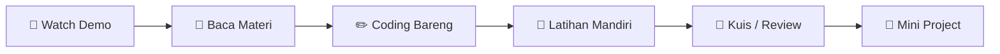
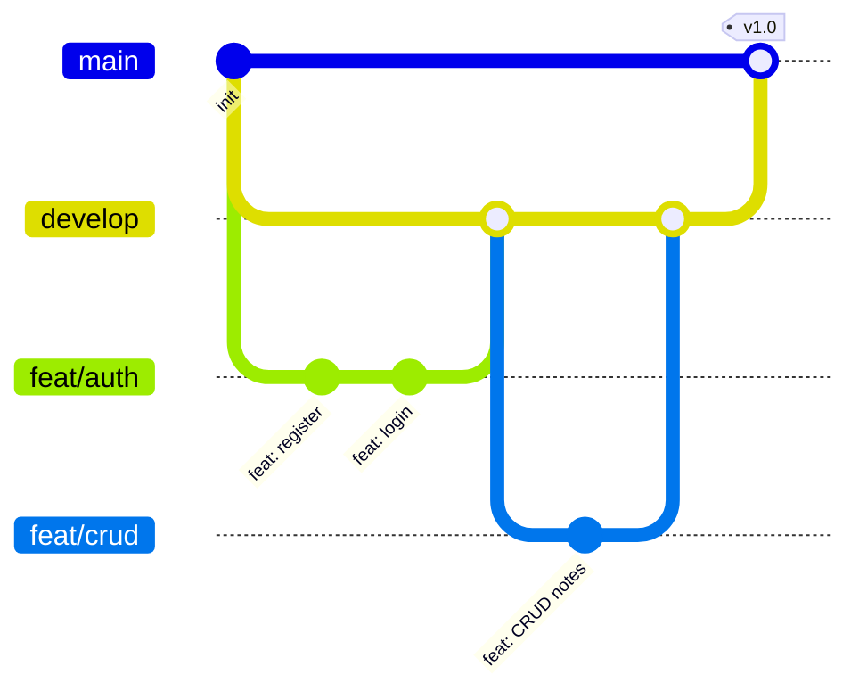
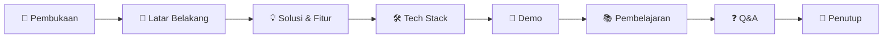
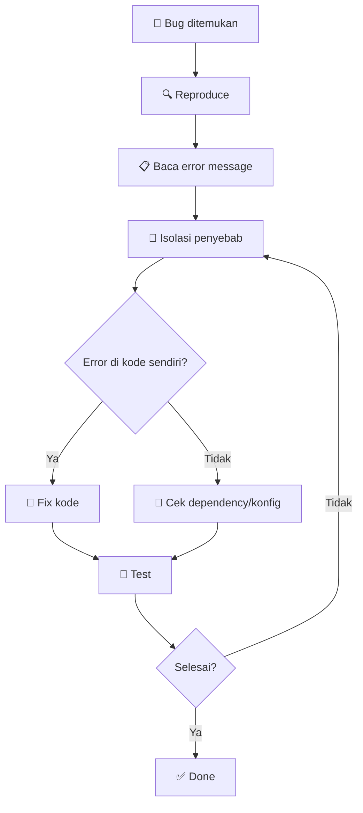

# 📖 Panduan Belajar RPL AI

> Kumpulan panduan belajar, workflow project, tips ujian, presentasi, dan manajemen waktu.
> Semua dalam Bahasa Indonesia, untuk siswa SMK RPL.

---

## 📋 Daftar Isi

| # | Topik | Level |
|---|-------|-------|
| 1 | Study Guide — Cara Belajar Efektif | 🌱 Beginner |
| 2 | Project Workflow — Dari Ide ke Deploy | 📐 Intermediate |
| 3 | Exam Preparation — Strategi Ujian | 🌱 Beginner |
| 4 | Presentation Guide — Tips Presentasi | 🌱 Beginner |
| 5 | Time Management — Atur Waktu Belajar | 🌱 Beginner |
| 6 | Note-Taking Strategy — Catatan Efektif | 🌱 Beginner |
| 7 | Debugging Mindset — Mentalitas Nyari Bug | 📐 Intermediate |
| 8 | Collaboration Guide — Kerja Tim & Git | 📐 Intermediate |
| 9 | Research Skills — Cara Cari Solusi | 🌱 Beginner |
| 10 | Learning Resources — Sumber Belajar | 🌱 Beginner |

---

## 1. Study Guide — Cara Belajar Efektif

### Prinsip Belajar Coding

1. **Practice > Theory** — baca 20%, coding 80%. Gak bakal bisa coding cuma dari baca.
2. **Build something** — belajar paling efektif pas lo bikin project nyata.
3. **Teach others** — jelasin ke temen. Kalo lo bisa ngajarin, lo beneran paham.
4. **Break it down** — masalah besar dipecah jadi kecil-kecil.
5. **Consistency > Intensity** — 30 menit tiap hari > 5 jam seminggu sekali.

### Metode Belajar

#### Active Recall

Bukan sekedar baca ulang, tapi **mengingat aktif**:

```
BACA → TUTUP BUKU → TULIS ULANG DARI INGATAN → CEK
```

Contoh: setelah belajar Express routing, tutup tutorial, tulis ulang dari ingatan. Baru cek apakah benar.

#### Feynman Technique

1. Pilih topik
2. Jelaskan ke anak kecil (sederhana, tanpa jargon)
3. Identifikasi celah pemahaman
4. Review + sederhanakan lagi

#### Pomodoro

```
25 menit FOKUS → 5 menit istirahat → ulangi 4x → 15-30 menit istirahat panjang
```

Tools: Forest App, Focus To-Do, atau timer HP.

#### Spaced Repetition

Review materi di interval:

| Waktu | Aktivitas |
|-------|-----------|
| Hari 1 | Belajar pertama |
| Hari 2 | Review 10 menit |
| Hari 7 | Review 5 menit |
| Hari 30 | Review 5 menit |

### Learning Path Per Sesi



### Weekly Learning Schedule

| Hari | Aktivitas | Durasi |
|------|-----------|--------|
| Senin | Baca materi + coding bareng | 2 jam |
| Selasa | Latihan mandiri + error hunting | 1.5 jam |
| Rabu | Kerjain challenge / tugas | 2 jam |
| Kamis | Review + tanya yang gak paham | 1 jam |
| Jumat | Mini project / eksplorasi | 2 jam |
| Sabtu | Rest / coding santai | Opsional |
| Minggu | Review mingguan + planning | 30 menit |

### Common Learning Pitfalls

| Pitfall | Solusi |
|---------|--------|
| **Tutorial hell** — nonton terus tanpa praktek | Setiap 10 menit video, pause + coding |
| **Overwhelm** — kebanyakan materi | Fokus 1 topik per hari |
| **Perfect code syndrome** — takut salah | Coding is iterative. Salah wajar |
| **Copy-paste tanpa paham** | Tulis ulang manual, ubah sedikit |
| **Lupa yang udah dipelajari** | Spaced repetition + catatan |

---

## 2. Project Workflow — Dari Ide ke Deploy

### Phase 1: Planning

#### 1a. Define Requirements

Tulis fitur apa aja yang harus ada. Format:

```markdown
## Requirements
### Must Have
- [ ] User bisa register & login
- [ ] User bisa CRUD todos
- [ ] AI summarize notes

### Nice to Have
- [ ] Dark mode
- [ ] Export to PDF
- [ ] Share todo list
```

#### 1b. Tech Stack Decision

```
Frontend:  React / Next.js + Tailwind CSS
Backend:   Express / Hono + TypeScript
Database:  PostgreSQL / SQLite
AI:        Mastra AI / OpenAI API
Deploy:    Vercel (FE) + Railway (BE)
```

#### 1c. Database Schema (sebelum coding)

```sql
-- Contoh schema notes app
CREATE TABLE users (
  id SERIAL PRIMARY KEY,
  email VARCHAR(255) UNIQUE NOT NULL,
  password_hash VARCHAR(255) NOT NULL,
  created_at TIMESTAMP DEFAULT NOW()
);

CREATE TABLE notes (
  id SERIAL PRIMARY KEY,
  user_id INTEGER REFERENCES users(id),
  title VARCHAR(200) NOT NULL,
  content TEXT,
  created_at TIMESTAMP DEFAULT NOW(),
  updated_at TIMESTAMP DEFAULT NOW()
);
```

### Phase 2: Setup Project

#### Git Init

```bash
# Backend
mkdir my-project
cd my-project
git init
npm init -y
npm install express typescript @types/node
npx tsc --init

# Frontend (React + Vite)
npm create vite@latest frontend -- --template react-ts
```

#### Branch Strategy



### Phase 3: Development

#### Development Order

1. **Backend dulu** — bikin API dulu, test pake Postman/curl
2. **Database** — migration + seed data
3. **Frontend** — mulai dari komponen paling kecil
4. **Integration** — sambung FE ke BE
5. **Auth** — login/register
6. **AI Feature** — integrate agent/tools
7. **Polish** — styling, error handling, loading states

#### Coding Workflow Per Fitur

```bash
# 1. Buat branch baru
git checkout -b feat/nama-fitur

# 2. Coding fitur
# 3. Test manual
# 4. Commit
git add .
git commit -m "feat: tambah fitur X"

# 5. Push
git push origin feat/nama-fitur

# 6. Buat PR ke develop
```

### Phase 4: Testing

#### Test Checklist

- [ ] Semua CRUD jalan
- [ ] Error handling (404, 400, 500)
- [ ] Auth (unauthenticated redirect)
- [ ] Responsive design
- [ ] Edge cases (input kosong, char limit)
- [ ] Performance (loading time < 2 detik)

#### Write Unit Tests

```typescript
// notes.test.ts
import { describe, it, expect } from "vitest";
import { createNote, getNotes } from "./notes";

describe("Notes Service", () => {
  it("should create a note", () => {
    const note = createNote({ title: "Test", content: "Hello" });
    expect(note.title).toBe("Test");
    expect(note.id).toBeDefined();
  });

  it("should return empty array when no notes", () => {
    const notes = getNotes();
    expect(notes).toEqual([]);
  });
});
```

### Phase 5: Deployment

#### Pre-Deploy Checklist

- [ ] Environment variables dipindah ke `.env`
- [ ] `.env.example` dibuat (isi dummy)
- [ ] `cors` diatur untuk production
- [ ] Error handler gak bocorin stack trace
- [ ] Build sukses (`npm run build`)
- [ ] Test di local production mode (`npm start`)
- [ ] Database migration siap

#### Deploy Flow

```
Local Dev → Push ke GitHub → Auto Deploy (Vercel/Railway) → Production URL
```

### Phase 6: Documentation

#### README Template

```markdown
# Nama Project

Deskripsi singkat: 2-3 kalimat.

## Tech Stack
- Frontend: React + TypeScript + Tailwind
- Backend: Express + PostgreSQL
- AI: Mastra AI Agent

## Fitur
- CRUD notes
- AI summarize
- Auth JWT

## Cara Install
1. Clone: `git clone ...`
2. Backend: `cd backend && npm install && cp .env.example .env`
3. Frontend: `cd frontend && npm install`
4. Run: `npm run dev`

## Environment Variables
```
DATABASE_URL=postgresql://...
JWT_SECRET=your-secret
OPENAI_API_KEY=sk-...
```

## API Documentation
| Method | Endpoint | Deskripsi |
|--------|----------|-----------|
| GET | /api/notes | Ambil semua notes |
| POST | /api/notes | Buat note baru |
| PUT | /api/notes/:id | Update note |

## Live Demo
[link.vercel.app](https://link.vercel.app)

## Screenshot

```

---

## 3. Exam Preparation — Strategi Ujian

### Tipe Soal di RPL AI

| Tipe | Bobot | Tips |
|------|-------|------|
| Pilihan Ganda | 40% | Eliminasi jawaban salah |
| Coding | 30% | Kerjain yang gampang dulu |
| Esai / Isian | 20% | Jawab poin-poin, bukan paragraf panjang |
| Diagram | 10% | Gambar sederhana asal jelas |

### 3 Hari Sebelum Ujian

#### H-3: Review Materi

Baca ulang semua modul. Fokus di bagian yang masih merah (belum paham).

#### H-2: Latihan Soal

Kerjain 20+ soal latihan. Timer per soal.

#### H-1: Light Review + Istirahat

- Review catatan / cheat sheet
- Gak usah belajar berat
- Tidur cukup (7-8 jam)

### Saat Ujian

| Langkah | Waktu |
|---------|-------|
| Baca semua soal dulu | 5 menit |
| Kerjain yang gampang | 30% waktu |
| Kerjain yang sedang | 40% waktu |
| Kerjain yang susah | 20% waktu |
| Review jawaban | 10% waktu |

### Setelah Ujian

1. Catat soal yang salah
2. Cari tau kenapa salah
3. Bahas sama temen / mentor

### Cheat Sheet Template

Boleh dibawa saat ujian (open notes). Format 1 lembar A4:

```markdown
## JavaScript
- == vs ===: == loose, === strict
- Closure: function dalam function, akses outer scope
- Promise: .then() / async/await

## SQL
- JOIN: INNER = irisang, LEFT = semua kiri
- GROUP BY: agregasi per kategori

## TypeScript
- interface vs type: interface extend, type union
- generics: <T> fungsi type-safe

## Express
- app.use( middleware ) — global
- app.get/post/put/delete
- req.params, req.query, req.body
```

---

## 4. Presentation Guide — Tips Presentasi

### Struktur Presentasi



### Slide Deck Guidelines

| Slide | Isi | Durasi |
|-------|-----|--------|
| 1 | Judul + Nama + Foto | 30 detik |
| 2 | Masalah yang diselesaikan | 1 menit |
| 3 | Fitur utama (screenshot/GIF) | 1 menit |
| 4 | Tech stack + alasan milih | 1 menit |
| 5 | Arsitektur (diagram) | 1 menit |
| 6 | Demo! (live coding / app) | 2-3 menit |
| 7 | Tantangan + solusi | 1 menit |
| 8 | Q&A | 2 menit |

### Tips Demo

1. **Siapin data dummy** — jangan input manual dari nol
2. **Siapin error scenario** — kalo demo gagal, ada backup
3. **Record dulu** — screen record sebagai backup
4. **Cek koneksi** — kalo pake API online, pastiin sinyal
5. **Printah demo** — tulis langkah yang akan didemo

### Public Speaking Tips

| Masalah | Solusi |
|---------|--------|
| Grogi / gugup | Tarik nafas dalam 3x sebelum mulai |
| Bicara cepet | Sadar, pelan-pelan. Diam sesekali gapapa |
| Baca slide terus | Slide = pointer, bukan skrip |
| Lupa materi | Siapin catatan kecil di kartu |
| Gak bisa jawab Q&A | "Good question, saya akan cari tau dan jawab nanti" |

### Dress Code Presentasi

```
✅ Kemeja / kaos polos rapi
✅ Sepatu (bukan sendal)
✅ Rambut rapi

❌ Kaos oblong kusut
❌ Topi / hoodie
❌ Sandal jepit
```

### Checklist Sebelum Presentasi

- [ ] Slide siap (PDF backup)
- [ ] Aplikasi jalan di local
- [ ] Screen recorder siap
- [ ] Koneksi internet stabil
- [ ] Backup plan (video / screenshot)
- [ ] Timer HP siap
- [ ] Air minum

---

## 5. Time Management — Atur Waktu Belajar

### Weekly Time Budget (SMK)

Asumsi: 40 jam/minggu di sekolah + 20 jam untuk belajar mandiri.

| Aktivitas | Jam/Minggu | Prioritas |
|-----------|------------|-----------|
| Sekolah (RPL) | 40 | Wajib |
| Belajar coding mandiri | 10 | Tinggi |
| Kerjain challenge | 5 | Tinggi |
| Review + catatan | 3 | Sedang |
| Baca artikel / docs | 2 | Sedang |
| Istirahat | 56 | Wajib! |

### Prioritization: Eisenhower Matrix

```
                URGENT                    NOT URGENT
        ┌─────────────────────┬─────────────────────┐
IMPORT  │ 🚨 DO FIRST         │ 📅 SCHEDULE         │
ANT     │ - Deadline besok    │ - Belajar TypeScript │
        │ - Error production  │ - Bikin portfolio    │
        ├─────────────────────┼─────────────────────┤
NOT     │ 📋 DELEGATE         │ 🗑 ELIMINATE         │
IMPORT  │ - Ngerjain tugas    │ - Scroll TikTok     │
ANT     │   yang bisa dibantu  │   berjam-jam         │
        │ - Setup tools       │ - Gaming berlebihan  │
        └─────────────────────┴─────────────────────┘
```

### Daily Schedule Template

```
[06:30] ⏰ Bangun + mandi
[07:00] 🍳 Sarapan
[07:30] 📚 Review materi kemarin (30 menit)
[08:00] 🏫 Sekolah
[15:00] 🏡 Pulang + istirahat
[16:00] 🧠 Coding session 1 (Pomodoro 25/5, 2 jam)
[18:00] 🍜 Makan + istirahat
[19:00] 🧠 Coding session 2 (1 jam) / challenge
[20:00] 📖 Baca materi baru
[21:00] 🆓 Free time
[22:00] 📱 No screen time
[22:30] 😴 Tidur
```

### Tools Manajemen Waktu

| Tools | Untuk | Platform |
|-------|-------|----------|
| Google Calendar | Jadwal belajar | Web, Mobile |
| Notion / Obsidian | Catatan + task list | All |
| Forest App | Fokus timer (Pomodoro) | iOS, Android |
| Todoist | Simple task list | All |
| GitHub Projects | Tracking progress project | Web |

### Time Management Anti-Patterns

| Anti-Pattern | Fix |
|-------------|-----|
| **Multitasking** — coding sambil YouTube | Fokus 1 tugas dalam 1 waktu |
| **Perfectionism** — "harus sempurna" | Done > perfect. Iterate |
| **No deadline** — "nanti aja" | Kasih deadline artificial |
| **Overplanning** — planning 2 jam, coding 0 | Batasi planning 15 menit |
| **Social media** — cek dikit jadi 1 jam | App blocker, grayscale mode |

### Weekly Review Template

```markdown
# Weekly Review — Minggu ke-[N]

## Apa yang udah dipelajari?
- Topic 1: ...
- Topic 2: ...

## Apa yang belum paham?
- ...

## Progress Challenge
- [ ] Week 1: ✅ / ❌
- [ ] Week 2: ✅ / ❌

## Rencana Minggu Depan
- Topic utama: ...
- Target: ...
```

---

## 6. Note-Taking Strategy

### Recommended Tools

| Tools | Kelebihan | Cocok untuk |
|-------|-----------|-------------|
| Obsidian | Markdown, graph view, free | Catatan belajar pribadi |
| Notion | All-in-one, database | Task + notes + project |
| GitHub Gist | Code snippets | Simpan kode contoh |
| VS Code + Markdown | Integrasi coding | Catatan sambil coding |

### Note Structure

Setiap topik minimal punya:

```markdown
# [Topik]
## 📖 Definisi
Apa itu?

## 💡 Konsep Kunci
- Poin 1
- Poin 2

## 🧪 Contoh Kode
```typescript
// contoh
```

## ⚠️ Common Mistakes
- Error yang sering terjadi

## 📚 Referensi
- Link dokumentasi
```

### Code Snippet Bank

Simpan kode yang sering dipake:

```markdown
### Express Route Template
```typescript
router.get("/api/resource", authenticate, async (req, res) => {
  try {
    const data = await db.query("SELECT * FROM resources");
    res.json(data);
  } catch (error) {
    res.status(500).json({ error: error.message });
  }
});
```
```

---

## 7. Debugging Mindset

### Langkah Debugging



### Error Types Cheat Sheet

| Error | Arti | Cek |
|-------|------|-----|
| `Cannot read property of undefined` | Lo akses property dari variable yang undefined | Initialisasi variable |
| `is not a function` | Lo panggil sesuatu yang bukan function | Typo atau import salah |
| `Module not found` | File gak ketemu | Path, nama file, case sensitivity |
| `Port already in use` | Port 3000 udah kepake | Ganti port / matikan proses lain |
| `SyntaxError` | Ada syntax yang salah | Kurung kurawal, titik koma |
| `EACCES` | Permission denied | `sudo` atau chmod |
| `ETIMEOUT` | Koneksi timeout | Internet, firewall, DNS |
| `Foreign key constraint` | Relasi database error | Pastikan ID referensi ada |

### Debugging Tools

| Tools | Untuk |
|-------|-------|
| `console.log()` | Cepat, debug sederhana |
| VS Code Debugger | Step-by-step execution |
| Chrome DevTools | Frontend debugging (Network, Console, Sources) |
| Postman / Thunder Client | Test API endpoint |
| `node --inspect` | Node.js debug mode |
| `git bisect` | Cari commit yang ngenalin bug |

### Mental Block? Lakukan Ini:

1. **Jalan kaki 5 menit** — reset otak
2. **Rubah font size / theme** — fresh perspective
3. **Jelaskan ke rubber duck** — atau temen, atau kucing
4. **Tidur** — serius, banyak bug ketahuan setelah bangun
5. **Cari di Google** — 90% error udah pernah dijawab di StackOverflow

---

## 8. Collaboration Guide — Kerja Tim & Git

### Git Workflow Tim

```bash
# Setiap orang punya branch sendiri
main
├── develop
│   ├── feat/budi-auth
│   ├── feat/ani-frontend
│   └── feat/cici-backend
└── hotfix/critical-bug
```

### Daily Standup (15 menit)

Tiap pagi, jawab 3 pertanyaan:

```
1. Apa yang gua kerjain kemarin?
2. Apa yang gua kerjain hari ini?
3. Ada blocker / masalah?
```

### Code Review Etika

| Saat Review | Jangan |
|-------------|--------|
| "Bagus, tapi baris 42 bisa pake `.map()`" | "Kode lo jelek" |
| "Fungsi ini udah bener, cuma naming kurang jelas" | "Ini gak sesuai standar" |
| "Saran: pake constant biar gak magic number" | "Ganti ini" (paksa) |

### Conflict Resolution

1. **Bedakan orang dan masalah** — kodenya yang dikritik, bukan orangnya
2. **Fokus ke goal tim** — bukan siapa yang bener
3. **Compromise** — kalau beda pendapat, coba dua-duanya, pilih yang lebih efisien

---

## 9. Research Skills — Cara Cari Solusi

### Step-by-Step Research

1. **Google error message** — copy paste error ke Google
2. **Stack Overflow** — filter jawaban dengan vote tinggi
3. **Official docs** — dokumentasi resmi (Express, React, TypeScript)
4. **GitHub Issues** — cari issue yang sama
5. **Discord / Forum** — tanya di komunitas

### Cara Nanya yang Baik

```markdown
❌ "Help, error ga jelas"
✅ "Waktu pake Express, saya dapet error 'EADDRINUSE' pas
   jalanin server. Udah coba ganti port 3001 tapi tetep.
   Ada yang tau solusinya?
   
   OS: Ubuntu 22.04
   Node: 20.x
   Error log: ...
```

### Sumber Referensi

| Kebutuhan | Sumber |
|-----------|--------|
| Dokumentasi resmi | MDN, Node.js docs, React docs, Express docs |
| Tutorial | FreeCodeCamp, YouTube (Fireship, Web Dev Simplified) |
| Best practices | The Odin Project, roadmap.sh |
| Komunitas | Discord IDDevs, r/indonesia, Telegram JS ID |
| AI Helper | ChatGPT, Claude, GitHub Copilot |

---

## 10. Learning Resources

### Bahasa Indonesia

| Sumber | Link | Untuk |
|--------|------|-------|
| Web Programming UNPAS | youtube.com/@sandhikagalih | Web dasar |
| Dicoding | dicoding.com | Sertifikasi programming |
| IDDevs Community | discord.gg/iddevs | Komunitas developer |
| Kelas Terbuka | youtube.com/@KelasTerbuka | Algoritma |
| Pukul Emas | youtube.com/@pukulemas | React Native |

### Bahasa Inggris

| Sumber | Link | Untuk |
|--------|------|-------|
| FreeCodeCamp | freecodecamp.org | Fullstack gratis |
| The Odin Project | theodinproject.com | Fullstack path |
| Frontend Mentor | frontendmentor.io | Latihan frontend |
| LeetCode | leetcode.com | Coding interview |
| Roadmap.sh | roadmap.sh | Learning path |
| Dev.to | dev.to | Blog + komunitas |

### Tools Gratis untuk Belajar

| Tools | Fungsi |
|-------|--------|
| VS Code | Editor kode |
| Git + GitHub | Version control + portfolio |
| Vercel / Railway | Deploy gratis |
| Replit | Coding online tanpa install |
| CodeSandbox | Frontend playground |
| Postman / Thunder Client | Test API |
| DB Browser for SQLite | Visualisasi database |

---

## 🚀 Quick Reference: Common Commands

```bash
# Git
git checkout -b feat/nama-fitur   # Buat branch baru
git add .                         # Stage semua perubahan
git commit -m "feat: pesan"      # Commit
git push origin feat/nama-fitur   # Push ke GitHub

# npm
npm init -y                       # Init project
npm install [package]             # Install package
npm run dev                       # Run development
npm run build                     # Build production

# Docker
docker compose up -d              # Run container
docker compose down               # Stop container
docker ps                         # Lihat container jalan

# TypeScript
npx tsc --init                    # Init TS config
npx tsc --noEmit                  # Check type error
```

---

Selamat belajar! 🚀
