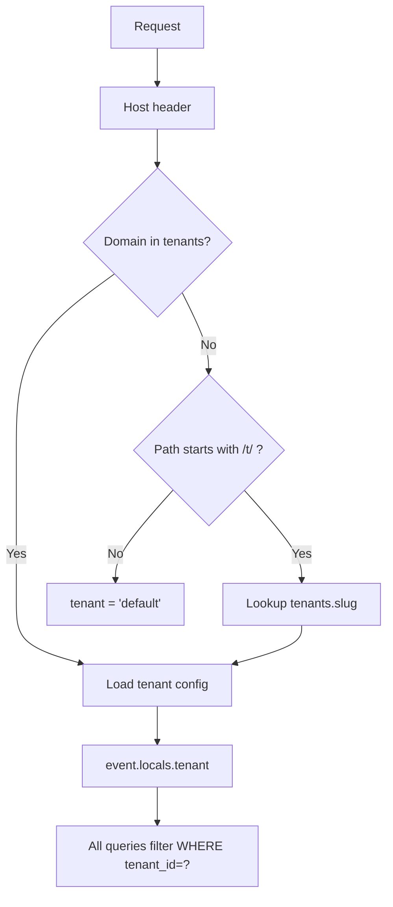

# PLAN: Multi-Tenant Learning Platform (LMS + K13 + University + Tutoring + Bimbel)

## 1. Vision

A single platform serving **any learning institution type**:

| Tenant Type | Who | What They Do | Key Needs |
|---|---|---|---|
| **LMS** | Course creators, trainers | Sell courses, self-paced learning | Content tree, certificates, quizzes |
| **K13 School** | SMA/MA/SMK/MTs | Formal education, rapor, kurikulum nasional | KD, PH/PTS/PAS, rapor K13, presensi, RPP |
| **University** | PTN/STT/Akademi | SIAKAD, SKS, KRS, transkrip | Fakultas, prodi, SKS, IPK |
| **Private Tutor** | Guru privat 1-on-1 | Teach individual students, track progress | Jadwal privat, progress report, billing |
| **Bimbel** | Pusat bimbingan belajar | Group classes, try out, intensif | Batch system, try out analysis, ranking |
| **Les Kelompok** | Small group (3-10 siswa) | Semi-private, same level | Group class, shared materials, attendance |

---

## 2. Tenant Schema (Shared Engine)

### 2a. Core Tenant

```sql
CREATE TABLE tenants (
  id TEXT PRIMARY KEY,
  name TEXT NOT NULL,
  slug TEXT UNIQUE NOT NULL,
  type TEXT NOT NULL CHECK(type IN (
    'lms',           -- course marketplace
    'academic_k13',  -- formal school (SMA/MA/SMK)
    'university',    -- PT/STT/Akademi
    'bimbel',        -- bimbel center
    'tutor',         -- private tutoring
    'kelompok'       -- small group learning
  )),
  subdomain TEXT UNIQUE,           -- sma-kembang.lesku.my.id
  custom_domain TEXT UNIQUE,
  logo_url TEXT,
  favicon_url TEXT,
  primary_color TEXT DEFAULT '#6c5ce7',
  config TEXT DEFAULT '{}',         -- JSON:
  -- {
  --   "grade_ranges": {"A": 92, "B": 84, "C": 75, "D": 0},
  --   "passing_grade": 75,
  --   "academic_year_format": "2025/2026",
  --   "semester_names": ["Ganjil", "Genap"],
  --   "k13_weight": {"ph": 0.6, "pts": 0.2, "pas": 0.2},
  --   "tutor_rate": 50000,
  --   "bimbel_packages": []
  -- }
  features TEXT DEFAULT '{}',       -- JSON array of enabled feature flags
  -- ["lms", "k13_grading", "attendance", "tryout", "rapor", "krs"]
  is_active INTEGER DEFAULT 1,
  owner_id TEXT,                    -- tenant admin user
  created_at TEXT DEFAULT (datetime('now')),
  updated_at TEXT DEFAULT (datetime('now'))
);

-- Single migration: ALTER TABLE ... ADD COLUMN tenant_id TEXT NOT NULL DEFAULT 'default'
-- ALL 50+ existing tables get this column.
```

### 2b. Tenant User Model

```sql
-- Each user belongs to one primary tenant, can be invited to others
ALTER TABLE users ADD COLUMN tenant_id TEXT NOT NULL DEFAULT 'default';

-- Cross-tenant user linking
CREATE TABLE tenant_users (
  id TEXT PRIMARY KEY,
  tenant_id TEXT NOT NULL,
  user_id TEXT NOT NULL,
  role TEXT NOT NULL CHECK(role IN (
    -- General
    'superadmin',       -- cross-tenant
    'admin',            -- tenant admin

    -- LMS
    'instructor',       -- course creator
    'student',          -- course taker

    -- K13
    'kepala_sekolah',   -- principal
    'wakil_kurikulum',  -- curriculum VP
    'guru',             -- teacher
    'wali_kelas',       -- homeroom teacher
    'siswa',            -- student
    'tata_usaha',       -- admin staff

    -- University
    'rektor',
    'dekan',
    'kaprodi',           -- head of study program
    'dosen',             -- lecturer
    'mahasiswa',         -- student
    'akademik',          -- academic admin

    -- Bimbel
    'pimpinan_bimbel',   -- center head
    'tentor',            -- tutor/teacher
    'admin_bimbel',      -- operational

    -- Private Tutor
    'tutor',             -- private tutor
    'murid_privat',      -- private student
    'wali_murid'         -- parent
  )),
  status TEXT DEFAULT 'active',
  joined_at TEXT DEFAULT (datetime('now')),
  UNIQUE(tenant_id, user_id)
);

CREATE INDEX idx_tenant_users_tenant ON tenant_users(tenant_id);
CREATE INDEX idx_tenant_users_user ON tenant_users(user_id);
```

### 2c. Tenant Feature Matrix

| Feature | LMS | K13 | Univ | Bimbel | Tutor | Kelompok |
|---|---|---|---|---|---|---|
| LMS courses | ✅ | ✅ | ✅ | ✅ | ✅ | ✅ |
| Content tree | ✅ | ✅ | ✅ | ✅ | ✅ | ✅ |
| Quiz/Assessment | ✅ | ✅ | ✅ | ✅ | ✅ | ✅ |
| Assignment | ✅ | ✅ | ✅ | ✅ | ✅ | ✅ |
| Discussion | ✅ | ✅ | ✅ | ✅ | ✅ | ✅ |
| Certificates | ✅ | ✅ | ✅ | ✅ | ✅ | ✅ |
| K13 School Structure | ❌ | ✅ | ❌ | ❌ | ❌ | ❌ |
| KD + RPP | ❌ | ✅ | ❌ | ❌ | ❌ | ❌ |
| K13 Grading (PH/PTS/PAS) | ❌ | ✅ | ❌ | ❌ | ❌ | ❌ |
| Rapor K13 | ❌ | ✅ | ❌ | ❌ | ❌ | ❌ |
| Attendance | ❌ | ✅ | ❌ | ✅ | ✅ | ✅ |
| Teaching Schedule | ❌ | ✅ | ❌ | ✅ | ✅ | ✅ |
| SIAKAD/KRS | ❌ | ❌ | ✅ | ❌ | ❌ | ❌ |
| Transkrip | ❌ | ❌ | ✅ | ❌ | ❌ | ❌ |
| Try Out System | ❌ | ✅ | ❌ | ✅ | ❌ | ❌ |
| Try Out Analysis | ❌ | ❌ | ❌ | ✅ | ❌ | ❌ |
| Session Billing | ❌ | ❌ | ❌ | ❌ | ✅ | ✅ |
| Parent Monitoring | ❌ | ✅ | ❌ | ❌ | ✅ | ✅ |
| Batch/Package | ❌ | ❌ | ❌ | ✅ | ✅ | ✅ |
| Progress Report | ❌ | ❌ | ❌ | ✅ | ✅ | ✅ |

---

## 3. Private Tutoring & Bimbel Schema

### 3a. Packages & Batches

```sql
-- Bimbel packages (e.g., "Intensif UTBK 3 Bulan", "Privat Matematika 10 Sesi")
CREATE TABLE learning_packages (
  id TEXT PRIMARY KEY,
  tenant_id TEXT NOT NULL,
  name TEXT NOT NULL,                    -- "Privat Matematika 10 Sesi"
  description TEXT,
  type TEXT NOT NULL CHECK(type IN (
    'privat_sessions',    -- X sesi pertemuan 1-on-1
    'bimbel_batch',       -- kelas bimbel with multiple students
    'kelompok_kecil',     -- semi-private (3-10 students)
    'langganan',          -- subscription monthly
    'paket_tryout'        -- try out only package
  )),
  duration_sessions INTEGER,            -- number of sessions (null = unlimited)
  duration_days INTEGER,                -- validity period in days
  price REAL,                           -- package price
  max_students INTEGER,                 -- for batch/kelompok
  subjects TEXT,                        -- JSON array of subject IDs
  grade_level TEXT,                      -- target grade/level
  includes_materials INTEGER DEFAULT 1,
  includes_tryout INTEGER DEFAULT 0,
  status TEXT DEFAULT 'active',
  created_at TEXT DEFAULT (datetime('now'))
);

-- Batch/class instances (e.g., "Kelas Intensif UTBK 2025 - Senin Sore")
CREATE TABLE batches (
  id TEXT PRIMARY KEY,
  tenant_id TEXT NOT NULL,
  package_id TEXT,
  name TEXT NOT NULL,                    -- "Intensif UTBK 2025 - Senin Sore"
  tutor_id TEXT NOT NULL,               -- tentor/guru
  room TEXT,
  max_students INTEGER,
  current_students INTEGER DEFAULT 0,
  start_date TEXT,
  end_date TEXT,
  schedule_json TEXT,                    -- '[{"day": 1, "start": "15:00", "end": "17:00"}]'
  status TEXT DEFAULT 'active',         -- active|completed|cancelled
  created_at TEXT DEFAULT (datetime('now'))
);

-- Students enrolled in batch
CREATE TABLE batch_enrollments (
  id TEXT PRIMARY KEY,
  tenant_id TEXT NOT NULL,
  batch_id TEXT NOT NULL,
  user_id TEXT NOT NULL,
  package_id TEXT,
  enrollment_date TEXT DEFAULT (datetime('now')),
  paid_amount REAL,
  payment_status TEXT DEFAULT 'pending', -- pending|partial|paid|expired
  remaining_sessions INTEGER,           -- for session-based packages
  status TEXT DEFAULT 'active',         -- active|completed|dropped|expired
  UNIQUE(batch_id, user_id)
);
```

### 3b. Tutoring Sessions

```sql
CREATE TABLE tutoring_sessions (
  id TEXT PRIMARY KEY,
  tenant_id TEXT NOT NULL,
  batch_id TEXT,                         -- null for 1-on-1 private
  tutor_id TEXT NOT NULL,
  student_id TEXT,                       -- null for batch sessions
  type TEXT NOT NULL CHECK(type IN (
    'privat_1on1',       -- private session
    'bimbel_kelas',      -- classroom bimbel
    'kelompok_kecil',    -- small group
    'online',            -- via video call
    'tryout'             -- try out session
  )),
  title TEXT,
  date TEXT NOT NULL,
  start_time TEXT NOT NULL,
  end_time TEXT NOT NULL,
  duration_minutes INTEGER,
  room TEXT,                              -- or video call link
  status TEXT DEFAULT 'scheduled',       -- scheduled|ongoing|completed|cancelled
  notes TEXT,
  materials TEXT,                        -- JSON: content_block IDs used
  homework JSON,                          -- assigned work
  created_at TEXT DEFAULT (datetime('now')),
  updated_at TEXT DEFAULT (datetime('now'))
);

-- Attendance per tutoring session
CREATE TABLE session_attendance (
  id TEXT PRIMARY KEY,
  tenant_id TEXT NOT NULL,
  session_id TEXT NOT NULL,
  user_id TEXT NOT NULL,
  status TEXT NOT NULL CHECK(status IN ('hadir','sakit','izin','alpha','terlambat')),
  time_in TEXT,
  time_out TEXT,
  minutes_late INTEGER DEFAULT 0,
  notes TEXT,
  recorded_by TEXT,
  UNIQUE(session_id, user_id)
);
```

### 3c. Tutoring Progress & Billing

```sql
-- Per-session progress notes (for private tutors)
CREATE TABLE session_progress (
  id TEXT PRIMARY KEY,
  tenant_id TEXT NOT NULL,
  session_id TEXT NOT NULL,
  student_id TEXT NOT NULL,
  topic_covered TEXT,                     -- "Persamaan Kuadrat, Fungsi Kuadrat"
  understanding_level TEXT CHECK(understanding_level IN ('paham','cukup','kurang','tidak_paham')),
  notes TEXT,
  next_session_plan TEXT,
  homework_given TEXT,
  homework_completed INTEGER DEFAULT 0,
  created_by TEXT,
  created_at TEXT DEFAULT (datetime('now'))
);

-- Progress report periods (monthly/each-N-sessions)
CREATE TABLE progress_reports (
  id TEXT PRIMARY KEY,
  tenant_id TEXT NOT NULL,
  student_id TEXT NOT NULL,
  batch_id TEXT,                          -- null for private
  period_start TEXT,
  period_end TEXT,
  sessions_attended INTEGER,
  sessions_total INTEGER,
  attendance_percentage REAL,
  subject_breakdown TEXT,                 -- JSON: per subject understanding level
  overall_grade TEXT,
  recommendations TEXT,
  parent_notes TEXT,
  status TEXT DEFAULT 'draft',           -- draft|finalized|sent
  created_by TEXT,
  created_at TEXT DEFAULT (datetime('now'))
);

-- Billing & payments
CREATE TABLE billing_records (
  id TEXT PRIMARY KEY,
  tenant_id TEXT NOT NULL,
  user_id TEXT NOT NULL,                  -- student/parent
  package_id TEXT,
  batch_id TEXT,
  invoice_number TEXT UNIQUE,
  type TEXT NOT NULL CHECK(type IN ('package','session','monthly','tryout','material')),
  amount REAL NOT NULL,
  discount REAL DEFAULT 0,
  total REAL NOT NULL,
  status TEXT DEFAULT 'unpaid',           -- unpaid|partial|paid|cancelled|refunded
  due_date TEXT,
  paid_at TEXT,
  payment_method TEXT,                    -- transfer|cash|qris|gopay
  payment_proof TEXT,                     -- URL
  notes TEXT,
  created_at TEXT DEFAULT (datetime('now'))
);
```

---

## 4. K13 School — Expanded Detail

### 4a. School Structure (existing + refinement)

```sql
CREATE TABLE school_levels (
  id TEXT PRIMARY KEY,
  tenant_id TEXT NOT NULL,
  name TEXT NOT NULL,                     -- 'SD', 'SMP', 'SMA', 'MA', 'SMK'
  slug TEXT NOT NULL,
  education_level TEXT DEFAULT 'menengah',-- dasar|menengah|tinggi
  created_at TEXT DEFAULT (datetime('now'))
);

CREATE TABLE grade_levels (
  id TEXT PRIMARY KEY,
  tenant_id TEXT NOT NULL,
  school_level_id TEXT NOT NULL,
  name TEXT NOT NULL,                     -- 'X', 'XI', 'XII' or '1','2','3','4','5','6'
  sequence INTEGER NOT NULL,             -- 10, 11, 12 or 1-6 for SD
  semester_count INTEGER DEFAULT 2,      -- ganjil+genap
  created_at TEXT DEFAULT (datetime('now'))
);

CREATE TABLE majors (
  id TEXT PRIMARY KEY,
  tenant_id TEXT NOT NULL,
  name TEXT NOT NULL,                     -- 'IPA', 'IPS', 'Bahasa', 'RPL', 'AKL', 'OTKP'
  code TEXT,
  type TEXT DEFAULT 'umum',              -- umum|kejuruan|agama
  created_at TEXT DEFAULT (datetime('now'))
);

CREATE TABLE classes (
  id TEXT PRIMARY KEY,
  tenant_id TEXT NOT NULL,
  grade_level_id TEXT NOT NULL,
  major_id TEXT,                          -- null for SD/SMP, wajib for SMA jurusan
  name TEXT NOT NULL,                     -- 'X IPA 1', 'XI RPL A', '3 SD A'
  code TEXT,
  academic_period_id TEXT NOT NULL,
  homeroom_teacher_id TEXT,
  room TEXT,
  shift TEXT DEFAULT 'pagi',             -- pagi|siang (for multi-shift schools)
  created_at TEXT DEFAULT (datetime('now'))
);

CREATE TABLE class_members (
  id TEXT PRIMARY KEY,
  tenant_id TEXT NOT NULL,
  class_id TEXT NOT NULL,
  user_id TEXT NOT NULL,
  role TEXT DEFAULT 'student',            -- student|assistant
  status TEXT DEFAULT 'active',
  nis TEXT,                               -- NIS number
  nisn TEXT,                              -- NISN national
  joined_at TEXT DEFAULT (datetime('now')),
  left_at TEXT,
  UNIQUE(class_id, user_id)
);
```

### 4b. Curriculum & Subjects

```sql
CREATE TABLE subjects (
  id TEXT PRIMARY KEY,
  tenant_id TEXT NOT NULL,
  name TEXT NOT NULL,
  code TEXT,
  curriculum TEXT DEFAULT 'k13',          -- k13|merdeka|kustom
  type TEXT DEFAULT 'wajib',             -- wajib|peminatan|lintas_minat|muatan_lokal|ekstrakurikuler
  major_id TEXT,                          -- null if not peminatan-specific
  grade_level_id TEXT,
  group_name TEXT,                        -- A (wajib), B (mulok), C (kejuruan)
  description TEXT,
  min_hours_per_week INTEGER,
  created_at TEXT DEFAULT (datetime('now'))
);

CREATE TABLE kompetensi_dasar (
  id TEXT PRIMARY KEY,
  tenant_id TEXT NOT NULL,
  subject_id TEXT NOT NULL,
  code TEXT NOT NULL,                     -- '3.1', '4.2'
  type TEXT NOT NULL,                     -- pengetahuan|keterampilan|spiritual|sosial
  competence_type TEXT NOT NULL,          -- ki_1, ki_2, ki_3, ki_4, kd_3, kd_4
  description TEXT NOT NULL,
  grade_level_id TEXT,
  semester INTEGER,                       -- 1 (ganjil) | 2 (genap)
  topics TEXT,                            -- JSON array: related topics
  created_at TEXT DEFAULT (datetime('now'))
);

-- Subject assignment to class with teacher
CREATE TABLE class_subjects (
  id TEXT PRIMARY KEY,
  tenant_id TEXT NOT NULL,
  class_id TEXT NOT NULL,
  subject_id TEXT NOT NULL,
  teacher_id TEXT NOT NULL,
  total_hours_per_week INTEGER,
  semester INTEGER NOT NULL,
  status TEXT DEFAULT 'active',
  kd_list TEXT,                           -- JSON: selected KD for this semester
  UNIQUE(class_id, subject_id, semester)
);
```

### 4c. Learning & Assessment (K13)

```sql
-- RPP / Lesson Plan
CREATE TABLE lesson_plans (
  id TEXT PRIMARY KEY,
  tenant_id TEXT NOT NULL,
  class_subject_id TEXT NOT NULL,
  kompetensi_dasar_id TEXT NOT NULL,
  title TEXT NOT NULL,
  meeting_number INTEGER,
  learning_objectives TEXT,
  learning_materials TEXT,                -- JSON: content_block IDs
  teaching_methods TEXT,
  media TEXT,
  assessment_methods TEXT,
  duration_minutes INTEGER,
  status TEXT DEFAULT 'draft',
  created_by TEXT,
  approved_by TEXT,
  created_at TEXT DEFAULT (datetime('now')),
  updated_at TEXT DEFAULT (datetime('now'))
);

-- Daily teaching log / Jurnal Mengajar
CREATE TABLE teaching_journals (
  id TEXT PRIMARY KEY,
  tenant_id TEXT NOT NULL,
  class_subject_id TEXT NOT NULL,
  lesson_plan_id TEXT,
  teacher_id TEXT NOT NULL,
  date TEXT NOT NULL,
  meeting_number INTEGER,
  topic_covered TEXT,
  kd_ids TEXT,                            -- JSON array
  attendance_summary TEXT,                -- {"hadir": 30, "sakit": 2, "alpha": 1}
  notes TEXT,
  next_meeting_plan TEXT,
  created_at TEXT DEFAULT (datetime('now'))
);

-- Teaching schedule
CREATE TABLE teaching_schedules (
  id TEXT PRIMARY KEY,
  tenant_id TEXT NOT NULL,
  class_id TEXT NOT NULL,
  subject_id TEXT NOT NULL,
  teacher_id TEXT NOT NULL,
  day_of_week INTEGER NOT NULL,           -- 0=Monday
  start_time TEXT NOT NULL,
  end_time TEXT NOT NULL,
  room TEXT,
  semester INTEGER NOT NULL,
  is_active INTEGER DEFAULT 1
);
```

### 4d. Attendance (Detailed)

```sql
CREATE TABLE attendance (
  id TEXT PRIMARY KEY,
  tenant_id TEXT NOT NULL,
  class_id TEXT NOT NULL,
  user_id TEXT NOT NULL,
  date TEXT NOT NULL,
  subject_id TEXT,                        -- null for general attendance
  status TEXT NOT NULL CHECK(status IN ('hadir','sakit','izin','alpha','dispensasi','terlambat')),
  time_in TEXT,
  minutes_late INTEGER DEFAULT 0,
  reason TEXT,
  documented_by TEXT,                     -- bukti (surat dokter, etc)
  recorded_by TEXT,
  created_at TEXT DEFAULT (datetime('now')),
  UNIQUE(class_id, user_id, date, subject_id)
);

-- Monthly attendance recap
CREATE TABLE attendance_recaps (
  id TEXT PRIMARY KEY,
  tenant_id TEXT NOT NULL,
  user_id TEXT NOT NULL,
  academic_period_id TEXT NOT NULL,
  month INTEGER NOT NULL,
  year INTEGER NOT NULL,
  total_hadir INTEGER DEFAULT 0,
  total_sakit INTEGER DEFAULT 0,
  total_izin INTEGER DEFAULT 0,
  total_alpha INTEGER DEFAULT 0,
  total_dispensasi INTEGER DEFAULT 0,
  total_terlambat INTEGER DEFAULT 0,
  percentage REAL,
  created_at TEXT DEFAULT (datetime('now')),
  UNIQUE(user_id, academic_period_id, month, year)
);
```

### 4e. K13 Grading (Full)

```sql
-- === PENGETAHUAN ===
-- PH (Penilaian Harian) — daily quiz/test per KD
CREATE TABLE k13_ph (
  id TEXT PRIMARY KEY,
  tenant_id TEXT NOT NULL,
  user_id TEXT NOT NULL,
  class_subject_id TEXT NOT NULL,
  kompetensi_dasar_id TEXT NOT NULL,
  title TEXT,
  score REAL NOT NULL,
  max_score REAL DEFAULT 100,
  remedial_score REAL,
  semester INTEGER NOT NULL,
  graded_by TEXT,
  graded_at TEXT DEFAULT (datetime('now')),
  created_at TEXT DEFAULT (datetime('now'))
);

-- PTS (Penilaian Tengah Semester)
CREATE TABLE k13_pts (
  id TEXT PRIMARY KEY,
  tenant_id TEXT NOT NULL,
  user_id TEXT NOT NULL,
  class_subject_id TEXT NOT NULL,
  semester INTEGER NOT NULL,
  score REAL NOT NULL,
  max_score REAL DEFAULT 100,
  remedial_score REAL,
  graded_by TEXT,
  graded_at TEXT DEFAULT (datetime('now')),
  created_at TEXT DEFAULT (datetime('now'))
);

-- PAS (Penilaian Akhir Semester) / PAT
CREATE TABLE k13_pas (
  id TEXT PRIMARY KEY,
  tenant_id TEXT NOT NULL,
  user_id TEXT NOT NULL,
  class_subject_id TEXT NOT NULL,
  semester INTEGER NOT NULL,
  score REAL NOT NULL,
  max_score REAL DEFAULT 100,
  remedial_score REAL,
  graded_by TEXT,
  graded_at TEXT DEFAULT (datetime('now')),
  created_at TEXT DEFAULT (datetime('now'))
);

-- === KETERAMPILAN ===
CREATE TABLE k13_skills (
  id TEXT PRIMARY KEY,
  tenant_id TEXT NOT NULL,
  user_id TEXT NOT NULL,
  class_subject_id TEXT NOT NULL,
  kompetensi_dasar_id TEXT NOT NULL,
  type TEXT NOT NULL CHECK(type IN ('praktik','produk','proyek','portofolio')),
  title TEXT,
  score REAL NOT NULL,
  max_score REAL DEFAULT 100,
  remedial_score REAL,
  semester INTEGER NOT NULL,
  graded_by TEXT,
  graded_at TEXT DEFAULT (datetime('now')),
  created_at TEXT DEFAULT (datetime('now'))
);

-- === SIKAP (KI-1 Spiritual, KI-2 Sosial) ===
CREATE TABLE k13_attitude (
  id TEXT PRIMARY KEY,
  tenant_id TEXT NOT NULL,
  user_id TEXT NOT NULL,
  class_id TEXT NOT NULL,
  competence_type TEXT NOT NULL CHECK(competence_type IN ('spiritual','sosial')),
  semester INTEGER NOT NULL,
  predikat TEXT NOT NULL CHECK(predikat IN ('SB','B','C','K')),
  deskripsi TEXT,
  graded_by TEXT,
  graded_at TEXT DEFAULT (datetime('now')),
  created_at TEXT DEFAULT (datetime('now')),
  UNIQUE(user_id, class_id, competence_type, semester)
);

-- === EKSTRAKURIKULER ===
CREATE TABLE k13_extracurricular (
  id TEXT PRIMARY KEY,
  tenant_id TEXT NOT NULL,
  user_id TEXT NOT NULL,
  class_id TEXT NOT NULL,
  activity_name TEXT NOT NULL,
  predikat TEXT NOT NULL CHECK(predikat IN ('SB','B','C','K')),
  deskripsi TEXT,
  semester INTEGER NOT NULL,
  academic_period_id TEXT NOT NULL,
  graded_by TEXT,
  created_at TEXT DEFAULT (datetime('now'))
);

-- === FINAL RAPOR ===
CREATE TABLE rapor_k13 (
  id TEXT PRIMARY KEY,
  tenant_id TEXT NOT NULL,
  user_id TEXT NOT NULL,
  class_id TEXT NOT NULL,
  academic_period_id TEXT NOT NULL,
  semester INTEGER NOT NULL,
  status TEXT DEFAULT 'draft',            -- draft|finalized|printed
  printed_count INTEGER DEFAULT 0,
  -- Per-subject summary stored as JSON for performance
  subject_grades TEXT,                    -- JSON: [{subject_id, na, predikat, kd_scores}]
  -- Attendance summary
  attendance_sick INTEGER DEFAULT 0,
  attendance_permit INTEGER DEFAULT 0,
  attendance_absent INTEGER DEFAULT 0,
  -- Attitude
  attitude_spiritual TEXT,                -- predikat
  attitude_spiritual_desc TEXT,
  attitude_social TEXT,
  attitude_social_desc TEXT,
  -- Extracurricular
  extracurriculars TEXT,                  -- JSON array
  -- Notes
  homeroom_notes TEXT,                    -- catatan wali kelas
  semester_notes TEXT,                    -- catatan akademik
  -- Audit
  finalized_by TEXT,
  finalized_at TEXT,
  printed_at TEXT,
  created_at TEXT DEFAULT (datetime('now')),
  updated_at TEXT DEFAULT (datetime('now'))
);
```

### 4f. K13 Grade Calculation

```
NILAI PENGETAHUAN (NP)
──────────────────────────────────────────
NPH = Σ(PH_score / PH_max) / count(PH) × 100
NPTS = PTS
NPAS = PAS
NA_Pengetahuan = (NPH × 60%) + (NPTS × 20%) + (NPAS × 20%)
                 ── or configurable weight from tenants.config.k13_weight ──
Predikat: A(≥92), B(84-91), C(75-83), D(<75)

NILAI KETERAMPILAN (NK)
──────────────────────────────────────────
NK = Σ(kd_skills_score) / count(KD)  -- per KD rata-rata
NA_Keterampilan = NK
Predikat: same as pengetahuan

NILAI AKHIR (NA)
──────────────────────────────────────────
NA = (NA_Pengetahuan + NA_Keterampilan) / 2
    ── or independent predikat ──
```

---

## 5. University — Expanded Detail

### 5a. Structure

```sql
CREATE TABLE faculties (
  id TEXT PRIMARY KEY,
  tenant_id TEXT NOT NULL,
  name TEXT NOT NULL,                     -- 'Fakultas Ilmu Komputer'
  code TEXT,                              -- 'FIK'
  dean_id TEXT,
  created_at TEXT DEFAULT (datetime('now'))
);

CREATE TABLE study_programs (
  id TEXT PRIMARY KEY,
  tenant_id TEXT NOT NULL,
  faculty_id TEXT NOT NULL,
  name TEXT NOT NULL,                     -- 'Teknik Informatika'
  code TEXT,                              -- 'TI'
  degree_type TEXT DEFAULT 's1',          -- d3|s1|s2|s3|profesi|spesialis
  total_sks INTEGER DEFAULT 144,
  accreditation TEXT,                     -- 'A', 'B', 'C'
  kaprodi_id TEXT,
  created_at TEXT DEFAULT (datetime('now'))
);

CREATE TABLE academic_semesters (
  id TEXT PRIMARY KEY,
  tenant_id TEXT NOT NULL,
  study_program_id TEXT,                  -- null if university-wide
  name TEXT NOT NULL,                     -- 'Ganjil 2025/2026'
  type TEXT NOT NULL CHECK(type IN ('ganjil','genap','pendek')),
  year TEXT NOT NULL,                     -- '2025/2026'
  is_active INTEGER DEFAULT 0,
  start_date TEXT,
  end_date TEXT,
  drop_deadline TEXT,                     -- batas akhir drop matkul
  created_at TEXT DEFAULT (datetime('now'))
);

CREATE TABLE course_catalog (
  id TEXT PRIMARY KEY,
  tenant_id TEXT NOT NULL,
  study_program_id TEXT NOT NULL,
  code TEXT NOT NULL,                     -- 'IF2110'
  name TEXT NOT NULL,
  sks INTEGER NOT NULL,
  sks_praktikum INTEGER DEFAULT 0,
  semester_level INTEGER,                 -- recommended semester (1-14)
  type TEXT DEFAULT 'wajib',              -- wajib|pilihan|fakultas|universitas
  kurikulum TEXT,                         -- '2024'
  prasyarat TEXT,                         -- JSON array of course_catalog_id
  deskripsi TEXT,
  learning_outcomes TEXT,
  created_at TEXT DEFAULT (datetime('now'))
);

-- Parallel classes per semester
CREATE TABLE kelas_kuliah (
  id TEXT PRIMARY KEY,
  tenant_id TEXT NOT NULL,
  course_catalog_id TEXT NOT NULL,
  academic_semester_id TEXT NOT NULL,
  code TEXT NOT NULL,                     -- 'IF2110-A', 'IF2110-B'
  dosen_id TEXT NOT NULL,
  schedule_json TEXT,                     -- [{"day": 1, "start": "08:00", "end": "09:40", "room": "RK-101"}]
  max_students INTEGER,
  current_students INTEGER DEFAULT 0,
  created_at TEXT DEFAULT (datetime('now'))
);
```

### 5b. KRS (Kartu Rencana Studi)

```sql
CREATE TABLE krs (
  id TEXT PRIMARY KEY,
  tenant_id TEXT NOT NULL,
  user_id TEXT NOT NULL,
  academic_semester_id TEXT NOT NULL,
  status TEXT DEFAULT 'draft',            -- draft|submitted|approved|revision|finalized
  total_sks INTEGER DEFAULT 0,
  ip_semester REAL,                      -- IP semester (computed after grading)
  approved_by TEXT,
  approved_at TEXT,
  created_at TEXT DEFAULT (datetime('now')),
  updated_at TEXT DEFAULT (datetime('now'))
);

CREATE TABLE krs_items (
  id TEXT PRIMARY KEY,
  krs_id TEXT NOT NULL,
  kelas_kuliah_id TEXT NOT NULL,
  status TEXT DEFAULT 'active',          -- active|dropped|completed
  dropped_at TEXT,
  grade_letter TEXT,
  grade_numeric REAL,
  created_at TEXT DEFAULT (datetime('now')),
  UNIQUE(krs_id, kelas_kuliah_id)
);
```

### 5c. Grade & Transcript

```sql
CREATE TABLE transcript_records (
  id TEXT PRIMARY KEY,
  tenant_id TEXT NOT NULL,
  user_id TEXT NOT NULL,
  course_catalog_id TEXT NOT NULL,
  kelas_kuliah_id TEXT,
  academic_semester_id TEXT NOT NULL,
  grade_letter TEXT,                      -- A|A-|B+|B|B-|C+|C|D|E
  grade_numeric REAL,                     -- 0.0 - 4.0
  sks INTEGER NOT NULL,
  is_remedial INTEGER DEFAULT 0,
  is_repeated INTEGER DEFAULT 0,         -- repeated course (best grade counts)
  graded_by TEXT,
  graded_at TEXT DEFAULT (datetime('now')),
  created_at TEXT DEFAULT (datetime('now'))
);

-- Indeks Prestasi Kumulatif
CREATE TABLE ipk_records (
  id TEXT PRIMARY KEY,
  tenant_id TEXT NOT NULL,
  user_id TEXT NOT NULL,
  academic_semester_id TEXT,              -- null if cumulative
  sks_total INTEGER DEFAULT 0,
  sks_passed INTEGER DEFAULT 0,
  bobot_total REAL DEFAULT 0,            -- Σ(SKS × GradePoint)
  ip REAL,                                -- IP semester or IPK cumulative
  type TEXT NOT NULL CHECK(type IN ('semester','kumulatif')),
  created_at TEXT DEFAULT (datetime('now'))
);
```

### 5d. Grade Conversion Scale

```sql
CREATE TABLE grade_scales (
  id TEXT PRIMARY KEY,
  tenant_id TEXT NOT NULL,
  name TEXT DEFAULT 'standard',           -- standard|kustom
  -- Stored in tenants.config or as rows
  grade TEXT NOT NULL,                    -- 'A'
  min_score REAL NOT NULL,
  grade_point REAL NOT NULL,              -- 4.0
  predikat TEXT,                          -- 'Sangat Baik'
  created_at TEXT DEFAULT (datetime('now'))
);

-- Standard:
-- A   ≥85   4.0  Sangat Baik
-- A-  80-84 3.7  Baik
-- B+  75-79 3.3  Lebih dari Baik
-- B   70-74 3.0  Baik
-- B-  65-69 2.7  Cukup Baik
-- C+  60-64 2.3  Lebih dari Cukup
-- C   55-59 2.0  Cukup
-- D   40-54 1.0  Kurang
-- E   <40   0.0  Gagal

-- IP = Σ(SKS × GradePoint) / Σ(SKS)
-- IPK = Σ(semester_bobot) / Σ(semester_sks)
```

---

## 6. Private Tutoring — Operations Detail

### 6a. Tutor Onboarding

1. Tutor registers → creates tenant (type='tutor')
2. Sets subjects they teach, rates, availability
3. Creates packages (e.g., "Paket 10 Sesi Matematika Rp1.000.000")
4. Shares link/QR with students
5. Student registers → linked to tutor's tenant

### 6b. Session Lifecycle

```
CREATE SESSION (tutor sets date/time)
  │
  ▼
SCHEDULED (student notified)
  │
  ▼
ONGOING (session starts)
  │  ├─ Attendance marked
  │  └─ Progress notes written
  │
  ▼
COMPLETED
  ├─ Homework assigned
  ├─ Next session planned
  └─ Billing auto-generated (if session-based)
```

### 6c. Parent Dashboard

- Real-time: upcoming sessions, homework status
- Reports: monthly progress, attendance, fee history
- Notifications: session reminders, payment due, progress report

### 6d. Tutor Dashboard

- Schedule calendar (weekly/daily view)
- Student list with progress per subject
- Session notes entry (per student)
- Billing tracker (paid/unpaid)
- Progress report generator

---

## 7. Bimbel — Operations Detail

### 7a. Bimbel Operations

| Feature | Description |
|---|---|
| **Pendaftaran** | Student registers, takes placement test, assigned to batch |
| **Batch System** | Multiple batches per package (Senin pagi, Selasa sore) |
| **Jadwal** | Regular schedule per batch (e.g., Mon/Wed 15:00-17:00) |
| **Absensi** | Per-session attendance, auto-notify parent if absent |
| **Materi** | Shared learning materials per batch, tutors upload |
| **Try Out** | Periodic try out, auto-graded, rank analysis |
| **Rapor Bimbel** | Progress report per period (monthly/batch-end) |
| **Tagihan** | Monthly/Session-based billing, late fee |

### 7b. Try Out (Bimbel-specific)

```sql
CREATE TABLE tryout_batches (
  id TEXT PRIMARY KEY,
  tenant_id TEXT NOT NULL,
  batch_id TEXT,
  title TEXT,
  date TEXT,
  duration_minutes INTEGER DEFAULT 180,
  question_count INTEGER DEFAULT 100,
  subjects TEXT,                          -- JSON: per-subject question breakdown
  created_at TEXT DEFAULT (datetime('now'))
);

CREATE TABLE tryout_participants (
  id TEXT PRIMARY KEY,
  tryout_batch_id TEXT NOT NULL,
  user_id TEXT NOT NULL,
  session_id TEXT,                        -- link to tryout_sessions
  total_score REAL,
  rank INTEGER,
  subject_scores TEXT,                    -- JSON: per-subject scores
  status TEXT DEFAULT 'registered',       -- registered|started|completed|absent
  created_at TEXT DEFAULT (datetime('now'))
);

-- Try out analysis
CREATE TABLE tryout_analysis (
  id TEXT PRIMARY KEY,
  tryout_batch_id TEXT NOT NULL,
  question_id TEXT NOT NULL,              -- from question_bank
  correct_count INTEGER DEFAULT 0,
  wrong_count INTEGER DEFAULT 0,
  skip_count INTEGER DEFAULT 0,
  difficulty_index REAL,                  -- correct / total
  discrimination_index REAL,              -- upper/lower group diff
  created_at TEXT DEFAULT (datetime('now'))
);
```

---

## 8. Technical Architecture

### 8a. Tenant Routing



### 8b. CF Pages Limitation & Solution

**Problem:** CF Pages Workers don't support wildcard subdomains.
**Solution:** Two approaches:

**Option A — Path-based (Recommended):**
```
/t/sma-kembang/admin/gradebook/...
/t/bimbel-pintar/tryout/...
```
Simple, works on Pages, no additional infra.

**Option B — Cloudflare Worker in front:**
```
Worker reads Host → adds X-Tenant-Slug header → Pages reads header
```
Adds complexity. Do later if needed.

### 8c. Default Tenant Backward Compat

```ts
// hooks.server.ts
export async function handle({ event, resolve }) {
  const host = event.request.headers.get('host') || '';
  const url = new URL(event.request.url);
  const pathMatch = url.pathname.match(/^\/t\/([^\/]+)/);

  let tenantSlug = 'default';
  if (pathMatch) {
    tenantSlug = pathMatch[1];
  } else {
    // Check domain-based tenant
    const db = getDB(event.platform);
    const tenant = await db.prepare(
      "SELECT * FROM tenants WHERE domain = ? OR ? LIKE CONCAT('%.', domain) LIMIT 1"
    ).bind(host, host).first();
    if (tenant) tenantSlug = tenant.slug;
  }

  event.locals.tenantId = tenantSlug;

  if (pathMatch) {
    // Strip /t/slug prefix from path for SvelteKit routing
    event.request = new Request(
      url.pathname.replace(/^\/t\/[^\/]+/, '') + url.search,
      event.request
    );
  }

  return resolve(event);
}
```

### 8d. Tenant-Aware Queries

```ts
// lib/server/tenant.ts
export function withTenant(query: string, event: any): string {
  const tenantId = event.locals.tenantId;
  if (query.includes('WHERE')) {
    return query.replace('WHERE', `WHERE tenant_id = '${tenantId}' AND`);
  }
  return `${query} WHERE tenant_id = '${tenantId}'`;
}

// Usage:
const rows = await db.prepare(
  withTenant('SELECT * FROM courses WHERE status = ?', event)
).bind('active').all();
```

Better: use view-level or pass through `event.locals` in every load function.

---

## 9. UI Strategy

### 9a. Tenant Type → UI Mode

| Tenant Type | Home Page | Dashboard | Main Menu |
|---|---|---|---|
| `lms` | Course catalog | Continue learning, XP | Courses, Certificates |
| `academic_k13` | Today's schedule | Class overview, pending grades | Jadwal, Nilai, Rapor, Absensi |
| `university` | KRS, IP tracker | Semester plan, transcript | KRS, Transkrip, Jadwal |
| `bimbel` | Batch list | Batch stats, try out results | Batches, Try Out, Laporan |
| `tutor` | Calendar | Session schedule, student list | Jadwal, Murid, Keuangan |
| `kelompok` | Group list | Group activity, materials | Groups, Sessions |

### 9b. Role → UI Per Tenant

Each tenant type has role-specific dashboards:
- K13: Siswa dash ≠ Guru dash ≠ Kepsek dash ≠ TU dash
- Bimbel: Tentor dash ≠ Admin dash ≠ Pimpinan dash
- Tutor: Tutor dash ≠ Murid dash ≠ Wali Murid dash

### 9c. Route Structure

```
/(backoffice)/admin/[mode]/          -- admin panel (tenant-agnostic)
/t/[tenant-slug]/                    -- tenant public pages
/t/[tenant-slug]/dashboard           -- role-based dashboard
/t/[tenant-slug]/schedule            -- jadwal (school/tutor/bimbel)
/t/[tenant-slug]/grades              -- nilai (K13)
/t/[tenant-slug]/rapor               -- rapor K13
/t/[tenant-slug]/attendance          -- absensi
/t/[tenant-slug]/krs                 -- university KRS
/t/[tenant-slug]/tryout              -- bimbel try out
/t/[tenant-slug]/sessions            -- tutor sessions
/t/[tenant-slug]/billing             -- billing (tutor/bimbel)
/t/[tenant-slug]/progress            -- progress report
```

For default tenant (backward compat):
```
/ (same as /t/default)
/dashboard
/learn/[offeringId]/...
```

---

## 10. Migration Phases

### [P1] Foundation — Tenant Engine
- Create `tenants` table + seed 'default' tenant
- Create `tenant_users` table
- Add `tenant_id` to ALL existing tables (ALTER TABLE)
- Create indexes on (tenant_id) for perf
- `hooks.server.ts` tenant detection + routing
- Admin UI: create/manage tenants

### [P2] K13 School — Core Structure
- school_levels, grade_levels, majors, classes, class_members
- subjects, kompetensi_dasar, class_subjects
- Teaching schedules
- Admin CRUD for all school entities
- Import CSV (for bulk class/student creation)

### [P3] K13 Grading
- k13_ph, k13_pts, k13_pas, k13_skills
- k13_attitude, k13_extracurricular
- Grade calculation helper (NPH, NPTS, NPAS → NA → Predikat)
- Teacher grade input UI (per class, per subject)
- Remedial tracking

### [P4] K13 Rapor
- rapor_k13 table
- Rapor generation engine (compute all subjects, attendance, attitude)
- Rapor PDF (print CSS, same pattern as grade export)
- Wali kelas notes
- Finalize + print tracking

### [P5] Attendance
- Attendance per class/date
- Teacher input (checklist UI: hadir/sakit/izin/alpha)
- Monthly recap
- Parent view of attendance

### [P6] Bimbel + Tutor Engine
- learning_packages, batches, batch_enrollments
- tutoring_sessions, session_attendance, session_progress
- progress_reports, billing_records
- Calendar for scheduling
- Package checkout flow

### [P7] University
- faculties, study_programs, academic_semesters
- course_catalog, kelas_kuliah
- KRS (draft → submit → approve)
- Grade input (dosen)
- transcript_records, ipk_records
- IP/IPK calculation

### [P8] UI Polish
- Tenant login page (subdomain/path based)
- Role-based routing per tenant type
- Each tenant type gets:
  - Tailored dashboard
  - Quick actions
  - Menu hierarchy

### [P9] Analytics & Reports
- Per-tenant dashboards with charts
- Academic reports (school: per class avg, per subject)
- Bimbel: try out analytics, improvement tracking
- Tutor: revenue reports, student progress
- Export CSV/PDF

---

## 11. File Map (Estimate)

| Phase | Files | Migration |
|---|---|---|
| P1 | ~10 files | migrations/0045_tenant_engine.sql |
| P2 | ~15 files | migrations/0046_k13_structure.sql |
| P3 | ~12 files | migrations/0047_k13_grading.sql |
| P4 | ~5 files | — (uses P3 data) |
| P5 | ~8 files | — (uses P2 tables) |
| P6 | ~15 files | migrations/0048_tutoring_engine.sql |
| P7 | ~12 files | migrations/0049_university.sql |
| P8 | ~20 files | — (UI only) |
| P9 | ~8 files | — (queries + charts) |

Total: ~105 files, 5 migrations.

---

## 12. Risks & Mitigations

| Risk | Mitigation |
|---|---|
| D1 100 table limit | Current: 55 tables. + ~20 new = 75. Under 100 limit. |
| tenant_id indexes slow writes | Indexes on (tenant_id) only — not composite with other cols unless query needs it. |
| Complex routing (path/subdomain) | Start with path-based only (`/t/slug`). Subdomain = nice-to-have. |
| K13 grade calc wrong | Unit test each formula. Compare against known K13 rapor. |
| Users in multiple tenants | tenant_users table handles this. Login picks tenant or shows switcher. |
| Existing UI breaks | Default tenant = existing behavior unchanged. New routes under `/t/`. |
| Data isolation bug | Every query must filter tenant_id. Use helper function or middleware to enforce. |
| Migration 50 ALTER TABLE | All ADD COLUMN, no DROP/CHANGE. Zero downtime, ~1ms each. |
