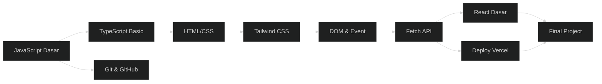
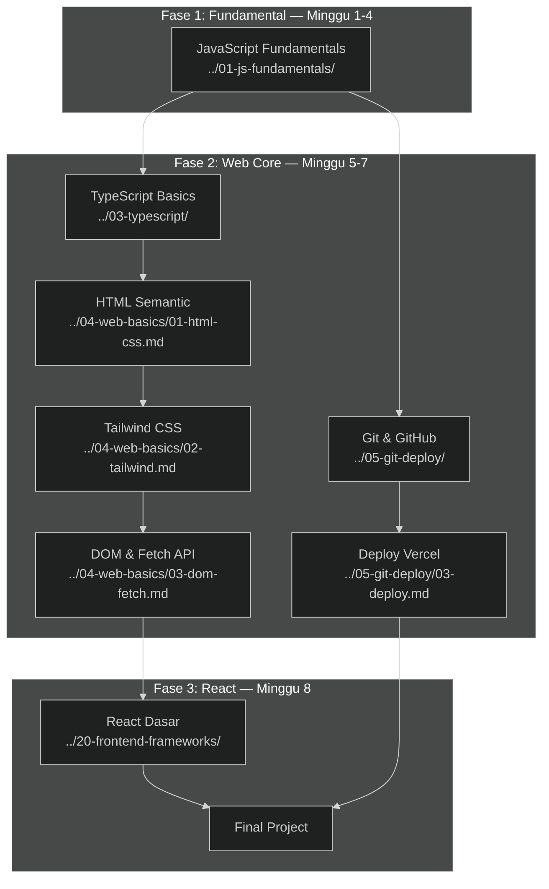

# 🎨 Path Frontend Web

> **Target:** Bisa bikin website modern pake HTML/CSS/JS + React
> **Estimasi:** 8 minggu
> **Output:** Landing page + dashboard API + website interaktif

---

## Peta Path

---

## Modul yang Diambil

| # | Modul | Minggu | Wajib |
|---|-------|--------|-------|
| 1 | JavaScript Fundamentals | 1-4 | ✅ |
| — | Algorithms & Data Structures | — | Opsional |
| 3 | TypeScript Basics | 5 | ✅ |
| 4 | Web Basics (HTML/CSS/Tailwind) | 6-7 | ✅ |
| 5 | Git & GitHub + Deploy | 5 | ✅ |
| — | React Dasar (Elektif) | 8 | ✅ (wajib di path ini) |
| — | Final Project | 7-8 | ✅ |

---

## Skill yang Dipelajari

- JavaScript ES6+ (Intermediate)
- TypeScript (Basic)
- HTML semantic + CSS Flexbox/Grid
- Tailwind CSS
- DOM manipulation + Event handling
- Fetch API + async/await
- React (komponen, props, state)
- Deploy Vercel

---

## Project Output

1. Landing page pribadi — live di Vercel
2. Dashboard API publik
3. Website interaktif pake React

---

## Peta Jalan Lengkap & Urutan Modul

### Fase 1: Fundamental (Minggu 1-4) ⭐ Wajib

**Modul: [JavaScript Fundamentals](../01-js-fundamentals/)**

| Minggu | Topik | Sub-Modul |
|--------|-------|-----------|
| 1 | Variables, Tipe Data, Control Flow | [`01-variables-types.md`](../01-js-fundamentals/01-variables-types.md), [`02-control-flow.md`](../01-js-fundamentals/02-control-flow.md) |
| 2 | Array, Objects, Functions | [`03-arrays-objects.md`](../01-js-fundamentals/03-arrays-objects.md), [`04-functions.md`](../01-js-fundamentals/04-functions.md) |
| 3 | Async JavaScript, Error Handling | [`05-async-errors.md`](../01-js-fundamentals/05-async-errors.md) |
| 4 | Review & Mini Project | Mini project: kalkulator / to-do list |

**Prasyarat:** Tidak ada — path ini dimulai dari nol.
**Target Pembelajaran:**
- Paham variable (`let`, `const`), tipe data, operator
- Bisa pakai control flow (`if`, `for`, `while`)
- Bisa manipulasi array & object
- Paham fungsi (arrow function, callback)
- Paham async/await, Promise, fetch API
- Siap debug error pakai try-catch

**Total waktu:** ~40 jam (10 jam/minggu)

### Fase 2: Web Core (Minggu 5-7) ⭐ Wajib

**Urutan pengerjaan — kerjakan paralel:**

| Minggu | Modul | Estimasi | Link |
|--------|-------|----------|------|
| 5 | **TypeScript Basics** | 10 jam | [`../03-typescript/`](../03-typescript/) |
| 5 | **Git & GitHub + Deploy** | 5 jam | [`../05-git-deploy/`](../05-git-deploy/) |
| 6 | **Web Basics (HTML/CSS)** | 15 jam | [`../04-web-basics/01-html-css.md`](../04-web-basics/01-html-css.md) |
| 6-7 | **Tailwind CSS** | 10 jam | [`../04-web-basics/02-tailwind.md`](../04-web-basics/02-tailwind.md) |
| 7 | **DOM & Fetch API** | 10 jam | [`../04-web-basics/03-dom-fetch.md`](../04-web-basics/03-dom-fetch.md) |
| 7 | **Deploy ke Vercel** | 3 jam | [`../05-git-deploy/03-deploy.md`](../05-git-deploy/03-deploy.md) |

**Prasyarat:** JavaScript Fundamentals (Minggu 1-4) harus sudah tuntas.
**Target Pembelajaran:**
- TypeScript: tipe dasar, interface, type annotation
- Git: init, add, commit, push, pull, branch, merge
- HTML: semantic tags (`<header>`, `<nav>`, `<main>`, `<article>`, `<section>`, `<footer>`)
- CSS: Flexbox, Grid, responsive design, media queries
- Tailwind: utility-first, responsive prefixes, dark mode, component extraction
- DOM: `querySelector`, event listener, DOM manipulation
- Fetch: GET/POST request, async/await, error handling
- Deploy: Vercel CLI, GitHub integration, environment variables, custom domain

### Fase 3: React & Final Project (Minggu 8) ⭐ Wajib

**Modul: [React Dasar](../20-frontend-frameworks/)**

| Minggu | Topik | Sub-Modul |
|--------|-------|-----------|
| 8 | React Setup & JSX | [`01-react-basics.md`](../20-frontend-frameworks/01-react-basics.md) |
| 8 | React Hooks (useState, useEffect) | [`02-react-hooks.md`](../20-frontend-frameworks/02-react-hooks.md) |
| 8 | Final Project | Landing page + Dashboard |

**Prasyarat:** Web Basics (Minggu 6-7), TypeScript (Minggu 5).
**Target Pembelajaran:**
- React: komponen, props, state
- JSX syntax, conditional rendering, list rendering
- useState, useEffect hooks
- Fetch API dalam React
- React Router dasar
- Integrasi Tailwind dengan React

---

## Modul Opsional (Pengayaan)

Modul ini tidak wajib tapi sangat direkomendasikan untuk memperdalam skill:

| Modul | Alasan | Estimasi | Link |
|-------|--------|----------|------|
| **Algorithms & Data Structures** | Persiapan technical interview | 20 jam | [`../02-algorithms-data-structures/`](../02-algorithms-data-structures/) |
| **UI/UX Design** | Bikin tampilan lebih profesional | 10 jam | [`../12-ui-ux-design/`](../12-ui-ux-design/) |
| **Git Branching** | Kolaborasi tim | 5 jam | [`../05-git-deploy/02-github-collab.md`](../05-git-deploy/02-github-collab.md) |
| **Web Performance** | Optimasi load time | 8 jam | [`../32-performance/`](../32-performance/) |
| **PWA & Offline** | Bikin web yang jalan offline | 10 jam | [`../34-pwa-offline/`](../34-pwa-offline/) |
| **AI Dev Workflow** | Coding lebih cepat dengan AI tools | 8 jam | [`../38-ai-dev-workflow/`](../38-ai-dev-workflow/) |
| **Next.js** | Framework React production-grade | 15 jam | [`../20-frontend-frameworks/03-nextjs-frameworks.md`](../20-frontend-frameworks/03-nextjs-frameworks.md) |

---

## Rencana Studi Mingguan (Detail)

### Fase 1: Minggu 1-4 — JavaScript Fundamentals

| Hari | Senin | Selasa | Rabu | Kamis | Jumat | Sabtu | Minggu |
|------|-------|--------|------|-------|-------|-------|--------|
| **M1** | Variable & tipe data | Control flow | Array dasar | Object dasar | Review | Latihan soal | Istirahat |
| **M2** | Functions | Arrow functions | Callback | Higher-order | Mini project | Review | Istirahat |
| **M3** | Promise & async | Fetch API | Error handling | try-catch | Latihan API | Mini project | Istirahat |
| **M4** | Review JS | Mini project | Debugging | Polish | Presentasi | Feedback | Istirahat |

### Fase 2: Minggu 5-7 — Web Core

| Hari | Senin | Selasa | Rabu | Kamis | Jumat | Sabtu | Minggu |
|------|-------|--------|------|-------|-------|-------|--------|
| **M5** | TS: tipe dasar | TS: interface | TS: function | Git: dasar | Git: branch | Deploy Vercel | Istirahat |
| **M6** | HTML semantic | CSS Flexbox | CSS Grid | Tailwind utility | Tailwind responsive | Review | Istirahat |
| **M7** | DOM manipulation | Event handling | Fetch API | Dashboard project | Review & deploy | Finalisasi | Istirahat |

### Fase 3: Minggu 8 — React & Final

| Hari | Senin | Selasa | Rabu | Kamis | Jumat | Sabtu | Minggu |
|------|-------|--------|------|-------|-------|-------|--------|
| **M8** | React setup & JSX | Komponen & Props | State & useState | useEffect & Fetch | Final project | Polish & deploy | Istirahat |

---

## Prasyarat & Learning Objectives per Fase

### Fase 1: JavaScript Fundamentals
**Prasyarat:** Tidak ada — cocok untuk pemula total.
**Target:**
- ✅ Bisa nulis kode JavaScript ES6+
- ✅ Paham variable scope, closure dasar
- ✅ Bisa fetch data dari API eksternal
- ✅ Siap untuk belajar framework/library

### Fase 2: Web Core
**Prasyarat:** JavaScript Fundamentals sudah tuntas.
**Target:**
- ✅ Bikin halaman web responsive dengan Tailwind
- ✅ Paham semantic HTML & aksesibilitas dasar
- ✅ Bisa integrasi API ke halaman web
- ✅ Bisa deploy ke Vercel

### Fase 3: React & Project
**Prasyarat:** Web Basics, TypeScript dasar, Git.
**Target:**
- ✅ Bikin single-page application dengan React
- ✅ Paham komponen, props, state, hooks
- ✅ Bisa deploy React app ke Vercel
- ✅ Portfolio-ready project

---

## Dependency Graph (Visual)

---

## Jalur Karir Setelah Path Ini

Setelah menyelesaikan Frontend Web Path, kamu bisa melamar ke posisi:

| Posisi | Gaji Junior (IDR) | Skill Tambahan yang Diperlukan |
|--------|-------------------|-------------------------------|
| **Frontend Developer** | Rp 5-10 juta/bln | React/Next.js production experience |
| **Web Developer** | Rp 4-8 juta/bln | Backend dasar (Node.js) |
| **UI Engineer** | Rp 6-12 juta/bln | Design system, aksesibilitas |
| **WordPress Developer** | Rp 4-7 juta/bln | PHP, WordPress ecosystem |
| **Freelance Web Developer** | Rp 50-200 ribu/jam | Client communication,项目管理 |

**Proyeksi karir 1-3 tahun:**
- **Junior Frontend** (0-1 thn): Membangun komponen, landing page, dashboard
- **Mid Frontend** (1-2 thn): Arsitektur frontend, performance optimization, code review
- **Senior Frontend** (2-3 thn): Design system lead, mentoring, technical decision

**Teknologi yang umum di industri:**
- React (paling banyak dipakai)
- Next.js (recommended setelah React dasar)
- Vue.js (alternatif populer)
- Svelte / SolidJS (modern, growing)
- TypeScript (standar industri)

---

## Proyek Portofolio yang Direkomendasikan

### 1. Landing Page Pribadi (Minggu 5-6)
**Tujuan:** Demonstrasi HTML semantic + Tailwind CSS + responsive design
**Link modul:** [`../04-web-basics/01-html-css.md`](../04-web-basics/01-html-css.md), [`../04-web-basics/02-tailwind.md`](../04-web-basics/02-tailwind.md)
**Fitur:**
- Hero section, about, skills, projects, contact
- Responsive (mobile-first)
- Dark mode toggle (Tailwind)
- Deploy ke Vercel
- Custom domain (opsional)

### 2. Dashboard API Publik (Minggu 7)
**Tujuan:** Demonstrasi Fetch API + DOM manipulation + data visualisasi
**Link modul:** [`../04-web-basics/03-dom-fetch.md`](../04-web-basics/03-dom-fetch.md), [`../05-git-deploy/03-deploy.md`](../05-git-deploy/03-deploy.md)
**Ide project:**
- Cuaca: fetch dari OpenWeatherMap API
- GitHub stats: fetch dari GitHub API
- Crypto price: fetch dari CoinGecko API
- Berita: fetch dari News API

### 3. Website Interaktif dengan React (Minggu 8 — Final)
**Tujuan:** Demonstrasi React + state management + routing
**Link modul:** [`../20-frontend-frameworks/01-react-basics.md`](../20-frontend-frameworks/01-react-basics.md), [`../20-frontend-frameworks/02-react-hooks.md`](../20-frontend-frameworks/02-react-hooks.md)
**Ide project:**
- **Aplikasi Catatan** — CRUD notes, kategori, search, dark mode
- **Movie Database** — Cari film dari API, filter, detail page
- **E-commerce Mini** — Product listing, cart, checkout flow
- **Task Manager** — Drag & drop, status, deadline

### 4. Proyek Portfolio Series (Advanced)
Setelah path selesai, lanjutkan ke proyek portofolio yang lebih kompleks:
[`../48-portfolio-project-series/`](../48-portfolio-project-series/)
- Landing page profesional
- CRUD API terintegrasi
- Full-stack app

---

## Tips Sukses

1. **Koding setiap hari** — Minimal 30 menit. Konsistensi > durasi.
2. **Bangun proyek nyata** — Jangan cuma ikut tutorial. Modifikasi, tambah fitur sendiri.
3. **Baca kode orang lain** — GitHub explore, baca open source React components.
4. **Gunakan AI sebagai tools** — [`AI Dev Workflow`](../38-ai-dev-workflow/) untuk pair programming.
5. **Join komunitas** — Discord RPL AI, Facebook Developer Circle, GitHub Discussions.
6. **Dokumentasikan perjalanan** — Blog atau LinkedIn posts tentang apa yang dipelajari.

---

## Integrasi dengan Path Lain

| Path | Relevansi | Waktu Terbaik |
|------|-----------|---------------|
| [Backend API](../02-backend-api.md) | Butuh frontend buat consume API | Setelah path ini selesai |
| [Full-Stack](../04-fullstack.md) | Gabung frontend + backend + AI | Rekomendasi utama |
| [AI Agent](../03-ai-agent.md) | Integrasi AI di frontend | Setelah paham API |

---

---

## Tools & Resources yang Direkomendasikan

### Editor & IDE
- **VS Code** — Editor utama. WAJIB install extension: ESLint, Prettier, Tailwind CSS IntelliSense, ES7+ React snippets, GitLens
- **CodeSandbox / StackBlitz** — Online editor buat prototyping cepat tanpa setup lokal

### Desain & Inspirasi
- **Figma** — Desain UI sebelum coding. Cari template gratis di Figma Community
- **Dribbble / Behance** — Inspirasi desain web modern
- **Tailwind UI** — Komponen pre-built Tailwind (berbayar, tapi kualitas tinggi)
- **Heroicons** — Icon set gratis dari Tailwind team
- **Unsplash / Pexels** — Gambar gratis untuk landing page

### Belajar & Referensi
- **MDN Web Docs** — Dokumentasi HTML/CSS/JS paling otoritatif
- **JavaScript.info** — Tutorial JavaScript paling lengkap (bisa offline)
- **React.dev** — Dokumentasi resmi React dengan tutorial interaktif
- **Tailwind Docs** — Dokumentasi Tailwind sangat jelas dan lengkap
- **Can I Use** — Cek kompatibilitas browser untuk CSS/JS feature

### Deployment & Hosting
- **Vercel** — Deploy frontend gratis, integrasi GitHub otomatis
- **Netlify** — Alternatif Vercel, fitur form handling built-in
- **Cloudflare Pages** — Cepat, gratis, unlimited bandwidth

### AI Assistance
- **GitHub Copilot** — AI pair programming dalam VS Code
- **Cursor** — AI-first IDE, rekomendasi untuk React development
- **Claude / ChatGPT** — Konsultasi kode, debugging, code review

## Studi Kasus: Dari Nol ke Frontend Developer dalam 8 Minggu

### Profil: Andi (Mahasiswa Semester 4)
Andi tidak punya background coding sama sekali. Mengikuti path ini dengan disiplin:

- **Minggu 1-2:** Struggle dengan JavaScript — sering error, bingung bedain `==` vs `===`. Tapi tetap nulis kode setiap hari.
- **Minggu 3:** Mulai klik dengan async/await setelah bikin fetch sederhana ke API cuaca.
- **Minggu 4:** Mini project kalkulator — pertama kali ngerasa "bisa bikin sesuatu yang nyata".
- **Minggu 5:** TypeScript agak bingung di awal, tapi interface membantu ngurangin error runtime.
- **Minggu 6:** Tailwind bikin styling jadi cepat. Andi bikin landing page pribadi dalam 2 hari.
- **Minggu 7:** Dashboard API publik — struggle dengan CORS error, tapi solusinya dipahami setelah baca [`../46-debugging-devtools/03-api-debugging.md`](../46-debugging-devtools/03-api-debugging.md).
- **Minggu 8:** Final project React — Aplikasi Catatan dengan fitur CRUD, search, dan dark mode. Deploy ke Vercel.

**Hasil:** 3 proyek di portofolio, siap melamar posisi Junior Frontend Developer.

## Checklist Progres Path

Gunakan checklist ini untuk tracking progress:

### Fase 1: JavaScript Fundamentals
- [ ] Variabel & tipe data
- [ ] Control flow (if/else, switch, loop)
- [ ] Array methods (map, filter, reduce)
- [ ] Objects & destructuring
- [ ] Functions (arrow, callback, higher-order)
- [ ] Async/await & Fetch API
- [ ] Error handling dengan try-catch
- [ ] Mini project selesai

### Fase 2: Web Core
- [ ] TypeScript: tipe dasar, interface
- [ ] Git: init, add, commit, push, branch
- [ ] HTML semantic tag
- [ ] CSS Flexbox & Grid
- [ ] Tailwind utility classes
- [ ] Responsive design (mobile-first)
- [ ] DOM manipulation
- [ ] Fetch API integration
- [ ] Deploy ke Vercel

### Fase 3: React & Final Project
- [ ] React setup (Vite)
- [ ] JSX & komponen
- [ ] Props & State
- [ ] useState & useEffect
- [ ] Conditional rendering
- [ ] Form handling
- [ ] Final project selesai & live

---

👉 Mulai dari [JavaScript Fundamentals](../01-js-fundamentals/)
