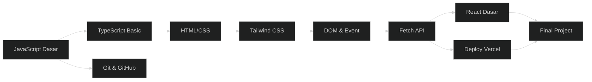

# 🎨 Path Frontend Web

> **Target:** Bisa bikin website modern pake HTML/CSS/JS + React
> **Estimasi:** 8 minggu
> **Output:** Landing page + dashboard API + website interaktif

---

## Peta Path

---

## Modul yang Diambil

| # | Modul | Minggu | Wajib |
|---|-------|--------|-------|
| 1 | JavaScript Fundamentals | 1-4 | ✅ |
| — | Algorithms & Data Structures | — | Opsional |
| 3 | TypeScript Basics | 5 | ✅ |
| 4 | Web Basics (HTML/CSS/Tailwind) | 6-7 | ✅ |
| 5 | Git & GitHub + Deploy | 5 | ✅ |
| — | React Dasar (Elektif) | 8 | ✅ (wajib di path ini) |
| — | Final Project | 7-8 | ✅ |

---

## Skill yang Dipelajari

- JavaScript ES6+ (Intermediate)
- TypeScript (Basic)
- HTML semantic + CSS Flexbox/Grid
- Tailwind CSS
- DOM manipulation + Event handling
- Fetch API + async/await
- React (komponen, props, state)
- Deploy Vercel

---

## Project Output

1. Landing page pribadi — live di Vercel
2. Dashboard API publik
3. Website interaktif pake React

👉 Mulai dari [JavaScript Fundamentals](../01-js-fundamentals/)
