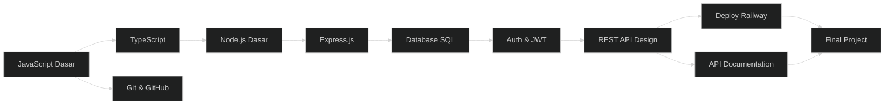
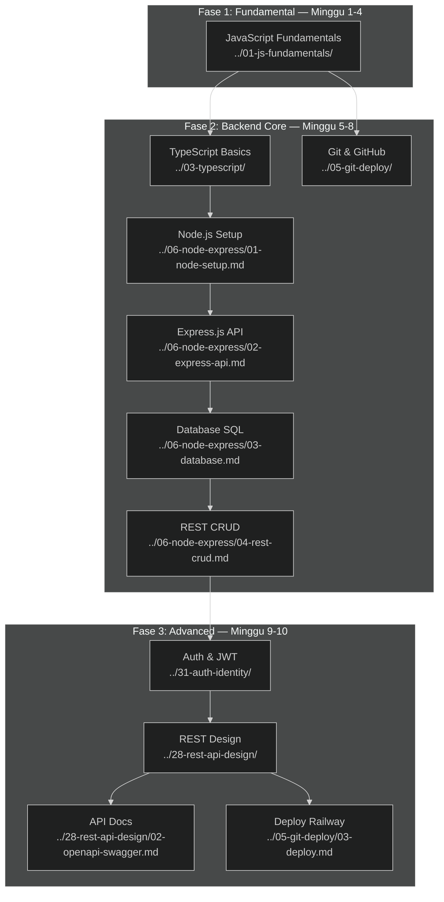

# ⚙️ Path Backend API

> **Target:** Bisa bikin REST API pake Node.js + TypeScript + Database
> **Estimasi:** 10 minggu
> **Output:** REST API production-ready + database + deploy

---

## Peta Path

---

## Modul yang Diambil

| # | Modul | Minggu | Wajib |
|---|-------|--------|-------|
| 1 | JavaScript Fundamentals | 1-4 | ✅ |
| — | Algorithms & Data Structures | — | Opsional |
| 3 | TypeScript Basics | 5 | ✅ |
| 5 | Git & GitHub + Deploy | 5 | ✅ |
| 6 | Node.js & Express | 6-7 | ✅ |
| — | Database SQL | 8 | ✅ |
| — | Docker (Elektif) | — | Opsional |
| — | Final Project | 9-12 | ✅ |

---

## Skill yang Dipelajari

- JavaScript ES6+ (Intermediate)
- TypeScript (Intermediate)
- Node.js runtime
- Express.js routing + middleware
- PostgreSQL / SQLite
- REST API design patterns
- JWT authentication
- Environment variables
- Deploy Railway

---

## Project Output

1. REST API dengan CRUD endpoints
2. PostgreSQL database integration
3. JWT authentication
4. API documentation
5. Deployed to Railway — bisa dipanggil dari mana aja

---

## Peta Jalan Lengkap & Urutan Modul

### Fase 1: Fundamental (Minggu 1-4) ⭐ Wajib

**Modul: [JavaScript Fundamentals](../01-js-fundamentals/)**

| Minggu | Topik | Sub-Modul |
|--------|-------|-----------|
| 1 | Variables, Tipe Data, Control Flow | [`01-variables-types.md`](../01-js-fundamentals/01-variables-types.md), [`02-control-flow.md`](../01-js-fundamentals/02-control-flow.md) |
| 2 | Array, Objects, Functions | [`03-arrays-objects.md`](../01-js-fundamentals/03-arrays-objects.md), [`04-functions.md`](../01-js-fundamentals/04-functions.md) |
| 3 | Async JavaScript, Error Handling | [`05-async-errors.md`](../01-js-fundamentals/05-async-errors.md) |
| 4 | Review & Mini Project | Mini project: CLI todo app |

**Prasyarat:** Tidak ada.
**Target Pembelajaran:**
- Variabel (`let`, `const`), tipe data, operator
- Control flow (`if`, `for`, `while`, `switch`)
- Array methods (`map`, `filter`, `reduce`)
- Object & destructuring
- Arrow functions, callback, higher-order functions
- Async/await, Promise, Fetch API
- Error handling try-catch

**Total waktu:** ~40 jam (10 jam/minggu)

### Fase 2: Backend Core (Minggu 5-8) ⭐ Wajib

**Urutan pengerjaan:**

| Minggu | Modul | Estimasi | Link |
|--------|-------|----------|------|
| 5 | **TypeScript Basics** | 10 jam | [`../03-typescript/`](../03-typescript/) |
| 5 | **Git & GitHub** | 5 jam | [`../05-git-deploy/`](../05-git-deploy/) |
| 6 | **Node.js Setup & Project Structure** | 8 jam | [`../06-node-express/01-node-setup.md`](../06-node-express/01-node-setup.md) |
| 6-7 | **Express.js API** | 15 jam | [`../06-node-express/02-express-api.md`](../06-node-express/02-express-api.md) |
| 7-8 | **REST API CRUD** | 10 jam | [`../06-node-express/04-rest-crud.md`](../06-node-express/04-rest-crud.md) |
| 8 | **Database SQL (PostgreSQL)** | 15 jam | [`../06-node-express/03-database.md`](../06-node-express/03-database.md) |

**Prasyarat:** JavaScript Fundamentals (Minggu 1-4).
**Target Pembelajaran:**
- TypeScript: tipe, interface, generics dasar
- Git: workflow kolaborasi, branch, merge, pull request
- Node.js: runtime, module system (CommonJS vs ESM), npm
- Express.js: routing, middleware (built-in & custom), error handling
- REST API: CRUD endpoints, status codes, request/response format
- PostgreSQL: koneksi, query, migration, seeding
- Environment variables: `.env`, validation

### Fase 3: Advanced Backend (Minggu 9-10) ⭐ Wajib

| Minggu | Modul | Estimasi | Link |
|--------|-------|----------|------|
| 9 | **Auth & JWT** | 10 jam | [`../31-auth-identity/`](../31-auth-identity/) |
| 9 | **REST API Design Patterns** | 8 jam | [`../28-rest-api-design/`](../28-rest-api-design/) |
| 10 | **API Documentation** | 5 jam | [`../28-rest-api-design/02-openapi-swagger.md`](../28-rest-api-design/02-openapi-swagger.md) |
| 10 | **Deploy Railway** | 5 jam | [`../05-git-deploy/03-deploy.md`](../05-git-deploy/03-deploy.md) |

**Prasyarat:** Node.js & Express, Database SQL.
**Target Pembelajaran:**
- JWT: token generation, verification, refresh token
- Authentication flow: register → login → protected routes
- REST design: naming conventions, HATEOAS, versioning
- Error handling: global error middleware, custom error classes
- API documentation: OpenAPI/Swagger, typedoc
- Deployment: Railway CLI, environment config, logging

### Fase 4: Final Project (Minggu 10-12) ⭐ Wajib

**Fitur minimal yang harus ada:**
1. ✅ User registration & login (JWT)
2. ✅ CRUD endpoints untuk resource utama
3. ✅ PostgreSQL database dengan migrasi
4. ✅ Validasi input (Zod/Joi)
5. ✅ Error handling konsisten
6. ✅ API documentation (Swagger)
7. ✅ Deployed ke Railway

---

## Modul Opsional (Pengayaan)

| Modul | Alasan | Estimasi | Link |
|-------|--------|----------|------|
| **Algorithms & Data Structures** | Technical interview prep | 20 jam | [`../02-algorithms-data-structures/`](../02-algorithms-data-structures/) |
| **Docker Basics** | Containerization, env consistency | 10 jam | [`../21-docker/`](../21-docker/) |
| **Testing (Unit & Integration)** | Code quality & reliability | 12 jam | [`../09-testing/`](../09-testing/) |
| **Linux Terminal** | Server administration | 8 jam | [`../27-linux-terminal/`](../27-linux-terminal/) |
| **Monitoring & Logging** | Production ops | 8 jam | [`../41-monitoring/`](../41-monitoring/) |
| **Design Patterns** | Scalable architecture | 10 jam | [`../10-design-patterns/`](../10-design-patterns/) |
| **System Design** | Arsitektur skala besar | 15 jam | [`../11-system-design/`](../11-system-design/) |
| **GraphQL / tRPC** | Alternatif REST API | 10 jam | [`../30-graphql-trpc/`](../30-graphql-trpc/) |
| **Advanced Database** | Indexing, transaction, scaling | 10 jam | [`../17-advanced-database/`](../17-advanced-database/) |

---

## Rencana Studi Mingguan (Detail)

### Fase 1: Minggu 1-4 — JavaScript Fundamentals

| Hari | Senin | Selasa | Rabu | Kamis | Jumat | Sabtu | Minggu |
|------|-------|--------|------|-------|-------|-------|--------|
| **M1** | Variable & tipe data | Control flow | Array | Object | Review | Latihan | Istirahat |
| **M2** | Functions | Arrow function | Callback | Higher-order | Mini CLI | Review | Istirahat |
| **M3** | Promise & async | Fetch API | Error handling | try-catch | Latihan API | Mini project | Istirahat |
| **M4** | Review JS | Mini project | Debugging | Polish | Presentasi | Feedback | Istirahat |

### Fase 2: Minggu 5-8 — Backend Core

| Hari | Senin | Selasa | Rabu | Kamis | Jumat | Sabtu | Minggu |
|------|-------|--------|------|-------|-------|-------|--------|
| **M5** | TS: tipe dasar | TS: interface | TS: generic | Git: dasar | Git: branch | Git: PR | Istirahat |
| **M6** | Node.js setup | Express routing | Express middleware | Error handling | REST CRUD | Review | Istirahat |
| **M7** | Database setup | SQL queries | Migration & seed | Koneksi Express | CRUD + DB | Review | Istirahat |
| **M8** | Validasi input | Error handling | REST patterns | Deploy Railway | Review | Polish | Istirahat |

### Fase 3: Minggu 9-10 — Advanced Backend

| Hari | Senin | Selasa | Rabu | Kamis | Jumat | Sabtu | Minggu |
|------|-------|--------|------|-------|-------|-------|--------|
| **M9** | Auth flow | JWT implement | Protected routes | Refresh token | API versioning | Review | Istirahat |
| **M10** | Swagger docs | Testing API | Deploy final | README docs | Final review | Presentasi | Istirahat |

---

## Prasyarat & Learning Objectives per Fase

### Fase 1: JavaScript Fundamentals
**Prasyarat:** Tidak ada.
**Target:**
- ✅ Nulis kode JavaScript ES6+ dengan percaya diri
- ✅ Debug error sendiri pake DevTools & console
- ✅ Siap belajar backend

### Fase 2: Backend Core
**Prasyarat:** JavaScript Fundamentals.
**Target:**
- ✅ Setup project Node.js dari nol
- ✅ Bikin REST API dengan Express
- ✅ Integrasi PostgreSQL
- ✅ Handle error dengan middleware

### Fase 3: Advanced Backend
**Prasyarat:** Node.js & Express, Database SQL.
**Target:**
- ✅ Implementasi JWT authentication
- ✅ Bikin API documentation
- ✅ Deploy ke Railway
- ✅ Production-ready code

---

## Dependency Graph (Visual)

---

## Jalur Karir Setelah Path Ini

| Posisi | Gaji Junior (IDR) | Skill Tambahan |
|--------|-------------------|----------------|
| **Backend Developer** | Rp 6-12 juta/bln | Node.js/Go/Python, database, cloud |
| **API Engineer** | Rp 7-14 juta/bln | REST/GraphQL, API design, documentation |
| **Database Administrator** | Rp 5-10 juta/bln | SQL advanced, indexing, optimization |
| **DevOps Engineer** | Rp 8-15 juta/bln | Docker, CI/CD, cloud infrastructure |
| **Technical Lead** | Rp 12-20 juta/bln | System design, team management |

**Proyeksi karir:**
- **Junior Backend** (0-1 thn): Implementasi API, debugging, database query
- **Mid Backend** (1-2 thn): Arsitektur API, performance optimization, code review
- **Senior Backend** (2-4 thn): System design, mentoring, technical decision
- **Tech Lead / Architect** (4+ thn): Architecture decision, team leadership

---

## Proyek Portofolio yang Direkomendasikan

### 1. REST API Manajemen Kontak (Final Project)
**Tujuan:** Demonstrasi CRUD + Auth + Database
**Link modul:** [`../06-node-express/04-rest-crud.md`](../06-node-express/04-rest-crud.md), [`../31-auth-identity/`](../31-auth-identity/)
**Fitur:**
- User registration & login
- CRUD kontak (nama, email, telepon, alamat)
- Kategori kontak (teman, keluarga, kerja)
- Search & pagination
- Validasi input Zod
- Swagger documentation
- Deploy ke Railway

### 2. Blog API
**Tujuan:** Relasi database kompleks
**Fitur:**
- Users, posts, categories, comments, tags
- Relasi many-to-many
- Nested CRUD
- Search & filter
- Rate limiting

### 3. E-commerce API
**Tujuan:** Production-ready API
**Fitur:**
- Products, categories, cart, orders
- Authentication & authorization (admin/user)
- Image upload
- Payment integration (opsional)

### 4. Realtime API
**Tujuan:** WebSocket & event-driven
**Link modul:** [`../16-realtime-apps/`](../16-realtime-apps/)
**Fitur:**
- Chat API
- Notifikasi realtime
- Live updates

---

## Tools & Resources

### Editor & Tools
- **VS Code** + REST Client extension
- **Postman / Insomnia** — API testing
- **DBVisualizer / DBeaver** — Database GUI
- **Railway / Render** — Deployment
- **Neon / Supabase** — PostgreSQL hosting gratis

### Belajar & Referensi
- **Express.js Docs** — Dokumentasi resmi
- **PostgreSQL Docs** — Dokumentasi database
- **Node.js Best Practices** — Gold standard untuk production Node.js
- **JWT.io** — Debugger token JWT

### AI Assistance
- **GitHub Copilot** — Pair programming
- **Claude / ChatGPT** — Debugging, code generation
- **Cursor** — AI-first IDE

---

## Studi Kasus: Dari Nol ke Backend Developer dalam 10 Minggu

### Profil: Budi (Lulusan SMK TKJ)
Budi lulus SMK Teknik Komputer Jaringan. Bisa install server, tapi gak bisa coding.

- **Minggu 1-3:** JavaScript berat di awal. Tapi karena Budi paham logika jaringan, konsep async/await lebih cepat dipahami.
- **Minggu 4:** CLI todo app — pertama kali bikin program yang jalan di terminal. Sense of achievement besar.
- **Minggu 5-6:** Node.js + Express. Budi struggle dengan middleware di awal, tapi setelah paham konsep "pipeline", semuanya klik.
- **Minggu 7:** Database SQL. Background TKJ membantu — Budi udah familiar dengan MySQL.
- **Minggu 8:** CRUD + database integration. Budi bikin REST API untuk manajemen inventaris.
- **Minggu 9:** JWT authentication. Agak rumit, tapi setelah baca [`../31-auth-identity/`](../31-auth-identity/) jadi paham konsep token-based auth.
- **Minggu 10:** Swagger docs + deploy Railway. Bikin dokumentasi API dan deploy.

**Hasil:** REST API production-ready. Budi apply sebagai Junior Backend Developer dan diterima di startup lokal.

---

## Checklist Progres Path

### Fase 1: JavaScript Fundamentals
- [ ] Variable & tipe data
- [ ] Control flow (if/else, switch, loop)
- [ ] Array methods (map, filter, reduce)
- [ ] Objects & destructuring
- [ ] Functions (arrow, callback, higher-order)
- [ ] Async/await & Fetch API
- [ ] Error handling try-catch
- [ ] CLI mini project

### Fase 2: Backend Core
- [ ] TypeScript: tipe, interface, generic
- [ ] Git: branch, merge, PR workflow
- [ ] Node.js project setup
- [ ] Express routing & middleware
- [ ] PostgreSQL connection & query
- [ ] Migration & seeding
- [ ] CRUD endpoints
- [ ] Input validation
- [ ] Error handling middleware

### Fase 3: Advanced
- [ ] JWT authentication
- [ ] Protected routes
- [ ] REST API naming conventions
- [ ] API versioning
- [ ] Swagger/OpenAPI docs
- [ ] Deploy ke Railway
- [ ] Environment configuration

---

## Integrasi dengan Path Lain

| Path | Relevansi | Waktu Terbaik |
|------|-----------|---------------|
| [Frontend Web](../01-frontend-web.md) | Consume API yang dibuat | Sebelum path ini |
| [Full-Stack](../04-fullstack.md) | Gabung backend + frontend + AI | Setelah path ini |
| [AI Agent](../03-ai-agent.md) | Integrasi AI di backend | Setelah paham REST API |

---

👉 Mulai dari [JavaScript Fundamentals](../01-js-fundamentals/)
