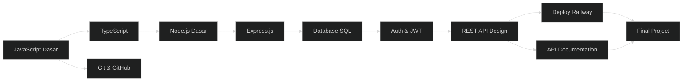

# ⚙️ Path Backend API

> **Target:** Bisa bikin REST API pake Node.js + TypeScript + Database
> **Estimasi:** 8 minggu
> **Output:** REST API production-ready + database + deploy

---

## Peta Path

---

## Modul yang Diambil

| # | Modul | Minggu | Wajib |
|---|-------|--------|-------|
| 1 | JavaScript Fundamentals | 1-4 | ✅ |
| 2 | TypeScript Basics | 5 | ✅ |
| 3 | Git & GitHub + Deploy | 5 | ✅ |
| 4 | Node.js & Express | 6-7 | ✅ |
| 5 | Database SQL | 8 | ✅ |
| — | Docker (Elektif) | — | Opsional |
| — | Final Project | 9-12 | ✅ |

---

## Skill yang Dipelajari

- JavaScript ES6+ (Intermediate)
- TypeScript (Intermediate)
- Node.js runtime
- Express.js routing + middleware
- PostgreSQL / SQLite
- REST API design patterns
- JWT authentication
- Environment variables
- Deploy Railway

---

## Project Output

1. REST API dengan CRUD endpoints
2. PostgreSQL database integration
3. JWT authentication
4. API documentation
5. Deployed to Railway — bisa dipanggil dari mana aja

👉 Mulai dari [JavaScript Fundamentals](../01-js-fundamentals/)
