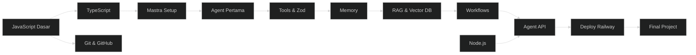

# 🤖 Path AI Agent

> **Target:** Bisa bikin AI agents pake Mastra framework + tools + RAG
> **Estimasi:** 8 minggu
> **Output:** AI agent with tools + memory + RAG, deploy sebagai API

---

## Peta Path

---

## Modul yang Diambil

| # | Modul | Minggu | Wajib |
|---|-------|--------|-------|
| 1 | JavaScript Fundamentals | 1-4 | ✅ |
| 2 | TypeScript Basics | 5 | ✅ |
| 3 | Git & GitHub | 5 | ✅ |
| 4 | Node.js & Express (dasar) | 6 | ✅ |
| 5 | Mastra AI — Agents & Tools | 7-8 | ✅ |
| 6 | Mastra AI — Memory & RAG | 9-10 | ✅ |
| 7 | Mastra AI — Workflows | 11 | ✅ |
| — | Final Project | 10-12 | ✅ |

---

## Skill yang Dipelajari

- JavaScript ES6+ (Intermediate)
- TypeScript (Intermediate)
- Mastra AI Framework
- Agent design + instruction engineering
- Tools with Zod schema
- Memory management
- RAG (Retrieval Augmented Generation)
- Multi-agent workflows
- Model selection & fallback
- AI observability

---

## Project Output

1. Mastra agent with 3+ custom tools
2. Agent memory (ingat percakapan sebelumnya)
3. RAG agent (jawab dari dokumen)
4. Agent sebagai API endpoint — bisa dipanggil frontend
5. Deployed ke Railway

👉 Mulai dari [JavaScript Fundamentals](../01-js-fundamentals/)
