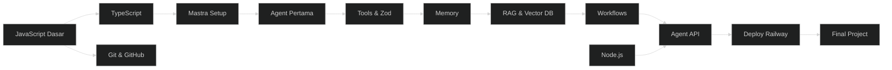
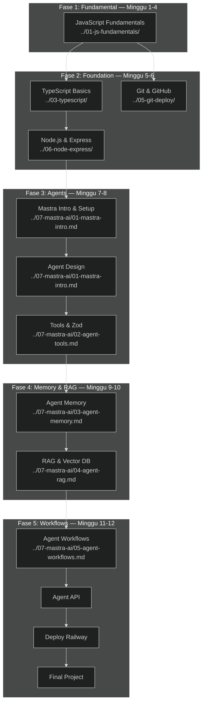

# 🤖 Path AI Agent

> **Target:** Bisa bikin AI agents pake Mastra framework + tools + RAG
> **Estimasi:** 10 minggu
> **Output:** AI agent with tools + memory + RAG, deploy sebagai API

---

## Peta Path

---

## Modul yang Diambil

| # | Modul | Minggu | Wajib |
|---|-------|--------|-------|
| 1 | JavaScript Fundamentals | 1-4 | ✅ |
| 3 | TypeScript Basics | 5 | ✅ |
| 5 | Git & GitHub | 5 | ✅ |
| 6 | Node.js & Express (dasar) | 6 | ✅ |
| 7 | Mastra AI — Agents & Tools | 7-8 | ✅ |
| — | Mastra AI — Memory & RAG | 9-10 | ✅ |
| — | Mastra AI — Workflows | 11 | ✅ |
| — | Algorithms & Data Structures | — | Opsional |
| — | Final Project | 10-12 | ✅ |

---

## Skill yang Dipelajari

- JavaScript ES6+ (Intermediate)
- TypeScript (Intermediate)
- Mastra AI Framework
- Agent design + instruction engineering
- Tools with Zod schema
- Memory management
- RAG (Retrieval Augmented Generation)
- Multi-agent workflows
- Model selection & fallback
- AI observability

---

## Project Output

1. Mastra agent with 3+ custom tools
2. Agent memory (ingat percakapan sebelumnya)
3. RAG agent (jawab dari dokumen)
4. Agent sebagai API endpoint — bisa dipanggil frontend
5. Deployed ke Railway

---

## Peta Jalan Lengkap & Urutan Modul

### Fase 1: Fundamental (Minggu 1-4) ⭐ Wajib

**Modul: [JavaScript Fundamentals](../01-js-fundamentals/)**

| Minggu | Topik | Sub-Modul |
|--------|-------|-----------|
| 1 | Variables, Tipe Data, Control Flow | [`01-variables-types.md`](../01-js-fundamentals/01-variables-types.md), [`02-control-flow.md`](../01-js-fundamentals/02-control-flow.md) |
| 2 | Array, Objects, Functions | [`03-arrays-objects.md`](../01-js-fundamentals/03-arrays-objects.md), [`04-functions.md`](../01-js-fundamentals/04-functions.md) |
| 3 | Async JavaScript, Error Handling | [`05-async-errors.md`](../01-js-fundamentals/05-async-errors.md) |
| 4 | Review & Mini Project | Mini project: CLI tool sederhana |

**Prasyarat:** Tidak ada.
**Target Pembelajaran:**
- Variable, control flow, function, array, object
- Async/await, Promise, error handling
- Bisa baca dan modifikasi kode JavaScript
- Siap belajar TypeScript & Node.js

**Total waktu:** ~40 jam (10 jam/minggu)

### Fase 2: Foundation untuk AI (Minggu 5-6) ⭐ Wajib

| Minggu | Modul | Estimasi | Link |
|--------|-------|----------|------|
| 5 | **TypeScript Basics** | 10 jam | [`../03-typescript/`](../03-typescript/) |
| 5 | **Git & GitHub** | 5 jam | [`../05-git-deploy/`](../05-git-deploy/) |
| 6 | **Node.js & Express Dasar** | 10 jam | [`../06-node-express/`](../06-node-express/) |

**Prasyarat:** JavaScript Fundamentals.
**Target Pembelajaran:**
- TypeScript: tipe, interface, generic, type safety
- Git: commit, branch, merge, remote
- Node.js: runtime, npm, module system
- Express: basic routing, middleware, API endpoint
- Zod: schema validation dasar (persiapan untuk tools)

### Fase 3: Mastra AI — Agents & Tools (Minggu 7-8) ⭐ Wajib

| Minggu | Modul | Sub-Modul | Link |
|--------|-------|-----------|------|
| 7 | Pengenalan Mastra & Agent Pertama | Konsep AI Agent vs API call | [`../07-mastra-ai/01-mastra-intro.md`](../07-mastra-ai/01-mastra-intro.md) |
| 7 | Mastra Setup | Install, init project, struktur | [`../07-mastra-ai/01-mastra-intro.md`](../07-mastra-ai/01-mastra-intro.md) |
| 7-8 | Agent dengan Tools | Zod schema, tool definition, function calling | [`../07-mastra-ai/02-agent-tools.md`](../07-mastra-ai/02-agent-tools.md) |

**Prasyarat:** TypeScript, Node.js & Express.
**Target Pembelajaran:**
- Paham bedanya AI Agent vs raw API call
- Setup project Mastra dari nol
- Bikin agent dengan instruksi (system prompt) yang jelas
- Bikin custom tools dengan Zod schema
- Tool execution & error handling
- Agent orchestration dasar
- Prompt engineering untuk agent behavior

### Fase 4: Memory & RAG (Minggu 9-10) ⭐ Wajib

| Minggu | Modul | Sub-Modul | Link |
|--------|-------|-----------|------|
| 9 | Agent Memory | Conversational memory, persistent storage | [`../07-mastra-ai/03-agent-memory.md`](../07-mastra-ai/03-agent-memory.md) |
| 9-10 | RAG Implementation | Vector embedding, similarity search, context injection | [`../07-mastra-ai/04-agent-rag.md`](../07-mastra-ai/04-agent-rag.md) |

**Prasyarat:** Agents & Tools (Minggu 7-8).
**Target Pembelajaran:**
- Macam-macam memory: window, summary, persistent
- Vector database: cara kerja, pilihan provider
- Document chunking & embedding
- RAG pipeline: query → retrieve → augment → generate
- Context window management
- Evaluasi kualitas RAG (faithfulness, relevance)

### Fase 5: Workflows, API & Deploy (Minggu 11-12) ⭐ Wajib

| Minggu | Modul | Sub-Modul | Link |
|--------|-------|-----------|------|
| 11 | Agent Workflows | Multi-agent, parallel execution, branching | [`../07-mastra-ai/05-agent-workflows.md`](../07-mastra-ai/05-agent-workflows.md) |
| 11 | Agent API | Express integration, webhook, streaming | — |
| 12 | Deploy Railway | Production deployment, env config | [`../05-git-deploy/03-deploy.md`](../05-git-deploy/03-deploy.md) |

**Prasyarat:** Memory & RAG.
**Target Pembelajaran:**
- Workflow design: sequential, parallel, conditional
- Multi-agent coordination
- Agent sebagai REST API endpoint
- Streaming response (SSE)
- Model fallback strategy
- Observability: logging, tracing, monitoring

---

## Modul Opsional (Pengayaan)

| Modul | Alasan | Estimasi | Link |
|-------|--------|----------|------|
| **Algorithms & Data Structures** | Problem solving lebih baik | 20 jam | [`../02-algorithms-data-structures/`](../02-algorithms-data-structures/) |
| **AI Prompt Engineering** | Prompt lebih efektif | 8 jam | [`../18-ai-prompt-engineering/`](../18-ai-prompt-engineering/) |
| **AI Dev Workflow** | AI tools dalam development | 8 jam | [`../38-ai-dev-workflow/`](../38-ai-dev-workflow/) |
| **Advanced Database** | Optimasi RAG dengan DB tuning | 10 jam | [`../17-advanced-database/`](../17-advanced-database/) |
| **Docker** | Containerization agent | 10 jam | [`../21-docker/`](../21-docker/) |
| **AI Coding Agents** | Coding dengan AI agents | 10 jam | [`../53-ai-coding-agents/`](../53-ai-coding-agents/) |
| **Production Ready Code** | Best practices production | 8 jam | [`../49-production-ready-code/`](../49-production-ready-code/) |
| **System Design** | Scaling AI infrastructure | 15 jam | [`../11-system-design/`](../11-system-design/) |

---

## Rencana Studi Mingguan (Detail)

### Fase 1: Minggu 1-4 — JavaScript Fundamentals

| Hari | Senin | Selasa | Rabu | Kamis | Jumat | Sabtu | Minggu |
|------|-------|--------|------|-------|-------|-------|--------|
| **M1** | Variable & tipe data | Control flow | Array | Object | Review | Latihan | Istirahat |
| **M2** | Functions | Arrow function | Callback | Higher-order | Mini CLI | Review | Istirahat |
| **M3** | Promise & async | Fetch API | Error handling | try-catch | Latihan API | Mini project | Istirahat |
| **M4** | Review JS | Mini project | Debugging | Polish | Presentasi | Feedback | Istirahat |

### Fase 2: Minggu 5-6 — Foundation

| Hari | Senin | Selasa | Rabu | Kamis | Jumat | Sabtu | Minggu |
|------|-------|--------|------|-------|-------|-------|--------|
| **M5** | TS: tipe dasar | TS: interface | TS: generic | Git: dasar | Git: branch | Git: remote | Istirahat |
| **M6** | Node.js setup | Express routing | Express API | Zod schema | Review | Mini API | Istirahat |

### Fase 3: Minggu 7-8 — Agents & Tools

| Hari | Senin | Selasa | Rabu | Kamis | Jumat | Sabtu | Minggu |
|------|-------|--------|------|-------|-------|-------|--------|
| **M7** | AI Agent konsep | Mastra setup | Agent pertama | System prompt | Tool definition | Tool testing | Istirahat |
| **M8** | Zod tools | Tool chaining | Agent orchestration | Error handling | Integration | Review | Istirahat |

### Fase 4: Minggu 9-10 — Memory & RAG

| Hari | Senin | Selasa | Rabu | Kamis | Jumat | Sabtu | Minggu |
|------|-------|--------|------|-------|-------|-------|--------|
| **M9** | Memory types | Window memory | Persistent memory | Vector DB setup | Embedding | RAG pipeline | Istirahat |
| **M10** | Document chunking | Context injection | RAG evaluation | Query optimization | Integration | Review | Istirahat |

### Fase 5: Minggu 11-12 — Workflows & Deploy

| Hari | Senin | Selasa | Rabu | Kamis | Jumat | Sabtu | Minggu |
|------|-------|--------|------|-------|-------|-------|--------|
| **M11** | Workflow design | Multi-agent | Parallel execution | Agent API | SSE streaming | Review | Istirahat |
| **M12** | Model fallback | Observability | Final project | Polish | Deploy | Presentasi | Istirahat |

---

## Prasyarat & Learning Objectives per Fase

### Fase 1: JavaScript Fundamentals
**Prasyarat:** Tidak ada.
**Target:**
- ✅ Paham JavaScript modern (ES6+)
- ✅ Bisa async/await & error handling
- ✅ Bisa akses API external

### Fase 2: Foundation for AI
**Prasyarat:** JavaScript Fundamentals.
**Target:**
- ✅ TypeScript type safety
- ✅ Node.js project setup
- ✅ Express API endpoint
- ✅ Zod schema validation

### Fase 3: Agents & Tools
**Prasyarat:** TypeScript, Node.js.
**Target:**
- ✅ Paham arsitektur AI Agent
- ✅ Setup Mastra project
- ✅ Bikin agent dengan custom tools
- ✅ Tool chaining & error handling

### Fase 4: Memory & RAG
**Prasyarat:** Agents & Tools.
**Target:**
- ✅ Memory management untuk conversational context
- ✅ Vector database setup & query
- ✅ RAG pipeline implementation
- ✅ Document processing & chunking

### Fase 5: Workflows & Production
**Prasyarat:** Memory & RAG.
**Target:**
- ✅ Multi-agent workflow design
- ✅ Agent sebagai production API
- ✅ Streaming response
- ✅ Deploy ke Railway

---

## Dependency Graph (Visual)

---

## Jalur Karir Setelah Path Ini

| Posisi | Gaji Junior (IDR) | Skill Tambahan |
|--------|-------------------|----------------|
| **AI Engineer** | Rp 8-15 juta/bln | LLM fine-tuning, RAG, agent architecture |
| **ML Engineer** | Rp 10-20 juta/bln | Python, ML pipelines, MLOps |
| **AI Product Engineer** | Rp 8-18 juta/bln | Frontend + AI integration, UX |
| **Prompt Engineer** | Rp 7-14 juta/bln | Prompt design, evaluation, testing |
| **AI Solutions Architect** | Rp 15-30 juta/bln | System design, AI infrastructure |

**Proyeksi karir:**
- **Junior AI Engineer** (0-1 thn): Implementasi agent, integrasi API, tool development
- **Mid AI Engineer** (1-2 thn): RAG pipeline, multi-agent systems, observability
- **Senior AI Engineer** (2-4 thn): AI architecture, model selection, fine-tuning
- **AI Lead / Architect** (4+ thn): Strategic AI implementation, team leadership

**Industri yang membutuhkan AI Agent skills (2025+):**
- Startup AI-native (mencari product-market fit)
- Perusahaan teknologi (automation, customer service)
- E-commerce (recommendation, chatbot)
- Fintech (fraud detection, financial advisory)
- Healthcare (medical record analysis, diagnosis assistance)
- Legal (document review, contract analysis)

---

## Proyek Portofolio yang Direkomendasikan

### 1. AI Customer Support Agent (Final Project)
**Tujuan:** Full-stack AI agent dengan tools + memory
**Link modul:** [`../07-mastra-ai/02-agent-tools.md`](../07-mastra-ai/02-agent-tools.md), [`../07-mastra-ai/03-agent-memory.md`](../07-mastra-ai/03-agent-memory.md)
**Fitur:**
- Agent yang bisa jawab pertanyaan FAQ
- Tools: search database, look up order status, escalate to human
- Memory: ingat percakapan sebelumnya
- RAG: knowledge base dari dokumen produk
- Deploy sebagai API

### 2. AI Research Assistant
**Tujuan:** RAG agent + document processing
**Link modul:** [`../07-mastra-ai/04-agent-rag.md`](../07-mastra-ai/04-agent-rag.md)
**Fitur:**
- Upload dokumen (PDF, markdown)
- Indexing & chunking
- Semantic search
- Q&A berdasarkan dokumen
- Source citation

### 3. Multi-Agent Workflow System
**Tujuan:** Complex workflow orchestration
**Link modul:** [`../07-mastra-ai/05-agent-workflows.md`](../07-mastra-ai/05-agent-workflows.md)
**Fitur:**
- Specialized agents (research, writing, review, publish)
- Sequential & parallel execution
- Handoff between agents
- Quality check gates
- Human-in-the-loop approval

### 4. AI Travel Planner
**Tujuan:** Agent dengan banyak tools eksternal
**Fitur:**
- Tools: flight search, hotel booking, weather API, currency converter
- Budget optimization
- Itinerary generation
- Memory: preferensi pengguna
- Multi-agent: planner + reviewer

---

## Tools & Resources

### Framework & Tools
- **Mastra AI** — Framework utama untuk AI agents
- **Zod** — Schema validation untuk tools
- **LibSQL / Turso** — Vector database untuk RAG
- **OpenAI / Anthropic / Google AI** — LLM providers
- **LangSmith / LangFuse** — Observability
- **Railway** — Deployment

### Belajar & Referensi
- [Mastra AI Docs](https://mastra.ai/docs) — Dokumentasi resmi
- [OpenAI Function Calling Guide](https://platform.openai.com/docs/guides/function-calling)
- [Anthropic Claude Tools Guide](https://docs.anthropic.com/en/docs/build-with-claude/tool-use)
- [RAG From Scratch](https://github.com/langchain-ai/rag-from-scratch)
- [LLM University by Cohere](https://cohere.com/llmu)

### Vector Database
- **Turso (LibSQL)** — Cocok untuk RAG sederhana
- **Pinecone** — Managed vector DB, production-ready
- **Qdrant** — Self-hosted vector DB
- **ChromaDB** — Embedded vector DB untuk development

---

## Studi Kasus: Dari Web Dev ke AI Engineer dalam 12 Minggu

### Profil: Citra (Frontend Developer 1 tahun)
Citra sudah kerja sebagai frontend developer selama 1 tahun. Ingin beralih ke AI Engineer.

- **Minggu 1-4:** Review JavaScript (sudah familiar), fokus ke async/await & fetch API.
- **Minggu 5-6:** TypeScript sudah biasa, Node.js baru pertama kali. Struggling dengan konsep middleware.
- **Minggu 7-8:** Mastra AI — bagian paling exciting. Citra bikin agent pertama dalam 2 hari. Tools dengan Zod agak rumit, tapi setelah paham schema validation, jadi mudah.
- **Minggu 9-10:** RAG — konsep vector database baru buat Citra. Tapi karena udah paham database relasional, pindah ke vector DB tidak terlalu susah.
- **Minggu 11-12:** Workflows & API. Citra bikin AI customer support agent yang terintegrasi dengan frontend React yang sudah dia kuasai.

**Hasil:** Portfolio AI Agent + backend skills. Citra apply sebagai AI Engineer dan diterima di startup AI-native dengan gaji naik 60%.

---

## Checklist Progres Path

### Fase 1: JavaScript Fundamentals
- [ ] Variable, tipe data, control flow
- [ ] Array methods & objects
- [ ] Functions & closures
- [ ] Async/await & Fetch API
- [ ] Error handling

### Fase 2: Foundation
- [ ] TypeScript tipe dasar & interface
- [ ] Git branching & remote
- [ ] Node.js project setup
- [ ] Express routing
- [ ] Zod schema validation

### Fase 3: Agents & Tools
- [ ] Paham konsep AI Agent
- [ ] Mastra project setup
- [ ] Agent dengan system prompt
- [ ] Custom tools dengan Zod
- [ ] Tool chaining

### Fase 4: Memory & RAG
- [ ] Conversational memory
- [ ] Vector database setup
- [ ] Document chunking & embedding
- [ ] RAG pipeline
- [ ] Retrieval evaluation

### Fase 5: Workflows & Production
- [ ] Multi-agent workflow
- [ ] Agent REST API
- [ ] Streaming response
- [ ] Model fallback
- [ ] Deploy Railway

---

## Integrasi dengan Path Lain

| Path | Relevansi | Waktu Terbaik |
|------|-----------|---------------|
| [Backend API](../02-backend-api.md) | Agent API backend foundation | Sebelum/sejajar path ini |
| [Frontend Web](../01-frontend-web.md) | Frontend consume agent API | Sebelum/sejajar |
| [Full-Stack](../04-fullstack.md) | Integrasi agent dalam full-stack app | Rekomendasi utama |

---

👉 Mulai dari [JavaScript Fundamentals](../01-js-fundamentals/)
