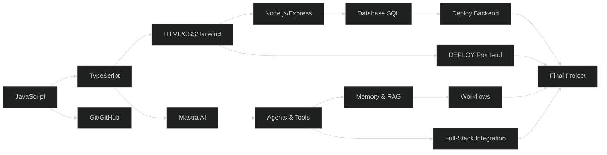

# 🌐 Path Full-Stack Web (Recommended)

> **Target:** Bisa bikin web app full-stack (frontend + backend + database + AI agent) + deploy.
> **Estimasi:** 12 minggu ✅
> **Output:** 1 web app live di internet, siap dipake portfolio.

---

## Peta Path

---

## Modul yang Diambil (Urutan)

| # | Modul | Minggu | Wajib |
|---|-------|--------|-------|
| 1 | JavaScript Fundamentals | 1-4 | ✅ |
| 2 | TypeScript Basics | 5 | ✅ |
| 3 | Web Basics (HTML/CSS/Tailwind) | 6-7 | ✅ |
| 4 | Git & GitHub + Deploy | 5 | ✅ |
| 5 | Node.js & Express | 8 | ✅ |
| 6 | Database SQL | 9 | ✅ |
| 7 | Mastra AI — Agents & Tools | 7-8 | ✅ |
| 8 | Mastra AI — Memory & RAG | 9 | ✅ |
| 9 | Mastra AI — Workflows | 10 | ✅ |
| — | Final Project | 10-12 | ✅ |

---

## Skill yang Dipelajari

| Skill | Level |
|-------|-------|
| JavaScript (ES6+) | Mahir |
| TypeScript | Intermediate |
| HTML/CSS/Tailwind | Intermediate |
| Git & GitHub | Intermediate |
| Node.js + Express | Intermediate |
| Database SQL (PostgreSQL) | Intermediate |
| Mastra AI Framework | Intermediate |
| AI Agents & Tools | Intermediate |
| RAG (Retrieval Augmented Generation) | Basic |
| Deploy (Vercel + Railway) | Intermediate |
| REST API Design | Intermediate |

---

## Project Output

Setelah selesai path ini, kamu bakal punya:

1. **Landing page pribadi** — live di Vercel
2. **Dashboard API publik** — fetch data + tampilkan
3. **Mastra AI Agent** — minimal 3 tools + memory
4. **Full-stack app** — frontend + backend + database + AI agent — **LIVE**

---

## Mulai dari Sini

👉 Mulai dari modul [JavaScript Fundamentals](../01-js-fundamentals/)
