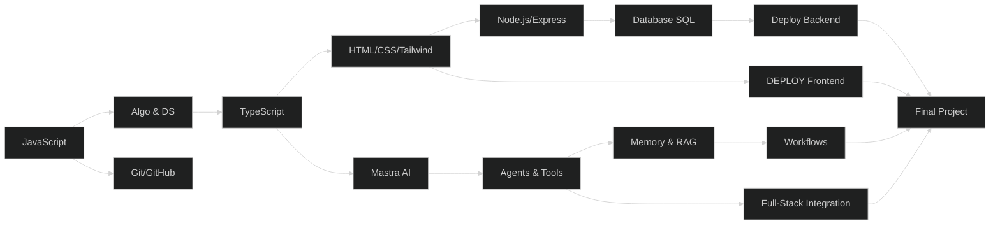
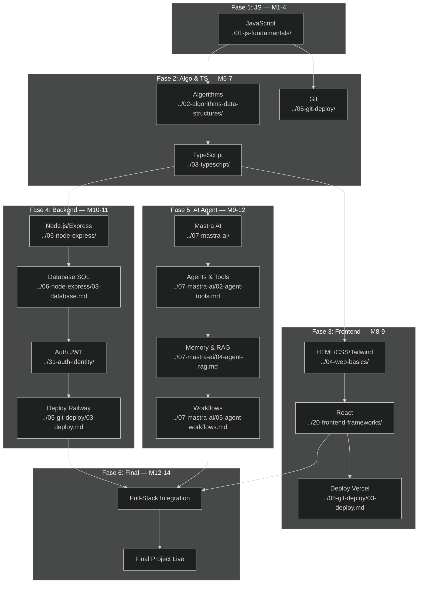

# 🌐 Path Full-Stack Web (Recommended)

> **Target:** Bisa bikin web app full-stack (frontend + backend + database + AI agent) + deploy.
> **Estimasi:** 14 minggu ✅
> **Output:** 1 web app live di internet, siap dipake portfolio.

---

## Peta Path

---

## Modul yang Diambil (Urutan)

| # | Modul | Minggu | Wajib |
|---|-------|--------|-------|
| 1 | JavaScript Fundamentals | 1-4 | ✅ |
| 2 | Algorithms & Data Structures | 5-6 | ✅ |
| 3 | TypeScript Basics | 7 | ✅ |
| 4 | Web Basics (HTML/CSS/Tailwind) | 8-9 | ✅ |
| 5 | Git & GitHub + Deploy | 7 | ✅ |
| 6 | Node.js & Express | 10 | ✅ |
| 7 | Database SQL | 11 | ✅ |
| 8 | Mastra AI — Agents & Tools | 9-10 | ✅ |
| 9 | Mastra AI — Memory & RAG | 11 | ✅ |
| 10 | Mastra AI — Workflows | 12 | ✅ |
| — | Final Project | 12-14 | ✅ |

---

## Skill yang Dipelajari

| Skill | Level |
|-------|-------|
| JavaScript (ES6+) | Mahir |
| Algorithms & Data Structures | Intermediate |
| TypeScript | Intermediate |
| HTML/CSS/Tailwind | Intermediate |
| Git & GitHub | Intermediate |
| Node.js + Express | Intermediate |
| Database SQL (PostgreSQL) | Intermediate |
| Mastra AI Framework | Intermediate |
| AI Agents & Tools | Intermediate |
| RAG (Retrieval Augmented Generation) | Basic |
| Deploy (Vercel + Railway) | Intermediate |
| REST API Design | Intermediate |

---

## Project Output

Setelah selesai path ini, kamu bakal punya:

1. **Landing page pribadi** — live di Vercel
2. **Dashboard API publik** — fetch data + tampilkan
3. **Mastra AI Agent** — minimal 3 tools + memory
4. **Full-stack app** — frontend + backend + database + AI agent — **LIVE**

---

## Peta Jalan Lengkap & Urutan Modul

### Fase 1: JavaScript Deep Dive (Minggu 1-4) ⭐ Wajib

**Modul: [JavaScript Fundamentals](../01-js-fundamentals/)**

| Minggu | Topik | Sub-Modul |
|--------|-------|-----------|
| 1 | Variables, Tipe Data, Control Flow | [`01-variables-types.md`](../01-js-fundamentals/01-variables-types.md), [`02-control-flow.md`](../01-js-fundamentals/02-control-flow.md) |
| 2 | Array, Objects, Functions | [`03-arrays-objects.md`](../01-js-fundamentals/03-arrays-objects.md), [`04-functions.md`](../01-js-fundamentals/04-functions.md) |
| 3 | Async JavaScript, Error Handling | [`05-async-errors.md`](../01-js-fundamentals/05-async-errors.md) |
| 4 | Review & Mini Project | Mini project: CLI todo app + basic algorithms |

**Prasyarat:** Tidak ada.
**Target Pembelajaran:**
- Semua konsep JavaScript modern
- Async/await, Promise, error handling
- Siap belajar algoritma & struktur data

**Total waktu:** ~40 jam (10 jam/minggu)

### Fase 2: Algorithms & TypeScript (Minggu 5-7) ⭐ Wajib

| Minggu | Modul | Sub-Modul | Link |
|--------|-------|-----------|------|
| 5 | **Big O Notation & Array/Hash Table** | Kompleksitas waktu & ruang | [`../02-algorithms-data-structures/01-big-o.md`](../02-algorithms-data-structures/01-big-o.md), [`../02-algorithms-data-structures/02-arrays-hashtables.md`](../02-algorithms-data-structures/02-arrays-hashtables.md) |
| 5 | **Stack, Queue, Linked List** | Struktur data linear | [`../02-algorithms-data-structures/03-stacks-queues-linkedlists.md`](../02-algorithms-data-structures/03-stacks-queues-linkedlists.md) |
| 6 | **Recursion & Sorting** | Algoritma rekursif & sorting | [`../02-algorithms-data-structures/04-recursion-sorting.md`](../02-algorithms-data-structures/04-recursion-sorting.md) |
| 6 | **Trees & Graphs** | Struktur data non-linear | [`../02-algorithms-data-structures/05-trees-graphs.md`](../02-algorithms-data-structures/05-trees-graphs.md) |
| 7 | **TypeScript Basics** | Tipe, interface, generic | [`../03-typescript/`](../03-typescript/) |
| 7 | **Git & GitHub** | Branch, merge, PR workflow | [`../05-git-deploy/`](../05-git-deploy/) |

**Prasyarat:** JavaScript Fundamentals.
**Target Pembelajaran:**
- Analisis kompleksitas algoritma (Big O)
- Implementasi stack, queue, linked list
- Algoritma sorting & searching
- Tree traversal & graph algorithms
- TypeScript type safety
- Git workflow kolaborasi

### Fase 3: Frontend Development (Minggu 8-9) ⭐ Wajib

| Minggu | Modul | Sub-Modul | Link |
|--------|-------|-----------|------|
| 8 | **HTML Semantic & CSS** | Semantic tags, Flexbox, Grid | [`../04-web-basics/01-html-css.md`](../04-web-basics/01-html-css.md) |
| 8 | **Tailwind CSS** | Utility-first, responsive, dark mode | [`../04-web-basics/02-tailwind.md`](../04-web-basics/02-tailwind.md) |
| 8-9 | **DOM & Fetch API** | DOM manipulation, event handling, API call | [`../04-web-basics/03-dom-fetch.md`](../04-web-basics/03-dom-fetch.md) |
| 9 | **React Dasar** | Komponen, props, state, hooks | [`../20-frontend-frameworks/01-react-basics.md`](../20-frontend-frameworks/01-react-basics.md), [`../20-frontend-frameworks/02-react-hooks.md`](../20-frontend-frameworks/02-react-hooks.md) |
| 9 | **Deploy Frontend (Vercel)** | CI/CD, custom domain | [`../05-git-deploy/03-deploy.md`](../05-git-deploy/03-deploy.md) |

**Prasyarat:** TypeScript, Algorithms.
**Target Pembelajaran:**
- Landing page responsive dengan Tailwind
- Single-page application dengan React
- Fetch API & async data loading
- Deploy frontend ke Vercel

### Fase 4: Backend & Database (Minggu 10-11) ⭐ Wajib

| Minggu | Modul | Sub-Modul | Link |
|--------|-------|-----------|------|
| 10 | **Node.js & Express** | Setup, routing, middleware, error handling | [`../06-node-express/`](../06-node-express/) |
| 10-11 | **REST API CRUD** | Endpoints, status codes, validation | [`../06-node-express/04-rest-crud.md`](../06-node-express/04-rest-crud.md) |
| 11 | **Database SQL (PostgreSQL)** | Schema, migration, query, relasi | [`../06-node-express/03-database.md`](../06-node-express/03-database.md) |
| 11 | **Auth & JWT** | Register, login, protected routes | [`../31-auth-identity/`](../31-auth-identity/) |
| 11 | **Deploy Backend (Railway)** | Production deployment | [`../05-git-deploy/03-deploy.md`](../05-git-deploy/03-deploy.md) |

**Prasyarat:** Frontend Development.
**Target Pembelajaran:**
- REST API dengan Express
- PostgreSQL integration
- JWT authentication
- Deploy backend ke Railway
- Integrasi frontend-backend (CORS, API client)

### Fase 5: AI Agent Integration (Minggu 9-12) ⭐ Wajib

*Mulai paralel dengan Fase 3-4*

| Minggu | Modul | Sub-Modul | Link |
|--------|-------|-----------|------|
| 9-10 | **Mastra AI — Agents & Tools** | Setup, agent, tools, Zod | [`../07-mastra-ai/01-mastra-intro.md`](../07-mastra-ai/01-mastra-intro.md), [`../07-mastra-ai/02-agent-tools.md`](../07-mastra-ai/02-agent-tools.md) |
| 11 | **Mastra AI — Memory & RAG** | Memory, vector DB, RAG pipeline | [`../07-mastra-ai/03-agent-memory.md`](../07-mastra-ai/03-agent-memory.md), [`../07-mastra-ai/04-agent-rag.md`](../07-mastra-ai/04-agent-rag.md) |
| 12 | **Mastra AI — Workflows** | Multi-agent, orchestration | [`../07-mastra-ai/05-agent-workflows.md`](../07-mastra-ai/05-agent-workflows.md) |

**Prasyarat:** TypeScript, Node.js.
**Target Pembelajaran:**
- AI agent dengan tools
- RAG pipeline
- Multi-agent workflow
- Integrasi agent dengan full-stack app

### Fase 6: Final Project — Full-Stack Integration (Minggu 12-14) ⭐ Wajib

| Minggu | Aktivitas | Output |
|--------|-----------|--------|
| 12 | Arsitektur & planning | ERD, wireframe, API design |
| 12-13 | Backend implementation | REST API + database + auth |
| 13 | Frontend implementation | React app + API integration |
| 13 | AI Agent integration | Agent tools + RAG |
| 14 | Polish, testing, deploy | Live di internet |

---

## Modul Opsional (Pengayaan)

| Modul | Alasan | Estimasi | Link |
|-------|--------|----------|------|
| **Docker** | Containerization & env consistency | 10 jam | [`../21-docker/`](../21-docker/) |
| **Testing** | Unit & integration testing | 12 jam | [`../09-testing/`](../09-testing/) |
| **Design Patterns** | Scalable architecture | 10 jam | [`../10-design-patterns/`](../10-design-patterns/) |
| **System Design** | Arsitektur skala besar | 15 jam | [`../11-system-design/`](../11-system-design/) |
| **Monitoring** | Production observability | 8 jam | [`../41-monitoring/`](../41-monitoring/) |
| **Performance** | Web performance optimization | 8 jam | [`../32-performance/`](../32-performance/) |
| **Realtime Apps** | WebSocket, live updates | 10 jam | [`../16-realtime-apps/`](../16-realtime-apps/) |
| **GraphQL / tRPC** | Alternatif REST API | 10 jam | [`../30-graphql-trpc/`](../30-graphql-trpc/) |
| **AI Dev Workflow** | AI-assisted development | 8 jam | [`../38-ai-dev-workflow/`](../38-ai-dev-workflow/) |
| **PWA & Offline** | Progressive web apps | 10 jam | [`../34-pwa-offline/`](../34-pwa-offline/) |
| **UI/UX Design** | Better user experience | 10 jam | [`../12-ui-ux-design/`](../12-ui-ux-design/) |
| **Microservices** | Modular backend architecture | 15 jam | [`../50-microservices-hands-on/`](../50-microservices-hands-on/) |
| **Internationalization** | Multi-language support | 8 jam | [`../45-internationalization/`](../45-internationalization/) |

---

## Rencana Studi Mingguan (Detail)

### Fase 1: Minggu 1-4 — JavaScript Deep Dive

| Hari | Senin | Selasa | Rabu | Kamis | Jumat | Sabtu | Minggu |
|------|-------|--------|------|-------|-------|-------|--------|
| **M1** | Variable & tipe data | Control flow | Array | Object | Review | Latihan | Istirahat |
| **M2** | Functions | Arrow function | Callback | Higher-order | Mini CLI | Review | Istirahat |
| **M3** | Promise & async | Fetch API | Error handling | try-catch | Latihan API | Mini project | Istirahat |
| **M4** | Algoritma dasar | Review JS | Mini project | Polish | Presentasi | Feedback | Istirahat |

### Fase 2: Minggu 5-7 — Algorithms & TypeScript

| Hari | Senin | Selasa | Rabu | Kamis | Jumat | Sabtu | Minggu |
|------|-------|--------|------|-------|-------|-------|--------|
| **M5** | Big O | Array/Hash | Stack/Queue | Linked List | Latihan soal | Review | Istirahat |
| **M6** | Recursion | Sorting | Searching | Trees | Graphs | Review | Istirahat |
| **M7** | TS: tipe dasar | TS: interface | TS: generic | Git: branch | Git: PR | Deploy | Istirahat |

### Fase 3: Minggu 8-9 — Frontend

| Hari | Senin | Selasa | Rabu | Kamis | Jumat | Sabtu | Minggu |
|------|-------|--------|------|-------|-------|-------|--------|
| **M8** | HTML semantic | CSS Flexbox/Grid | Tailwind utility | Tailwind responsive | Landing page | Deploy Vercel | Istirahat |
| **M9** | React setup | Komponen & Props | State & useState | useEffect & Fetch | Final FE | Review | Istirahat |

### Fase 4: Minggu 10-11 — Backend

| Hari | Senin | Selasa | Rabu | Kamis | Jumat | Sabtu | Minggu |
|------|-------|--------|------|-------|-------|-------|--------|
| **M10** | Node.js setup | Express routing | Express middleware | CRUD API | Auth JWT | Review | Istirahat |
| **M11** | Database setup | SQL migration | Integrasi DB | API + DB | Deploy Railway | FE-BE integration | Istirahat |

### Fase 5: Minggu 9-12 — AI Agent (Paralel)

| Hari | Senin | Selasa | Rabu | Kamis | Jumat | Sabtu | Minggu |
|------|-------|--------|------|-------|-------|-------|--------|
| **M9** | AI konsep | Mastra setup | Agent pertama | Tools Zod | Tool testing | Review | Istirahat |
| **M10** | Memory types | Persistent memory | Vector DB | RAG pipeline | Embedding | Review | Istirahat |
| **M11** | Workflow design | Multi-agent | Agent API | SSE streaming | Integration | Review | Istirahat |
| **M12** | Full-stack integration | Polish | Testing | Final project | Presentasi | Deploy | Istirahat |

---

## Prasyarat & Learning Objectives per Fase

### Fase 1: JavaScript Deep Dive
**Prasyarat:** Tidak ada.
**Target:** ✅ JavaScript ES6+ mahir, siap algoritma

### Fase 2: Algorithms & TypeScript
**Prasyarat:** JavaScript Fundamentals.
**Target:** ✅ Big O, struktur data, TypeScript, Git

### Fase 3: Frontend
**Prasyarat:** TypeScript, Algorithms.
**Target:** ✅ Landing page + React SPA, deploy Vercel

### Fase 4: Backend
**Prasyarat:** Frontend Development.
**Target:** ✅ REST API + PostgreSQL + JWT, deploy Railway

### Fase 5: AI Agent
**Prasyarat:** TypeScript, Node.js.
**Target:** ✅ AI agent + tools + RAG + workflows

### Fase 6: Final Project
**Prasyarat:** Semua fase sebelumnya.
**Target:** ✅ Full-stack web app with AI, live di internet

---

## Dependency Graph (Visual)

---

## Jalur Karir Setelah Path Ini

| Posisi | Gaji Junior (IDR) | Skill Tambahan |
|--------|-------------------|----------------|
| **Full-Stack Developer** | Rp 7-15 juta/bln | Frontend + backend + database |
| **Software Engineer** | Rp 8-18 juta/bln | System design, algorithms |
| **AI Engineer** | Rp 10-22 juta/bln | AI agents, RAG, LLM |
| **Technical Lead** | Rp 15-30 juta/bln | Architecture, team management |
| **Coder Camp Founder** | Rp 20+ juta/bln | Business, curriculum design |

**Proyeksi karir:**
- **Junior Full-Stack** (0-1 thn): Feature implementation, bug fixing, API integration
- **Mid Full-Stack** (1-2 thn): System architecture, performance optimization, code review
- **Senior Full-Stack** (2-4 thn): Tech stack decisions, mentoring, scalable design
- **Tech Lead / Architect** (4+ thn): Cross-team coordination, technical strategy

**Industri:**
- Startup (cepat, generalist skills dibutuhkan)
- Agency (banyak project, variasi stack)
- Enterprise (Java/.NET -> pindah ke Node.js/TypeScript)
- Freelance (full-stack = satu orang bisa handle semuanya)
- EdTech (bikin platform belajar)

---

## Proyek Portofolio yang Direkomendasikan

### 1. AI-Powered Task Manager (Final Project)
**Tujuan:** Full-stack app dengan AI agent integration
**Fitur:**
- **Frontend:** React + Tailwind, responsive, dark mode
- **Backend:** Express + PostgreSQL, REST API, JWT auth
- **AI Agent:** Natural language task creation, smart suggestions, auto-categorization
- **RAG:** Knowledge base dari task history
- **Deploy:** Vercel (FE) + Railway (BE)

### 2. E-Commerce Platform
**Tujuan:** Production-ready e-commerce
**Fitur:**
- Product catalog, cart, checkout
- Admin dashboard (CRUD produk)
- AI chatbot untuk customer service
- Payment integration
- Order tracking

### 3. AI Content Platform
**Tujuan:** AI-powered content generation & management
**Fitur:**
- Blog/CMS dengan markdown editor
- AI agent buat generate konten
- RAG dari knowledge base
- Multi-user dengan roles
- SEO optimization

### 4. Learning Management System (LMS)
**Tujuan:** Platform belajar online + AI tutor
**Link modul terkait:** [`../48-portfolio-project-series/`](../48-portfolio-project-series/)
**Fitur:**
- Course management (CRUD)
- Student enrollment & progress tracking
- AI tutor agent (jawab pertanyaan berdasarkan materi)
- Quiz & assessment system
- Certificate generation

---

## Tools & Resources

### Full-Stack Stack Utama
- **Frontend:** React + Vite + Tailwind CSS
- **Backend:** Node.js + Express + TypeScript
- **Database:** PostgreSQL (Neon/Supabase)
- **AI:** Mastra AI + OpenAI/Claude
- **Deploy:** Vercel (FE) + Railway (BE)

### Tools Pendukung
- **VS Code** — Editor utama
- **Postman** — API testing
- **DBeaver** — Database GUI
- **Figma** — UI design
- **GitHub** — Version control
- **Notion** — Documentation & planning

### Belajar & Referensi
- **MDN Web Docs** — HTML/CSS/JS reference
- **React.dev** — React documentation
- **Express.js Docs** — Backend framework
- **PostgreSQL Docs** — Database
- **Mastra AI Docs** — AI agent framework
- **OWASP Top 10** — Security best practices

### Performance & Monitoring
- **Lighthouse** — Frontend performance audit
- **Sentry** — Error tracking
- **Logtail / BetterStack** — Logging
- **Uptime Robot** — Uptime monitoring

---

## Studi Kasus: Dari Nol ke Full-Stack Developer dalam 14 Minggu

### Profil: Dimas (Fresh Graduate — Sistem Informasi)
Dimas lulus S1 Sistem Informasi. Selama kuliah coding cuma HTML doang.

- **Minggu 1-4:** JavaScript adalah tantangan terbesar. Struggling dengan callback & closure. Tapi setelah 4 minggu konsisten, mulai paham konsep programming.
- **Minggu 5-6:** Algorithms — Big O membuat Dimas berpikir ulang tentang efisiensi kode. Soal technical interview mulai bisa dikerjakan.
- **Minggu 7:** TypeScript — karena udah paham JavaScript, TypeScript lebih ke "tambahin tipe" aja. Git juga mulai terbiasa.
- **Minggu 8:** Frontend dengan Tailwind + React. Landing page jadi dalam 3 hari — first time punya website online!
- **Minggu 9-10:** Mulai Mastra AI (paralel). Agent pertama bikin Dimas excited banget — merasa ini beda level dari web biasa.
- **Minggu 10-11:** Backend — bagian paling challenging. Struggle dengan middleware & database migration. Tapi setelah CRUD API jadi, semuanya klik.
- **Minggu 12-14:** Final project. Dimas bikin AI-Powered Task Manager. Integrasi React + Express + PostgreSQL + Mastra Agent. Deploy ke Vercel + Railway.

**Hasil:**
- Portfolio: 4 proyek live di internet
- Technical skills: full-stack + AI agent
- Dalam 14 minggu, dari nol ke offering freelance full-stack developer
- Apply sebagai Junior Full-Stack Developer — diterima di 2 perusahaan

---

## Checklist Progres Path

### Fase 1: JavaScript
- [ ] Variable, tipe, control flow
- [ ] Array methods & objects
- [ ] Functions & closures
- [ ] Async/await & Fetch API
- [ ] Error handling

### Fase 2: Algorithms & TypeScript
- [ ] Big O analysis
- [ ] Stack, queue, linked list
- [ ] Recursion & sorting
- [ ] Trees & graphs
- [ ] TypeScript types & interfaces
- [ ] Git branching & PR

### Fase 3: Frontend
- [ ] HTML semantic & CSS layout
- [ ] Tailwind utility & responsive
- [ ] DOM manipulation
- [ ] React components & props
- [ ] React hooks (useState, useEffect)
- [ ] Deploy Vercel

### Fase 4: Backend
- [ ] Node.js project setup
- [ ] Express routing & middleware
- [ ] REST API CRUD
- [ ] PostgreSQL schema & migration
- [ ] JWT authentication
- [ ] Deploy Railway

### Fase 5: AI Agent
- [ ] Mastra setup
- [ ] Agent with system prompt
- [ ] Custom tools (Zod)
- [ ] Conversational memory
- [ ] RAG pipeline
- [ ] Multi-agent workflow

### Fase 6: Final Project
- [ ] Full-stack architecture plan
- [ ] Frontend + Backend integration
- [ ] AI agent integration
- [ ] Testing
- [ ] Deploy live
- [ ] README & documentation

---

## Estimasi Waktu Total

| Fase | Minggu | Jam/Minggu | Total Jam |
|------|--------|------------|-----------|
| Fase 1: JavaScript | 1-4 | 10 | 40 |
| Fase 2: Algo & TS | 5-7 | 12 | 36 |
| Fase 3: Frontend | 8-9 | 15 | 30 |
| Fase 4: Backend | 10-11 | 15 | 30 |
| Fase 5: AI Agent | 9-12 | 10 | 40 |
| Fase 6: Final Project | 12-14 | 15 | 45 |
| **Total** | **14 minggu** | — | **~220 jam** |

---

## Integrasi dengan Path Lain

| Path | Hubungan | Waktu |
|------|----------|-------|
| [Frontend Web](../01-frontend-web.md) | Subset — frontend only version | Ambil ini jika target frontend saja |
| [Backend API](../02-backend-api.md) | Subset — backend only version | Ambil ini jika target backend saja |
| [AI Agent](../03-ai-agent.md) | Subset — AI only version | Ambil ini jika target AI specialist |

---

## Mulai dari Sini

👉 Mulai dari modul [JavaScript Fundamentals](../01-js-fundamentals/)
