<!-- _class: title -->
# Sesi 1: Arsitektur Aplikasi & Jaringan

> **Topik:** Monolitik vs Microservice, DNS, HTTP/HTTPS, REST, Load Balancer, Deployment Strategies

---

## 1. Monolitik vs Microservices

### Monolitik

Satu kode buat semuanya — frontend, backend, database query, semuanya dalam satu repo, satu server.

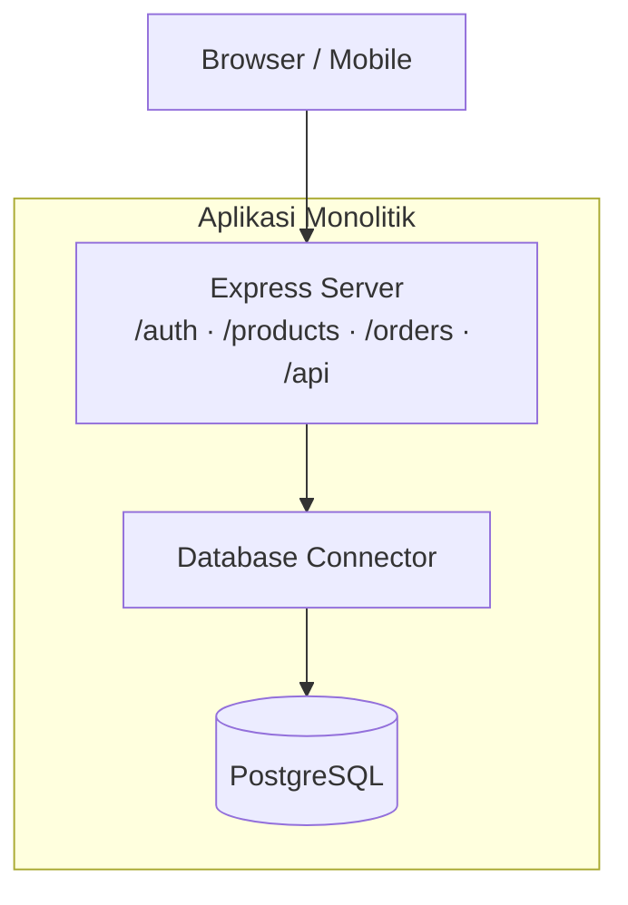

**Ciri-ciri:**
- Satu kode base, satu deployment
- Semua fitur dalam satu proses
- Scaling: tinggal clone server

**Kelebihan:**
| Pro | Keterangan |
|-----|------------|
| ✅ Gampang di-start | Cocok buat proyek sekolah / MVP |
| ✅ Testing sederhana | Cukup 1 integration test suite |
| ✅ Deployment mudah | Jalanin 1 service aja |
| ✅ Debugging langsung | Error di 1 tempat |

**Kekurangan:**
| Cons | Keterangan |
|------|------------|
| ❌ 1 error matiin semua | Bug di fitur A bisa bikin fitur B ikut down |
| ❌ Susah dipisah tim | 2 orang edit file sama → conflict |
| ❌ Build & deploy lambat | Semakin gede kode, semakin lama |

**Analogi:** Mall dengan 1 tenant raksasa. Semua toko dalam satu ruangan — kalau toko makanan error, toko baju ikut tutup.

### Microservices

Fitur dipisah jadi service-service kecil, masing-masing jalan sendiri.

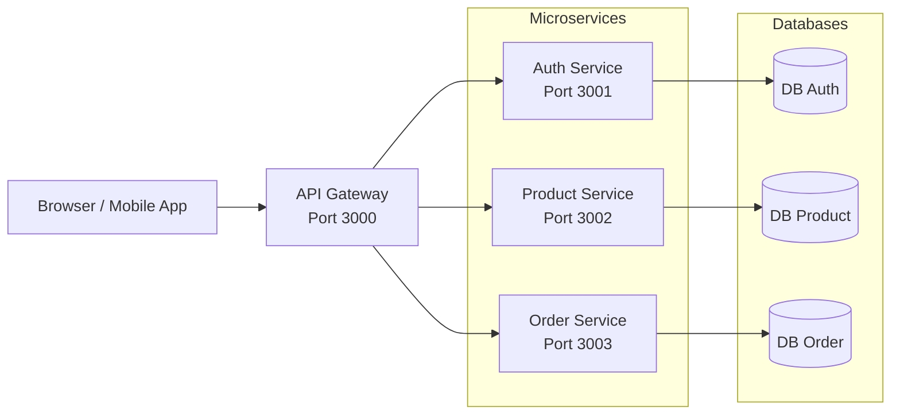

**Ciri-ciri:**
- Tiap service punya database sendiri
- Komunikasi via HTTP/REST atau message broker
- Bisa pakai tech stack beda tiap service

**Kelebihan:**
| Pro | Keterangan |
|-----|------------|
| ✅ Isolasi error | Service A mati, B & C tetap jalan |
| ✅ Scaling per-service | Yang sibuk aja di-scale |
| ✅ Tim independen | Tiap tim pegang service beda |
| ✅ Build/deploy cepet | Kode kecil-kecil |

**Kekurangan:**
| Cons | Keterangan |
|------|------------|
| ❌ Kompleksitas tinggi | Perlu API Gateway, service discovery, monitoring |
| ❌ Debugging susah | Tracing request antar service |
| ❌ Data consistency rumit | Transaksi lintas service butuh saga pattern |

**Analogi:** Mall dengan tenant terpisah. Toko baju punya pintu sendiri, kasir sendiri. Kalau toko makanan renovasi, lo tetap belanja baju.

### Kapan Pilih Yang Mana?

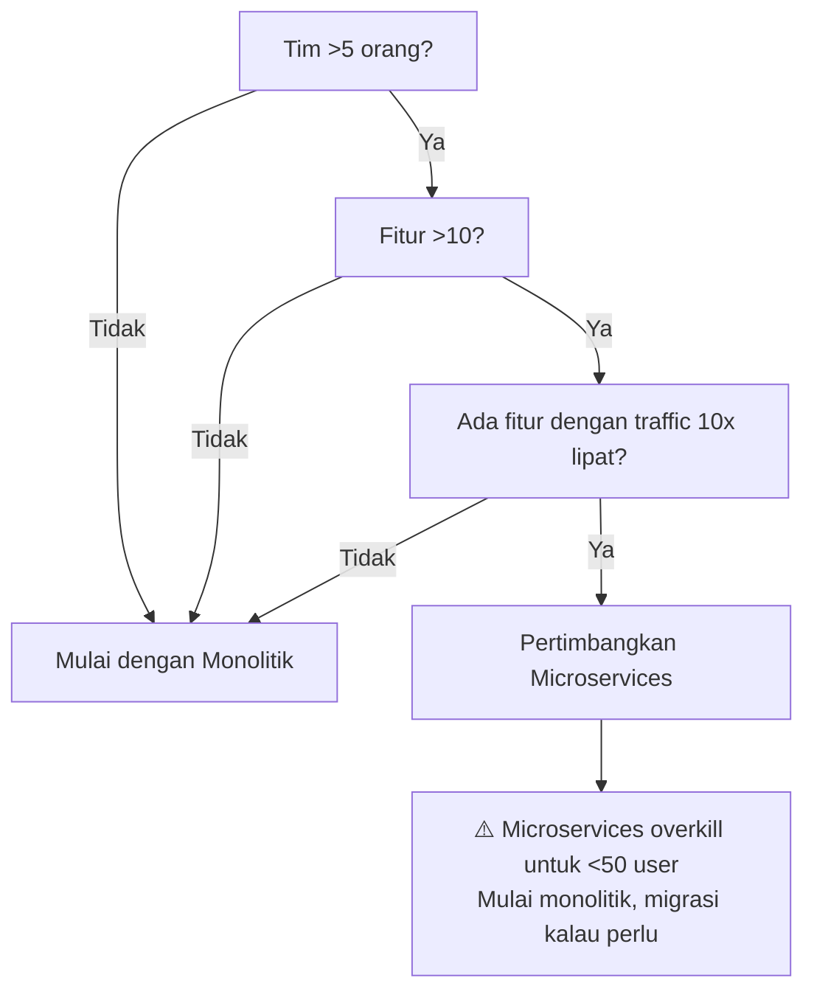

---

## 2. DNS Resolution

DNS (Domain Name System) = **buku telepon internet**. Ubah nama domain (`google.com`) jadi IP address (`142.250.64.78`).

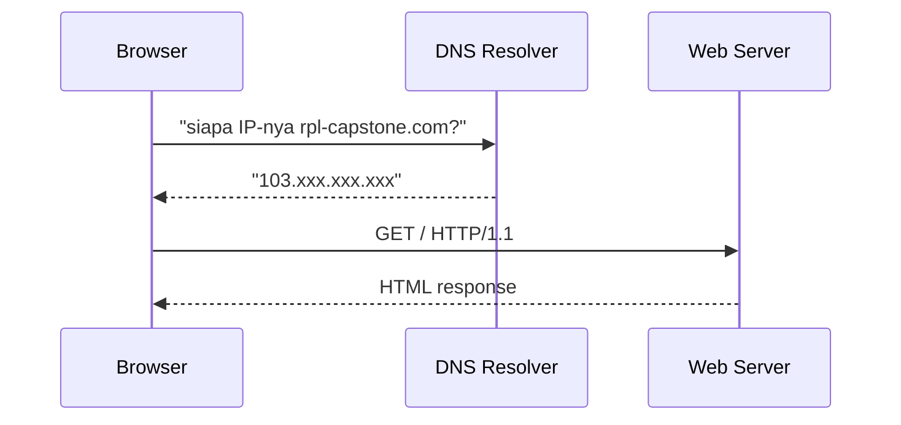

**Alur lengkap DNS lookup:**
1. **Browser cache** — cek dulu di local cache browser
2. **OS cache** — cek di `/etc/hosts` atau cache OS
3. **DNS Resolver** — tanya ke ISP (biasanya pake Google DNS `8.8.8.8` atau Cloudflare `1.1.1.1`)
4. **Root DNS** → **TLD DNS** (.com, .org) → **Authoritative DNS** (provider hosting lo)
5. Balikin IP address

**Kenapa lo peduli?**
- DNS lookup butuh waktu 20-120ms — kena ke tiap request pertama
- Pake DNS caching biar cepet (TTL biasanya 300-86400 detik)
- Cloudflare DNS `1.1.1.1` lebih cepet dari ISP default

---

## 3. HTTP / HTTPS / TLS

### HTTP (Hypertext Transfer Protocol)

Protokol buat komunikasi browser ↔ server. Format request-response.

```http
GET /api/products HTTP/1.1
Host: rpl-capstone.com
User-Agent: Mozilla/5.0
Accept: application/json

---

HTTP/1.1 200 OK
Content-Type: application/json

[{ "id": 1, "name": "Buku A" }]
```

### HTTPS = HTTP + TLS (SSL)

Data dikirim dalam bentuk **terenkripsi** — gak bisa dibaca orang di tengah jalan.

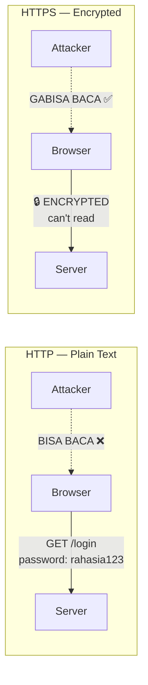

**Cara kerja TLS (simplified):**
1. Client minta koneksi HTTPS
2. Server kirim **SSL Certificate** (berisi public key)
3. Client verifikasi certificate (apakah valid, gak expired)
4. Client & server bikin **session key** (symmetric encryption)
5. Semua data dienkripsi pake session key itu

**TL;DR buat lo:**
- HTTPS **WAJIB** buat production — apalagi kalau ada login / payment
- Pake **Let's Encrypt** (gratis) atau Cloudflare
- HTTP cuma buat local development

---

## 4. REST Principles

REST (Representational State Transfer) = gaya arsitektur API yang paling populer.

### 6 Prinsip REST (lo cukup paham 4 yang bold)

| Prinsip | Maksud | Contoh |
|---------|--------|--------|
| **Client-Server** | Frontend & backend pisah | React panggil API Express |
| **Stateless** | Tiap request berdiri sendiri, gak perlu tahu request sebelumnya | JWT token dikirim tiap request |
| **Cacheable** | Response bisa di-cache | `Cache-Control: max-age=3600` |
| **Uniform Interface** | Endpoint konsisten | `/products`, `/products/1`, `/products/1/reviews` |
| Layered System | Client gak peduli di belakang ada apa aja | Bisa ada API Gateway, load balancer, dll |
| Code on Demand (optional) | Server kirim code executable | Jarang dipake |

### RESTful API Design

```javascript
// ✅ RESTful — endpoint ngikut resource
GET    /api/products          // list products
GET    /api/products/1        // detail product
POST   /api/products          // buat product baru
PUT    /api/products/1        // update product
DELETE /api/products/1        // hapus product

// ❌ BUKAN RESTful — endpoint pake verb
GET    /api/getProducts
POST   /api/createProduct
POST   /api/deleteProduct?id=1
```

**HTTP Status Codes yang sering kepake:**

| Kode | Arti | Kapan |
|------|------|-------|
| 200 | OK | Success GET, PUT, PATCH |
| 201 | Created | Success POST (data baru) |
| 204 | No Content | Success DELETE |
| 400 | Bad Request | Input gak valid |
| 401 | Unauthorized | Belum login |
| 403 | Forbidden | Gak punya akses |
| 404 | Not Found | Resource gak ada |
| 429 | Too Many Requests | Kena rate limit |
| 500 | Internal Server Error | Server error |

---

## 5. Load Balancer

**Load Balancer (LB)** = alat yang ngedistribusikan traffic ke beberapa server.

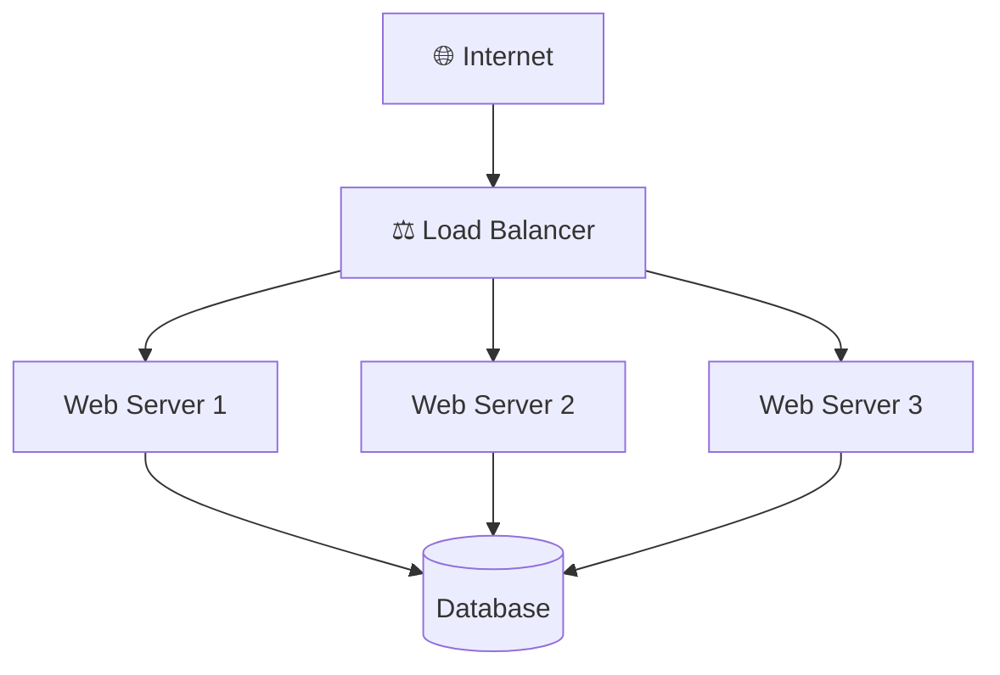

### Kenapa Perlu?

- 1 server bisa handle ~500-2000 request/detik
- Kalau user 10.000, 1 server jebol
- Dengan LB: traffic dibagi ke 3 server → masing-masing handle ~3.333 request

### Algoritma Load Balancing

| Metode | Cara Kerja | Analogi |
|--------|-----------|---------|
| **Round Robin** | Giliran: server 1 → 2 → 3 → 1 | Kasir bank: nomor antrian dibagi rata |
| **Least Connections** | Kirim ke server dengan koneksi paling sedikit | Pilih kasir antriannya paling pendek |
| **IP Hash** | Client yang sama selalu ke server yang sama | Siswa ke ruang kelas yang sama tiap hari |

### Untuk Capstone

Lo gak butuh load balancer beneran buat proyek sekolah. Tapi pahamin konsepnya:

- `pm2 start app.js -i max` → **cluster mode** — Node.js jalan pake semua CPU core
- Nanti di kerja beneran pake **NGINX** atau **AWS ALB**

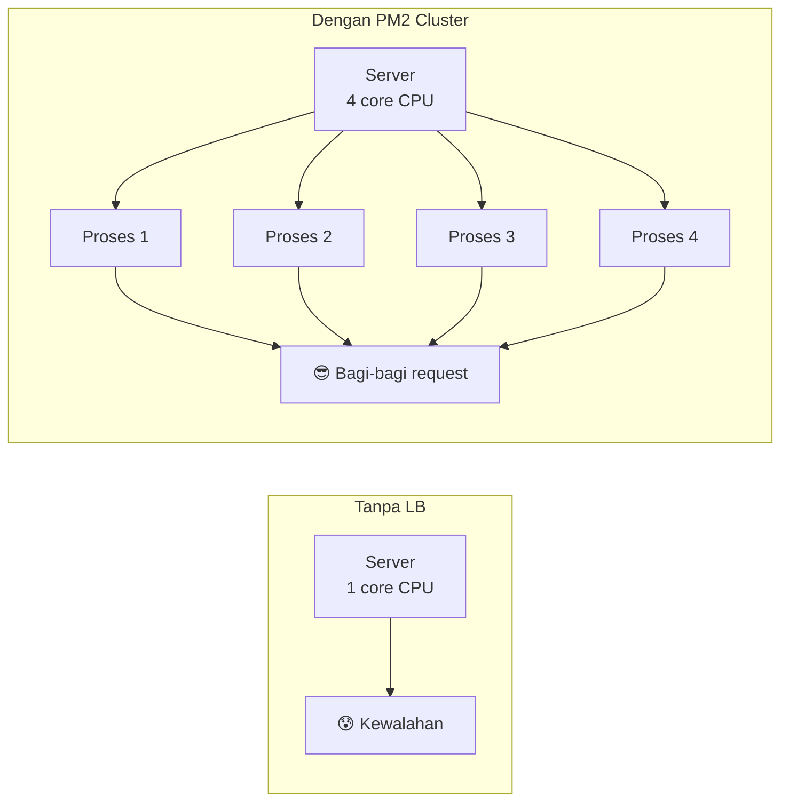

---

## 6. Deployment Strategies

### Big Bang Deployment

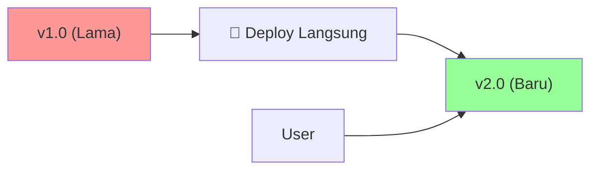

**+** Paling sederhana  
**-** Kalau error, semua user kena

### Rolling Deployment

Update server satu per satu — gak semua kena downtime.

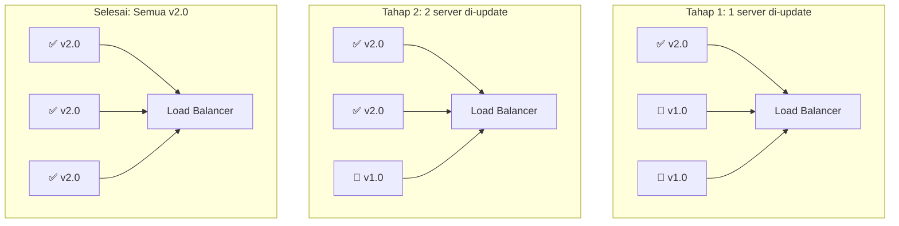

### Blue-Green Deployment

Dua lingkungan identik. Blue = live. Green = versi baru. Test dulu, baru switch.

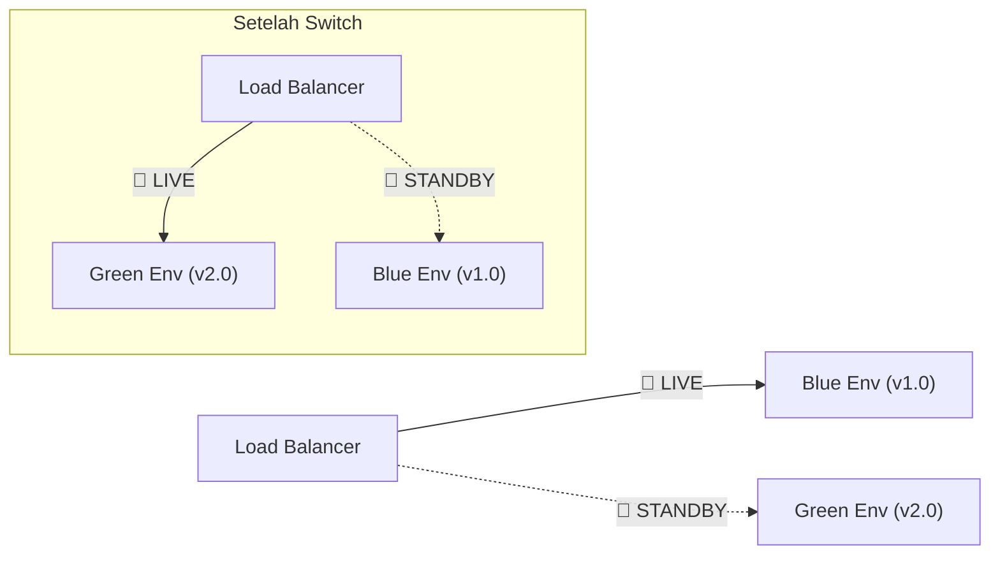

**+** Rollback instan — tinggal switch balik  
**-** Butuh 2x resource (2 lingkungan)

### Canary Deployment

Kirim versi baru ke **sebagian kecil user** dulu. Kalau aman, rollout ke semua.

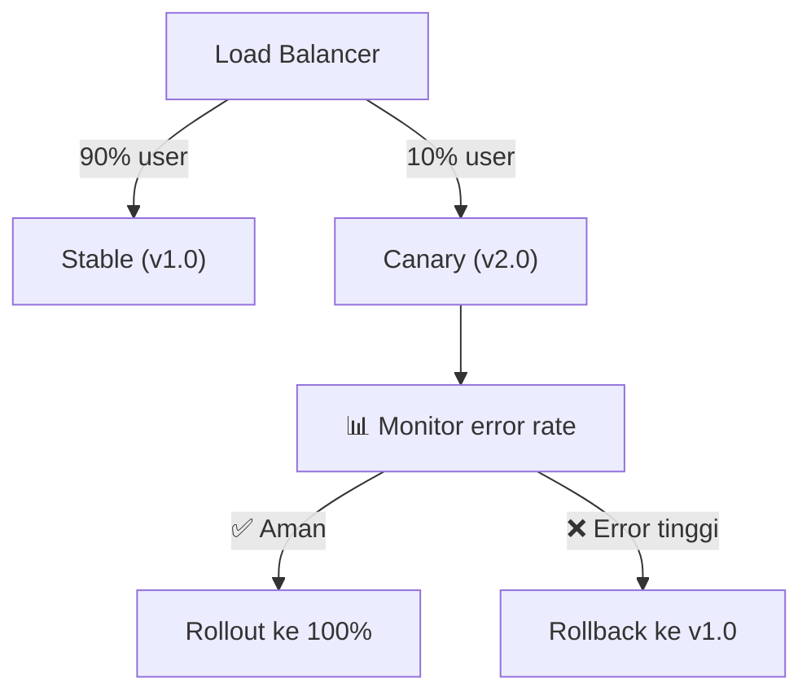

---

## Latihan

1. **Diagram arsitektur:** Gambar arsitektur monolitik untuk aplikasi capstone lo (minimal: server, database, client). Terus gambar versi microservices-nya. Apa aja yang berubah?

2. **DNS & HTTPS:** Cek domain (atau IP) aplikasi capstone lo pake `nslookup` atau `dig`. Terus cek apakah udah pake HTTPS. Kalau belum, cari tau gimana cara pasang SSL pake Let's Encrypt.

3. **Desain REST API:** Dari fitur capstone lo, buat daftar endpoint REST yang lo butuhin. Tulis method (GET/POST/PUT/DELETE), path, dan status code response untuk tiap endpoint. Jangan lupa grouping berdasarkan resource.

4. **Strategi deployment:** Kalau lo deploy aplikasi capstone ke Vercel + Railway, termasuk strategi deployment apa (big bang, rolling, blue-green, canary)? Jelaskan kenapa.
