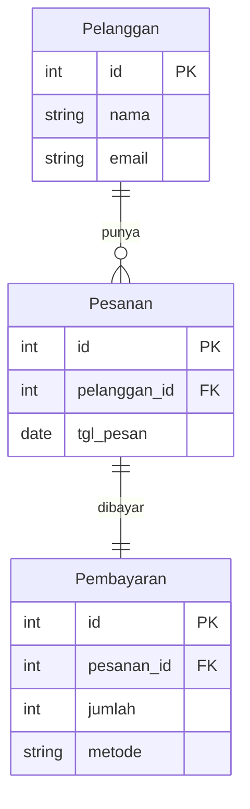
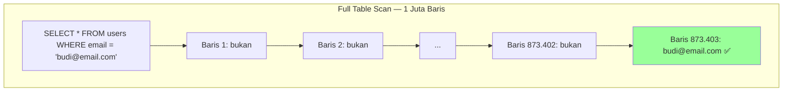
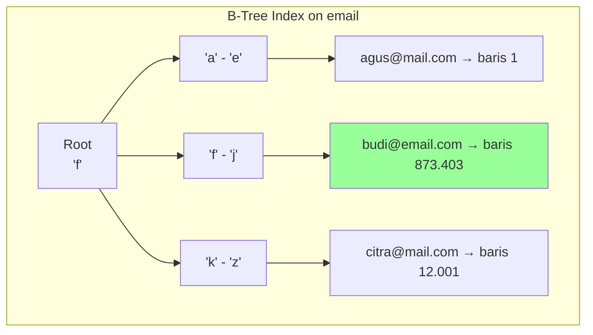
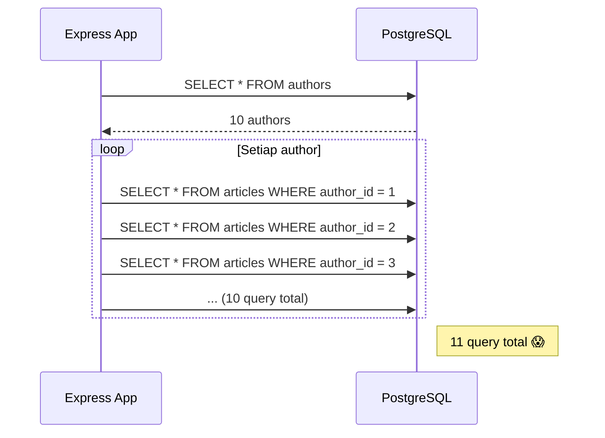
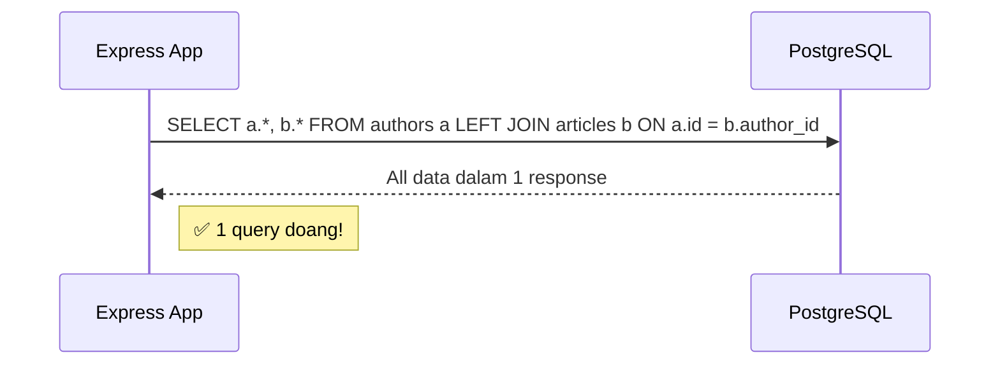
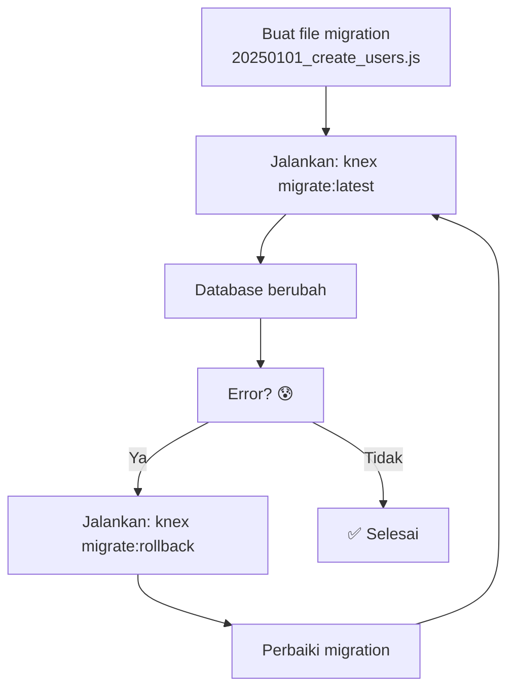

<!-- _class: title -->
# Sesi 2: Database Design

> **Topik:** Normalisasi (1NF/2NF/3NF), Indexing (B-tree, Composite), N+1 Problem, Migration Strategies

---

## 1. Normalisasi Database

Normalisasi = proses **ngilangin data duplikat** dari database.

### Kenapa Harus Dinormalisasi?

Tanpa normalisasi, tabel lo bakal kayak gini:

```sql
-- ❌ Tabel JELEK — data berulang
CREATE TABLE pesanan (
    id SERIAL PRIMARY KEY,
    produk VARCHAR(100),
    nama_pelanggan VARCHAR(100),
    alamat_pelanggan TEXT
);

-- Data:
-- 1 | Buku A  | Budi Santoso | Jl. Merdeka No.1
-- 2 | Pensil  | Budi Santoso | Jl. Merdeka No.1  ← duplikat!
-- 3 | Buku B  | Budi Santoso | Jl. Merdeka No.1  ← duplikat!
-- 4 | Buku A  | Siti Rahma   | Jl. Sudirman No.2
```

**Masalah:** Nama Budi Santoso + alamatnya ditulis 3 kali. Kalau Budi pindah rumah, lo harus ganti di 3 baris. Kalau lupa 1, data jadi inkonsisten.

### 1NF (First Normal Form)

**Aturan:** Setiap kolom isinya **1 nilai aja** (bukan array/list).

```sql
-- ❌ LANGKAH 1NF — kolom 'telepon' berisi banyak nomor
CREATE TABLE pelanggan_1nf (
    id SERIAL PRIMARY KEY,
    nama VARCHAR(100),
    telepon TEXT  -- "08123456789;087654321"
);

-- ✅ SETELAH 1NF — pisah ke tabel terpisah
CREATE TABLE pelanggan (
    id SERIAL PRIMARY KEY,
    nama VARCHAR(100)
);

CREATE TABLE telepon (
    id SERIAL PRIMARY KEY,
    pelanggan_id INT REFERENCES pelanggan(id),
    nomor VARCHAR(20)
);
```

### 2NF (Second Normal Form)

**Aturan:** Gak ada kolom yang tergantung sama **sebagian** primary key (berlaku kalau PK-nya composite key).

```sql
-- ❌ LANGKAH 2NF — PK composite (siswa_id, kelas_id)
-- Tapi 'nama_siswa' cuma tergantung sama siswa_id, bukan sama kelas_id
CREATE TABLE pendaftaran (
    siswa_id INT,
    kelas_id INT,
    nama_siswa VARCHAR(100),  -- ❌ tergantung siswa_id aja
    nama_kelas VARCHAR(50),   -- ❌ tergantung kelas_id aja
    tgl_daftar DATE,
    PRIMARY KEY (siswa_id, kelas_id)
);

-- ✅ SETELAH 2NF — pisah
CREATE TABLE siswa (
    id SERIAL PRIMARY KEY,
    nama VARCHAR(100)
);

CREATE TABLE kelas (
    id SERIAL PRIMARY KEY,
    nama VARCHAR(50)
);

CREATE TABLE pendaftaran (
    siswa_id INT REFERENCES siswa(id),
    kelas_id INT REFERENCES kelas(id),
    tgl_daftar DATE,
    PRIMARY KEY (siswa_id, kelas_id)
);
```

### 3NF (Third Normal Form)

**Aturan:** Kolom non-key gak boleh tergantung sama kolom non-key lain.

```sql
-- ❌ LANGKAH 3NF — 'kota' tergantung sama 'kode_pos', bukan sama 'id'
CREATE TABLE pelanggan_3nf (
    id SERIAL PRIMARY KEY,
    nama VARCHAR(100),
    kode_pos VARCHAR(5),
    kota VARCHAR(50)  -- ❌ tergantung kode_pos, bukan id
);

-- ✅ SETELAH 3NF — pisah
CREATE TABLE kode_pos (
    kode VARCHAR(5) PRIMARY KEY,
    kota VARCHAR(50)
);

CREATE TABLE pelanggan (
    id SERIAL PRIMARY KEY,
    nama VARCHAR(100),
    kode_pos VARCHAR(5) REFERENCES kode_pos(kode)
);
```

### Ringkasan Visual



**Rules of thumb (gak usah hafal nama bentuknya):**
1. Ada kata diulang-ulang? → Pisahin ke tabel baru
2. Satu kolom berisi banyak nilai (pisah pake koma)? → Pisahin ke tabel baru
3. Foreign key > copy-paste data

---

## 2. Indexing

**Index** = fitur database buat nyari data **lebih cepet**, kayak indeks di buku.

### Tanpa Index (Full Table Scan)



Database baca **semua baris** dari awal sampe akhir. Kalau 1 juta baris, bisa 500ms-5 detik.

### Dengan Index (B-Tree)



Database pake struktur B-Tree — langsung lompat ke baris yang dicari. Butuh **<1ms**.

### Kapan Pake Index?

```sql
-- ✅ Index kolom yang dipake WHERE
CREATE INDEX idx_users_email ON users (email);

-- ✅ Index foreign key (otomatis di PostgreSQL kalau pake REFERENCES)
CREATE INDEX idx_products_category ON products (category_id);

-- ✅ Index buat sorting
CREATE INDEX idx_orders_date ON orders (created_at DESC);

-- ❌ JANGAN index boolean / kolom dengan 2-3 nilai unik
-- ❌ JANGAN index tabel kecil (<1000 baris)
-- ❌ Hati-hati index di kolom yang sering UPDATE
```

### Composite Index

Index di **lebih dari 1 kolom**. Urutan kolom **PENTING**.

```sql
-- Index composite: kolom dicari dari kiri ke kanan
CREATE INDEX idx_users_city_status ON users (city, status);

-- ✅ Berguna untuk query:
SELECT * FROM users WHERE city = 'Jakarta' AND status = 'active';
SELECT * FROM users WHERE city = 'Jakarta';

-- ❌ TIDAK berguna untuk:
SELECT * FROM users WHERE status = 'active';  -- kolom kiri (city) gak dipake
```

**Analogi Index Composite:** Buku telepon diurutkan (kota, nama). Kalau lo cari berdasarkan kota → cepet. Tapi kalau cari berdasarkan nama aja (tanpa kota) → lo tetap harus scan semua kota.

### EXPLAIN — Cara Cek Performa Query

```sql
-- Cek apakah query pake index atau full scan
EXPLAIN ANALYZE SELECT * FROM users WHERE email = 'budi@email.com';
```

```
                              QUERY PLAN
───────────────────────────────────────────────────────────
 Index Scan using idx_users_email on users  (cost=...)
   Index Cond: ((email)::text = 'budi@email.com'::text)
   Execution Time: 0.123 ms
← Kalau liat "Index Scan" → bagus. Kalau "Seq Scan" → full table scan (lambat)
```

---

## 3. N+1 Query Problem

**N+1 Problem** = bug performa di ORM (Sequelize, Prisma, TypeORM) — bukan di SQL mentah.

### Kejadiannya

```javascript
// ❌ INI SALAH — N+1 query!
// Lo punya 10 author, masing-masing punya banyak artikel

const authors = await Author.findAll(); // 1 query → dapet 10 author

for (const author of authors) {
  const articles = await Article.findAll({
    where: { authorId: author.id }
  });
  // 10 query lagi (1 per author)
  console.log(author.name, articles.length);
}
```



**Total query:** 1 (ambil author) + 10 (ambil artikel per author) = **11 query**. Kalau author 1000 → 1001 query. Server lemess.

### Solusi: Eager Loading (JOIN)

```javascript
// ✅ INI BENER — JOIN dalam 1 query
const authors = await Author.findAll({
  include: [{ model: Article }]
});
// 1 query pake JOIN → selesai
```



```sql
-- Query yang di-generate ORM:
SELECT a.*, b.*
FROM authors a
LEFT JOIN articles b ON a.id = b.author_id;
```

### Deteksi N+1

- Log query muncul query SAMA berulang-ulang
- API yang tadinya 50ms tiba-tiba jadi 2 detik pas data banyak
- Aktifin `logging: true` di Sequelize / `log: ['query']` di Prisma

**Analogi:** Lo mau fotokopi 10 halaman buku. Cara N+1: lo buka halaman 1 → ke mesin fotokopi → balik → buka halaman 2 → ... 10x bolak-balik. Cara JOIN: lo bawa bukunya ke mesin, fotokopi 10 halaman sekaligus.

---

## 4. Migration Strategies

Migration = cara **ngelola perubahan** struktur database secara terstruktur.

### Kenapa Migration?

- Tim kerja bareng — perlu sinkron skema database
- Production udah jalan — gak bisa asal hapus kolom
- Version control buat database — bisa rollback kalau error

### Contoh Migration (Knex.js)

```javascript
// 20250101_create_users.js
exports.up = function (knex) {
  return knex.schema.createTable('users', (table) => {
    table.increments('id');
    table.string('email').unique().notNullable();
    table.string('password').notNullable();
    table.timestamps();
  });
};

exports.down = function (knex) {
  return knex.schema.dropTableIfExists('users');
};
```

```javascript
// 20250102_add_phone_to_users.js
exports.up = function (knex) {
  return knex.schema.table('users', (table) => {
    table.string('phone', 15).nullable();
  });
};

exports.down = function (knex) {
  return knex.schema.table('users', (table) => {
    table.dropColumn('phone');
  });
};
```

### Migration di Prisma

```prisma
// schema.prisma
model User {
  id        Int      @id @default(autoincrement())
  email     String   @unique
  name      String?
  password  String
  phone     String?  // tambah kolom baru
  createdAt DateTime @default(now())
  updatedAt DateTime @updatedAt
}
```

```bash

---

# Jalanin migration
npx prisma migrate dev --name add_phone_field
```

### Aturan Migration

| Aturan | Penjelasan |
|--------|------------|
| **1 migration = 1 perubahan** | Jangan campur "tambah kolom" + "ganti tipe data" dalam 1 file |
| **SELALU tulis `down`** | Biar bisa rollback kalau error |
| **Jangan edit migration yang udah di-commit** | Buat migration BARU untuk perubahan berikutnya |
| **Test di staging dulu** | Jangan langsung migrate di production |
| **Backup database sebelum migrate** | Safety net kalau ada yang salah |

### Migration Flow



---

## Latihan

1. **Normalisasi skema:** Diberikan tabel berikut. Normalisasikan sampai 3NF. Tulis SQL CREATE TABLE untuk hasilnya.

```sql
-- Data pesanan rental mobil
-- 1 | Toyota Avanza | 500000 | Budi | budi@mail.com | 08123456789 | 2024-01-15 | 2024-01-17
-- 2 | Honda Brio   | 400000 | Budi | budi@mail.com | 08123456789 | 2024-02-01 | 2024-02-03
-- 3 | Toyota Avanza | 500000 | Siti | siti@mail.com | 087654321 | 2024-01-20 | 2024-01-22
```

2. **Index optimization:** Dari aplikasi capstone lo, sebutkan 3 kolom yang paling cocok di-index. Tulis query CREATE INDEX-nya. Jelaskan kenapa milih kolom itu. Terus sebutkan 1 kolom yang **JANGAN** di-index dan kenapa.

3. **Fix N+1:** Kode di bawah punya N+1 problem. Tulis ulang pakai eager loading (JOIN) biar jadi 1 query.

```javascript
const orders = await Order.findAll({ where: { userId: 1 } });

for (const order of orders) {
  const items = await OrderItem.findAll({
    where: { orderId: order.id }
  });
  console.log(`Order ${order.id}: ${items.length} items`);
}
```

4. **Migration strategy:** Lo punya tabel `users` yang mau ditambah kolom `refresh_token`. Tapi production udah jalan dengan 1000 user. Tulis migration file-nya (pakai knex atau Prisma) dengan `up` dan `down`. Apa yang harus lo perhatiin sebelum jalanin migration ini di production?
