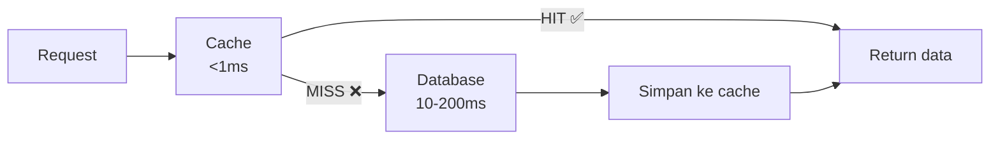
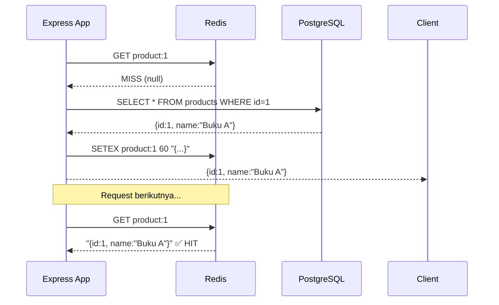
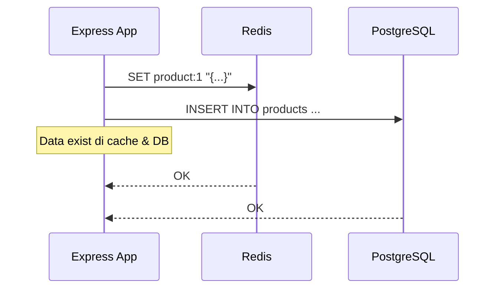
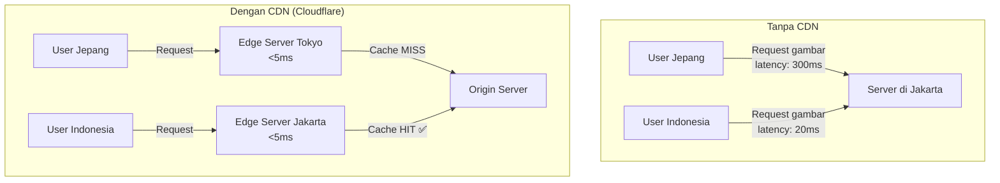
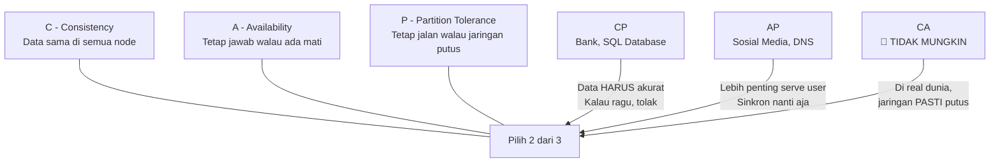

<!-- _class: title -->
# Sesi 3: Caching & CAP Theorem

> **Topik:** Caching Strategies (Cache Aside, Write Through, Write Behind), Redis Data Types, CDN, CAP Theorem, Consistency Models

---

## 1. Caching Strategies

**Cache** = tempat nyimpen data **sementara** biar akses berikutnya lebih cepet.

Database itu keras — baca dari disk, proses query, kirim data. Butuh waktu 10-200ms. Cache nyimpen hasil di **RAM** — akses <1ms.



### Cache Aside (Paling Umum)

Aplikasi tanggung jawab penuh ngelola cache.

```javascript
// CACHE ASIDE — aplikasi handle sendiri
async function getProduct(id) {
  // 1. Cek cache dulu
  const cached = await redis.get(`product:${id}`);

  if (cached) {
    console.log('CACHE HIT ✅');
    return JSON.parse(cached);
  }

  // 2. Miss — ambil dari DB
  console.log('CACHE MISS ❌');
  const product = await Product.findByPk(id);

  // 3. Simpan ke cache (expire 60 detik)
  await redis.setex(`product:${id}`, 60, JSON.stringify(product));

  // 4. Return
  return product;
}

// Kalau data di-update — HAPUS cache biar di-refresh
async function updateProduct(id, data) {
  const product = await Product.update(data, { where: { id } });
  await redis.del(`product:${id}`); // hapus cache
  return product;
}
```



| Pro | Cons |
|-----|------|
| ✅ Sederhana — mudah diimplementasi | ❌ Cache miss pertama tetap lambat |
| ✅ Cache cuma nyimpen data yang diminta | ❌ Perlu handle invalidation manual |
| ✅ TTL bisa beda tiap key | ❌ Data bisa basi (stale) |

### Write Through

Data ditulis ke **cache DAN database** secara bersamaan.

```javascript
// WRITE THROUGH — tulis ke cache + DB barengan
async function createProduct(data) {
  // Tulis ke DB
  const product = await Product.create(data);

  // Langsung simpan ke cache juga
  await redis.set(`product:${product.id}`, JSON.stringify(product));

  return product;
}
```



| Pro | Cons |
|-----|------|
| ✅ Cache selalu up-to-date | ❌ Write lebih lambat (2 operasi) |
| ✅ Read selalu HIT (asumsi data sering diakses) | ❌ Nyimpen data yang jarang diakses = boros memori |

### Write Behind (Write Back)

Data ditulis ke **cache dulu**, trus di-sync ke database **nanti**.

```javascript
// WRITE BEHIND — tulis ke cache dulu, DB belakangan
async function logUserAction(userId, action) {
  // Simpen di Redis dulu (cepat)
  await redis.lpush(`logs:${userId}`, JSON.stringify({ action, time: Date.now() }));

  // Nanti di-flush ke DB secara periodik
  // (background job tiap 5 menit)
}

// Background job — pindahin dari Redis ke DB
async function flushLogs() {
  const keys = await redis.keys('logs:*');
  for (const key of keys) {
    const logs = await redis.lrange(key, 0, -1);
    // Batch insert ke PostgreSQL
    await Log.bulkCreate(logs.map(JSON.parse));
    await redis.del(key);
  }
}
```

| Pro | Cons |
|-----|------|
| ✅ Write sangat cepet (ke RAM) | ❌ Risiko data hilang kalau Redis crash sebelum di-flush |
| ✅ Bisa batch write ke DB | ❌ Kompleksitas lebih tinggi |

### Kapan Pake Yang Mana?

| Strategy | Pake Kalau |
|----------|------------|
| **Cache Aside** | ✅ **Default — hampir semua kasus.** Data read-heavy, update jarang |
| **Write Through** | Data harus selalu konsisten antara cache & DB (misal: konfigurasi, session) |
| **Write Behind** | Log data, analytics, counter — data yang gak masalah kalau hilang sedikit |

---

## 2. Redis Data Types

Redis bukan cuma `SET`/`GET` string. Banyak tipe data yang berguna.

| Tipe | Perintah | Contoh Use Case |
|------|----------|-----------------|
| **String** | `SET`, `GET`, `SETEX` | Cache response API, session token |
| **Hash** | `HSET`, `HGET`, `HGETALL` | Profil user, object data |
| **List** | `LPUSH`, `RPOP`, `LRANGE` | Queue, log terbaru |
| **Set** | `SADD`, `SMEMBERS`, `SISMEMBER` | Tag, unique visitors |
| **Sorted Set** | `ZADD`, `ZRANGE`, `ZRANK` | Leaderboard, trending |
| **Bitmap** | `SETBIT`, `GETBIT` | Tracking user online hari ini |

```javascript
// STRING — cache product
await redis.setex('product:1', 60, JSON.stringify({ name: 'Buku A', price: 50000 }));

// HASH — profil user (bisa akses field tertentu)
await redis.hset('user:1', { name: 'Budi', email: 'budi@mail.com', age: 17 });
const name = await redis.hget('user:1', 'name'); // "Budi"

// LIST — antrian notifikasi
await redis.lpush('notifications:user:1', 'Pesanan berhasil!');
await redis.lpush('notifications:user:1', 'Pembayaran diterima');
const recent = await redis.lrange('notifications:user:1', 0, 2); // 2 notif terbaru

// SORTED SET — leaderboard
await redis.zadd('leaderboard', 100, 'user:1'); // score 100
await redis.zadd('leaderboard', 85, 'user:2');
const top3 = await redis.zrevrange('leaderboard', 0, 2, 'WITHSCORES');
// [ 'user:1', '100', 'user:2', '85' ]
```

### TTL (Time To Live)

```javascript
// Set data dengan expire otomatis
await redis.setex('key', 3600, 'value'); // expire 1 jam
await redis.expire('key', 60); // set expire setelah set

// Cek sisa waktu
const ttl = await redis.ttl('key'); // detik tersisa
```

**Best practice:** SELALU kasih TTL. Cache tanpa TTL = bom memori.

---

## 3. CDN (Content Delivery Network)

**CDN** = jaringan server di seluruh dunia yang nyimpen **file statis** (gambar, CSS, JS, video) biar loading cepet.



### Cloudflare

CDN gratis yang paling populer. Lo tinggal pointing DNS ke Cloudflare, otomatis:

- File statis di-cache di 300+ lokasi worldwide
- HTTPS otomatis
- DDoS protection
- Minification otomatis (CSS/JS di-kecilin)

**Konfigurasi cache di Cloudflare:**

```
Page Rules → Cache Level: Standard
- Cache static files: .jpg, .png, .css, .js, .woff2
- TTL otomatis (biasanya 30 hari)
- HTML biasanya BYPASS (gak di-cache) biar dinamis
```

**Untuk capstone:** Pasang Cloudflare di domain lo. Gratis + bikin app lo loading cepet + HTTPS.

---

## 4. CAP Theorem

**CAP Theorem** = teorema yang bilang: **sistem terdistribusi gak bisa punya ketiganya sekaligus.**

### 3 Sifat

| Sifat | Maksud | Gampangnya |
|-------|--------|------------|
| **C**onsistency | Semua node liat data yang **sama** | Semua server jawab "Budi punya saldo 10rb" |
| **A**vailability | Semua request **tetap dilayani**, walau ada node mati | Ada server mati? Server lain tetap jawab |
| **P**artition Tolerance | Sistem tetep jalan walau koneksi antar node **putus** | Server A & B putus komunikasi, tapi tetap layani user |

### Pilih 2 dari 3



**Yang paling penting:** Network partition (P) pasti terjadi — jaringan gak 100% reliable. Jadi pilihan lo cuma **CP** atau **AP**.

### CP (Consistency + Partition Tolerance)

Sistem milih **data akurat** daripada **selalu tersedia**.

```javascript
// CP Example — Bank transfer
async function transfer(senderId, receiverId, amount) {
  // Pake TRANSACTION — kalo gagal semua di-rollback
  const result = await db.transaction(async (trx) => {
    const sender = await User.findByPk(senderId, { transaction: trx });
    if (sender.balance < amount) throw new Error('Saldo kurang');

    await User.decrement({ balance: amount }, { where: { id: senderId }, transaction: trx });
    await User.increment({ balance: amount }, { where: { id: receiverId }, transaction: trx });
  });

  // Kalau ada error transaksi — saldo tetap konsisten
  return result;
}
```

**Contoh CP:** Sistem perbankan. Kalau koneksi ATM ke server pusat putus, ATM gak kasih uang daripada saldo gak akurat.

### AP (Availability + Partition Tolerance)

Sistem milih **tetap jawab** daripada **data pasti akurat**.

```javascript
// AP Example — Like postingan (eventual consistency)
async function likePost(userId, postId) {
  // Langsung return — gak perlu nunggu sinkron ke semua node
  await redis.incr(`likes:${postId}`);

  // Background job buat sync ke DB nanti
  await queue.add('syncLikes', { postId });

  return { likes: await redis.get(`likes:${postId}`) };
}
```

**Contoh AP:** Sosial media. Lo bisa liat postingan temen walau server lain belum update. Ntar juga sinkron (eventual consistency).

### Kenapa Ini Penting Buat Lo?

| Service | Pilih | Alasan |
|---------|-------|--------|
| **Top-up saldo** | CP | Jangan sampe saldo ganda |
| **Beli item** | CP | Stok harus akurat |
| **Feed artikel** | AP | User gak peduli real-time |
| **Komentar** | AP | Lebih baik bisa komen walau delay |
| **Login session** | AP | User lebih penting bisa login |

---

## 5. Consistency Models

### Strong Consistency

Data selalu **up-to-date** di semua node. Setelah write, semua read langsung liat data baru.

```
User A: SET balance = 5000
                      → Semua node punya balance = 5000
User B: GET balance   → 5000 (pasti)
```

**+** Gak ada data basi  
**-** Lambat (perlu nunggu semua node sinkron)  
**-** Availability turun kalau ada node mati  

### Eventual Consistency

Data boleh **beda sementara**, ntar juga sinkron.

```
User A: SET balance = 5000  (di Node 1)
User B: GET balance         → Masih 4000 (data basi, OK)
                             ↓ 5 detik kemudian...
User B: GET balance         → 5000 (udah sinkron)
```

**+** Cepet, availability tinggi  
**+** Tetap serve request walau ada node mati  
**-** Data bisa basi (stale read)  

### Kapan Pake?

| Model | Contoh |
|-------|--------|
| **Strong Consistency** | Transaksi keuangan, booking tiket, stok barang |
| **Eventual Consistency** | Like count, view count, feed notifikasi, log |

---

## Latihan

1. **Caching strategy:** Aplikasi capstone lo punya endpoint `GET /api/products` yang dipanggil 1000×/detik. Data produk berubah setiap kali admin edit (mungkin 1×/jam). Strategi caching apa yang paling cocok? Tulis kode implementasinya pake Redis (cache aside atau write through). Jangan lupa TTL dan invalidation.

2. **Redis data type:** Lo perlu nyimpen **top 10 produk terlaris** yang update real-time setiap ada transaksi. Tipe data Redis apa yang cocok? Tulis kode buat nambahin score pas ada transaksi dan ngambil top 10.

3. **CAP analysis:** Dari aplikasi capstone lo, sebutkan 3 fitur dan tentukan apakah fitur itu harus CP atau AP. Jelaskan kenapa.

```
Contoh tabel:
| Fitur | Pilih (CP/AP) | Alasan |
|-------|---------------|--------|
| Login | AP            | User lebih penting bisa login daripada data session 100% sinkron |
| ...   | ...           | ...    |
```

4. **CDN setup:** Domain capstone lo di-cloudflare.com. File statis (gambar produk, CSS, JS) udah di-cache. Tapi user complain gambar produk lama muncul padahal admin udah ganti gambar. Apa yang terjadi dan gimana solusinya?
