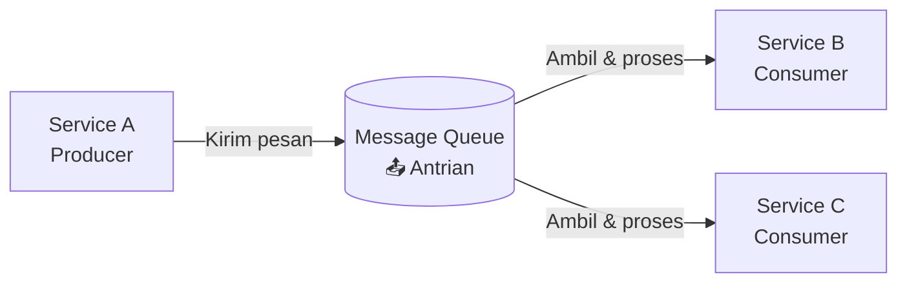
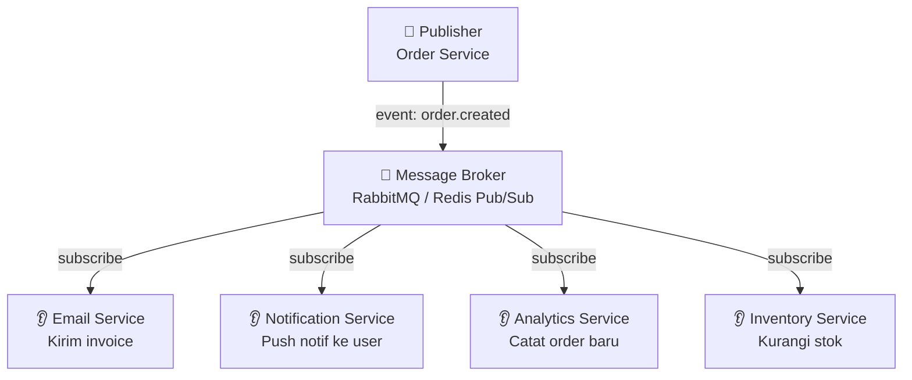
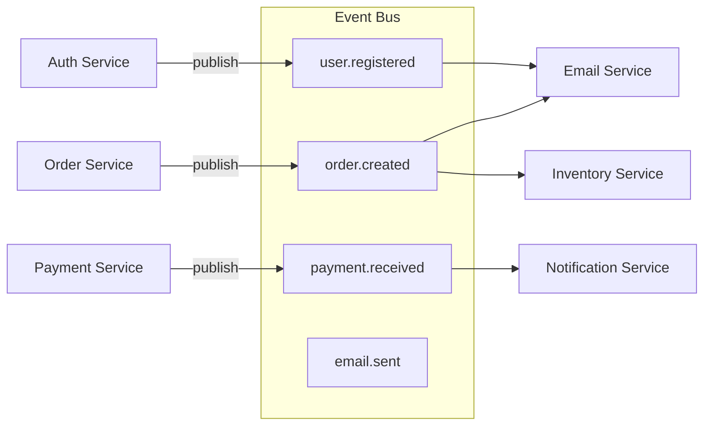
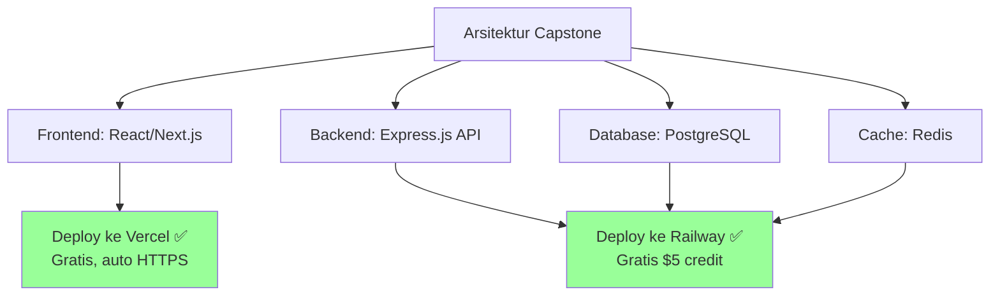
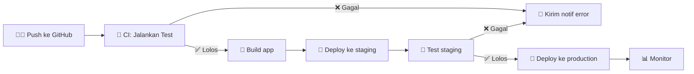
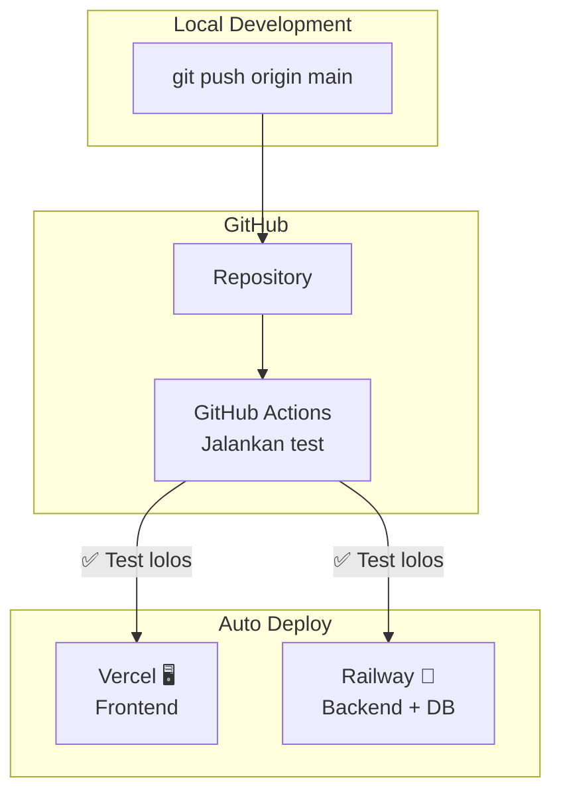
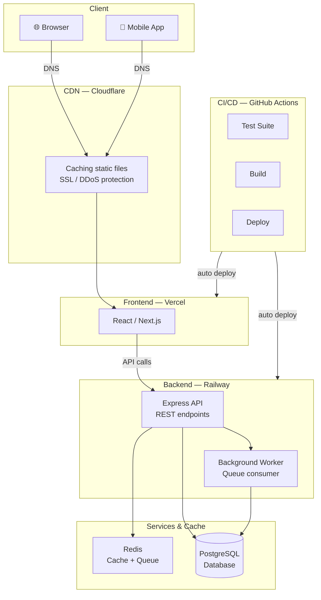

<!-- _class: title -->
# Sesi 4: Message Queue & Hosting

> **Topik:** Message Queue (RabbitMQ/Redis), Pub/Sub, Event-Driven Architecture, Hosting Comparison, CI/CD Pipeline

---

## 1. Message Queue

**Message Queue** = tempat antrian pesan antar service. Service A kirim pesan, Service B ambil dan proses.



### Kenapa Perlu Queue?

| Tanpa Queue | Dengan Queue |
|-------------|--------------|
| User klik "daftar" → nunggu email verifikasi → loading 3 detik | User klik "daftar" → langsung dapet response "Cek email" → email dikirim di background |
| 1000 user upload foto barengan → server lemess | 1000 upload antri, diproses 1 per 1 atau sesuai kapasitas |
| Service order harus nunggu service payment | Service order kirim pesan "pesanan baru" → selesai urusan |

### RabbitMQ — Contoh

```javascript
// PRODUCER — kirim pesan ke queue
const amqp = require('amqplib');

async function sendEmailQueue(emailData) {
  const connection = await amqp.connect('amqp://localhost');
  const channel = await connection.createChannel();

  const queue = 'email_queue';
  await channel.assertQueue(queue, { durable: true });

  channel.sendToQueue(queue, Buffer.from(JSON.stringify(emailData)), {
    persistent: true // pesan gak ilang kalau server restart
  });

  console.log(`📨 Pesan masuk antrian: ${emailData.to}`);
  await channel.close();
  await connection.close();
}

// CONSUMER — ambil & proses pesan dari queue
async function processEmailQueue() {
  const connection = await amqp.connect('amqp://localhost');
  const channel = await connection.createChannel();

  const queue = 'email_queue';
  await channel.assertQueue(queue, { durable: true });

  // Ambil 1 pesan setiap kali (jangan banjir)
  channel.prefetch(1);

  console.log('👂 Menunggu pesan email...');
  channel.consume(queue, async (msg) => {
    const emailData = JSON.parse(msg.content.toString());

    try {
      // Kirim email (pake nodemailer atau API mail)
      await sendEmail(emailData);
      console.log(`✅ Email terkirim ke ${emailData.to}`);

      // Confirm ke RabbitMQ bahwa pesan udah diproses
      channel.ack(msg);
    } catch (error) {
      console.log(`❌ Gagal kirim email: ${error.message}`);
      // Kalau gagal, pesan balik ke queue atau kirim ke dead letter queue
      channel.nack(msg, false, true); // requeue
    }
  });
}
```

### Redis sebagai Queue

Redis juga bisa dipake sebagai queue sederhana pake List.

```javascript
// PRODUCER — push ke list
await redis.lpush('email_queue', JSON.stringify({ to: 'budi@mail.com', subject: 'Selamat datang' }));

// CONSUMER — blok sampe ada pesan (BLPOP)
const result = await redis.brpop('email_queue', 0); // 0 = wait forever
const emailData = JSON.parse(result[1]);
```

| RabbitMQ | Redis Queue |
|----------|-------------|
| Feature-rich (dead letter, routing, exchange) | Sederhana |
| Message persist ke disk | Bisa ilang kalau gak di-set dengan bener |
| Cocok buat production skala besar | Cocok buat tugas/capstone |
| Butuh install RabbitMQ server | Udah include kalau lo pake Redis |

---

## 2. Pub/Sub (Publish/Subscribe)

Pola komunikasi **1-to-many**: 1 publisher, banyak subscriber.



### Contoh Redis Pub/Sub

```javascript
// SUBSCRIBER — jalan di file terpisah
const subscriber = new Redis();

subscriber.subscribe('order:created', (err, count) => {
  console.log(`Subscribe ke ${count} channel`);
});

subscriber.on('message', (channel, message) => {
  const order = JSON.parse(message);
  console.log(`📦 Order baru: #${order.id}`);

  if (channel === 'order:created') {
    // Kirim email
    sendEmail(order.userEmail, 'Pesanan berhasil dibuat!');
    // Update inventory
    updateStock(order.items);
  }
});

// PUBLISHER — pas user checkout
const publisher = new Redis();

app.post('/checkout', async (req, res) => {
  const order = await Order.create(req.body);

  // Publish event — semua subscriber bakal dapet
  await publisher.publish('order:created', JSON.stringify(order));

  res.json({ message: 'Pesanan berhasil!', orderId: order.id });
});
```

### Event-Driven Architecture

Dengan pub/sub, aplikasi lo jadi **event-driven** — tiap service reaksi terhadap event, gak perlu saling tahu.



**+** Decoupling — service gak perlu tahu satu sama lain  
**+** Scalable — tinggal tambah subscriber kalau perlu  
**+** Resilient — satu service mati, yang lain tetap jalan  
**-** Eventual consistency — data mungkin delay  
**-** Debugging susah — flow gak linear  

---

## 3. Hosting Comparison

Buat capstone / proyek sekolah, lo bisa pilih beberapa opsi:

| Platform | Cocok Buat | Harga | Kelebihan | Kekurangan |
|----------|-----------|-------|-----------|------------|
| **Vercel** | Frontend (React/Next.js) | Gratis (Hobby) | Deploy dari GitHub, auto HTTPS, CDN | Gak bisa backend Node.js sendiri (cuma serverless) |
| **Railway** | Backend (Express/API) + DB | Gratis $5 credit/bulan, bayar setelah | Mudah, connect GitHub, support PostgreSQL/Redis | Kalau gak pake dalam 30 hari, project di-sleep |
| **Biznet Gio** | Full app Indonesia | Mulai ~50rb/bulan | Server di Indonesia — latency rendah, IP statis | Setup manual lewat dashboard |
| **DOKS (Digital Ocean K8s)** | Production skala besar | ~$12-15/bulan | Managed Kubernetes, auto-scaling | Overkill buat capstone |
| **VPS (Digital Ocean Droplet)** | Full control | ~$6/bulan | Root akses, bebas install apa aja | Perlu setup manual (Nginx, SSL, dll) |

### Rekomendasi Buat Capstone



### Checklist Deployment

```
✅ Frontend di Vercel — tinggal push ke GitHub, auto deploy
✅ Backend di Railway — connect repo, set env variable
✅ Database PostgreSQL di Railway — built-in
✅ Redis di Railway — built-in
✅ Domain kustom — Cloudflare (gratis) pointing ke Vercel + Railway
✅ SSL — otomatis dari Vercel & Cloudflare
```

---

## 4. CI/CD Pipeline

**CI (Continuous Integration)** = tiap kali lo push kode, otomatis di-test.  
**CD (Continuous Deployment)** = kalau test lolos, otomatis di-deploy ke production.



### Contoh GitHub Actions CI/CD

```yaml

---

# .github/workflows/deploy.yml
name: Deploy

on:
  push:
    branches: [main]

jobs:
  test:
    runs-on: ubuntu-latest
    steps:
      - uses: actions/checkout@v3
      - uses: actions/setup-node@v3
        with:
          node-version: 18
      - run: npm ci
      - run: npm test

  deploy:
    needs: test  # jalan kalau test sukses
    runs-on: ubuntu-latest
    steps:
      - uses: actions/checkout@v3
      - name: Deploy to Railway
        uses: bervProject/railway-deploy@v1
        with:
          railway_token: ${{ secrets.RAILWAY_TOKEN }}
```

### Untuk Capstone (Minimal)

Buat proyek capstone, CI/CD minimal yang perlu lo setup:

1. **GitHub repo** — source of truth
2. **Vercel** — auto deploy dari GitHub (tinggal connect repo, frontend otomatis deploy tiap push ke main)
3. **Railway** — auto deploy backend (connect repo, set environment variables)
4. **Environment variables** — simpen di dashboard Vercel & Railway, gak perlu `.env` di repo



---

## 5. Arsitektur Lengkap Capstone

Semua konsep yang udah dipelajari — digabung jadi satu:



---

## Latihan

1. **Queue scenario:** Di capstone lo, ada fitur kirim email verifikasi, upload gambar, dan export laporan. Fitur mana yang perlu pake queue? Gambar diagram arsitektur-nya pake mermaid.

2. **Pub/Sub design:** Aplikasi lo punya event `order.shipped` (pesanan dikirim). Service apa aja yang perlu subscribe ke event ini? Tulis kode publisher dan subscriber pake Redis Pub/Sub.

3. **Hosting plan:** Tulis rencana hosting buat capstone lo: pilih platform buat frontend, backend, database. Hitung estimasi biaya (pakai yang gratis dulu). Kasih alasan kenapa milih platform itu.

```
Tabel:
| Komponen | Platform | Alasan | Estimasi Biaya |
|----------|----------|--------|----------------|
| Frontend | Vercel   | Gratis, auto deploy | Rp 0 |
| Backend  | ...      | ...    | ... |
| Database | ...      | ...    | ... |
| Domain   | ...      | ...    | ... |
```

4. **CI/CD flow:** Deskripsikan pipeline CI/CD buat capstone lo dalam 5 langkah. Mulai dari "push ke GitHub" sampai "app live di production". Kalau test gagal, apa yang harus terjadi? Tulis juga file `.github/workflows/deploy.yml` sederhana.
