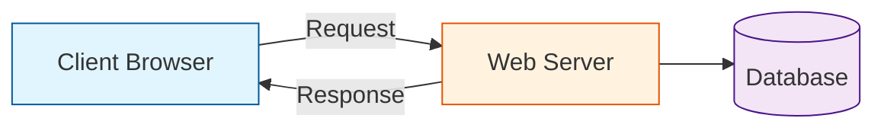
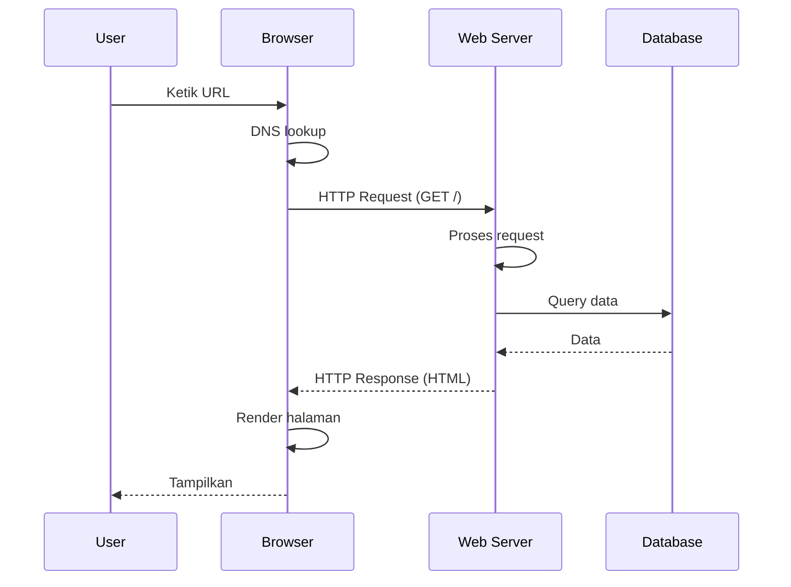
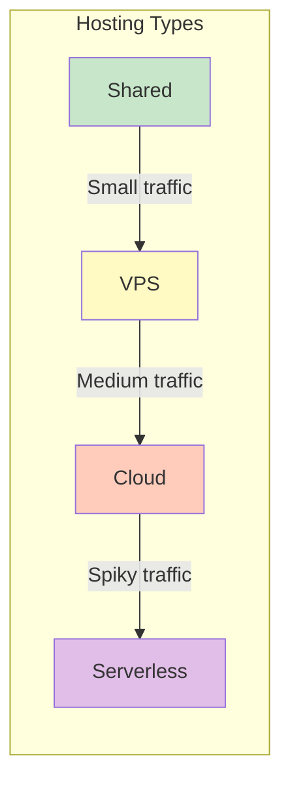

<!-- _class: title -->
# 01. Cara Kerja Web

## Internet Basics

Internet = jaringan global komputer yang saling terhubung. Setiap perangkat punya alamat unik.

### IP Address

- **IPv4**: `192.168.1.1` — 4 blok angka (32-bit), ~4.3 miliar alamat
- **IPv6**: `2001:db8::ff00:42:8329` — format hex (128-bit), alamat hampir tak terbatas

```bash

---

# Cek IP sendiri
curl ifconfig.me
```

### DNS (Domain Name System)

DNS = buku telepon internet. Manusia gampang inget `google.com`, komputer butuh IP `142.250.184.46`.

```
Browser -> Cari DNS -> Dapet IP -> Connect ke server
```

```bash

---

# Cek DNS lookup
nslookup google.com
dig google.com +short
```

### TCP/IP

Protokol yang ngatur data dikirim via internet:

| Layer | Fungsi | Contoh |
|-------|--------|--------|
| Application | Data aplikasi | HTTP, FTP, SMTP |
| Transport | Pengiriman data | TCP, UDP |
| Internet | Routing & alamat | IP |
| Network Access | Hardware fisik | Ethernet, Wi-Fi |

---

## Client & Server



| Peran | Tugas | Contoh |
|-------|-------|--------|
| **Client** | Minta data, render tampilan | Browser, mobile app, Postman |
| **Server** | Proses request, kirim response | Apache, Nginx, Node.js |

---

## Request-Response Cycle



---

## URL Structure

```
  https://www.example.com:443/path/to/page?query=value&page=1#section
  \____/ \_______________/\__/\__________________/\______________/\______/
   |            |          |          |                |            |
 Protocol    Domain      Port       Path            Query        Fragment
```

| Komponen | Contoh | Keterangan |
|----------|--------|------------|
| **Protocol** | `https://` | Aturan komunikasi (HTTP/HTTPS) |
| **Domain** | `www.example.com` | Nama website (DNS) |
| **Port** | `:443` | Gerbang masuk (default: 80 HTTP, 443 HTTPS) |
| **Path** | `/products/laptop` | Resource spesifik di server |
| **Query** | `?search=laptop&page=2` | Parameter tambahan (key=value) |
| **Fragment** | `#section` | Bagian spesifik dalam halaman |

---

## Browser DevTools — Network Tab

Cara buka: `F12` atau `Ctrl+Shift+I` → tab **Network**

Yang bisa kamu lihat:

| Kolom | Arti |
|-------|------|
| Name | Nama file request |
| Status | HTTP status code |
| Type | Tipe resource (document, css, js, img) |
| Size | Ukuran response |
| Time | Waktu loading |
| Waterfall | Timeline request visual |

> **Latihan**: Buka website manapun → Network tab → reload → liat semua request yang muncul

---

## Hosting Overview

Cara naro website biar bisa diakses dari internet.

### Shared Hosting
- Satu server dipake banyak orang
- Murah, sumber daya terbatas
- Cocok: blog kecil, website statis

### VPS (Virtual Private Server)
- Server virtual sendiri, resource dedicated
- Root access, bebas config
- Cocok: website menengah, API

### Cloud Hosting
- Infrastruktur scalable (AWS, GCP, Azure)
- Bayar sesuai pemakaian
- Cocok: aplikasi besar, traffic fluktuatif

### Serverless
- Jalanin code tanpa ngurus server
- Scale otomatis, bayar per eksekusi
- Cocok: fungsi API, webhook, background job



---

## Rangkuman

| Konsep | Inti |
|--------|------|
| IP & DNS | IP itu alamat, DNS buku telepon |
| Client-Server | Client minta, server kasih |
| URL | Protocol://domain:port/path?query |
| DevTools Network | Liat semua request website |
| Hosting | Shared → VPS → Cloud → Serverless |

---

## Latihan

### 1. Trace URL
Uraikan URL ini bagian per bagian:
```
https://shop.example.com:8080/products/category?sort=price&limit=10#reviews
```

### 2. Analisis Network Tab
Buka 3 website favorit. Catat:
- Total request yang keluar
- Request paling lambat
- Tipe file paling banyak (gambar? JS? CSS?)
- Status code 200 vs 404 vs 301

### 3. Gambar Arsitektur
Bikin diagram Mermaid arsitektur web yang mencakup: Client, DNS, CDN, Web Server, Database. Jelaskan alur request dari user buka browser sampai dapet halaman.

### 4. Bedain Hosting Types
Buat tabel perbandingan Shared, VPS, Cloud, Serverless dari segi:
- Harga
- Kontrol
- Skalabilitas
- Contoh kasus penggunaan
- Kelebihan & kekurangan
