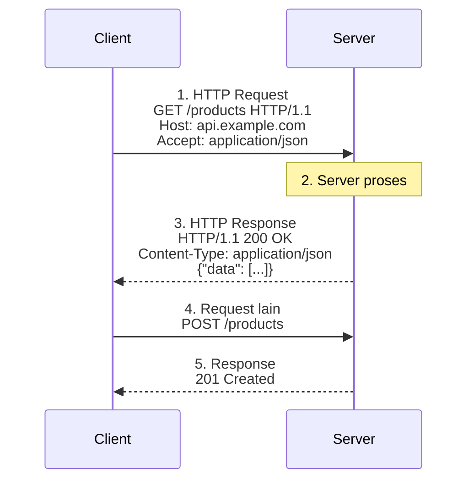
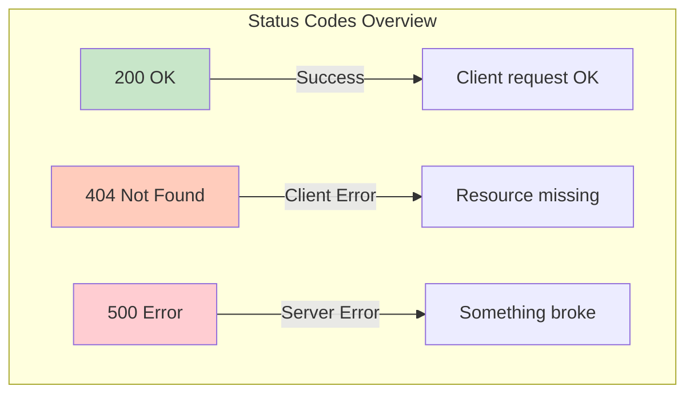

<!-- _class: title -->
# 02. HTTP Basics

## Apa itu HTTP?

**HTTP** (HyperText Transfer Protocol) = bahasa yang dipake client & server buat komunikasi. Setiap interaksi web adalah pertukaran **HTTP Request** (dari client) dan **HTTP Response** (dari server).

---

## Cara Kerja



---

## HTTP Methods

Method = *verb* yang ngasih tau server **mau ngapain**.

| Method | Fungsi | Analogi Restoran | Kapan Pake |
|--------|--------|------------------|------------|
| **GET** | Ambil data | Lihat menu | Baca artikel, liat produk |
| **POST** | Kirim data baru | Pesan makanan | Register, upload foto |
| **PUT** | Update data (ganti semua) | Ganti pesanan total | Update profil, ganti password |
| **PATCH** | Update data (sebagian) | Ganti topping aja | Edit bio, ubah quantity |
| **DELETE** | Hapus data | Batalkan pesanan | Hapus akun, delete post |

> **Catatan**: PUT kirim data lengkap, PATCH kirim data yang berubah aja.

```bash

---

# Contoh pake curl
curl https://api.github.com/users/midory          # GET
curl -X POST https://api.example.com/users        # POST
curl -X PUT -d '{"name":"Baru"}' https://api.example.com/users/1  # PUT
curl -X DELETE https://api.example.com/users/1    # DELETE
```

### Idempotent & Safe

| Sifat | Arti | Method |
|-------|------|--------|
| **Safe** | Gak ngubah data di server | GET |
| **Idempotent** | Request berkali-kali hasilnya sama | GET, PUT, DELETE |
| **Not Safe** | Bisa ngubah data | POST, PUT, PATCH, DELETE |

---

## HTTP Status Codes

Server ngasih kode 3 digit biar client tau hasilnya.

### 1xx — Informational
Lagi proses, tunggu bentar.

### 2xx — Success
| Kode | Nama | Arti |
|------|------|------|
| **200** | OK | Sukses! Data dikirim |
| **201** | Created | Data baru berhasil dibuat |
| **204** | No Content | Sukses, tapi gak ada data (biasanya setelah DELETE) |

### 3xx — Redirection
| Kode | Nama | Arti |
|------|------|------|
| **301** | Moved Permanently | Pindah alamat permanen (cache oleh browser) |
| **302** | Found | Pindah sementara |
| **304** | Not Modified | Data gak berubah, pake cache aja |

### 4xx — Client Error
| Kode | Nama | Arti | Analogi |
|------|------|------|---------|
| **400** | Bad Request | Request salah format | Pesan gak jelas |
| **401** | Unauthorized | Belum login | Kartu identitas gak ada |
| **403** | Forbidden | Gak punya akses | Dilarang masuk |
| **404** | Not Found | Resource gak ada | Alamat salah |
| **405** | Method Not Allowed | Method gak didukung | Minta bayar cash di toko cashless |
| **429** | Too Many Requests | Kebanyakan request, kena rate limit | Antrian penuh |

### 5xx — Server Error
| Kode | Nama | Arti |
|------|------|------|
| **500** | Internal Server Error | Error umum di server |
| **502** | Bad Gateway | Server gateway dapet response invalid |
| **503** | Service Unavailable | Server sibuk / maintenance |



---

## HTTP Headers

Header = metadata yang nyertain request/response.

### Request Headers
| Header | Contoh | Fungsi |
|--------|--------|--------|
| `Host` | `api.example.com` | Domain tujuan |
| `User-Agent` | `Mozilla/5.0...` | Identitas browser/client |
| `Accept` | `application/json` | Format response yang diinginkan |
| `Authorization` | `Bearer eyJhbG...` | Token autentikasi |
| `Content-Type` | `application/json` | Format data yang dikirim (POST/PUT) |
| `Cookie` | `session_id=abc` | Data session |

### Response Headers
| Header | Contoh | Fungsi |
|--------|--------|--------|
| `Content-Type` | `text/html; charset=utf-8` | Format response |
| `Content-Length` | `1234` | Ukuran response (bytes) |
| `Set-Cookie` | `session_id=xyz; Path=/` | Set cookie di browser |
| `Cache-Control` | `max-age=3600` | Aturan caching |
| `Access-Control-Allow-Origin` | `*` | CORS policy |

```bash

---

# Liat headers pake curl -v
curl -v https://api.github.com
```

---

## HTTPS & SSL

### HTTP vs HTTPS

| HTTP | HTTPS |
|------|-------|
| Data plaintext | Data terenkripsi |
| Port 80 | Port 443 |
| Rentan man-in-the-middle | Aman pake TLS/SSL |
| ❌ Trusted | ✅ Padlock hijau di browser |

### Cara Kerja HTTPS

```
1. Client minta koneksi aman (ClientHello)
2. Server kirim sertifikat SSL + public key
3. Client verifikasi sertifikat (via Certificate Authority)
4. Client buat session key, enkrip pake public key
5. Server dekrip pake private key
6. Komunikasi terenkripsi dimulai!
```

> **SSL Certificate**: Dapet gratis dari Let's Encrypt, atau bayar dari DigiCert, Cloudflare, dll.

---

## HTTP/2 vs HTTP/3

| Fitur | HTTP/1.1 | HTTP/2 | HTTP/3 |
|-------|----------|--------|--------|
| Tahun | 1997 | 2015 | 2022 |
| Transport | TCP | TCP | QUIC (UDP) |
| Koneksi | 1 request per koneksi | Multiplexing | Multiplexing |
| Head-of-line blocking | ❌ Ya | ⚠️ Parsial (TCP level) | ✅ Gak ada |
| Server push | ❌ | ✅ | ✅ |
| Adopsi | Legacy | 40%+ web | 30%+ (makin naik) |

**Multiplexing** = kirim banyak request dalam 1 koneksi tanpa nunggu antrian.

---

## Rangkuman

| Konsep | Inti |
|--------|------|
| HTTP Methods | GET ambil, POST buat, PUT ganti, PATCH edit, DELETE hapus |
| Status Codes | 2xx ok, 3xx pindah, 4xx error client, 5xx error server |
| Headers | Metadata request/response |
| HTTPS | HTTP + enkripsi TLS, pake sertifikat SSL |
| HTTP/2 & /3 | Lebih cepet, multiplexing, HOL blocking solved |

---

## Latihan

### 1. Match Method to Action
Cocokin method HTTP ke aksi berikut:
- `[ ]` Ngirim form login
- `[ ]` Liat daftar produk
- `[ ]` Hapus komentar
- `[ ]` Ganti nama profil
- `[ ]` Upload foto profil

Tulis method yang tepat (GET, POST, PUT, PATCH, DELETE).

### 2. Identify Status Codes
Kasus berikut, status code apa yang tepat?
- User buka halaman yang gak ada
- Form login berhasil
- User gak login nyoba akses dashboard
- Server lagi down maintenance
- Data baru berhasil dibuat
- Redirect dari http ke https

### 3. Curl Command Practice
Tulis curl command buat:
- GET data user dari `https://jsonplaceholder.typicode.com/users/1`
- POST user baru dengan data `{"name":"Budi","email":"budi@mail.com"}`
- Liat response headers aja dari Google
- DELETE post dengan id 1

### 4. HTTP vs HTTPS
Jelaskan pake diagram atau tulisan:
- Apa bedanya HTTP dan HTTPS?
- Gimana proses handshake TLS?
- Kenapa HTTPS penting buat production?
- Cari tau: website mana aja yang masih pake HTTP? Kenapa?
