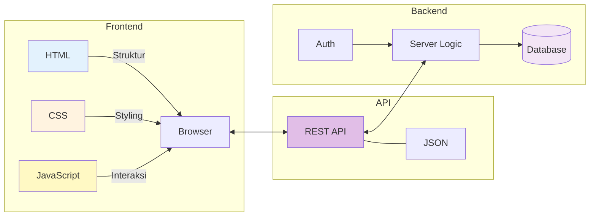
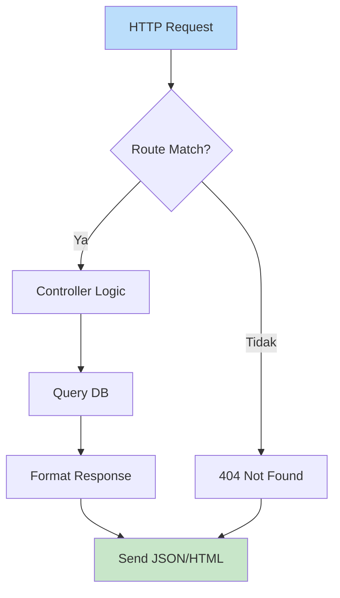
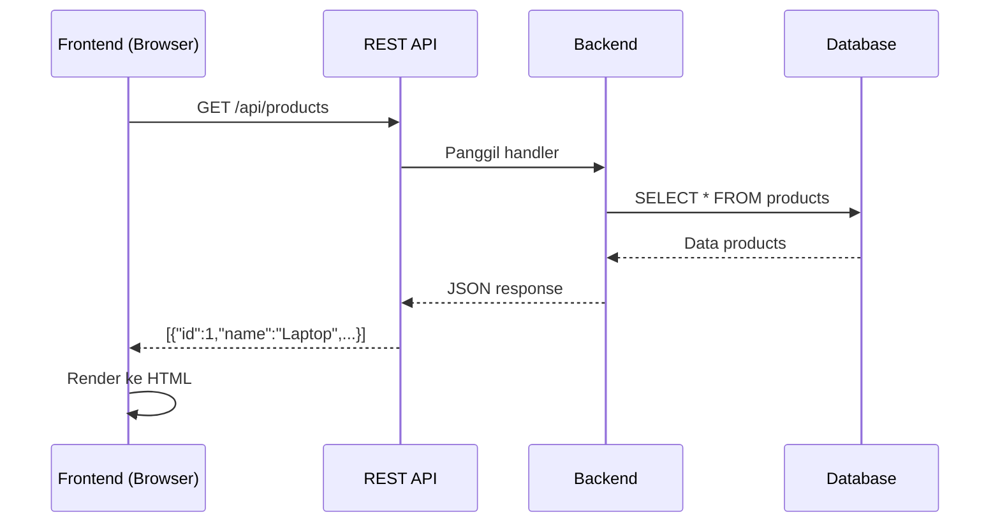
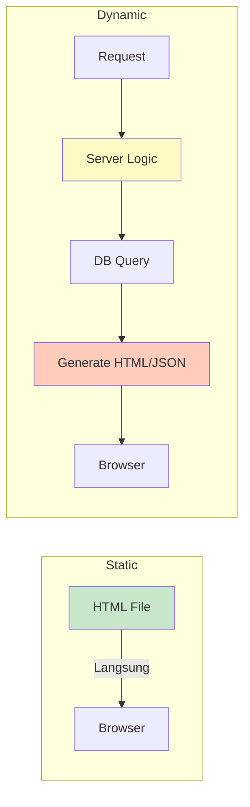

<!-- _class: title -->
# 03. Frontend vs Backend

## Gambaran Besar



| Layer | Tugas | Teknologi |
|-------|-------|-----------|
| **Frontend** | Tampilan, interaksi user | HTML, CSS, JavaScript, React, Vue |
| **API** | Jembatan FE ↔ BE | REST, JSON, GraphQL |
| **Backend** | Logic, data, auth, API | Node.js, Python, Go, database |

---

## Frontend

### HTML — Struktur
```html
<div class="product-card">
  <h2>MacBook Pro</h2>
  <p class="price">Rp 25.000.000</p>
  <button onclick="addToCart()">Beli</button>
</div>
```

### CSS — Tampilan
```css
.product-card {
  border: 1px solid #ddd;
  padding: 16px;
  border-radius: 8px;
}
.price { color: #e65100; font-weight: bold; }
```

### JavaScript — Interaksi
```javascript
function addToCart() {
  alert('Barang ditambahkan ke keranjang!');
  updateCartCount();
}
```

### Cara Kerja Browser Rendering

```
HTML  → DOM (Document Object Model)
CSS   → CSSOM (CSS Object Model)
JS    → Eksekusi + DOM manipulation
         ↓
  Render Tree → Layout → Paint → Composite
```

> Browser baca HTML → parse → bikin DOM tree → CSSOM → render tree → gambar di layar.

---

## Backend

### Server Logic
```javascript
// Contoh server sederhana pake Node.js (tanpa framework)
const http = require('http');

const server = http.createServer((req, res) => {
  if (req.url === '/api/users' && req.method === 'GET') {
    res.writeHead(200, { 'Content-Type': 'application/json' });
    res.end(JSON.stringify([
      { id: 1, name: 'Budi', email: 'budi@mail.com' }
    ]));
  } else {
    res.writeHead(404);
    res.end('Not Found');
  }
});

server.listen(3000);
```



### Database
Database tempat nyimpen data aplikasi:

| Jenis | Contoh | Cocok |
|-------|--------|-------|
| Relational (SQL) | PostgreSQL, MySQL | Data terstruktur (user, order) |
| NoSQL | MongoDB, Firestore | Data fleksibel (JSON) |
| Cache | Redis | Data sementara (session) |
| Full-text Search | Elasticsearch | Pencarian |

---

## API — Jembatan FE & BE

**API** (Application Programming Interface) = cara dua aplikasi ngobrol.



### REST API Concept

REST = Representational State Transfer. Prinsipnya:

| Prinsip | Arti |
|---------|------|
| **Stateless** | Tiap request berdiri sendiri, gak butuh konteks sebelumnya |
| **Resource-based** | Setiap entity punya endpoint: `/users`, `/products`, `/orders` |
| **CRUD via HTTP** | GET (read), POST (create), PUT/PATCH (update), DELETE |
| **JSON Response** | Data dikirim dalam format JSON |

### Contoh Endpoint REST

| Method | Endpoint | Fungsi |
|--------|----------|--------|
| GET | `/api/users` | Ambil semua user |
| GET | `/api/users/1` | Ambil user id 1 |
| POST | `/api/users` | Buat user baru |
| PUT | `/api/users/1` | Update user id 1 |
| DELETE | `/api/users/1` | Hapus user id 1 |

---

## JSON Format

### Contoh JSON
```json
{
  "id": 1,
  "name": "Budi Santoso",
  "email": "budi@mail.com",
  "isActive": true,
  "hobbies": ["coding", "gaming"],
  "address": {
    "city": "Jakarta",
    "country": "Indonesia"
  }
}
```

### JSON vs XML
| JSON | XML |
|------|-----|
| Ringan, lebih kecil | Berat, lebih besar |
| Gampang dibaca JS | Perlu parser |
| `{ "key": "value" }` | `<key>value</key>` |
| Array langsung `[]` | Butuh `<list><item>` |

---

## API Testing — Postman / Thunder Client

### Postman

1. Download Postman → New Request
2. Pilih method (GET, POST, dll)
3. Masukin URL: `https://jsonplaceholder.typicode.com/posts`
4. Klik **Send**
5. Liat response: status, body JSON, headers

### Thunder Client (VS Code Extension)

Lebih ringan, langsung dari VS Code.

### Test Public API

Coba endpoint ini pake Postman/Thunder Client:

| Endpoint | Method | Coba |
|----------|--------|------|
| `https://jsonplaceholder.typicode.com/posts` | GET | Ambil semua posts |
| `https://jsonplaceholder.typicode.com/posts/1` | GET | Ambil 1 post |
| `https://jsonplaceholder.typicode.com/posts` | POST | Buat post baru (isi Body JSON) |
| `https://api.github.com/users/octocat` | GET | Ambil data user GitHub |

```json
// Body buat POST
{
  "title": "Belajar API",
  "body": "Seru banget!",
  "userId": 1
}
```

---

## Serving Static Files vs Dynamic Content

| Static | Dynamic |
|--------|---------|
| File udah jadi (.html, .css, .js) | Dibikin server pas request |
| Langsung dikirim ke browser | Proses dulu (query DB, logic) |
| Cepet, bisa cache CDN | Lebih lambat, butuh server |
| Contoh: profile page, blog post | Contoh: dashboard user, search |



---

## Rangkuman

| Konsep | Inti |
|--------|------|
| Frontend | HTML (struktur) + CSS (tampilan) + JS (interaksi), render di browser |
| Backend | Logic, database, API, jalan di server |
| API | Jembatan FE-BE via HTTP, biasanya REST + JSON |
| REST | Resource-based endpoints, CRUD via HTTP methods |
| JSON | Format data ringan pengganti XML |
| Static vs Dynamic | File siap vs content generated on request |

---

## Latihan

### 1. Bedain FE vs BE
Kategorikan ini Frontend (FE) atau Backend (BE):
- `[ ]` Nampilin data user di halaman profil
- `[ ]` Validasi password sebelum simpan ke DB
- `[ ]` Ngirim email notifikasi
- `[ ]` Animasi tombol hover
- `[ ]` Routing URL di browser (React Router)
- `[ ]` Query database buat laporan
- `[ ]` Format response JSON dari API

### 2. Parse JSON
Dari JSON response API berikut, jawab:
```json
{
  "status": "success",
  "data": {
    "users": [
      { "id": 1, "name": "Budi", "email": "budi@mail.com", "role": "admin" },
      { "id": 2, "name": "Sari", "email": "sari@mail.com", "role": "user" },
      { "id": 3, "name": "Joko", "email": "joko@mail.com", "role": "user" }
    ],
    "total": 3,
    "page": 1
  }
}
```
- Ada berapa user?
- Siapa aja yang role admin?
- Apa status dari response ini?
- Gimana cara akses email user pertama di JavaScript?

### 3. API Test
Pake Postman/Thunder Client/curl, lakukan:
- GET posts dari `https://jsonplaceholder.typicode.com/posts`
- GET post id 42
- POST post baru (data bebas)
- Catat: status code tiap response, response time, content-type header

### 4. Gambar Arsitektur Fullstack
Bikin diagram Mermaid yang mencakup:
- User dengan browser
- Frontend (React/HTML)
- REST API
- Backend server
- Database (PostgreSQL)
- Alur data dari user login sampai liat profil
