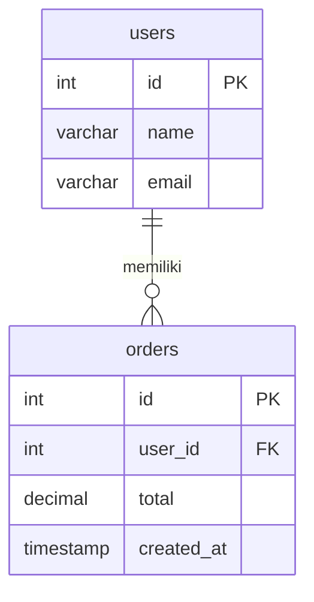
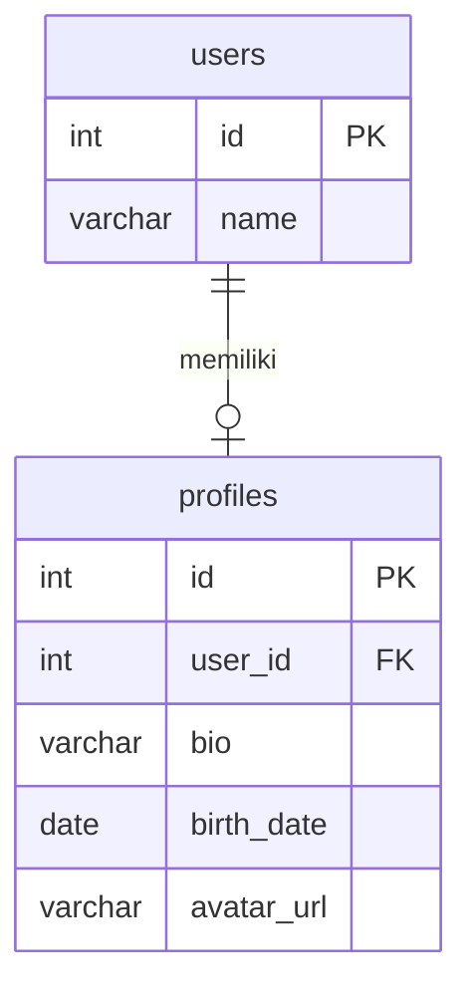
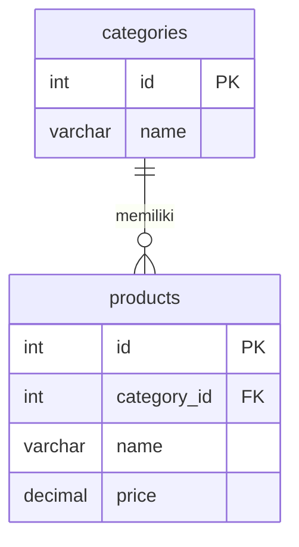
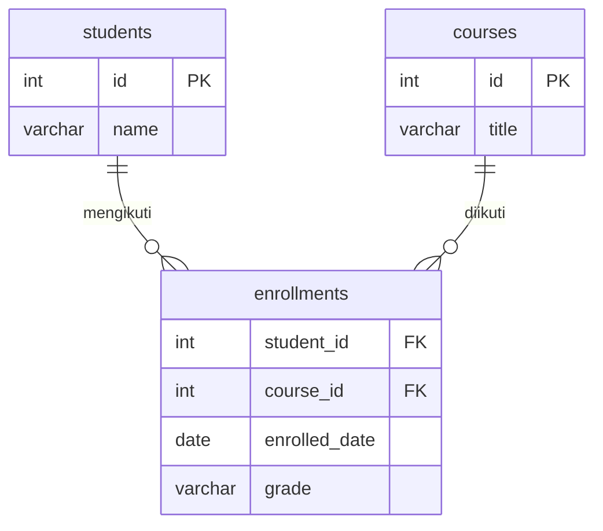
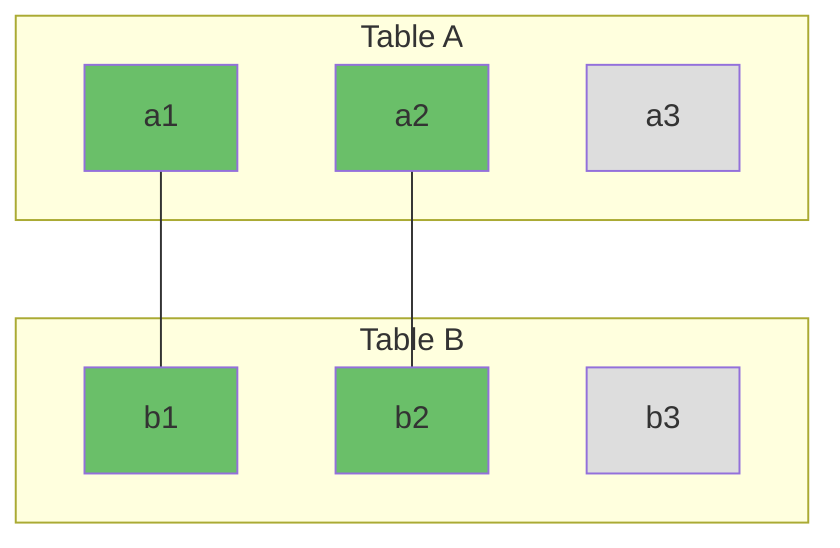
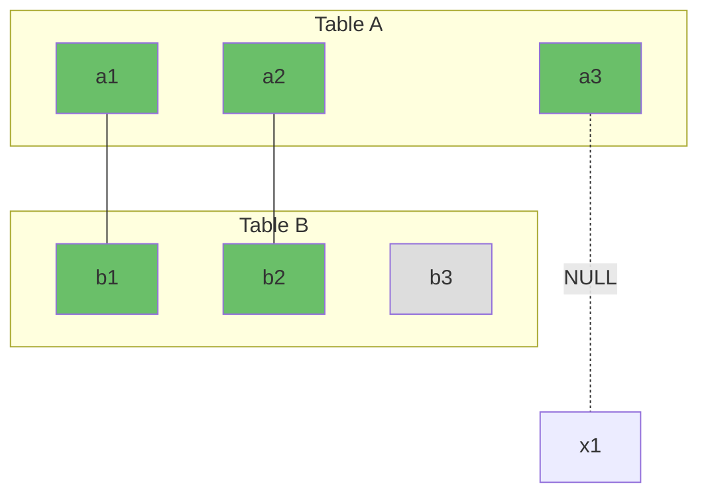
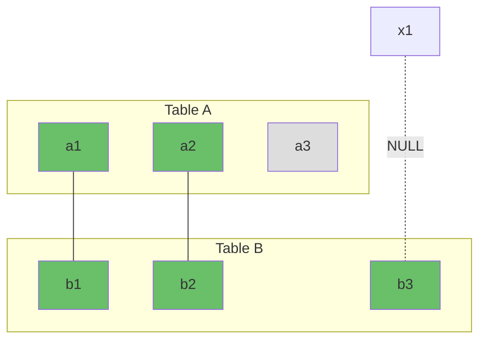
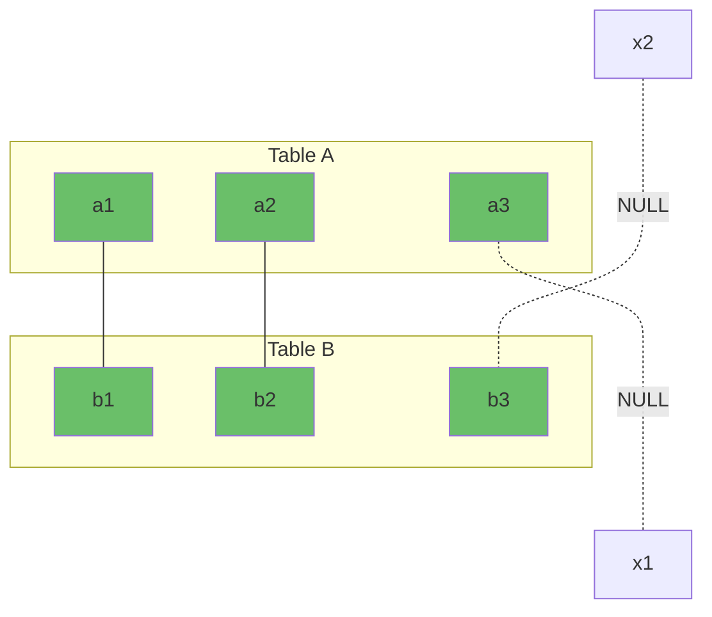

<!-- _class: title -->
# 1.3 Relationships

## Foreign Key Concept

**Foreign Key (FK):** Column di satu table yang refer ke Primary Key di table lain. Ini yang bikin relational database powerful.



```sql
-- Table users (parent)
CREATE TABLE users (
    id SERIAL PRIMARY KEY,
    name VARCHAR(100) NOT NULL,
    email VARCHAR(255) UNIQUE NOT NULL
);

-- Table orders (child) dengan foreign key
CREATE TABLE orders (
    id SERIAL PRIMARY KEY,
    user_id INT NOT NULL,
    total DECIMAL(10, 2) NOT NULL DEFAULT 0,
    status VARCHAR(20) DEFAULT 'pending',
    created_at TIMESTAMP WITH TIME ZONE DEFAULT NOW(),

    -- Foreign key constraint
    CONSTRAINT fk_orders_user
        FOREIGN KEY (user_id)
        REFERENCES users(id)
        ON DELETE CASCADE
);
```

### FK Constraints Actions

Yang terjadi kalau data di parent di-delete atau di-update:

| Action | Maksud |
|--------|--------|
| `ON DELETE CASCADE` | Delete child otomatis kalau parent di-delete |
| `ON DELETE SET NULL` | Set FK jadi NULL kalau parent di-delete |
| `ON DELETE RESTRICT` | Cegah delete parent kalau masih ada child |
| `ON DELETE NO ACTION` | Sama kaya RESTRICT, deferred di beberapa DB |
| `ON UPDATE CASCADE` | Update FK otomatis kalau PK parent berubah |

```sql
-- Paling umum dipake
CONSTRAINT fk_orders_user
    FOREIGN KEY (user_id)
    REFERENCES users(id)
    ON DELETE CASCADE;

-- Kalo user dihapus, ordernya ikut kehapus
```

```sql
-- Alternatif: user dihapus, order tetap ada tapi user_id jadi NULL
CONSTRAINT fk_orders_user
    FOREIGN KEY (user_id)
    REFERENCES users(id)
    ON DELETE SET NULL;
```

> **Pilih yang mana?** `CASCADE` — kalau data child nggak berguna tanpa parent (kaya order tanpa user). `SET NULL` — kalau data child tetap berguna (kaya log activity, histori). `RESTRICT` — kalau mau jaga integritas ketat.

---

## Table Relationships

### 1:1 (One-to-One)

Satu row di Table A berhubungan dengan **tepat satu** row di Table B.

**Contoh:** User ↔ Profile



```sql
CREATE TABLE profiles (
    id SERIAL PRIMARY KEY,
    user_id INT UNIQUE NOT NULL,           -- UNIQUE = 1:1
    bio TEXT,
    birth_date DATE,
    avatar_url VARCHAR(500),

    CONSTRAINT fk_profile_user
        FOREIGN KEY (user_id)
        REFERENCES users(id)
        ON DELETE CASCADE
);
```

> **UNIQUE** di FK yang bikin 1:1. Tanpa UNIQUE, user bisa punya banyak profile (jadi 1:N).

### 1:N (One-to-Many)

Satu row di Table A berhubungan dengan **banyak** row di Table B.

**Contoh:** User → Orders, Category → Products



```sql
CREATE TABLE categories (
    id SERIAL PRIMARY KEY,
    name VARCHAR(100) NOT NULL
);

CREATE TABLE products (
    id SERIAL PRIMARY KEY,
    category_id INT NOT NULL,
    name VARCHAR(200) NOT NULL,
    price DECIMAL(10, 2) NOT NULL,

    CONSTRAINT fk_product_category
        FOREIGN KEY (category_id)
        REFERENCES categories(id)
        ON DELETE RESTRICT
);

-- 1 kategori bisa punya banyak produk
-- 1 produk hanya punya 1 kategori
```

### N:M (Many-to-Many)

Satu row di Table A berhubungan dengan **banyak** row di Table B, dan sebaliknya.

**Contoh:** Students ↔ Courses, Products ↔ Tags



N:M butuh **junction table** (table penghubung) di tengah.

```sql
CREATE TABLE students (
    id SERIAL PRIMARY KEY,
    name VARCHAR(100) NOT NULL
);

CREATE TABLE courses (
    id SERIAL PRIMARY KEY,
    title VARCHAR(200) NOT NULL
);

-- Junction table
CREATE TABLE enrollments (
    student_id INT NOT NULL,
    course_id INT NOT NULL,
    enrolled_date DATE DEFAULT CURRENT_DATE,
    grade VARCHAR(2),

    -- Composite primary key — 2 column jadi 1 PK
    PRIMARY KEY (student_id, course_id),

    CONSTRAINT fk_enrollment_student
        FOREIGN KEY (student_id)
        REFERENCES students(id)
        ON DELETE CASCADE,

    CONSTRAINT fk_enrollment_course
        FOREIGN KEY (course_id)
        REFERENCES courses(id)
        ON DELETE CASCADE
);

-- 1 student bisa ambil banyak course
-- 1 course bisa diambil banyak student
```

### Ringkasan Relationship

| Tipe | FK di table mana? | Butuh extra? | Contoh |
|------|-------------------|-------------|--------|
| 1:1 | Salah satu table | UNIQUE constraint di FK | user → profile |
| 1:N | Table child (many side) | — | category → products |
| N:M | Junction table | Table ketiga | students ↔ courses |

---

## JOIN Types

JOIN = menggabungkan data dari 2+ table berdasarkan hubungan.

### INNER JOIN

Hanya baris yang **punya pasangan** di kedua table.



```sql
-- INNER JOIN
SELECT * FROM table_a
INNER JOIN table_b ON table_a.id = table_b.fk_id;

-- Contoh: produk + kategori
SELECT
    p.name AS produk,
    c.name AS kategori,
    p.price
FROM products p
INNER JOIN categories c ON p.category_id = c.id;
-- Hanya produk yang punya kategori — produk tanpa kategori tidak muncul
```

### LEFT JOIN

Semua baris dari Table A, plus data Table B kalau ada (kalau nggak ada → NULL).



```sql
-- LEFT JOIN
SELECT * FROM table_a
LEFT JOIN table_b ON table_a.id = table_b.fk_id;

-- Contoh: semua kategori, meskipun tidak punya produk
SELECT
    c.name AS kategori,
    COUNT(p.id) AS jumlah_produk
FROM categories c
LEFT JOIN products p ON c.id = p.category_id
GROUP BY c.id, c.name
ORDER BY jumlah_produk DESC;
```

### RIGHT JOIN

Kebalikan LEFT JOIN — semua baris dari Table B, plus data Table A kalau ada.



```sql
-- RIGHT JOIN — jarang dipake, biasanya dibalik pake LEFT saja
SELECT * FROM table_a
RIGHT JOIN table_b ON table_a.id = table_b.fk_id;

-- Sama aja kaya:
SELECT * FROM table_b
LEFT JOIN table_a ON table_b.id = table_a.fk_id;
```

### FULL JOIN

Semua baris dari kedua table — kalau nggak ada pasangan → NULL.



```sql
-- FULL JOIN — semua muncul, yang tidak cocok jadi NULL
SELECT * FROM table_a
FULL JOIN table_b ON table_a.id = table_b.fk_id;
```

### Venn Diagram JOIN

```
INNER JOIN:      A ∩ B          [●-------●]
LEFT JOIN:       A ∪ (A∩B)      [●-------●] + A saja
RIGHT JOIN:      B ∪ (A∩B)      [●-------●] + B saja
FULL JOIN:       A ∪ B          [●-------●] + A saja + B saja
```

### Contoh JOIN Lengkap

```sql
-- Setup data
CREATE TABLE users (
    id SERIAL PRIMARY KEY,
    name VARCHAR(100)
);
CREATE TABLE orders (
    id SERIAL PRIMARY KEY,
    user_id INT,
    total DECIMAL(10,2),
    FOREIGN KEY (user_id) REFERENCES users(id)
);

INSERT INTO users (name) VALUES ('Budi'), ('Ani'), ('Citra');
INSERT INTO orders (user_id, total) VALUES
    (1, 150000), (1, 75000), (2, 200000);

-- INNER JOIN — user yang punya order
SELECT u.name, o.total, o.id AS order_id
FROM users u
INNER JOIN orders o ON u.id = o.user_id;
-- Hasil: Budi (2 order), Ani (1 order)
-- Citra tidak muncul (tidak punya order)

-- LEFT JOIN — semua user + order mereka
SELECT u.name, o.total
FROM users u
LEFT JOIN orders o ON u.id = o.user_id;
-- Hasil: Budi (150000, 75000), Ani (200000), Citra (NULL)
-- Citra muncul dengan total NULL

-- LEFT JOIN — user yang tidak punya order
SELECT u.name
FROM users u
LEFT JOIN orders o ON u.id = o.user_id
WHERE o.id IS NULL;
-- Hasil: Citra
```

---

## Indexing Basics

Index = struktur data (B-Tree) yang bikin pencarian cepet.

### Kenapa Index?

```sql
-- Tanpa index — database scan SEMUA baris (full table scan)
SELECT * FROM products WHERE name = 'Kopi Arabika 250gr';
-- Kalau 1 juta baris, dicek satu-satu → lambat

-- Dengan index — langsung lompat ke baris yang cocok
CREATE INDEX idx_products_name ON products(name);
SELECT * FROM products WHERE name = 'Kopi Arabika 250gr';
-- Langsung ketemu → cepet
```

### Kapan pake index?

| Column | Index? | Alasan |
|--------|--------|--------|
| `id` (PK) | ✅ Otomatis | Primary key always indexed |
| `email` | ✅ | Sering dipake login/WHERE |
| `name` | ✅ | Sering di-search |
| `created_at` | ✅ | Sering di-ORDER BY atau BETWEEN |
| `description` (TEXT) | ❌ | Jarang di-filter exact match |
| `is_active` (BOOLEAN) | ❌ | Hanya 2 nilai — selectivity rendah |

### Jenis Index

```sql
-- Single column index
CREATE INDEX idx_users_email ON users(email);

-- Composite index (multi column) — urutan penting!
CREATE INDEX idx_users_status_created
ON users(is_active, created_at DESC);
-- Berguna buat: WHERE is_active = true ORDER BY created_at DESC

-- Unique index (sama kayak UNIQUE constraint)
CREATE UNIQUE INDEX idx_users_email_unique ON users(email);

-- Partial index — cuma index baris tertentu
CREATE INDEX idx_active_products ON products(is_active)
WHERE is_active = true;
-- Hemat space, cepet kalau sering filter aktif
```

### Trade-off Index

| Kelebihan | Kekurangan |
|-----------|------------|
| SELECT lebih cepet | INSERT/UPDATE/DELETE lebih lambat (harus update index juga) |
| ORDER BY lebih cepet | Pake space disk |
| JOIN lebih cepet | Index salah bikin database bingung |

> **Rule of thumb:** Index column yang sering dipake di WHERE, JOIN, ORDER BY. Jangan index SEMUA column. Mulai dari index di PK (otomatis) + FK + column yang sering difilter.

---

## Migration Concept

Migration = version control buat database schema.

### Kenapa Migration?

```
Tim development — 3 orang, 3 database lokal, 1 production

Tanpa migration:
- Budi nambah column "phone" di table users
- Ani gak tau — codenya error karena column belum ada
- Production di-update manual — beda sama lokal
- Siapa yang terakhir update? Nggak jelas

Dengan migration:
- migration_001_add_phone_to_users.sql — semua jalanin
- Urutan jelas, versioning jelas
- Bisa rollback kalau error
```

### Contoh Migration

```sql
-- File: 001_create_users.sql
-- Up
CREATE TABLE users (
    id SERIAL PRIMARY KEY,
    name VARCHAR(100) NOT NULL,
    email VARCHAR(255) UNIQUE NOT NULL,
    created_at TIMESTAMP WITH TIME ZONE DEFAULT NOW()
);

-- Down (rollback)
DROP TABLE users;

-- File: 002_add_phone_to_users.sql
-- Up
ALTER TABLE users ADD COLUMN phone VARCHAR(20);

-- Down
ALTER TABLE users DROP COLUMN phone;

-- File: 003_create_orders.sql
-- Up
CREATE TABLE orders (
    id SERIAL PRIMARY KEY,
    user_id INT NOT NULL REFERENCES users(id) ON DELETE CASCADE,
    total DECIMAL(10, 2) NOT NULL,
    status VARCHAR(20) DEFAULT 'pending',
    created_at TIMESTAMP WITH TIME ZONE DEFAULT NOW()
);

CREATE INDEX idx_orders_user_status ON orders(user_id, status);

-- Down
DROP TABLE orders;
```

### Tools Migration

| Tool | Bahasa | Database |
|------|--------|----------|
| **knex.js** | Node.js | Multi DB |
| **Prisma Migrate** | Node.js | Multi DB (auto-generate) |
| **Alembic** | Python | SQLAlchemy |
| **Flyway** | Java | Multi DB |
| **golang-migrate** | Go | Multi DB |
| **Manual SQL** | — | Universal |

---

## Latihan

**Latihan 1: Desain Users + Orders**
Buat table `users` dan `orders` dengan relasi 1:N:
- Users: id, name, email, phone, created_at
- Orders: id, user_id (FK), total, status (pending/paid/shipped/delivered/cancelled), shipping_address, created_at
- Tambah index di `user_id` dan `status`
- Tulis constraint ON DELETE yang tepat

**Latihan 2: Query dengan JOIN**
Dari table users dan orders di atas, tulis query untuk:
1. Mendapatkan semua order milik user dengan nama "Budi", termasuk detail user
2. Menampilkan semua user beserta total belanja mereka (user yang belum order tetap muncul)
3. Menampilkan user yang belum pernah order
4. Total pendapatan (SUM total) per status order
5. Rata-rata total order per user (hanya user yang pernah order)

**Latihan 3: Categories N:M dengan Products**
Buat sistem kategori yang memungkinkan satu produk punya banyak kategori:

- `products` — id, name, price, stock
- `categories` — id, name, slug
- `product_categories` — junction table

Tulis query untuk:
1. Menambahkan produk "Kopi Arabika" ke kategori "Kopi" dan "Premium"
2. Mendapatkan semua kategori dari satu produk
3. Mendapatkan semua produk dalam satu kategori
4. Produk yang tidak punya kategori sama sekali

**Latihan 4: Add Indexing**
Dari semua table yang udah dibuat, identifikasi 3 query yang paling sering dipake. Tambah index yang sesuai. Tuliskan:
- Query yang mau dipercepat
- Index yang dibuat (CREATE INDEX)
- Kenapa index itu membantu
