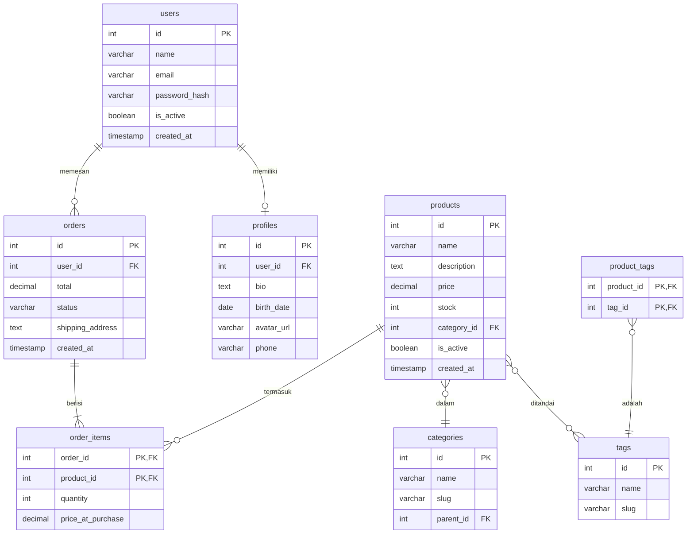

<!-- _class: title -->
# 1.4 Database Design

## Normalization

Normalization = proses menghilangkan data duplikat dan menjaga integritas data dengan memecah table jadi table-table kecil yang terstruktur.

Tujuan:
- ❌ Hindari data redundancy (data sama di banyak tempat)
- ❌ Hindari anomaly (INSERT/UPDATE/DELETE error karena duplikasi)
- ✅ Jaga konsistensi data
- ✅ Memudahkan maintenance

Tiga bentuk normal paling umum: **1NF, 2NF, 3NF**.

---

### 1NF — First Normal Form

**Aturan:**
1. Setiap column punya satu nilai (atomic) — jangan array/string multi-value
2. Setiap baris harus unik (pake PK)
3. Semua column di satu table harus same type

```sql
-- ❌ BEFORE — MELANGGAR 1NF
-- Column "subjects" isi banyak nilai dalam satu cell
CREATE TABLE students_1nf_bad (
    id SERIAL PRIMARY KEY,
    name VARCHAR(100),
    subjects VARCHAR(200)  -- 'Math,Science,English' — SATU CELL BANYAK NILAI
);

-- ❌ Atau pake array
CREATE TABLE students_1nf_bad2 (
    id SERIAL PRIMARY KEY,
    name VARCHAR(100),
    subjects TEXT[]  -- array — tetap melanggar 1NF
);
```

```sql
-- ✅ AFTER — 1NF compliant
-- Satu baris per subject per student
CREATE TABLE students_1nf_good (
    id SERIAL PRIMARY KEY,
    name VARCHAR(100),
    subject VARCHAR(100)  -- 'Math' — satu cell SATU nilai
);

-- Data:
-- 1, 'Budi', 'Math'
-- 1, 'Budi', 'Science'
-- 1, 'Budi', 'English'
-- 2, 'Ani', 'Math'
-- 2, 'Ani', 'Art'
```

### 2NF — Second Normal Form

**Prasyarat:** Sudah 1NF.
**Aturan:** Semua non-key column harus **fully functionally dependent** pada seluruh PK (bukan sebagian).

Ini cuma masalah kalau PK-nya **composite** (2+ column jadi PK).

```sql
-- ❌ BEFORE — MELANGGAR 2NF
-- PK composite: (student_id, course_id)
-- "student_name" cuma tergantung student_id, bukan (student_id + course_id)
-- "course_title" cuma tergantung course_id, bukan (student_id + course_id)

CREATE TABLE enrollments_2nf_bad (
    student_id INT,
    course_id INT,
    student_name VARCHAR(100),    -- ❌ partial dependency ke student_id saja
    course_title VARCHAR(200),    -- ❌ partial dependency ke course_id saja
    grade VARCHAR(2),             -- ✅ full dependency ke (student_id, course_id)

    PRIMARY KEY (student_id, course_id)
);

-- Data duplikat:
-- 1, 101, 'Budi', 'Math 101', 'A'
-- 1, 102, 'Budi', 'Science 101', 'B'
-- Nama 'Budi' duplikat di 2 baris
```

```sql
-- ✅ AFTER — 2NF compliant
-- Pisah ke 3 table

CREATE TABLE students_2nf (
    id SERIAL PRIMARY KEY,
    name VARCHAR(100) NOT NULL
);

CREATE TABLE courses_2nf (
    id SERIAL PRIMARY KEY,
    title VARCHAR(200) NOT NULL
);

CREATE TABLE enrollments_2nf (
    student_id INT REFERENCES students_2nf(id),
    course_id INT REFERENCES courses_2nf(id),
    grade VARCHAR(2),

    PRIMARY KEY (student_id, course_id)
);

-- Sekarang "Budi" cuma di satu tempat — students_2nf
-- "Math 101" cuma di satu tempat — courses_2nf
```

### 3NF — Third Normal Form

**Prasyarat:** Sudah 2NF.
**Aturan:** Tidak ada **transitive dependency** — column non-key tidak boleh tergantung sama column non-key lain.

```sql
-- ❌ BEFORE — MELANGGAR 3NF
-- "category_name" tergantung "category_id" — tapi category_id bukan PK
-- Transitive: order_id → category_id → category_name

CREATE TABLE products_3nf_bad (
    id SERIAL PRIMARY KEY,
    name VARCHAR(200),
    category_id INT,
    category_name VARCHAR(100),  -- ❌ transitive dependency via category_id
    price DECIMAL(10,2)
);

-- Kalau kategori ganti nama, update di semua produk — repot & rawan inconsistent
```

```sql
-- ✅ AFTER — 3NF compliant

CREATE TABLE categories_3nf (
    id SERIAL PRIMARY KEY,
    name VARCHAR(100) NOT NULL
);

CREATE TABLE products_3nf (
    id SERIAL PRIMARY KEY,
    name VARCHAR(200) NOT NULL,
    category_id INT REFERENCES categories_3nf(id),
    price DECIMAL(10, 2) NOT NULL
);

-- Ganti nama kategori cukup di satu baris categories_3nf
-- Produk otomatis pake nama kategori terbaru via JOIN
```

### Contoh Normalisasi Lengkap

**Skenario:** Sistem order sederhana.

**Data awal (unnormalized):**

| OrderID | Customer | Address | Product | Qty | Price | Total |
|---------|----------|---------|---------|-----|-------|-------|
| 1 | Budi | Jl. Merdeka 1, Jakarta | Kopi 250gr, Teh 50gr | 2, 1 | 45000, 25000 | 115000 |
| 2 | Ani | Jl. Sudirman 5, Bandung | Gula 1kg | 3 | 15500 | 46500 |

Masalah:
- `Customer` + `Address` duplikat kalau order lagi
- `Product` multi-value (1 cell)
- Duplikasi data

**1NF — atomic values:**

| OrderID | Customer | Address | Product | Qty | Price | Total |
|---------|----------|---------|---------|-----|-------|-------|
| 1 | Budi | Jl. Merdeka 1, Jakarta | Kopi 250gr | 2 | 45000 | 115000 |
| 1 | Budi | Jl. Merdeka 1, Jakarta | Teh 50gr | 1 | 25000 | 115000 |
| 2 | Ani | Jl. Sudirman 5, Bandung | Gula 1kg | 3 | 15500 | 46500 |

Masalah baru: `Customer`, `Address`, `Total` duplikat di baris 1 & 2.

**2NF — pisah dependent column:**

Orders:

| OrderID | Customer | Address | Total |
|---------|----------|---------|-------|
| 1 | Budi | Jl. Merdeka 1, Jakarta | 115000 |
| 2 | Ani | Jl. Sudirman 5, Bandung | 46500 |

Order Items:

| OrderID | Product | Qty | Price |
|---------|---------|-----|-------|
| 1 | Kopi 250gr | 2 | 45000 |
| 1 | Teh 50gr | 1 | 25000 |
| 2 | Gula 1kg | 3 | 15500 |

Masalah: `Customer` dan `Address` masih di Orders — transitive dependency.

**3NF — no transitive dependency:**

Customers:

| CustomerID | Name | Address |
|------------|------|---------|
| 1 | Budi | Jl. Merdeka 1, Jakarta |
| 2 | Ani | Jl. Sudirman 5, Bandung |

Orders:

| OrderID | CustomerID | Total |
|---------|------------|-------|
| 1 | 1 | 115000 |
| 2 | 2 | 46500 |

Order Items:

| OrderID | Product | Qty | Price |
|---------|---------|-----|-------|
| 1 | Kopi 250gr | 2 | 45000 |
| 1 | Teh 50gr | 1 | 25000 |
| 2 | Gula 1kg | 3 | 15500 |

Products:

| ProductID | Name | Price |
|-----------|------|-------|
| 1 | Kopi 250gr | 45000 |
| 2 | Teh 50gr | 25000 |
| 3 | Gula 1kg | 15500 |

Order Items (final v2):

| OrderID | ProductID | Qty |
|---------|-----------|-----|
| 1 | 1 | 2 |
| 1 | 2 | 1 |
| 2 | 3 | 3 |

Hasil: Zero duplication, semua data konsisten, ganti harga produk cukup di satu tempat.

---

## Denormalization Trade-offs

Kadang normalisasi **berlebihan** — query jadi terlalu banyak JOIN yang bikin lambat.

**Denormalization** = sengaja taruh data duplikat biar query cepet.

### Kapan Denormalize?

| Skenario | Normalized | Denormalized |
|----------|------------|--------------|
| Dashboard analytics | JOIN 5 table | 1 table, siap display |
| Search dengan banyak filter | JOIN 7 table | Flat table dengan index |
| Read-heavy app | JOIN tiap request | Cache di column ekstra |

### Contoh Denormalization

```sql
-- Normalized (3NF)
SELECT
    o.id AS order_id,
    c.name AS customer_name,
    SUM(oi.qty * p.price) AS total
FROM orders o
JOIN customers c ON o.customer_id = c.id
JOIN order_items oi ON o.id = oi.order_id
JOIN products p ON oi.product_id = p.id
WHERE o.id = 1
GROUP BY o.id, c.name;

-- Denormalized — total sudah disimpan di orders
SELECT o.id, c.name, o.total
FROM orders o
JOIN customers c ON o.customer_id = c.id
WHERE o.id = 1;
```

**Trade-off:**

| Normalized | Denormalized |
|------------|--------------|
| ✅ Data konsisten | ❌ Bisa inconsistent (kalau lupa update) |
| ✅ Update di 1 tempat | ❌ Update di banyak tempat |
| ❌ Query banyak JOIN | ✅ Query cepet |
| ❌ Read lambat (banyak JOIN) | ✅ Read cepet |

> **Rule of thumb:** Normalize sampai 3NF dulu. Denormalize **hanya** kalau ada masalah performa yang terukur. Jangan denormalize dari awal.

---

## Naming Conventions

Konsistensi nama = readability + maintainability.

### Table Names

```sql
-- ✅ GOOD — snake_case, plural
CREATE TABLE users (...);
CREATE TABLE order_items (...);
CREATE TABLE product_categories (...);

-- ❌ BAD
CREATE TABLE User (...);       -- PascalCase + singular
CREATE TABLE tbl_user (...);   -- Prefix 'tbl_'
CREATE TABLE userData (...);   -- camelCase
CREATE TABLE user_list (...);  -- Plural vs singular? Pilih salah satu
```

### Column Names

```sql
-- ✅ GOOD — snake_case, singular
id, name, email, created_at, is_active, category_id

-- ❌ BAD
UserName, userdata, UserName, usersName
```

### Convention Guide

| Elemen | Convention | Contoh |
|--------|------------|--------|
| Table name | `snake_case`, plural | `users`, `order_items`, `product_categories` |
| Column name | `snake_case`, singular | `first_name`, `created_at` |
| Primary key | `id` | `id` |
| Foreign key | `singular_table_id` | `user_id`, `category_id` |
| Boolean | `is_` or `has_` prefix | `is_active`, `is_verified`, `has_discount` |
| Timestamp | `_at` suffix | `created_at`, `updated_at`, `deleted_at` |
| Date | `_date` suffix | `birth_date`, `order_date` |
| Junction table | `table1_table2` | `product_categories`, `user_roles` |

---

## ERD Basics

**ERD (Entity Relationship Diagram)** — diagram yang menunjukkan entity (table) dan hubungannya.

### Notasi Crow's Foot

```
o|----o|  one
||----||  many
o|----||  zero or many (optional)
 ||----o|  one and only one

Relasi:
  Users 1───< Orders     (1:N — user punya banyak order)
  Users 1───1 Profiles   (1:1 — user punya 1 profile)
  Students >───< Courses  (N:M — via junction)
```

### Contoh ERD E-commerce



### Cara Baca ERD

1. Kotak = entity / table
2. Baris di dalam kotak = column
3. PK = Primary Key, FK = Foreign Key
4. Garis = relationship
5. Simbol garis = cardinality

---

## Schema Migration Workflow

Workflow development database yang proper:

```
┌─────────────┐     ┌─────────────┐     ┌─────────────┐
│  Developer   │     │  Migration   │     │  Database   │
│  (bikin SQL) │────>│  (versioned) │────>│  (apply)    │
└─────────────┘     └─────────────┘     └─────────────┘
                           │
                           v
                    ┌─────────────┐
                    │  Git commit │
                    └─────────────┘
```

### Langkah-langkah

1. **Tulis migration** — file SQL dengan nomor urut
2. **Review** — di code review bareng tim
3. **Apply ke dev** — jalanin migration di database development
4. **Test** — pastikan aplikasi masih jalan
5. **Commit** — masuk ke git
6. **Deploy** — apply ke staging, lalu production

### Contoh Workflow

```bash

---

# Struktur folder migrations
migrations/
├── 001_create_users.sql
├── 002_create_products.sql
├── 003_create_orders.sql
└── 004_add_category_to_products.sql
```

```sql
-- 004_add_category_to_products.sql
-- Up
ALTER TABLE products ADD COLUMN category_id INT REFERENCES categories(id);
CREATE INDEX idx_products_category ON products(category_id);

-- Down
DROP INDEX IF EXISTS idx_products_category;
ALTER TABLE products DROP COLUMN IF EXISTS category_id;
```

### Migration Best Practices

- **Jangan edit migration yang sudah di-commit** — bikin migration baru aja
- **Setiap migration harus punya rollback (Down)** — biar bisa revert
- **Test migration di dev/staging dulu** — sebelum production
- **One migration = one logical change** — jangan campur-campur
- **Jangan manual edit database production** — selalu lewat migration

---

## Database vs Application-Level Validation

Validasi data bisa di dua tempat: database (constraint) atau aplikasi (code).

### Database Validation

```sql
CREATE TABLE users (
    id SERIAL PRIMARY KEY,
    email VARCHAR(255) UNIQUE NOT NULL,             -- unique + not null
    age INT CHECK (age >= 17 AND age <= 150),       -- check constraint
    name VARCHAR(100) NOT NULL,
    price DECIMAL(10, 2) CHECK (price > 0),
    status VARCHAR(20) DEFAULT 'active'
        CHECK (status IN ('active', 'inactive', 'banned')),
    created_at TIMESTAMP WITH TIME ZONE DEFAULT NOW()
);
```

### Application Validation

```javascript
// Express.js — validation di aplikasi
const Joi = require('joi');

const userSchema = Joi.object({
    email: Joi.string().email().required(),
    age: Joi.number().min(17).max(150).required(),
    name: Joi.string().min(2).max(100).required(),
    price: Joi.number().positive().precision(2),
    status: Joi.string().valid('active', 'inactive', 'banned')
});
```

### Perbandingan

| Aspek | Database | Aplikasi |
|-------|----------|----------|
| **Kecepatan** | Lambat (I/O) | Cepat (in-memory) |
| **Keamanan** | ✅ Last defense — bypass aplikasi tetap kena | ❌ Bisa di-skip |
| **Pesan error** | ❌ Generic / cryptic | ✅ Bisa custom |
| **Data consistency** | ✅ Semua entry point kena | ❌ Tiap aplikasi beda |
| **Business logic** | ❌ Sulit (complex rules) | ✅ Mudah |

> **Best practice:** DOUBLE VALIDATION. Validasi di aplikasi buat UX cepat + error message bagus. Validasi di database sebagai **safety net** — tetap pake NOT NULL, UNIQUE, CHECK, FK.

---

## Latihan

**Latihan 1: Normalisasi Table**

Table berikut dalam bentuk unnormalized. Normalisasi sampai 3NF:

**Sales Table:**

| SalesID | Date | Customer | Phone | Product1 | Qty1 | Price1 | Product2 | Qty2 | Price2 | Total |
|---------|------|----------|-------|----------|------|--------|----------|------|--------|-------|
| 1 | 2024-01-10 | Budi | 0812... | Kopi | 2 | 45000 | Teh | 1 | 25000 | 115000 |
| 2 | 2024-01-10 | Ani | 0821... | Gula | 3 | 15500 | NULL | NULL | NULL | 46500 |
| 3 | 2024-01-11 | Budi | 0812... | Kopi | 1 | 45000 | NULL | NULL | NULL | 45000 |

Identifikasi masalahnya, lalu buat struktur table 3NF.

**Latihan 2: Desain E-commerce Schema**

Buat desain database lengkap untuk aplikasi toko online dengan fitur:
- User bisa register & login
- User bisa lihat product by category
- User bisa add to cart
- User bisa checkout (cart → order)
- Admin bisa manage product & category
- Setiap product bisa punya banyak gambar
- Track order status (pending → paid → shipped → delivered)

Tentukan:
1. Semua table yang diperlukan
2. Column dan tipe data masing-masing
3. Primary key & foreign key
4. Index yang diperlukan
5. Constraint (UNIQUE, NOT NULL, CHECK)

**Latihan 3: Tulis Migration**

Buat 3 file migration berurutan untuk aplikasi blog:

- `001_create_users.sql` — users table
- `002_create_posts.sql` — posts table (dengan FK ke users)
- `003_add_published_at.sql` — tambah column published_at ke posts

Tiap migration harus punya bagian UP dan DOWN.

**Latihan 4: ERD dari Requirement**

Gambarkan ERD (dalam format mermaid) untuk sistem perpustakaan dengan requirement:

- Anggota bisa pinjam buku
- Satu anggota bisa pinjam max 3 buku
- Buku punya kategori
- Satu buku bisa punya banyak penulis
- Tracking peminjaman: tgl pinjam, tgl harus kembali, tgl kembali (null if belum)
- Denda keterlambatan: Rp 1000/hari
