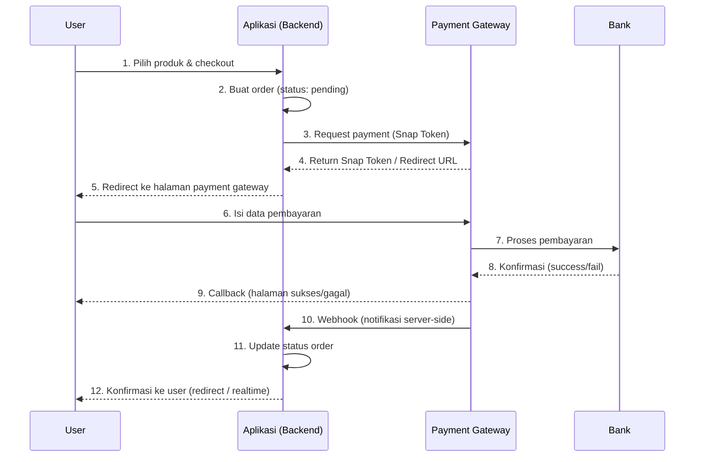

<!-- _class: title -->
# Sesi 01: Payment Basics — Midtrans Snap Integration

> **Tujuan:** Memahami payment flow, konsep payment gateway, perbedaan sandbox vs production, dan integrasi Midtrans Snap API.

## 📖 Materi

### 1. Payment Flow Overview

Flow pembayaran online umum terdiri dari 4 tahap:



**Penjelasan:**

- **Checkout (1-2):** User pilih produk, backend buat order dengan status `pending`
- **Payment Request (3-4):** Backend request token ke payment gateway
- **Redirect (5-6):** User diarahkan ke halaman payment gateway untuk bayar
- **Proses (7-8):** Gateway proses pembayaran via bank/VA/QRIS/dll
- **Callback (9):** Gateway redirect user kembali ke aplikasi (halaman sukses/gagal)
- **Webhook (10-11):** Gateway kirim notifikasi ke backend — **ini kritis** karena user bisa tutup browser sebelum callback
- **Konfirmasi (12):** Backend update status dan beri konfirmasi ke user

### 2. Payment Gateway Concepts

| Konsep | Penjelasan |
|--------|------------|
| **Payment Gateway** | Layanan pihak ketiga yang memproses transaksi (Midtrans, Xendit, Stripe) |
| **Snap** | Midtrans UI payment — modal/redirect yang handle semua metode pembayaran |
| **Core API** | API langsung dari Midtrans untuk charge, status, cancel, refund |
| **Direct Debit** | Debit langsung dari rekening bank user |
| **Virtual Account (VA)** | Nomor virtual account untuk transfer bank |
| **QRIS** | Standar QR code pembayaran Indonesia |
| **Invoice** | URL pembayaran yang bisa dikirim ke user (Xendit) |
| **Webhook** | HTTP callback dari gateway ke server aplikasi untuk notifikasi real-time |
| **Callback** | Redirect dari gateway ke frontend setelah pembayaran selesai |

### 3. Sandbox vs Production

| Aspek | Sandbox | Production |
|-------|---------|------------|
| **Server Key** | `SB-Mid-server-xxx` | `Mid-server-xxx` |
| **Client Key** | `SB-Mid-client-xxx` | `Mid-client-xxx` |
| **Base URL** | `https://app.sandbox.midtrans.com` | `https://app.midtrans.com` |
| **Uang** | Virtual — tidak real | Real |
| **Kartu** | Kartu test (`4111 1111 1111 1111`) | Kartu asli |
| **Rate Limit** | Lebih longgar | Strict |
| **Webhook** | Bisa test pake midtrans dashboard | Harus endpoint public (ngrok/deploy) |

### 4. Midtrans Snap API — Setup & Redirect Flow

#### 4.1 Instalasi

```bash
npm install midtrans-client
```

#### 4.2 Konfigurasi Midtrans Client

```javascript
// config/midtrans.js
const midtransClient = require('midtrans-client');

const snap = new midtransClient.Snap({
  isProduction: process.env.MIDTRANS_IS_PRODUCTION === 'true',
  serverKey: process.env.MIDTRANS_SERVER_KEY,
  clientKey: process.env.MIDTRANS_CLIENT_KEY,
});

const coreApi = new midtransClient.CoreApi({
  isProduction: process.env.MIDTRANS_IS_PRODUCTION === 'true',
  serverKey: process.env.MIDTRANS_SERVER_KEY,
  clientKey: process.env.MIDTRANS_CLIENT_KEY,
});

module.exports = { snap, coreApi };
```

#### 4.3 Environment Variables

```bash

---

# .env
MIDTRANS_SERVER_KEY=SB-Mid-server-your-server-key
MIDTRANS_CLIENT_KEY=SB-Mid-client-your-client-key
MIDTRANS_IS_PRODUCTION=false
MIDTRANS_PRODUCTION_SERVER_KEY=Mid-server-your-production-key
MIDTRANS_PRODUCTION_CLIENT_KEY=Mid-client-your-production-key
```

#### 4.4 Checkout Endpoint — Generate Snap Token

```javascript
// routes/payment.js
const express = require('express');
const router = express.Router();
const { snap } = require('../config/midtrans');
const { v4: uuidv4 } = require('uuid');

// Simple in-memory db (ganti dengan PostgreSQL nanti)
const transactions = [];

router.post('/checkout', async (req, res) => {
  try {
    const { productId, quantity, paymentMethod } = req.body;
    
    // TODO: ambil harga dari database
    const productPrice = 150000;
    const grossAmount = productPrice * quantity;
    const orderId = `ORDER-${Date.now()}-${uuidv4().slice(0, 8)}`;

    const parameter = {
      transaction_details: {
        order_id: orderId,
        gross_amount: grossAmount,
      },
      credit_card: {
        secure: true,
      },
      customer_details: {
        first_name: 'Budi',
        last_name: 'Santoso',
        email: 'budi@example.com',
        phone: '081234567890',
      },
    };

    const transaction = await snap.createTransaction(parameter);

    // Simpan transaksi ke database
    transactions.push({
      order_id: orderId,
      transaction_id: transaction.token,
      gross_amount: grossAmount,
      status: 'pending',
      created_at: new Date(),
    });

    res.json({
      success: true,
      data: {
        token: transaction.token,
        redirect_url: transaction.redirect_url,
        order_id: orderId,
      },
    });
  } catch (error) {
    console.error('Midtrans checkout error:', error);
    res.status(500).json({
      success: false,
      message: 'Gagal memproses checkout',
      error: error.message,
    });
  }
});

module.exports = router;
module.exports.transactions = transactions;
```

#### 4.5 Frontend — Redirect to Snap

```html
<!-- public/checkout.html -->
<!DOCTYPE html>
<html>
<head>
  <title>Checkout</title>
</head>
<body>
  <h1>Checkout</h1>
  <button id="pay-button">Bayar Sekarang</button>

  <script src="https://app.sandbox.midtrans.com/snap/snap.js"
          data-client-key="YOUR_CLIENT_KEY"></script>
  <script>
    document.getElementById('pay-button').onclick = function () {
      fetch('/api/payments/checkout', {
        method: 'POST',
        headers: { 'Content-Type': 'application/json' },
        body: JSON.stringify({
          productId: 'PROD-001',
          quantity: 2,
          paymentMethod: 'credit_card',
        }),
      })
        .then(res => res.json())
        .then(data => {
          if (data.success) {
            // Mode 1: Snap Modal (popup)
            snap.pay(data.data.token, {
              onSuccess: function (result) {
                console.log('Payment success:', result);
                window.location.href = '/success.html?order_id=' + data.data.order_id;
              },
              onPending: function (result) {
                console.log('Payment pending:', result);
              },
              onError: function (result) {
                console.error('Payment error:', result);
              },
              onClose: function () {
                console.log('User closed popup');
              },
            });
          }
        });
    };
  </script>
</body>
</html>
```

#### 4.6 Callback & Redirect Page

```javascript
// routes/payment.js — tambahkan
router.get('/status/:orderId', (req, res) => {
  const tx = transactions.find(t => t.order_id === req.params.orderId);
  if (!tx) {
    return res.status(404).json({ success: false, message: 'Transaksi tidak ditemukan' });
  }
  res.json({ success: true, data: tx });
});
```

### 5. Webhook Endpoint (Sederhana)

```javascript
// routes/webhook.js
const express = require('express');
const router = express.Router();

// Sementara — next session kita bahas verifikasi
router.post('/midtrans', (req, res) => {
  const notification = req.body;
  
  console.log('Webhook received:', notification);

  const { order_id, transaction_status, fraud_status } = notification;

  // Mapping status (detail di sesi 02)
  const statusMap = {
    capture: transaction_status === 'capture' && fraud_status === 'accept' ? 'success' : 'failed',
    settlement: 'success',
    pending: 'pending',
    deny: 'failed',
    expire: 'expired',
    cancel: 'failed',
  };

  const newStatus = statusMap[transaction_status] || 'unknown';

  // Update transaksi
  const tx = transactions.find(t => t.order_id === order_id);
  if (tx) {
    tx.status = newStatus;
    tx.updated_at = new Date();
    console.log(`Transaksi ${order_id} updated ke ${newStatus}`);
  }

  res.status(200).json({ status: 'ok' });
});

module.exports = router;
```

### 6. Integrasi ke app.js

```javascript
// app.js
const express = require('express');
const paymentRoutes = require('./routes/payment');
const webhookRoutes = require('./routes/webhook');

const app = express();

// Webhook harus raw body — jangan pakai express.json() untuk /webhook
app.use('/api/webhook', express.raw({ type: 'application/json' }), webhookRoutes);

// Routes lain pake express.json()
app.use(express.json());
app.use('/api/payments', paymentRoutes);
app.use(express.static('public'));

app.listen(3000, () => {
  console.log('Server running on port 3000');
});
```

> **Catatan:** Webhook handler perlu `express.raw()` karena signature verification butuh body mentah (raw). Kalau pake `express.json()`, body sudah diubah dan signature verification gagal.

## 🧪 Latihan

### Latihan 1: Setup Midtrans Sandbox

Buat akun Midtrans sandbox dan konfigurasi environment:

1. Daftar di [Midtrans Dashboard](https://dashboard.midtrans.com) (pilih sandbox)
2. Ambil `Server Key` dan `Client Key` dari menu Settings → Access Keys
3. Buat file `.env` dengan 4 variable Midtrans
4. Buat file `config/midtrans.js` export `snap` dan `coreApi`

**Output:** File `.env` terisi, file `config/midtrans.js` siap pakai.

### Latihan 2: Checkout Endpoint

Buat POST `/api/payments/checkout`:

1. Terima `{ productId, quantity, paymentMethod }`
2. Generate `order_id` format `INV-{timestamp}-{random}`
3. Set `gross_amount` dari harga produk (hardcode dulu)
4. Call `snap.createTransaction()` dengan parameter lengkap
5. Return `{ token, redirect_url, order_id }`
6. Simpan transaksi ke array (in-memory)

**Output:** Endpoint berfungsi, test dengan curl/Postman dapat token.

### Latihan 3: Frontend Snap Integration

Buat halaman HTML sederhana:

1. Tombol "Bayar Sekarang" trigger fetch ke `/api/payments/checkout`
2. Panggil `snap.pay()` dengan token dari response
3. Handle callback `onSuccess` → redirect ke `/success.html?order_id=...`
4. Handle `onError` dan `onClose`

**Output:** Flow lengkap: klik → fetch → popup snap → bayar → redirect.

### Latihan 4: Webhook Endpoint Sederhana

Buat POST `/api/webhook/midtrans`:

1. Terima raw JSON body dari Midtrans
2. Log notification yang diterima
3. Map `transaction_status` ke status internal (pending/success/failed/expired)
4. Update status transaksi di array
5. Return `200 OK`

**Output:** Webhook menerima notifikasi dan update status transaksi.

## 📝 Ringkasan

- Payment flow: checkout → gateway redirect → user bayar → webhook update status
- Snap API: paling mudah, handle UI pembayaran otomatis
- Sandbox vs Production: berbeda server key dan base URL
- Webhook: critical untuk update status real-time
- Jangan gunakan express.json() di route webhook — gunakan express.raw()

**Next:** Sesi 02 — Midtrans Core API & Xendit (charge, status, cancel, refund, webhook signature verification).
