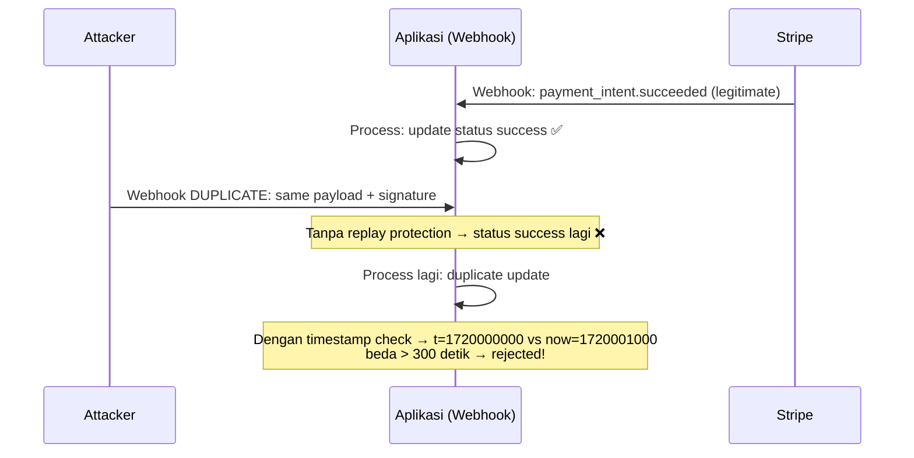

<!-- _class: title -->
# Sesi 03: Stripe Webhook

> **Tujuan:** Memahami integrasi Stripe (Checkout Session, Payment Intent), webhook Stripe dengan endpoint secret, event types, idempotency, dan keamanan webhook.

## 📖 Materi

### 1. Stripe Setup

#### 1.1 Instalasi & Konfigurasi

```bash
npm install stripe
```

```javascript
// config/stripe.js
const Stripe = require('stripe');

const stripe = new Stripe(process.env.STRIPE_SECRET_KEY, {
  apiVersion: '2025-02-24.acacia', // gunakan versi terbaru stabil
});

module.exports = stripe;
```

```bash

---

# .env
STRIPE_SECRET_KEY=sk_test_...
STRIPE_PUBLISHABLE_KEY=pk_test_...
STRIPE_WEBHOOK_SECRET=whsec_...
```

#### 1.2 Stripe API Version

Selalu pakai versi API stabil terbaru. Cek di [Stripe API Changelog](https://stripe.com/docs/api/versioning).

### 2. Checkout Session

Checkout Session adalah halaman pembayaran hosted oleh Stripe. User diarahkan ke URL Stripe, bayar, lalu redirect kembali.

```javascript
// routes/stripe-checkout.js
const express = require('express');
const router = express.Router();
const stripe = require('../config/stripe');

router.post('/create-checkout-session', async (req, res) => {
  try {
    const { priceId, quantity = 1, customerEmail } = req.body;

    const session = await stripe.checkout.sessions.create({
      mode: 'payment',
      line_items: [
        {
          price: priceId,     // price_xxx dari Stripe Dashboard
          quantity: quantity,
        },
      ],
      customer_email: customerEmail,
      success_url: `${process.env.APP_URL}/payment/success?session_id={CHECKOUT_SESSION_ID}`,
      cancel_url: `${process.env.APP_URL}/payment/cancel`,
      metadata: {
        order_id: `ORDER-${Date.now()}`,
        source: 'web',
      },
    });

    res.json({
      success: true,
      data: {
        session_id: session.id,
        url: session.url,
        metadata: session.metadata,
      },
    });
  } catch (error) {
    console.error('Stripe checkout error:', error);
    res.status(500).json({
      success: false,
      message: error.message,
    });
  }
});

module.exports = router;
```

**Response:**
```json
{
  "success": true,
  "data": {
    "session_id": "cs_test_...",
    "url": "https://checkout.stripe.com/c/pay/cs_test_...",
    "metadata": {
      "order_id": "ORDER-1712345678901",
      "source": "web"
    }
  }
}
```

#### Custom Domain (Opsional)

Stripe Checkout bisa pakai custom domain, tapi default domain Stripe sudah cukup untuk development.

### 3. Payment Intent

Payment Intent memberikan kontrol lebih (dibanding Checkout Session). Cocok untuk pembayaran dengan UI sendiri.

```javascript
// routes/stripe-payment-intent.js
const express = require('express');
const router = express.Router();
const stripe = require('../config/stripe');

router.post('/create-payment-intent', async (req, res) => {
  try {
    const { amount, currency = 'idr', paymentMethodType = 'card' } = req.body;

    const paymentIntent = await stripe.paymentIntents.create({
      amount: Math.round(amount * 100), // amount dalam sen
      currency: currency.toLowerCase(),  // 'idr', 'usd'
      payment_method_types: [paymentMethodType],
      metadata: {
        integration_check: 'accept_a_payment',
      },
    });

    res.json({
      success: true,
      data: {
        client_secret: paymentIntent.client_secret,
        payment_intent_id: paymentIntent.id,
        amount: paymentIntent.amount,
        currency: paymentIntent.currency,
        status: paymentIntent.status,
      },
    });
  } catch (error) {
    console.error('Create PaymentIntent error:', error);
    res.status(500).json({ success: false, message: error.message });
  }
});
```

**Client-side dengan Stripe.js:**

```html
<script src="https://js.stripe.com/v3/"></script>
<script>
  const stripe = Stripe('pk_test_...');

  async function initialize() {
    const response = await fetch('/api/stripe/create-payment-intent', {
      method: 'POST',
      headers: { 'Content-Type': 'application/json' },
      body: JSON.stringify({ amount: 150000, currency: 'idr' }),
    });
    const { data } = await response.json();

    const elements = stripe.elements({ clientSecret: data.client_secret });
    const paymentElement = elements.create('payment');
    paymentElement.mount('#payment-element');

    document.getElementById('submit').onclick = async () => {
      const { error } = await stripe.confirmPayment({
        elements,
        confirmParams: {
          return_url: 'https://yourapp.com/payment/success',
        },
      });

      if (error) {
        console.error('Payment failed:', error.message);
      }
    };
  }

  initialize();
</script>
```

### 4. Stripe Webhook

#### 4.1 Setup Webhook Endpoint

```javascript
// routes/stripe-webhook.js
const express = require('express');
const router = express.Router();
const stripe = require('../config/stripe');

// Stripe webhook — harus raw body, endpoint secret diverifikasi
router.post('/stripe', express.raw({ type: 'application/json' }), async (req, res) => {
  const sig = req.headers['stripe-signature'];
  const endpointSecret = process.env.STRIPE_WEBHOOK_SECRET;

  let event;

  // 1. Verifikasi signature
  try {
    event = stripe.webhooks.constructEvent(
      req.body,      // raw body
      sig,           // signature header
      endpointSecret
    );
  } catch (err) {
    console.error('Stripe webhook signature verification failed:', err.message);
    return res.status(400).send(`Webhook Error: ${err.message}`);
  }

  // 2. Handle event berdasarkan tipe
  try {
    switch (event.type) {
      case 'checkout.session.completed': {
        const session = event.data.object;
        await handleCheckoutCompleted(session);
        break;
      }
      case 'checkout.session.expired': {
        const session = event.data.object;
        await handleCheckoutExpired(session);
        break;
      }
      case 'payment_intent.succeeded': {
        const paymentIntent = event.data.object;
        await handlePaymentSucceeded(paymentIntent);
        break;
      }
      case 'payment_intent.payment_failed': {
        const paymentIntent = event.data.object;
        await handlePaymentFailed(paymentIntent);
        break;
      }
      default:
        console.log(`Unhandled event type: ${event.type}`);
    }

    res.json({ received: true });
  } catch (error) {
    console.error(`Error processing event ${event.type}:`, error);
    res.status(200).json({ received: true, error: true });
  }
});

async function handleCheckoutCompleted(session) {
  const { metadata, payment_intent, amount_total, currency } = session;

  const transaction = {
    order_id: metadata.order_id,
    stripe_session_id: session.id,
    stripe_payment_intent: payment_intent,
    amount: amount_total / 100, // dari sen ke rupiah
    currency: currency,
    status: 'success',
    paid_at: new Date(),
  };

  // TODO: simpan ke database
  // await db('transactions').where({ order_id: metadata.order_id }).update(transaction);
  console.log('Checkout completed:', transaction);
}

async function handleCheckoutExpired(session) {
  // Update status ke expired
  console.log('Checkout expired:', session.id);
}

async function handlePaymentSucceeded(paymentIntent) {
  console.log('Payment succeeded:', paymentIntent.id);
}

async function handlePaymentFailed(paymentIntent) {
  console.log('Payment failed:', paymentIntent.id);
}

module.exports = router;
```

#### 4.2 Event Types Penting

| Event | Trigger | Aksi |
|-------|---------|------|
| `checkout.session.completed` | User selesai bayar via Checkout Session | Update status success, kirim konfirmasi |
| `checkout.session.expired` | Session tidak dibayar dalam 24 jam | Update status expired |
| `checkout.session.async_payment_succeeded` | Pembayaran tertunda sukses (e.g., transfer bank) | Update status success |
| `checkout.session.async_payment_failed` | Pembayaran tertunda gagal | Update status failed |
| `payment_intent.succeeded` | Payment Intent sukses | Update status success |
| `payment_intent.payment_failed` | Payment Intent gagal | Update status failed |
| `payment_intent.amount_capturable_updated` | Pembayaran menunggu capture | Update status pending |

### 5. Webhook Security

#### 5.1 Signature Verification

Stripe menggunakan HMAC-SHA256 untuk signature. `stripe.webhooks.constructEvent()` handle verifikasi:

- Baca header `stripe-signature`
- Parse timestamp dan signature
- Generate HMAC dengan endpoint secret
- Compare signature
- **Replay protection:** cek timestamp dalam tolerance (default 5 menit)

```javascript
// Manual signature verification (jika perlu)
const crypto = require('crypto');

function verifyStripeSignature(payload, sigHeader, secret) {
  const parts = sigHeader.split(',');
  const timestamp = parts.find(p => p.startsWith('t=')).split('=')[1];
  const signatures = parts.filter(p => p.startsWith('v1=')).map(p => p.split('=')[1]);

  const signedPayload = `${timestamp}.${payload.toString()}`;
  const expectedSig = crypto
    .createHmac('sha256', secret)
    .update(signedPayload)
    .digest('hex');

  if (!signatures.includes(expectedSig)) {
    throw new Error('Invalid signature');
  }

  // Replay protection — cek timestamp dalam 5 menit
  const now = Math.floor(Date.now() / 1000);
  if (Math.abs(now - parseInt(timestamp)) > 300) {
    throw new Error('Timestamp out of tolerance — possible replay attack');
  }

  return true;
}
```

#### 5.2 Replay Protection

Apa itu replay attack?



**Cara Stripe handle:**
1. `t=` timestamp: waktu Stripe generate event
2. Webhook endpoint cek: `now - t <= 300 detik`
3. Jika lebih dari 5 menit → tolak

### 6. Idempotency Key

Idempotency mencegah duplicate processing dari event yang sama.

#### 6.1 Stripe Native Idempotency

Stripe API mendukung idempotency key via header:

```javascript
// Stripe otomatis handle idempotency untuk API calls
// Tapi untuk webhook handler, kita harus handle sendiri
async function createPaymentIntentWithIdempotency(amount, idempotencyKey) {
  try {
    const paymentIntent = await stripe.paymentIntents.create(
      {
        amount: amount,
        currency: 'idr',
      },
      {
        idempotencyKey: idempotencyKey,
      }
    );
    return paymentIntent;
  } catch (error) {
    if (error.type === 'StripeIdempotencyError') {
      console.log('Idempotency key conflict:', error.message);
      // Key sudah digunakan dengan parameter berbeda
    }
    throw error;
  }
}
```

#### 6.2 Webhook Idempotency — Manual

Untuk webhook, kita harus simpan `event.id` yang sudah diproses:

```javascript
// middleware/idempotency.js
/**
 * Middleware idempotency untuk webhook
 * Menyimpan event_id yang sudah diproses di Redis/DB
 */
async function webhookIdempotency(req, res, next) {
  // Assumes event.id tersedia setelah signature verification
  if (req.body && req.body.id) {
    const eventId = req.body.id;
    
    // Cek apakah event sudah diproses
    const processed = await checkEventProcessed(eventId);
    if (processed) {
      console.log(`Duplicate webhook event: ${eventId} — skipping`);
      // Return 200 biaya Stripe tidak retry
      return res.status(200).json({ received: true, duplicate: true });
    }

    // Tandai sedang diproses (lock)
    await markEventProcessing(eventId);
    next();

    // Setelah response, tandai selesai
    res.on('finish', async () => {
      if (res.statusCode === 200) {
        await markEventProcessed(eventId);
      } else {
        await clearEventLock(eventId); // unlock untuk retry
      }
    });
  } else {
    next();
  }
}

// ——— Implementasi dengan Redis ———
const redis = require('redis');
const client = redis.createClient();

async function checkEventProcessed(eventId) {
  const result = await client.get(`webhook:${eventId}`);
  return result === 'done';
}

async function markEventProcessing(eventId) {
  // SET NX — Redis atomic: set jika belum ada
  const set = await client.set(`webhook:${eventId}`, 'processing', {
    NX: true,
    EX: 60, // expire 60 detik — safety jika handler crash
  });
  return set === 'OK';
}

async function markEventProcessed(eventId) {
  await client.set(`webhook:${eventId}`, 'done', {
    EX: 86400, // expire 24 jam
  });
}

async function clearEventLock(eventId) {
  await client.del(`webhook:${eventId}`);
}
```

#### 6.3 Idempotency di Database (SQL)

Alternatif tanpa Redis — pakai unique constraint:

```sql
-- Buat tabel untuk menyimpan processed events
CREATE TABLE processed_webhooks (
  id SERIAL PRIMARY KEY,
  event_id VARCHAR(255) NOT NULL UNIQUE,
  gateway VARCHAR(50) NOT NULL,
  event_type VARCHAR(100),
  status VARCHAR(20) DEFAULT 'processing',  -- processing | done | failed
  processed_at TIMESTAMP DEFAULT NOW(),
  UNIQUE(event_id)
);

-- Index untuk lookup cepat
CREATE INDEX idx_processed_webhooks_event_id ON processed_webhooks(event_id);
```

```javascript
// Implementasi dengan PostgreSQL
async function processEventUnique(eventId, gateway, processingFn) {
  const client = await pool.connect();

  try {
    await client.query('BEGIN');

    // Insert dengan ON CONFLICT — atomic
    const result = await client.query(
      `INSERT INTO processed_webhooks (event_id, gateway, status)
       VALUES ($1, $2, 'processing')
       ON CONFLICT (event_id) DO UPDATE SET status = processed_webhooks.status
       RETURNING status`,
      [eventId, gateway]
    );

    // Jika sudah 'done', skip
    if (result.rows[0].status === 'done') {
      await client.query('ROLLBACK');
      return { skipped: true };
    }

    // Proses event
    const resultData = await processingFn();

    // Tandai selesai
    await client.query(
      `UPDATE processed_webhooks SET status = 'done' WHERE event_id = $1`,
      [eventId]
    );

    await client.query('COMMIT');
    return resultData;
  } catch (error) {
    await client.query('ROLLBACK');
    throw error;
  } finally {
    client.release();
  }
}
```

## 🧪 Latihan

### Latihan 1: Stripe Checkout Session

Buat endpoint POST `/api/stripe/create-checkout-session`:

1. Setup Stripe dengan secret key (mode test)
2. Buat Checkout Session dengan 1 produk (hardcode priceId)
3. Set success_url dan cancel_url
4. Tambahkan metadata order_id
5. Return session URL

**Output:** Endpoint return URL Stripe Checkout. Buka di browser, bisa bayar dengan kartu test Stripe (4242 4242 4242 4242).

### Latihan 2: Stripe Payment Intent + Client

Buat flow pembayaran dengan Payment Intent:

1. Backend: POST `/api/stripe/create-payment-intent` — return `client_secret`
2. Frontend: render Stripe Elements (Card / Payment Element)
3. Client-side: confirmPayment dengan Stripe.js
4. Handle success dan error di frontend

**Output:** Form pembayaran dengan Stripe Elements, bisa input kartu dan bayar.

### Latihan 3: Stripe Webhook Handler

Buat webhook endpoint POST `/api/webhook/stripe`:

1. Pakai `express.raw()` — jangan `express.json()`
2. Verifikasi signature dengan `stripe.webhooks.constructEvent()`
3. Handle 3 event types: `checkout.session.completed`, `payment_intent.succeeded`, `payment_intent.payment_failed`
4. Untuk setiap event, log detail dan return 200

**Output:** Webhook menerima event dari Stripe, memverifikasi signature, dan memproses event.

### Latihan 4: Idempotency with Redis/DB

Implementasi idempotency di webhook handler:

1. Buat middleware `webhookIdempotency` yang cek event_id
2. Cek apakah event_id sudah diproses (di Redis atau DB)
3. Jika sudah → return 200 (skip)
4. Jika baru → proses, simpan event_id
5. Test dengan mengirim event Stripe yang sama 2 kali

**Output:** Event Stripe yang sama hanya diproses sekali. Request duplikat di-skip.

## 📝 Ringkasan

- Checkout Session: hosted payment page — paling mudah diintegrasi
- Payment Intent: kontrol lebih — cocok untuk custom UI
- Webhook security: constructEvent verifikasi signature + replay protection
- Event types: checkout.session.completed, payment_intent.succeeded, dll
- Idempotency: critical di production untuk mencegah duplicate processing
- Redis/DB idempotency: simpan event_id yang sudah diproses

**Next:** Sesi 04 — Production Payment (DB schema, idempotency & race condition, retry & reconciliation, PCI compliance).
