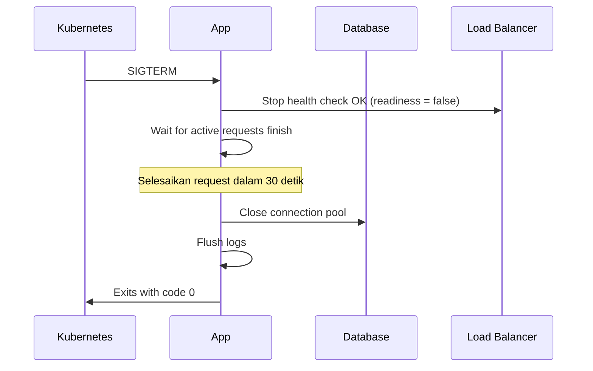

<!-- _class: title -->
# 41.3 Health Check & Monitoring

## Kenapa Health Check?

Production app musti siap mati kapan aja — restart, scaling, deploy. Health check ngasih tau orchestrator (Kubernetes, Docker, load balancer) kapan aplikasi siap nerima traffic.

**Dua jenis probe:**

| Probe | Fungsi | Kalo Gagal |
|-------|--------|-----------|
| **Liveness** (`/healthz`) | Apakah app masih hidup? Ga hang? | Container di-restart |
| **Readiness** (`/readyz`) | Apakah app siap nerima traffic? | Traffic dialihkan |

**Contoh kasus:**

- App jalan tapi DB mati → liveness OK (proses jalan), readiness FAIL (ga bisa serve request)
- App memory leak → liveness FAIL (app ga responsif), container direstart
- Cold start butuh 10 detik → readiness FAIL sampe app siap

## Endpoint /healthz (Liveness)

Check simpel — apakah proses app masih jalan.

```typescript
// src/routes/health.ts
import { Router, Request, Response } from 'express';

const router = Router();

// Liveness — cuma check app jalan
router.get('/healthz', (_req: Request, res: Response) => {
  res.status(200).json({
    status: 'ok',
    timestamp: new Date().toISOString(),
    uptime: process.uptime(),
  });
});

export default router;
```

```typescript
// src/index.ts
import healthRouter from './routes/health';
app.use(healthRouter);
```

## Endpoint /readyz (Readiness)

Check dependensi beneran — DB, Redis, external API.

```typescript
// src/routes/health.ts (lanjutan)
import { Router, Request, Response } from 'express';
import { Pool } from 'pg';
import { createClient } from 'redis';

const router = Router();

interface HealthCheck {
  name: string;
  status: 'ok' | 'error';
  error?: string;
  latency?: number;
}

// Readiness — check dependensi
router.get('/readyz', async (_req: Request, res: Response) => {
  const checks: HealthCheck[] = [];

  // Check PostgreSQL
  const pgPool = new Pool({ connectionString: process.env.DATABASE_URL });
  const pgStart = Date.now();
  try {
    await pgPool.query('SELECT 1');
    checks.push({ name: 'postgres', status: 'ok', latency: Date.now() - pgStart });
  } catch (err) {
    checks.push({
      name: 'postgres',
      status: 'error',
      error: err.message,
      latency: Date.now() - pgStart,
    });
  } finally {
    await pgPool.end();
  }

  // Check Redis
  if (process.env.REDIS_URL) {
    const redis = createClient({ url: process.env.REDIS_URL });
    const redisStart = Date.now();
    try {
      await redis.connect();
      await redis.ping();
      checks.push({ name: 'redis', status: 'ok', latency: Date.now() - redisStart });
    } catch (err) {
      checks.push({
        name: 'redis',
        status: 'error',
        error: err.message,
        latency: Date.now() - redisStart,
      });
    } finally {
      await redis.disconnect();
    }
  }

  // Check external API
  if (process.env.EXTERNAL_API_URL) {
    const apiStart = Date.now();
    try {
      const response = await fetch(`${process.env.EXTERNAL_API_URL}/health`);
      if (response.ok) {
        checks.push({ name: 'external-api', status: 'ok', latency: Date.now() - apiStart });
      } else {
        checks.push({
          name: 'external-api',
          status: 'error',
          error: `HTTP ${response.status}`,
          latency: Date.now() - apiStart,
        });
      }
    } catch (err) {
      checks.push({
        name: 'external-api',
        status: 'error',
        error: err.message,
        latency: Date.now() - apiStart,
      });
    }
  }

  // Overall status
  const allOk = checks.every(c => c.status === 'ok');
  const statusCode = allOk ? 200 : 503;

  res.status(statusCode).json({
    status: allOk ? 'ok' : 'degraded',
    timestamp: new Date().toISOString(),
    uptime: process.uptime(),
    checks,
  });
});

export default router;
```

## Dependency Check Pattern — Best Practices

### Timeout per Check

Jangan biarin satu check lambat nahan yang lain.

```typescript
async function checkWithTimeout<T>(
  name: string,
  fn: () => Promise<T>,
  timeoutMs = 3000
): Promise<HealthCheck> {
  const start = Date.now();
  try {
    const result = await Promise.race([
      fn(),
      new Promise<never>((_, reject) =>
        setTimeout(() => reject(new Error('Timeout')), timeoutMs)
      ),
    ]);
    return { name, status: 'ok', latency: Date.now() - start };
  } catch (err) {
    return { name, status: 'error', error: err.message, latency: Date.now() - start };
  }
}

// Pake:
const pgCheck = await checkWithTimeout('postgres', () => pgPool.query('SELECT 1'));
```

### Concurrent Checks

Check dependensi parallel, bukan sequential.

```typescript
const [pgResult, redisResult, apiResult] = await Promise.all([
  checkPostgres(),
  checkRedis(),
  checkExternalAPI(),
]);
```

## Graceful Shutdown

Kalo app di-terminate (SIGTERM / SIGINT), jangan langsung mati. Kasih waktu buat:

1. Berhenti nerima request baru
2. Selesaikan request yang lagi jalan
3. Tutup koneksi DB, Redis, dll.
4. Flush log

```typescript
// src/index.ts
import express from 'express';
import logger from './lib/logger';
import { Pool } from 'pg';
import { createClient } from 'redis';

const app = express();
const server = app.listen(PORT, () => {
  logger.info({ port: PORT }, 'Server started');
});

// Graceful shutdown
async function gracefulShutdown(signal: string) {
  logger.info({ signal }, 'Received shutdown signal');

  // 1. Stop accept new connections
  server.close(() => {
    logger.info('HTTP server closed');
  });

  // 2. Wait for active requests (max 30 detik)
  const forceExit = setTimeout(() => {
    logger.error('Forced shutdown after timeout');
    process.exit(1);
  }, 30000);

  try {
    // 3. Close database connections
    await pgPool.end();
    logger.info('PostgreSQL pool closed');

    // 4. Close Redis
    await redisClient.disconnect();
    logger.info('Redis disconnected');

    // 5. Flush log
    await logger.flush?.();

    clearTimeout(forceExit);
    process.exit(0);
  } catch (err) {
    logger.error({ err }, 'Error during graceful shutdown');
    process.exit(1);
  }
}

// Listen for signals
process.on('SIGTERM', () => gracefulShutdown('SIGTERM'));
process.on('SIGINT', () => gracefulShutdown('SIGINT'));
```

### Connection Draining Pattern



## Monitoring Dashboard — express-status-monitor

Pasang dashboard realtime buat liat request rate, response time, status code, dll.

```bash
npm install express-status-monitor
```

```typescript
// src/index.ts
import statusMonitor from 'express-status-monitor';

app.use(statusMonitor({
  title: 'Express Status',      // Judul dashboard
  path: '/status',               // Dashboard URL
  spans: [
    { interval: 1, retention: 60 },    // 1 detik, simpan 60 data
    { interval: 5, retention: 60 },    // 5 detik, simpan 60 data
    { interval: 15, retention: 60 },   // 15 detik, simpan 60 data
  ],
  chartVisibility: {
    cpu: true,
    memory: true,
    load: true,
    eventLoop: true,
    heap: true,
    responseTime: true,
    rps: true,
    statusCodes: true,
  },
  healthChecks: [
    { protocol: 'http', host: 'localhost', path: '/healthz', port: PORT },
    { protocol: 'http', host: 'localhost', path: '/readyz', port: PORT },
  ],
}));
```

**Dashboard available di:** `http://localhost:3000/status`

Fitur:
- **CPU & Memory usage** — realtime chart
- **Request per second** — throughput
- **Response time** — avg, max, min
- **Status codes** — breakdown 2xx, 3xx, 4xx, 5xx
- **Health check status** — hijau/merah

**⚠️ Proteksi:** Dashboard expose informasi sensitif. Jangan lupa auth middleware:

```typescript
// Proteksi dashboard middleware
app.use('/status', (req, res, next) => {
  const token = req.headers['authorization'];
  if (token !== `Bearer ${process.env.STATUS_MONITOR_TOKEN}`) {
    return res.status(401).json({ error: 'Unauthorized' });
  }
  next();
});
app.use(statusMonitor({...}));
```

## K8s Probe Integration

Kalo app di-deploy ke Kubernetes, config probe-nya:

```yaml

---

# deployment.yaml
apiVersion: apps/v1
kind: Deployment
spec:
  template:
    spec:
      containers:
        - name: my-app
          ports:
            - containerPort: 3000
          livenessProbe:
            httpGet:
              path: /healthz
              port: 3000
            initialDelaySeconds: 5
            periodSeconds: 10
            timeoutSeconds: 3
            failureThreshold: 3
          readinessProbe:
            httpGet:
              path: /readyz
              port: 3000
            initialDelaySeconds: 10
            periodSeconds: 5
            timeoutSeconds: 3
            failureThreshold: 2
```

## Latihan

1. Buat endpoint `/healthz` (liveness) dan `/readyz` (readiness). Liveness return `{ status: 'ok', uptime }`. Readiness check PostgreSQL (SELECT 1) + Redis (PING) dengan timeout 2 detik per check. Tulis kode lengkap + contoh response sukses dan gagal.

2. Implementasikan graceful shutdown handler: tangkap SIGTERM & SIGINT, stop HTTP server, close koneksi DB + Redis, beri waktu maksimal 20 detik. Tulis kode lengkap dengan logging tiap step. Sertakan mermaid sequence diagram.

3. Pasang express-status-monitor dashboard di `/admin/status`. Proteksi dashboard dengan Bearer token dari env `STATUS_TOKEN`. Konfigurasi health checks untuk /healthz dan /readyz. Tulis kode setup + middleware auth.

4. Buat K8s probe config (YAML) yang pake /healthz untuk liveness dan /readyz untuk readiness. Jelaskan perbedaan parameter: initialDelaySeconds, periodSeconds, timeoutSeconds, failureThreshold untuk masing-masing probe. Kapan pake nilai agresif vs konservatif?
