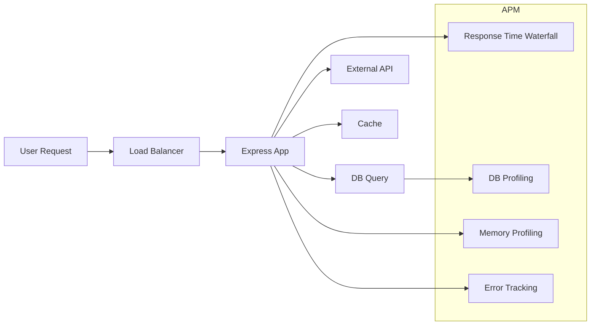

<!-- _class: title -->
# 41.4 Production Monitoring

## Uptime Monitoring

Health check endpoint aja ga cukup — kalo app mati total, health check juga ikut mati. Butuh **external monitoring** yang ngecek dari luar.

### Pilihan Tools

| Tool | Deployment | Harga | Fitur |
|------|-----------|-------|-------|
| **Uptime Kuma** | Self-hosted | Gratis | Open source, banyak notifikasi, status page |
| **Upstash Monitor** | Managed cloud | Gratis tier | Serverless, cron-based, Slack/email/webhook |
| **UptimeRobot** | Managed cloud | Free: 50 monitor | Simple, mature, banyak integrasi |
| **Better Uptime** | Managed cloud | Paid | Status page + on-call scheduling |
| **Checkly** | Managed cloud | Paid | Playwright-based, browser check |

### Rekomendasi

- **Personal/side project:** Uptime Kuma (self-host pake Docker) atau UptimeRobot (free tier)
- **Production tim:** Better Uptime atau Checkly (browser check beneran)

### Setup Uptime Kuma

```bash

---

# Docker
docker run -d --name uptime-kuma \
  -p 3001:3001 \
  -v uptime-kuma-data:/app/data \
  louislam/uptime-kuma:latest
```

Buka `http://localhost:3001` → buat akun → add monitor:

| Setting | Isi |
|---------|-----|
| Monitor Type | HTTP(s) |
| URL | `https://api.example.com/healthz` |
| Interval | 60 detik |
| Retries | 3 |
| Notification | Slack / Discord / Email |

### Setup Upstash Monitor

```bash

---

# CLI
npx @upstash/monitor-cli add \
  --url https://api.example.com/healthz \
  --interval 60s \
  --notify slack
```

### Generate Status Page

Buat halaman publik yang nunjukin status semua service.

```html
<!-- Contoh sederhana — polling /healthz -->
<!DOCTYPE html>
<html>
<head>
  <title>System Status</title>
  <style>
    .ok { color: green; }
    .error { color: red; }
  </style>
</head>
<body>
  <h1>🟢 System Status</h1>
  <div id="checks"></div>

  <script>
    async function checkHealth() {
      const services = [
        { name: 'API', url: '/healthz' },
        { name: 'Database', url: '/readyz' },
      ];

      const checksEl = document.getElementById('checks');
      checksEl.innerHTML = '';

      for (const svc of services) {
        try {
          const res = await fetch(svc.url);
          const data = await res.json();
          checksEl.innerHTML += `<p class="${data.status === 'ok' ? 'ok' : 'error'}">
            ${data.status === 'ok' ? '✅' : '❌'} ${svc.name}: ${data.status}
          </p>`;
        } catch {
          checksEl.innerHTML += `<p class="error">❌ ${svc.name}: unreachable</p>`;
        }
      }
    }

    checkHealth();
    setInterval(checkHealth, 30000);
  </script>
</body>
</html>
```

## Alerting

Bukan cuma tau ada error — **harus dikasih tau** pas terjadi.

### Alert Channels

| Channel | Cocok buat | Latency |
|---------|-----------|---------|
| **Email** | Non-urgent, report harian | 1-5 menit |
| **Slack webhook** | Team notification | ~detik |
| **Discord webhook** | Team notification | ~detik |
| **PagerDuty/Opsgenie** | On-call, urgent | ~detik |
| **SMS/Phone** | Critical, 24/7 | ~menit |

### Slack Webhook

```typescript
// src/lib/alert.ts
import logger from './logger';

const SLACK_WEBHOOK_URL = process.env.SLACK_WEBHOOK_URL;

interface AlertPayload {
  title: string;
  message: string;
  severity: 'critical' | 'warning' | 'info';
  service: string;
  timestamp: string;
  metadata?: Record<string, unknown>;
}

export async function sendSlackAlert(payload: AlertPayload) {
  if (!SLACK_WEBHOOK_URL) {
    logger.warn('SLACK_WEBHOOK_URL not set, skipping alert');
    return;
  }

  const color = payload.severity === 'critical' ? '#FF0000'
               : payload.severity === 'warning' ? '#FFA500'
               : '#3498DB';

  const blocks = [
    {
      type: 'header',
      text: { type: 'plain_text', text: `🚨 ${payload.title}` },
    },
    {
      type: 'section',
      fields: [
        { type: 'mrkdwn', text: `*Service:*\n${payload.service}` },
        { type: 'mrkdwn', text: `*Severity:*\n${payload.severity}` },
        { type: 'mrkdwn', text: `*Time:*\n${payload.timestamp}` },
      ],
    },
    { type: 'section', text: { type: 'mrkdwn', text: payload.message } },
  ];

  if (payload.metadata) {
    blocks.push({
      type: 'section',
      fields: Object.entries(payload.metadata).map(([k, v]) => ({
        type: 'mrkdwn',
        text: `*${k}:*\n${v}`,
      })),
    });
  }

  try {
    await fetch(SLACK_WEBHOOK_URL, {
      method: 'POST',
      headers: { 'Content-Type': 'application/json' },
      body: JSON.stringify({ attachments: [{ color, blocks }] }),
    });
    logger.info({ severity: payload.severity }, 'Alert sent to Slack');
  } catch (err) {
    logger.error({ err }, 'Failed to send Slack alert');
  }
}
```

### Discord Webhook

```typescript
export async function sendDiscordAlert(payload: AlertPayload) {
  const webhookUrl = process.env.DISCORD_WEBHOOK_URL;
  if (!webhookUrl) return;

  const color = payload.severity === 'critical' ? 0xFF0000
               : payload.severity === 'warning' ? 0xFFA500
               : 0x3498DB;

  const embed = {
    title: payload.title,
    description: payload.message,
    color,
    fields: [
      { name: 'Service', value: payload.service, inline: true },
      { name: 'Severity', value: payload.severity, inline: true },
      { name: 'Time', value: payload.timestamp, inline: true },
    ],
    timestamp: payload.timestamp,
  };

  try {
    await fetch(webhookUrl, {
      method: 'POST',
      headers: { 'Content-Type': 'application/json' },
      body: JSON.stringify({ embeds: [embed] }),
    });
  } catch (err) {
    logger.error({ err }, 'Failed to send Discord alert');
  }
}
```

### Alert Threshold Logic

```typescript
// src/lib/alertManager.ts
import logger from './logger';
import { sendSlackAlert } from './alert';

class AlertManager {
  private errorCounts = new Map<string, { count: number; windowStart: number }>();
  private readonly windowMs = 5 * 60 * 1000;  // 5 menit
  private readonly threshold = 10;              // 10 error dalam 5 menit

  recordError(service: string, errorMessage: string) {
    const now = Date.now();
    const key = service;

    let record = this.errorCounts.get(key);
    if (!record || now - record.windowStart > this.windowMs) {
      record = { count: 0, windowStart: now };
    }

    record.count++;
    this.errorCounts.set(key, record);

    if (record.count >= this.threshold) {
      sendSlackAlert({
        title: 'Error Rate Threshold Breached',
        message: `${service} has ${record.count} errors in 5 minutes. Last: ${errorMessage}`,
        severity: 'critical',
        service,
        timestamp: new Date().toISOString(),
        metadata: { errorCount: record.count, windowMinutes: this.windowMs / 60000 },
      });

      // Reset counter
      this.errorCounts.set(key, { count: 0, windowStart: now });
    }
  }
}

export const alertManager = new AlertManager();

// Pake:
app.use((err, req, res, next) => {
  alertManager.recordError('api', err.message);
  next(err);
});
```

## APM — Application Performance Monitoring

APM = ngeliat **kenapa** aplikasi lambat, bukan cuma tau kalo lambat.

### Components



### Response Time Waterfall

Breakdown waktu tiap span dalam satu request:

```
GET /api/orders/123  →  total: 850ms
├── Middleware          15ms
├── Auth check          22ms
├── DB query (orders)  320ms  ← bottleneck
├── DB query (items)   280ms  ← bottleneck
├── External API call  180ms
└── Response serialize  33ms
```

**Cara baca:**
- Cari span paling panjang → itu bottleneck
- Bandingin p50 vs p99 — kalo p99 jauh lebih besar, ada request yang outlier
- DB query lambat? Tambah index atau cache
- External API lambat? Set timeout lebih ketat atau pake circuit breaker

### DB Query Profiling

Jangan tebak — ukur query mana yang lambat.

```typescript
// Prisma middleware — log query lambat
import { PrismaClient } from '@prisma/client';

const prisma = new PrismaClient();

prisma.$use(async (params, next) => {
  const start = Date.now();
  const result = await next(params);
  const duration = Date.now() - start;

  if (duration > 100) {
    // Log query yang lambat (>100ms)
    logger.warn({
      model: params.model,
      action: params.action,
      duration: `${duration}ms`,
      args: JSON.stringify(params.args).slice(0, 200),
    }, 'Slow database query');
  }

  return result;
});
```

### Memory Leak Detection

Memory leak = memory usage naek terus ga pernah turun.

```typescript
// Memory usage monitoring
function logMemoryUsage() {
  const used = process.memoryUsage();
  logger.info({
    rss: `${Math.round(used.rss / 1024 / 1024)}MB`,
    heapTotal: `${Math.round(used.heapTotal / 1024 / 1024)}MB`,
    heapUsed: `${Math.round(used.heapUsed / 1024 / 1024)}MB`,
    external: `${Math.round(used.external / 1024 / 1024)}MB`,
  }, 'Memory usage');
}

// Log setiap 5 menit
setInterval(logMemoryUsage, 5 * 60 * 1000);

// Alert kalo heapUsed > 500MB
setInterval(() => {
  const heapUsedMB = process.memoryUsage().heapUsed / 1024 / 1024;
  if (heapUsedMB > 500) {
    sendSlackAlert({
      title: 'High Memory Usage',
      message: `Heap usage at ${Math.round(heapUsedMB)}MB`,
      severity: 'warning',
      service: 'api',
      timestamp: new Date().toISOString(),
      metadata: { heapUsed: `${Math.round(heapUsedMB)}MB` },
    });
  }
}, 60000);
```

### Common APM Tools

| Tool | Deployment | Fitur Utama |
|------|-----------|------------|
| **Sentry Performance** | Managed | Tracing + error dalam satu platform |
| **Datadog APM** | Managed | Waterfall, dashboard, integration 700+ |
| **New Relic** | Managed | Distributed tracing, AI insights |
| **OpenTelemetry** | Self-hosted | Open standard, vendor-agnostic |
| **Grafana + Tempo** | Self-hosted | Traces + metrics + logs satu atap |

## Incident Response Checklist

Kalo production down — jangan panik. Ikutin checklist.

### 🚨 1. Detect & Triage

```
□ Apakah benar ini incident? (bukan false alarm)
□ Service mana yang kena? (API, DB, Worker, dll)
□ Severity level? (critical / major / minor)
□ Berapa impact? (semua user? fitur tertentu?)
```

**Severity Levels:**

| Level | Definisi | Response Time |
|-------|----------|--------------|
| **P0 — Critical** | Semua user ga bisa akses, data loss | < 15 menit |
| **P1 — Major** | Fitur utama broken, sebagian user | < 1 jam |
| **P2 — Minor** | Fitur non-krusial broken, ga ada workaround | < 4 jam |
| **P3 — Low** | Bug kecil, ada workaround | Next sprint |

### 📢 2. Communicate

```
□ Notify team via Slack/Discord (buat channel #incident)
□ Update status page (jika ada)
□ Assign incident lead
□ Start incident channel / thread
```

**Template pesan:**

```
🚨 INCIDENT: [TITLE]
Service: API
Severity: P1
Start time: 14:30 UTC
Impact: Order creation broken for all users
Status: INVESTIGATING
Lead: @midory
```

### 🔍 3. Investigate

```
□ Cek Sentry — error baru? release mana?
□ Cek logs — pake grep / jq cari pola error
□ Cek metrics — CPU, memory, request rate spike?
□ Cek DB — slow queries, connections, replication lag
□ Cek external API — apakah upstream down?
□ Cek recent deploy / config change
□ Rollback if needed — kembalikan ke release sebelumnya
```

### 🔧 4. Mitigate & Resolve

```
□ Apply hotfix / rollback
□ Restart service jika perlu
□ Scale up jika traffic spike
□ Clear cache jika data corrupt
□ Verify fix — test endpoint health
□ Monitor after fix — liat sentry, logs, metrics 15 menit
```

### ✅ 5. Follow Up

```
□ Update status page → RESOLVED
□ Write postmortem dalam 24 jam
   - Timeline (detect → investigate → fix → resolve)
   - Root cause analysis (5 Whys)
   - Action items (prevent recurrence)
   - What went well / what went wrong
□ Schedule action items ke sprint berikutnya
□ Share postmortem ke team
```

### Template Postmortem

```markdown

---

# Postmortem: [Title]

**Date:** 2025-03-20
**Severity:** P1
**Duration:** 47 minutes (14:30 — 15:17 UTC)
**Impact:** 12,000 failed orders, ~$3,200 revenue loss

## Timeline
| Time | Event |
|------|-------|
| 14:30 | PagerDuty alert: 5xx error rate spike |
| 14:32 | Sentry: 1000+ errors in 2 min |
| 14:35 | Investigation started |
| 14:40 | Found: DB connection pool exhausted |
| 14:45 | Rolled back deploy to v1.2.0 |
| 15:00 | DB pool recovered, errors dropping |
| 15:10 | All endpoints healthy |
| 15:17 | Status page → RESOLVED |

## Root Cause
Deploy v1.2.3 introduced a bug where `db.query()` inside a `forEach` loop
created 50 concurrent connections per request instead of reusing pool.

## Action Items
- [ ] Add DB pool max connection alert in Sentry
- [ ] Add connection pool monitoring dashboard
- [ ] Code review: forbid db.query() inside loops
- [ ] Staged rollout: 10% → 50% → 100%
```

## Latihan

1. Setup Uptime Kuma via Docker (atau konfigurasi UptimeRobot) untuk monitor endpoint `/healthz` tiap 60 detik. Konfigurasi notifikasi ke Slack/Discord kalo down. Tulis docker-compose.yml + screenshot konfigurasi monitor.

2. Buat fungsi `sendSlackAlert` dan `sendDiscordAlert` yang kirim pesan terformat (title, severity, message, timestamp, metadata). Tulis kode lengkap + payload JSON contoh untuk severity critical dan warning.

3. Implementasikan AlertManager: hitung error rate per service dalam window 5 menit, kirim alert kalo threshold 10 error terlewati. Reset counter setelah alert. Integrasikan ke Express error handler. Tulis kode lengkap.

4. Buat memory monitoring: log memory usage (rss, heapTotal, heapUsed) tiap 5 menit, kirim alert kalo heapUsed > 400MB. Buat DB query profiler untuk Prisma/ORM — log query yang > 200ms. Tulis kode lengkap.
