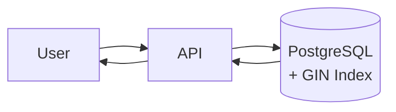
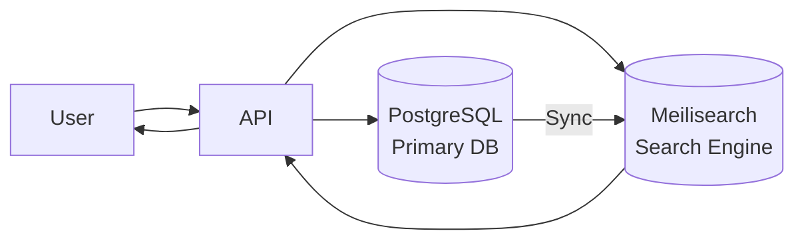
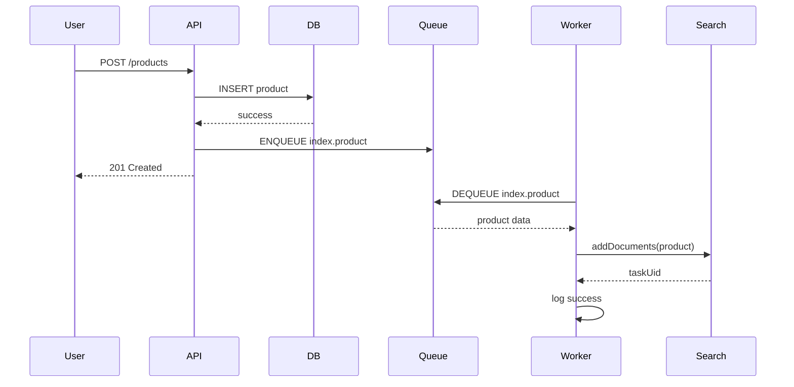
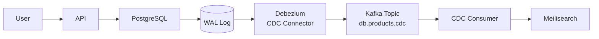
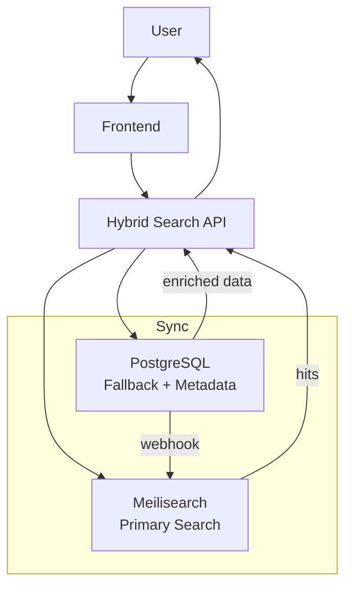
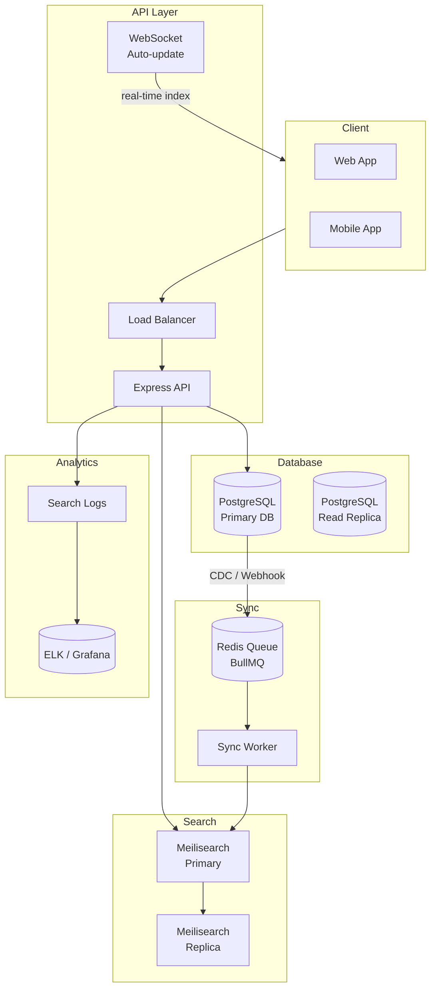

<!-- _class: title -->
# 04. Search Architecture

## Single vs Dedicated Search Service

### Single Database Search (PostgreSQL FTS)

Paling simpel — search langsung di database utama.



**Cocok buat:**
- Dataset < 1 juta row
- Search bukan fitur utama
- Tim kecil / MVP
- Infra minimal

**Kelebihan:** gak ada service baru, data selalu konsisten (read your own writes), gak perlu sync.
**Kekurangan:** performance turun di scale, gak ada typo tolerance, query complex jadi lambat.

### Dedicated Search Engine (Meilisearch / Elasticsearch)

Search engine terpisah — performa optimal.



**Cocok buat:**
- Dataset besar (> 1M docs)
- Search adalah primary feature
- Butuh typo tolerance, filter, faceted
- Butuh response < 50ms

**Kelebihan:** performa tinggi, fitur search lengkap, scalable.
**Kekurangan:** tambah infra, data bisa stale (tergantung sync), maintenance cost.

### Decision Matrix

| Kriteria | PostgreSQL FTS | Dedicated Search Engine (Meilisearch) |
|----------|---------------|--------------------------------------|
| Setup | ✅ Built-in | 🔶 Docker / binary |
| Consistency | ✅ Strong (same DB) | 🔶 Eventual (sync delay) |
| Search speed | 🔶 50-200ms | ✅ 10-50ms |
| Typo tolerance | ❌ Manual | ✅ Built-in |
| Ranking | ✅ ts_rank | ✅ Ranking rules + custom |
| Faceted search | ❌ Manual GROUP BY | ✅ Built-in |
| Scaling read | 🔶 Replica | ✅ Horizontal shard |
| DevOps overhead | None | 🔶 Sedang |
| Use case | Secondary / hybrid | Primary / high perf |

## Data Sync Strategy

Data di PostgreSQL harus sync ke search engine. Tiga strategi:

### 1. Webhook / Application-Level Sync

Waktu write ke DB, langsung kirim ke search engine.



**Pros:** real-time (detik), kontrol penuh, bisa retry logic.
**Cons:** kalo service crash di tengah, data gak ke-index. Butuh queue (BullMQ / Redis) biar reliable.

```js
// Product service
async function createProduct(req, res) {
  const product = await db.products.create(req.body);
  
  // Queue indexing (async)
  await indexQueue.add('index-product', {
    action: 'upsert',
    data: product
  });
  
  res.status(201).json(product);
}

// Worker
indexQueue.process(async (job) => {
  const { action, data } = job.data;
  
  if (action === 'upsert') {
    await searchClient.index('products').addDocuments([data]);
  } else if (action === 'delete') {
    await searchClient.index('products').deleteDocument(data.id);
  }
});
```

### 2. Cron-Based Sync

Berkala (tiap 5-30 menit) sync semua data yang berubah.

```js
// Script: scripts/sync-search.js
const cron = require('node-cron');
const { db } = require('./db');
const { searchClient } = require('./search');

// Sync tiap 15 menit
cron.schedule('*/15 * * * *', async () => {
  const lastSync = await getLastSyncTime();
  
  // Ambil data yang berubah sejak lastSync
  const products = await db.products.findMany({
    where: { updatedAt: { gt: lastSync } }
  });
  
  if (products.length === 0) return;
  
  // Update ke Meilisearch
  await searchClient.index('products').addDocuments(products);
  
  // Update lastSync
  await setLastSyncTime(new Date());
});
```

**Pros:** sederhana, gak butuh queue.
**Cons:** delay sampai 15 menit, data bisa stale, full scan query tiap cron.

### 3. CDC — Change Data Capture

Debezium / pglogical — capture perubahan dari PostgreSQL WAL (Write-Ahead Log).



**Pros:** real-time, gak perlu modifikasi aplikasi, capture semua perubahan (termasuk direct SQL).
**Cons:** kompleks, butuh Kafka, infrastruktur berat. Overkill buat startup.

### Comparison

| Strategy | Delay | Complexity | Reliability | Use Case |
|----------|-------|-----------|-------------|----------|
| Webhook | Detik | Medium | ✅ Retry via queue | Most apps |
| Cron | 5-30 menit | Low | ❌ Bisa skip | Batch / gak real-time |
| CDC | Real-time | High | ✅ WAL-level | Enterprise / high volume |

## Hybrid Search

Kombinasi PostgreSQL FTS + Meilisearch — ambil kelebihan masing-masing.



### Kapan pake hybrid?

- **Primary search → Meilisearch**: autocomplete, fuzzy search, filter, faceted
- **Detail data → PostgreSQL**: ambil data lengkap pas user klik hasil search
- **Fallback → PostgreSQL FTS**: kalau Meilisearch down, masih bisa search basic

### Implementasi

```js
async function hybridSearch(req, res) {
  const { q, filter, page = 1, limit = 20 } = req.query;
  
  try {
    // 1. Primary — Meilisearch
    const meiliResults = await searchClient.index('products').search(q, {
      filter: buildFilter(filter),
      limit,
      offset: (page - 1) * limit
    });
    
    // 2. Enrich — ambil data lengkap dari PostgreSQL
    const ids = meiliResults.hits.map(h => h.id);
    const products = await db.products.findMany({
      where: { id: { in: ids } },
      select: {
        id: true,
        name: true,
        description: true,
        category: true,
        price: true,
        stock: true,
        images: true,
        rating: true,
        reviews: true
      }
    });
    
    // Map back preserving Meilisearch order
    const productMap = new Map(products.map(p => [p.id, p]));
    const enriched = meiliResults.hits.map(h => ({
      ...productMap.get(h.id),
      _score: h._score,
      _rankingScore: h._rankingScore
    }));
    
    res.json({
      hits: enriched,
      totalHits: meiliResults.totalHits,
      facetDistribution: meiliResults.facetDistribution
    });
    
  } catch (err) {
    console.error('Meilisearch failed, fallback to PostgreSQL FTS:', err.message);
    
    // 3. Fallback — PostgreSQL FTS
    const pgResults = await db.$queryRaw`
      WITH query AS (
        SELECT plainto_tsquery('indonesian', ${q}) AS q
      )
      SELECT 
        p.*,
        ts_rank_cd(p.search_vector, q.q) AS score
      FROM products p, query q
      WHERE p.search_vector @@ q.q
        AND p.deleted = false
      ORDER BY score DESC
      LIMIT ${limit} OFFSET ${(page - 1) * limit}
    `;
    
    res.json({
      hits: pgResults,
      totalHits: pgResults.length,
      fallback: true
    });
  }
}
```

## Search Analytics

Pantau apa yang user cari — buat improve search relevansi.

### Popular Searches

```sql
CREATE TABLE search_logs (
  id SERIAL PRIMARY KEY,
  query TEXT NOT NULL,
  results_count INTEGER DEFAULT 0,
  user_id INTEGER,
  ip_address INET,
  created_at TIMESTAMPTZ DEFAULT NOW()
);

CREATE INDEX idx_search_logs_query ON search_logs(query);
CREATE INDEX idx_search_logs_created ON search_logs(created_at);
```

```js
// Log setiap search
async function logSearch(query, resultsCount, userId, ip) {
  await db.searchLogs.create({
    data: {
      query: query.toLowerCase().trim(),
      resultsCount,
      userId,
      ipAddress: ip
    }
  });
}

// Get popular searches (hari ini)
const popular = await db.$queryRaw`
  SELECT 
    query,
    COUNT(*) as frequency,
    AVG(results_count) as avg_results
  FROM search_logs
  WHERE created_at >= CURRENT_DATE
  GROUP BY query
  ORDER BY frequency DESC
  LIMIT 20
`;
```

### Zero Results Tracking

Query yang gak dapet hasil = sinyal buat improve.

```js
// Track zero-result queries
async function trackZeroResults() {
  const zeroResults = await db.$queryRaw`
    SELECT query, COUNT(*) as frequency
    FROM search_logs
    WHERE results_count = 0
    GROUP BY query
    ORDER BY frequency DESC
    LIMIT 20
  `;
  
  // Kirim notifikasi tim product
  console.log('🚨 Zero result queries:', zeroResults);
  
  return zeroResults;
}

// Auto-suggest buat zero results
function suggestForZeroResults(query) {
  // Pake Fuse.js buat cari kata terdekat
  const fuse = new Fuse(knownGoodQueries, { threshold: 0.5 });
  const suggestions = fuse.search(query);
  
  return suggestions.slice(0, 3).map(s => s.item);
}
```

### Analytics Dashboard

```js
// Endpoint ringkasan analytics
app.get('/api/admin/search-analytics', async (req, res) => {
  const { startDate, endDate } = req.query;
  
  const [popular, zeroResults, trends] = await Promise.all([
    // Top queries
    db.$queryRaw`
      SELECT query, COUNT(*) as freq, AVG(results_count) as avg_res
      FROM search_logs
      WHERE created_at BETWEEN ${startDate} AND ${endDate}
      GROUP BY query ORDER BY freq DESC LIMIT 20
    `,
    
    // Zero results
    db.$queryRaw`
      SELECT query, COUNT(*) as freq
      FROM search_logs
      WHERE created_at BETWEEN ${startDate} AND ${endDate}
        AND results_count = 0
      GROUP BY query ORDER BY freq DESC LIMIT 20
    `,
    
    // Daily trend
    db.$queryRaw`
      SELECT DATE(created_at) as date, COUNT(*) as total_searches,
             COUNT(*) FILTER (WHERE results_count > 0) as successful_searches
      FROM search_logs
      WHERE created_at BETWEEN ${startDate} AND ${endDate}
      GROUP BY DATE(created_at) ORDER BY date
    `
  ]);
  
  res.json({ popular, zeroResults, trends });
});
```

## Multi-Language Search

Dataset multilingual butuh strategi khusus.

### Approaches

| Approach | Pros | Cons | Use Case |
|----------|------|------|----------|
| **Single index, auto-detect** | Simple, satu endpoint | Stemming cuma buat satu bahasa | Mayoritas satu bahasa |
| **Per-language field** | Stemming sesuai tiap bahasa | Ukuran index lebih besar | Konten bilingual |
| **Per-language index** | Isolasi sempurna | Query routing complex | Multi-region app |
| **No stemming (simple)** | Konsisten semua bahasa | Gak dapet stemming benefit | Short text / names |

### Per-language Field (PostgreSQL)

```sql
ALTER TABLE documents ADD COLUMN search_vector_en tsvector;
ALTER TABLE documents ADD COLUMN search_vector_id tsvector;

CREATE FUNCTION docs_search_update() RETURNS trigger AS $$
BEGIN
  NEW.search_vector_en := to_tsvector('english', coalesce(NEW.title,'') || ' ' || coalesce(NEW.body,''));
  NEW.search_vector_id := to_tsvector('indonesian', coalesce(NEW.title,'') || ' ' || coalesce(NEW.body,''));
  RETURN NEW;
END;
$$ LANGUAGE plpgsql;

-- Search: coba English dulu, fallback Indonesian
SELECT * FROM documents
WHERE search_vector_en @@ plainto_tsquery('english', 'economic growth')
   OR search_vector_id @@ plainto_tsquery('indonesian', 'economic growth')
ORDER BY 
  CASE 
    WHEN search_vector_en @@ plainto_tsquery('english', 'economic growth') THEN 1
    ELSE 2
  END;
```

### Per-language Field (Meilisearch)

```js
// Index dengan field per bahasa
const docs = [
  {
    id: 1,
    title_en: 'Coffee Production in Indonesia',
    title_id: 'Produksi Kopi di Indonesia',
    desc_en: 'Indonesian coffee production reached record high',
    desc_id: 'Produksi kopi Indonesia mencapai rekor tertinggi',
  }
];

await searchClient.index('documents').addDocuments(docs);

// Search — cari di dua field
await searchClient.index('documents').search('produksi kopi', {
  attributesToSearchOn: ['title_id', 'desc_id']
});

await searchClient.index('documents').search('coffee production', {
  attributesToSearchOn: ['title_en', 'desc_en']
});
```

### Language Detection

```js
// Simple detection pake karakter
function detectLanguage(query) {
  // Indonesian common words
  const idWords = ['dan', 'di', 'ke', 'dari', 'yang', 'dengan', 'untuk', 'pada', 'adalah', 'ini'];
  // English common words  
  const enWords = ['and', 'the', 'of', 'to', 'in', 'for', 'with', 'is', 'this', 'that'];
  
  const words = query.toLowerCase().split(/\s+/);
  let idScore = words.filter(w => idWords.includes(w)).length;
  let enScore = words.filter(w => enWords.includes(w)).length;
  
  if (idScore > enScore) return 'id';
  if (enScore > idScore) return 'en';
  
  // Fallback: karakter spesifik
  if (/[^a-zA-Z0-9\s]/.test(query)) return 'id'; // ada karakter non-ASCII
  return 'en'; // default
}

// Gunakan di search
async function searchMultiLang(query) {
  const lang = detectLanguage(query);
  const fields = lang === 'id' 
    ? ['title_id', 'desc_id'] 
    : ['title_en', 'desc_en'];
  
  return await searchClient.index('documents').search(query, {
    attributesToSearchOn: fields
  });
}
```

## Full Production Architecture



### Production Checklist

1. **Separate search service** — jangan gabung di API server
2. **Async sync** — queue-based, jangan blocking request
3. **Circuit breaker** — fallback ke PostgreSQL kalau Meilisearch down
4. **Monitoring** — track search latency, error rate, popular queries
5. **A/B testing** — test ranking changes sama user
6. **Backup** — dump Meilisearch index berkala
7. **Staging index** — jangan langsung nge-index ke production
8. **Rate limiting** — proteksi dari abuse

## Latihan

### Latihan 1: Data Sync Webhook
Buat Express endpoint POST `/api/products`. Setelah insert ke PostgreSQL, kirim data ke Meilisearch via BullMQ queue. Guarantee: kalo queue gagal, data tetap masuk ke DB. Implement retry 3x.

### Latihan 2: Hybrid Search API
Buat endpoint GET `/api/search?q=...` yang:
- Primary search pake Meilisearch
- Enrich data pake PostgreSQL (ambil semua field termasuk image_url, rating, stock)
- Fallback ke PostgreSQL FTS kalau Meilisearch error
- Response: `{ hits: [...], totalHits, source: 'meilisearch'|'postgres' }`

### Latihan 3: Search Analytics
Buat middleware search logger yang nyimpen query, results_count, user_id, ip, created_at ke tabel `search_logs`. Implement endpoint GET `/api/admin/search-analytics` yang return:
- Top 10 popular queries hari ini
- Zero result queries (results_count = 0) — top 5
- Daily search trend 7 hari terakhir

### Latihan 4: Multi-Language Search
Buat tabel `documents_multilang` dengan kolom `title_en`, `title_id`, `content_en`, `content_id`, `lang`. Implementasi search endpoint yang:
- Detect language dari query
- Search di field sesuai bahasa
- Fallback ke field lain kalau hasil sedikit (< 3)
- Tampilkan label "Bahasa Indonesia" / "English" di response
