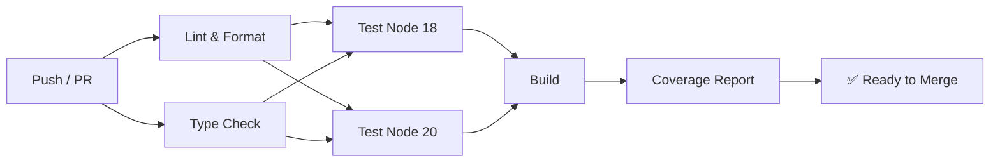
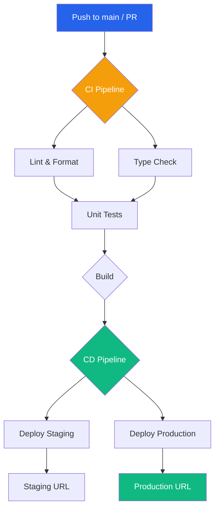

<!-- _class: title -->
# Sesi 4: GitHub Actions & Project Management

> Otomatiskan CI/CD pipeline, setup GitHub Projects board, dan kelola issues & PR dengan template profesional.

**Durasi**: 4 jam | **Output**: CI workflow running + GitHub Project board

---

## 4.1 GitHub Actions Overview

GitHub Actions = CI/CD bawaan GitHub. Jalankan workflow otomatis berdasarkan event di repository.

### Konsep Dasar

| Istilah | Penjelasan |
|---------|------------|
| **Workflow** | Satu file YAML di `.github/workflows/` — definisi pipeline |
| **Job** | Kumpulan step yang jalan di runner yang sama |
| **Step** | Satu perintah (run action atau shell command) |
| **Action** | Unit reusable — bisa dari GitHub Marketplace atau buat sendiri |
| **Runner** | Server yang menjalankan workflow (GitHub-hosted atau self-hosted) |
| **Event** | Trigger — push, pull_request, schedule, dll |
| **Matrix** | Jalanin job yang sama dengan multiple versi |

### Struktur Workflow

```yaml
name: CI Pipeline
on:
  push:
    branches: [main]
  pull_request:
    branches: [main]

jobs:
  test:
    runs-on: ubuntu-latest
    steps:
      - uses: actions/checkout@v4
      - uses: actions/setup-node@v4
        with:
          node-version: 18
      - run: npm ci
      - run: npm test
```

---

## 4.2 Workflow YAML — Komponen Detail

### Event Triggers

```yaml
on:
  # Push ke branch tertentu
  push:
    branches: [main, develop]
    paths:
      - 'src/**'
      - '!docs/**'

  # Pull request ke branch tertentu
  pull_request:
    branches: [main]
    types: [opened, synchronize, reopened]

  # Schedule (cron) — format UTC
  schedule:
    - cron: '0 6 * * 1'  # Setiap Senin jam 6 pagi UTC

  # Manual trigger dari UI
  workflow_dispatch:
    inputs:
      environment:
        description: 'Deploy environment'
        required: true
        default: 'staging'
        type: choice
        options:
          - staging
          - production
```

### Jobs & Dependencies

```yaml
jobs:
  lint:
    runs-on: ubuntu-latest
    steps:
      - run: echo "Linting..."

  test:
    needs: lint  # Tunggu lint selesai
    runs-on: ubuntu-latest
    steps:
      - run: echo "Testing..."

  build:
    needs: [lint, test]  # Tunggu keduanya
    runs-on: ubuntu-latest
    steps:
      - run: echo "Building..."
```

### Matrix Strategy

Jalankan job yang sama dengan multiple versi / konfigurasi:

```yaml
jobs:
  test:
    runs-on: ubuntu-latest
    strategy:
      matrix:
        node-version: [16, 18, 20]
        os: [ubuntu-latest, windows-latest]
        include:
          - node-version: 18
            os: ubuntu-latest
            coverage: true
        exclude:
          - node-version: 16
            os: windows-latest
    steps:
      - uses: actions/checkout@v4
      - uses: actions/setup-node@v4
        with:
          node-version: ${{ matrix.node-version }}
      - run: npm ci
      - run: npm test
      - if: matrix.coverage
        run: npm run coverage
```

### Environment Variables & Secrets

```yaml
jobs:
  deploy:
    runs-on: ubuntu-latest
    env:
      NODE_ENV: production
    steps:
      - name: Deploy
        run: |
          echo "Deploying to ${{ env.NODE_ENV }}"
        env:
          APP_SECRET: ${{ secrets.APP_SECRET }}
```

Set **Repository Secrets** di: Settings → Secrets and variables → Actions

---

## 4.3 CI Pipeline (Lint → Type Check → Test → Build → Coverage)

Pipeline CI lengkap untuk Node.js + TypeScript:

File `.github/workflows/ci.yml`:

```yaml
name: CI Pipeline

on:
  push:
    branches: [main, develop]
  pull_request:
    branches: [main]

concurrency:
  group: ${{ github.workflow }}-${{ github.ref }}
  cancel-in-progress: true

jobs:
  lint:
    name: Lint & Format
    runs-on: ubuntu-latest
    steps:
      - uses: actions/checkout@v4
      - uses: actions/setup-node@v4
        with:
          node-version: 20
          cache: 'npm'
      - run: npm ci
      - run: npm run lint
      - run: npm run format:check

  type-check:
    name: TypeScript Type Check
    runs-on: ubuntu-latest
    steps:
      - uses: actions/checkout@v4
      - uses: actions/setup-node@v4
        with:
          node-version: 20
          cache: 'npm'
      - run: npm ci
      - run: npm run type-check

  test:
    name: Unit & Integration Tests
    needs: [lint, type-check]
    runs-on: ubuntu-latest
    strategy:
      matrix:
        node-version: [18, 20]
    steps:
      - uses: actions/checkout@v4
      - uses: actions/setup-node@v4
        with:
          node-version: ${{ matrix.node-version }}
          cache: 'npm'
      - run: npm ci
      - run: npm test
      - name: Upload Coverage
        uses: actions/upload-artifact@v4
        with:
          name: coverage-${{ matrix.node-version }}
          path: coverage/

  build:
    name: Build
    needs: [test]
    runs-on: ubuntu-latest
    steps:
      - uses: actions/checkout@v4
      - uses: actions/setup-node@v4
        with:
          node-version: 20
          cache: 'npm'
      - run: npm ci
      - run: npm run build
      - name: Upload Build Artifact
        uses: actions/upload-artifact@v4
        with:
          name: build
          path: dist/

  coverage-report:
    name: Coverage Report
    needs: [test]
    if: github.event_name == 'pull_request'
    runs-on: ubuntu-latest
    steps:
      - uses: actions/checkout@v4
      - uses: actions/setup-node@v4
        with:
          node-version: 20
      - run: npm ci
      - run: npm run coverage
      - uses: davelosert/vitest-coverage-report-action@v2
        with:
          json-summary-path: coverage/coverage-summary.json
```

### Pipeline Visual



---

## 4.4 CD Pipeline (Build → Push → Deploy)

### Deploy ke Vercel

File `.github/workflows/deploy-vercel.yml`:

```yaml
name: Deploy to Vercel

on:
  push:
    branches: [main]

jobs:
  deploy:
    runs-on: ubuntu-latest
    steps:
      - uses: actions/checkout@v4
      - uses: actions/setup-node@v4
        with:
          node-version: 20
          cache: 'npm'
      - run: npm ci
      - run: npm run build
      - name: Deploy to Vercel
        uses: amondnet/vercel-action@v25
        with:
          vercel-token: ${{ secrets.VERCEL_TOKEN }}
          vercel-org-id: ${{ secrets.VERCEL_ORG_ID }}
          vercel-project-id: ${{ secrets.VERCEL_PROJECT_ID }}
          vercel-args: '--prod'
```

### Deploy ke Railway

File `.github/workflows/deploy-railway.yml`:

```yaml
name: Deploy to Railway

on:
  push:
    branches: [main]

jobs:
  deploy:
    runs-on: ubuntu-latest
    steps:
      - uses: actions/checkout@v4
      - name: Install Railway CLI
        run: npm i -g @railway/cli
      - name: Deploy
        run: railway up --service ${{ secrets.RAILWAY_SERVICE }}
        env:
          RAILWAY_TOKEN: ${{ secrets.RAILWAY_TOKEN }}
```

### Deploy ke GitHub Pages

File `.github/workflows/deploy-pages.yml`:

```yaml
name: Deploy to GitHub Pages

on:
  push:
    branches: [main]

permissions:
  contents: read
  pages: write
  id-token: write

jobs:
  build:
    runs-on: ubuntu-latest
    steps:
      - uses: actions/checkout@v4
      - uses: actions/setup-node@v4
        with:
          node-version: 20
      - run: npm ci
      - run: npm run build
      - uses: actions/upload-pages-artifact@v3
        with:
          path: dist/

  deploy:
    needs: build
    environment:
      name: github-pages
      url: ${{ steps.deployment.outputs.page_url }}
    runs-on: ubuntu-latest
    steps:
      - name: Deploy to GitHub Pages
        id: deployment
        uses: actions/deploy-pages@v4
```

---

## 4.5 GitHub Projects

GitHub Projects = Kanban board untuk manage task tim.

### Setup Project Board

1. Repository → **Projects** → **Create project**
2. Pilih template: **Feature planning** atau **Bug triage** atau **Blank**
3. Beri nama: "Development Sprint 1"

### Columns Standar

| Column | Isi |
|--------|-----|
| **Backlog** | Ide/task yang belum diprioritaskan |
| **To Do** | Task siap dikerjakan |
| **In Progress** | Sedang dikerjakan |
| **In Review** | PR sudah dibuat, menunggu review |
| **Done** | Selesai dan sudah di-merge |

### Labels

Buat label di repo → Issues → Labels:

| Label | Warna | Deskripsi |
|-------|-------|-----------|
| `bug` | `#d73a4a` | Something isn't working |
| `enhancement` | `#a2eeef` | New feature or request |
| `documentation` | `#0075ca` | Improvements or additions to documentation |
| `good first issue` | `#7057ff` | Good for newcomers |
| `help wanted` | `#008672` | Extra attention is needed |
| `priority: high` | `#b60205` | Critical priority |
| `priority: medium` | `#fbca04` | Medium priority |
| `priority: low` | `#0e8a16` | Low priority |

### Milestones

1. Repository → **Issues** → **Milestones** → **Create a milestone**
2. Isi title, due date, description
3. Assign issues ke milestone

### Automation Rules

GitHub Projects bisa otomatis move cards:

| Trigger | Aksi |
|---------|------|
| Issue opened → | Move ke **To Do** |
| PR opened → | Move ke **In Review** |
| PR merged → | Move ke **Done** |
| Issue/PR closed → | Move ke **Done** |

Setup: Di Project board → ⚙️ Settings → **Automation** → Add workflow

---

## 4.6 Issue & PR Templates

### Issue Template: Bug Report

File `.github/ISSUE_TEMPLATE/bug_report.md`:

```markdown
---
name: Bug report
about: Create a report to help us improve
title: '[BUG] '
labels: bug
assignees: ''
---

## Describe the Bug
<!-- Clear description of the bug -->

## To Reproduce
Steps:
1. Go to '...'
2. Click on '...'
3. See error

## Expected Behavior
<!-- What should happen -->

## Screenshots
<!-- If applicable -->

## Environment
- OS: [e.g. Windows, macOS]
- Browser: [e.g. Chrome, Firefox]
- Version: [e.g. 1.0.0]

## Additional Context
<!-- Add any other context -->
```

### Issue Template: Feature Request

File `.github/ISSUE_TEMPLATE/feature_request.md`:

```markdown
---
name: Feature request
about: Suggest an idea for this project
title: '[FEATURE] '
labels: enhancement
assignees: ''
---

## Problem
<!-- Is your feature request related to a problem? Describe -->

## Solution
<!-- Describe the solution you'd like -->

## Alternatives
<!-- Describe alternatives you've considered -->

## Additional Context
<!-- Add any other context or screenshots -->
```

### Setup Semua Template

```bash

---

# Buat struktur folder
mkdir -p .github/ISSUE_TEMPLATE


---

# Download template dari repo ini atau buat manual

---

# ...


---

# Commit
git add .github/
git commit -m "docs: add issue and PR templates"
git push origin main
```

---

## 4.7 Diagram: CI/CD Pipeline



---

## 4.8 Latihan

### Latihan 1: Setup CI Workflow

#### Setup Project Sederhana

```bash

---

# Buat project Node.js minimal
cd ~/Projects/latihan-git-workflow  # atau folder baru


---

# Init project (kalau belum ada package.json)
npm init -y


---

# Install tools
npm install --save-dev vitest @biomejs/biome


---

# Setup test file
mkdir src
cat > src/sum.js << 'EOF'
export function sum(a, b) {
  return a + b;
}
EOF

cat > src/sum.test.js << 'EOF'
import { describe, it, expect } from 'vitest';
import { sum } from './sum';

describe('sum', () => {
  it('adds 1 + 2 = 3', () => {
    expect(sum(1, 2)).toBe(3);
  });

  it('adds negative numbers', () => {
    expect(sum(-1, -1)).toBe(-2);
  });
});
EOF


---

# Update package.json scripts

---

# "test": "vitest run"

---

# "type": "module"
```

File `package.json` (update):

```json
{
  "name": "latihan-git-workflow",
  "type": "module",
  "scripts": {
    "test": "vitest run",
    "test:watch": "vitest",
    "lint": "biome check src/",
    "format": "biome format --write src/"
  },
  "devDependencies": {
    "@biomejs/biome": "^1.8.0",
    "vitest": "^1.6.0"
  }
}
```

#### Buat CI Workflow

```bash
mkdir -p .github/workflows
```

File `.github/workflows/ci.yml`:

```yaml
name: CI Pipeline

on:
  push:
    branches: [main]
  pull_request:
    branches: [main]

jobs:
  test:
    runs-on: ubuntu-latest
    strategy:
      matrix:
        node-version: [18, 20]

    steps:
      - uses: actions/checkout@v4
      - uses: actions/setup-node@v4
        with:
          node-version: ${{ matrix.node-version }}
          cache: 'npm'
      - run: npm ci
      - run: npm run lint
      - run: npm test
```

```bash

---

# Commit dan push
git add .
git commit -m "ci: add CI workflow with lint and test"
git push origin main
```

3. Buka GitHub → **Actions** tab → lihat workflow running
4. Klik workflow → lihat job test dengan matrix [18, 20]
5. Verifikasi semua green ✅

#### Tambah Badge CI ke README

```markdown

```

### Latihan 2: Setup GitHub Project Board

1. Buka repo → **Projects** → **Create project** → **Blank**
2. Nama: "Development Sprint"
3. Buat columns: **Backlog**, **To Do**, **In Progress**, **In Review**, **Done**
4. Buat labels (Settings → Labels → New label):
   - `bug` (red `#d73a4a`)
   - `enhancement` (green `#a2eeef`)
   - `good first issue` (purple `#7057ff`)

### Latihan 3: Create Issues & Milestones

1. Buka **Issues** → **Milestones** → **New milestone**
   - Title: "Sprint 1 - Git Workflow"
   - Due date: +2 minggu
   - Description: "Implementasi branching strategy + CI/CD"

2. Buat Issues:

**Issue 1**: "Setup branching strategy documentation"
- Labels: documentation
- Project: Development Sprint → To Do
- Milestone: Sprint 1

**Issue 2**: "Add unit tests for utility functions"
- Labels: enhancement, good first issue
- Project: Development Sprint → To Do
- Assignees: diri sendiri

**Issue 3**: "Fix broken navigation on mobile"
- Labels: bug
- Priority: priority: high
- Project: Development Sprint → To Do

### Latihan 4: Setup Issue & PR Templates

```bash

---

# Buat template structure
mkdir -p .github/ISSUE_TEMPLATE


---

# Download template files (copy dari sesi 4.6)

---

# Atau buat manual
```

File `.github/ISSUE_TEMPLATE/bug_report.md` dan `feature_request.md` (copy dari konten 4.6).

File `.github/pull_request_template.md` (copy dari sesi 2.2).

```bash
git add .github/
git commit -m "docs: add issue and PR templates"
git push origin main
```

Verify: Buka repo → **Issues** → **New issue** — lihat template muncul.

### Latihan 5: Uji CI Pipeline

1. Buat branch baru:

```bash
git checkout -b feature/test-ci
```

2. Edit file, buat test fail:

```bash
cat > src/sum.test.js << 'EOF'
import { describe, it, expect } from 'vitest';
import { sum } from './sum';

describe('sum', () => {
  it('should fail', () => {
    expect(sum(1, 2)).toBe(999); // FAIL!
  });
});
EOF
```

3. Commit + push → buat PR:

```bash
git add src/sum.test.js
git commit -m "test: intentionally failing test"
git push origin feature/test-ci
```

4. Buka GitHub → Create PR
5. Lihat **CI Pipeline** — akan FAIL ❌
6. PR tidak bisa merge (karena branch protection + status check fails)
7. Fix test, push ulang → CI PASS ✅ → merge

### Checklist Output Sesi 4

- [ ] CI workflow (lint + test + build) berjalan otomatis di GitHub Actions
- [ ] Badge CI status terlihat di README
- [ ] GitHub Project board dengan columns dan cards
- [ ] Minimal 3 issues dengan labels dan milestone
- [ ] File `.github/ISSUE_TEMPLATE/bug_report.md` dan `feature_request.md`
- [ ] File `.github/pull_request_template.md`
- [ ] PR gagal merge karena CI failed — dan berhasil setelah fix
- [ ] Paham perbedaan event trigger (push vs pull_request vs schedule)

---

## Referensi

- [GitHub Actions Documentation](https://docs.github.com/en/actions)
- [Workflow Syntax](https://docs.github.com/en/actions/using-workflows/workflow-syntax-for-github-actions)
- [GitHub Actions Marketplace](https://github.com/marketplace?type=actions)
- [Vercel Action](https://github.com/marketplace/actions/vercel-action)
- [Railway CLI](https://docs.railway.app/develop/cli)
- [GitHub Projects Docs](https://docs.github.com/en/issues/planning-and-tracking-with-projects)
- [Creating Issue Templates](https://docs.github.com/en/communities/using-templates-to-encourage-useful-issues-and-pull-requests/about-issue-and-pull-request-templates)
